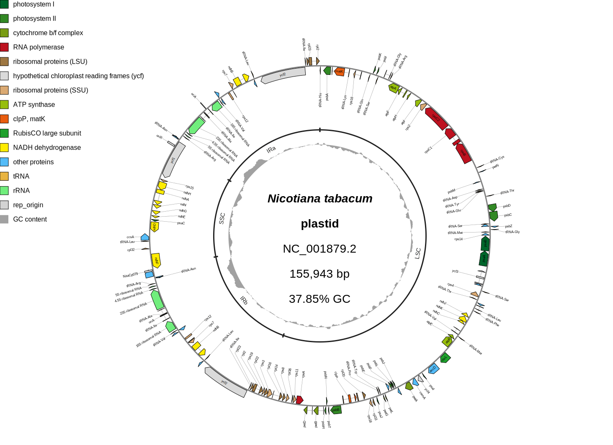
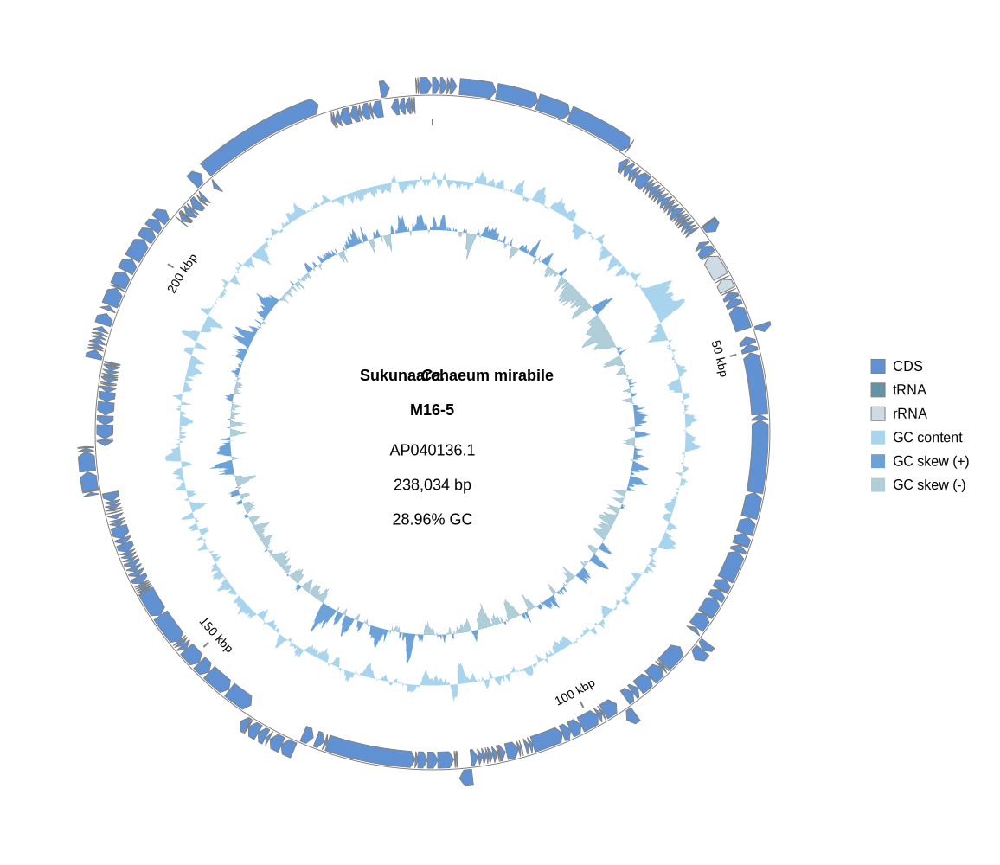
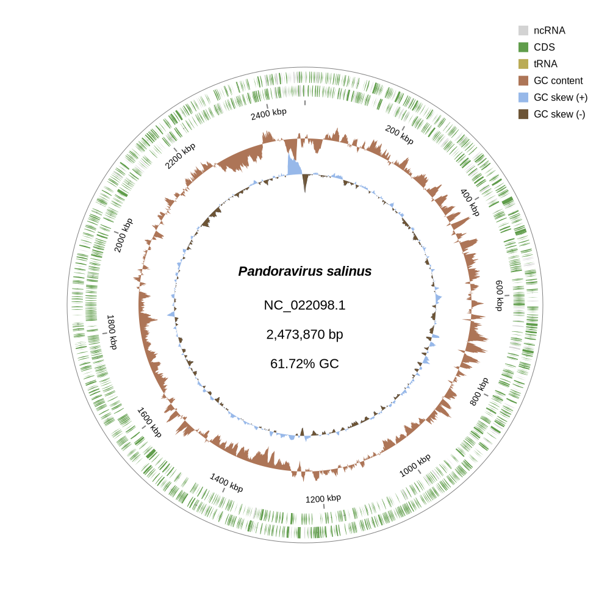
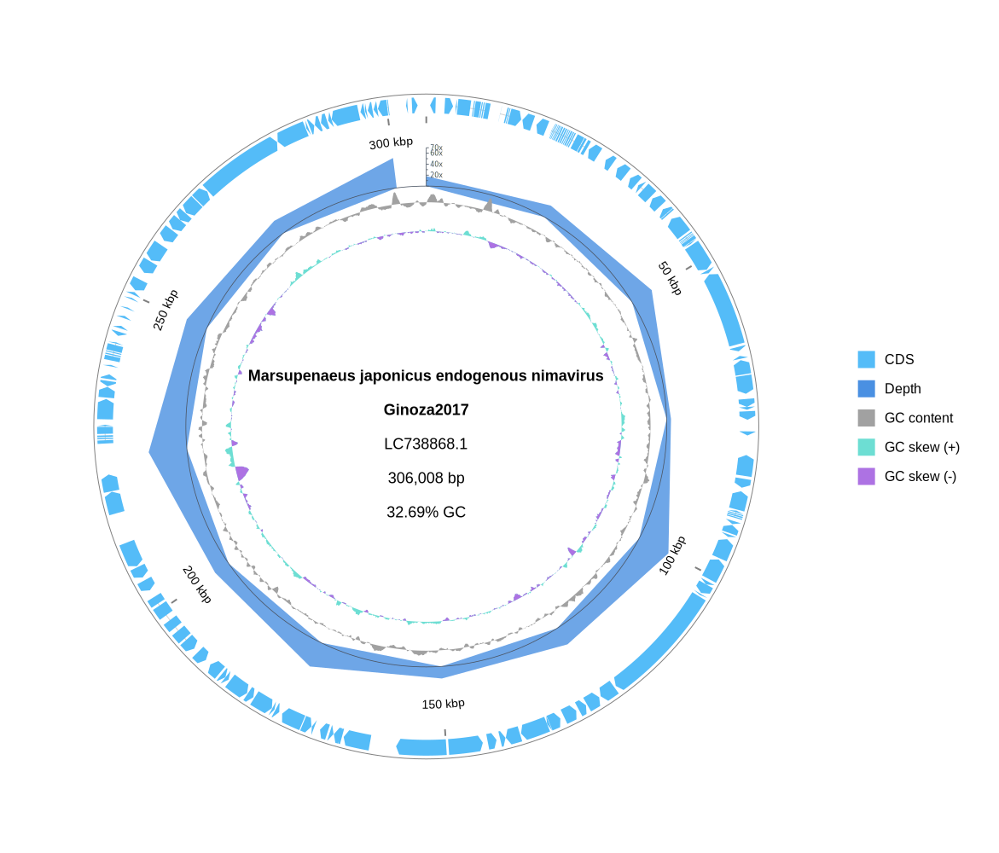
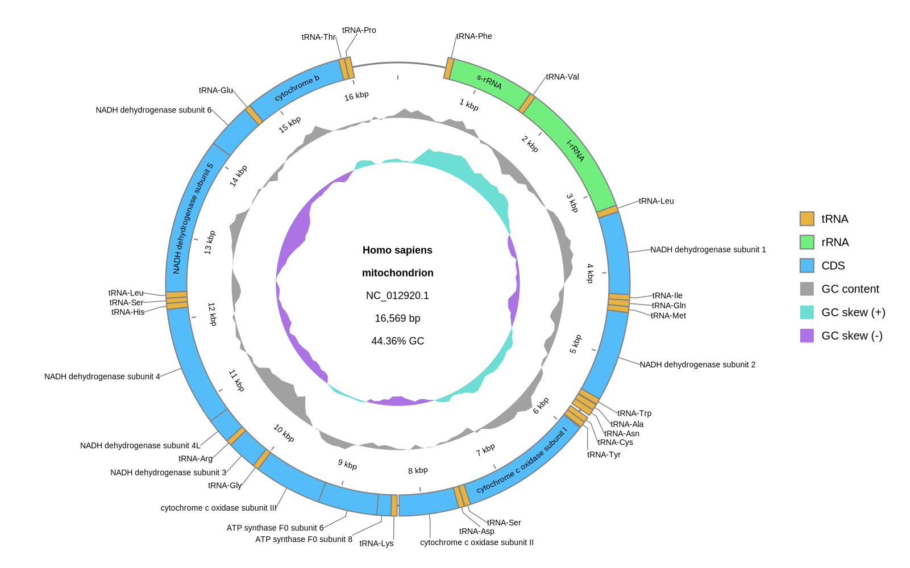
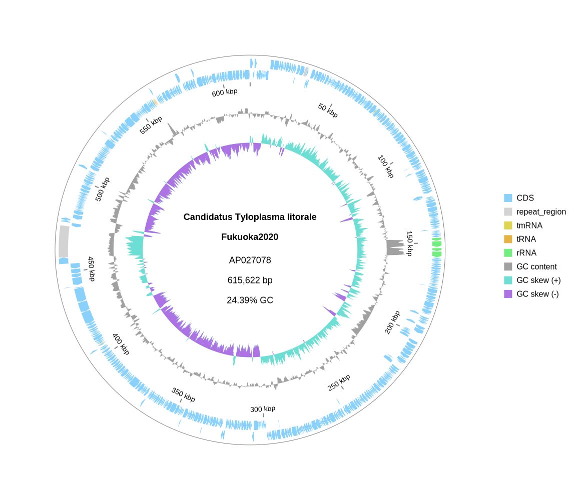

[Home](./DOCS.md) | [Installation](./INSTALL.md) | [Quickstart](./QUICKSTART.md) | [Tutorials](./TUTORIALS/TUTORIALS.md) | [Recipes](./RECIPES.md) | [CLI Reference](./CLI_Reference.md) | **Gallery** | [FAQ](./FAQ.md) | [About](./ABOUT.md)

# Gallery

These figures were generated with gbdraw. Click any figure to open the full-size output.

For zooming, feature popups, match inspection, and downloadable sessions, open the [interactive gallery](https://gbdraw.app/gallery/).

## Circular genome maps

<table>
  <tr>
    <td width="50%" valign="top">
       
      <strong><em>Nicotiana tabacum</em> chloroplast</strong> 
      Feature labels, a GC-content track, and LSC, SSC, IRa, and IRb region brackets. See the <a href="./TUTORIALS/5_Table_Driven_Inputs.md#7-region-annotation-tables">annotation-table tutorial</a> or open the <a href="https://gbdraw.app/gallery/#tobacco-chloroplast">interactive example</a>.
    </td>
    <td width="50%" valign="top">
       
      <strong>Human mitochondrial genome</strong> 
      Qualifier-based labels placed inside and outside the ring with the <code>soft_pastels</code> palette. See <a href="./TUTORIALS/3_Advanced_Customization.md">Advanced customization</a>.
    </td>
  </tr>
  <tr>
    <td width="50%" valign="top">
       
      <strong><em>Ca.</em> Sukunaarchaeum mirabile</strong> 
      A compact archaeal genome using separated strands, a centered feature track, and the <code>fugaku</code> palette.
    </td>
    <td width="50%" valign="top">
       
      <strong><em>Pandoravirus salinus</em></strong> 
      A large viral genome with dense forward- and reverse-strand annotations using the <code>forest</code> palette.
    </td>
  </tr>
</table>

## Comparative genomics

<table>
  <tr>
    <td width="50%" valign="top">
       
      <strong><em>Escherichia coli</em> and <em>Shigella dysenteriae</em></strong> 
      A two-record Linear diagram with nucleotide-match ribbons and separated feature strands. See the <a href="./TUTORIALS/2_Comparative_Genomics.md">comparative-genomics tutorial</a>.
    </td>
    <td width="50%" valign="top">
       
      <strong>Four-record <em>Escherichia</em>–<em>Shigella</em> comparison</strong> 
      Adjacent nucleotide comparisons across four bacterial records on one canvas.
    </td>
  </tr>
  <tr>
    <td colspan="2" valign="top">
       
      <strong><em>Vibrio</em> Harveyi group multi-record collinearity</strong> 
      Five RefSeq assemblies are arranged as one species per row, retaining all 11 chromosomes and plasmids. LOSATP searches 18 cross-record combinations between adjacent rows.  
      The blocks are colored by orientation and identity. All features are rectangular; species and strain appear as a two-line left definition. The legend sits below the diagram, which has no plot title.  
      The Gallery provides an interactive SVG with internally gzip-compressed metadata and a separate gzip-compressed Session JSON. Follow the <a href="https://gbdraw.app/gallery/#vibrio-harveyi-group-collinear">Gallery tutorial</a> to reproduce the workflow.
    </td>
  </tr>
  <tr>
    <td colspan="2" valign="top">
       
      <strong>Majanivirus comparison</strong> 
      Ten viral records connected by translated-nucleotide matches, with product-based feature colors. For a protein-search version, open the <a href="https://gbdraw.app/gallery/#majanivirus_orthogroup">interactive case study</a>.
    </td>
  </tr>
</table>

## Labels, tracks, and visual styles

<table>
  <tr>
    <td width="50%" valign="top">
       
      <strong>Selected virulence-feature labels</strong> 
      A label whitelist keeps attention on selected <em>E. coli</em> O157:H7 features. See <a href="./TUTORIALS/3_Advanced_Customization.md">Advanced customization</a>.
    </td>
    <td width="50%" valign="top">
       
      <strong>Read-depth track</strong> 
      A circular depth profile with a quantitative axis and evenly spaced tick labels. See <a href="./TUTORIALS/6_Depth_Quantitative_Tracks.md">Depth and quantitative tracks</a>.
    </td>
  </tr>
  <tr>
    <td width="50%" valign="top">
       
      <strong>Feature-shape overrides</strong> 
      CDS, rRNA, and tRNA features rendered as rectangles instead of directional arrows. See <a href="./TUTORIALS/9_Feature_Visibility_Shapes.md">Feature visibility and shapes</a>.
    </td>
    <td width="50%" valign="top">
       
      <strong>Built-in color palettes</strong> 
      Choose any built-in palette and recolor one full-size Circular SVG immediately in the <a href="https://gbdraw.app/gallery/palettes/">Circular Palette Explorer</a>. The <a href="../examples/color_palette_examples.md">palette reference</a> lists the underlying colors.
    </td>
  </tr>
</table>

## Reproduce or adapt a figure

- Use the [web app](https://gbdraw.app/) to create a diagram in the browser.
- Follow the [Quickstart](./QUICKSTART.md) for the shortest command-line workflow.
- Browse the [Tutorials](./TUTORIALS/TUTORIALS.md) for complete workflows or [Recipes](./RECIPES.md) for short commands.

[Home](./DOCS.md) | [Installation](./INSTALL.md) | [Quickstart](./QUICKSTART.md) | [Tutorials](./TUTORIALS/TUTORIALS.md) | [Recipes](./RECIPES.md) | [CLI Reference](./CLI_Reference.md) | **Gallery** | [FAQ](./FAQ.md) | [About](./ABOUT.md)
