[Documentation home](./DOCS.md) | [Tutorials](./TUTORIALS/README.md) | [Technical documentation](./REFERENCE/README.md) | [FAQ](./FAQ.md) | **Gallery** | [Installation](./INSTALL.md) | [About](./ABOUT.md)

# Gallery

Finished figures made with gbdraw. The ten Web Gallery examples come first, in the order of the [interactive Gallery](https://gbdraw.app/gallery/), where you can zoom, open feature popups, download the Session, and follow a step-by-step web app guide. Five of them also have a Tutorial that builds the figure from downloaded inputs in the web app, on the command line, and in Python.

## Web Gallery examples

### A first circular genome map (human mitochondrial genome)

<a href="https://gbdraw.app/gallery/#HmmtDNA_basic_circular">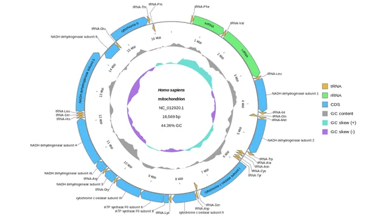</a>

The 16,569-bp human mitochondrial genome from one GenBank record, with labeled genes and rings for GC content and GC skew. With separate strands, forward-strand genes sit on the outer lane and reverse-strand genes on the inner lane, and product names are placed outside the circle or inside the longest arrows. Find NADH dehydrogenase subunit 6 and eight tRNA genes on the inner lane: they are the genes on the reverse strand.

[Open in the interactive Gallery](https://gbdraw.app/gallery/#HmmtDNA_basic_circular) | [Tutorial: Draw a labeled circular map of the human mitochondrial genome](./TUTORIALS/first-circular-genome-diagram.md)

### A first linear genome map (phage lambda)

<a href="https://gbdraw.app/gallery/#lambda_basic_linear">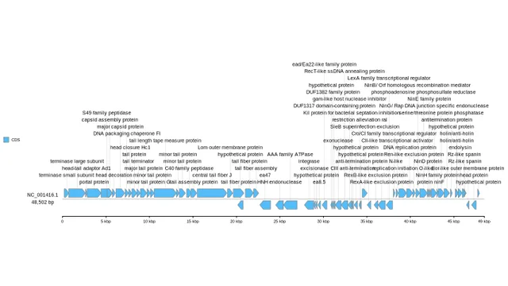</a>

The 48,502-bp phage lambda genome as one linear track, with every CDS labeled by its product. With separate strands, forward-strand genes sit above the axis and reverse-strand genes below it, and a ruler marks positions in kbp. The head and tail genes in the first 22 kbp are on the forward strand, while most genes between 22 and 38 kbp are on the reverse strand.

[Open in the interactive Gallery](https://gbdraw.app/gallery/#lambda_basic_linear) | [Tutorial: Draw a labeled linear map of the Lambda phage genome](./TUTORIALS/first-linear-genome-diagram.md)

### Strand composition of the human mitochondrial genome (AT skew)

<a href="https://gbdraw.app/gallery/#HmmtDNA_ATskew">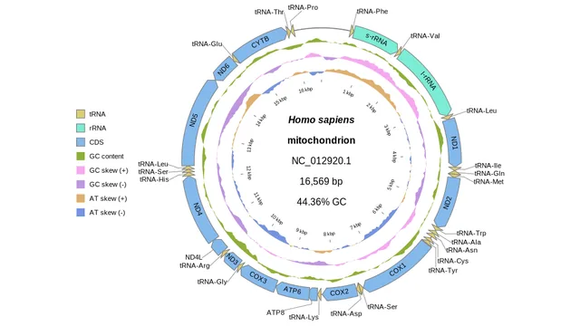</a>

The human mitochondrial genome with GC content, GC skew, and AT skew rings inside the gene ring, each computed in 500-bp windows moved in 50-bp steps. The AT skew ring is an extra track that compares A with T, and a qualifier priority table labels genes by gene name (ND1, COX1) instead of product. Compare the two skew rings window by window; each is drawn around its genome-wide average, so its colors mark windows above or below that average.

[Open in the interactive Gallery](https://gbdraw.app/gallery/#HmmtDNA_ATskew)

### Quadripartite structure of a chloroplast genome (<i>Nicotiana tabacum</i>)

<a href="https://gbdraw.app/gallery/#tobacco-chloroplast">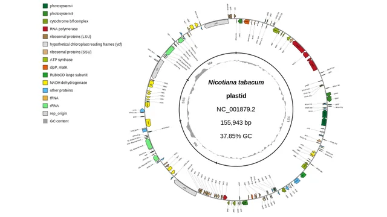</a>

The 155,943-bp tobacco chloroplast genome with brackets for the large single-copy region (LSC), the small single-copy region (SSC), and the two inverted repeats (IRa and IRb). An annotation table supplies the four region boundaries, and a color table groups genes by function, such as photosystem I, RNA polymerase, and NADH dehydrogenase. Genes in the inverted repeats, such as <i>ycf2</i>, <i>ndhB</i>, and the rRNA genes, appear twice: once in IRa and once in IRb.

[Open in the interactive Gallery](https://gbdraw.app/gallery/#tobacco-chloroplast) | [Tutorial: Make an annotated map of the tobacco chloroplast genome](./TUTORIALS/build-an-annotated-chloroplast-map.md)

### Every replicon of a multi-replicon bacterial genome on one canvas (<i>Vibrio nigripulchritudo</i>)

<a href="https://gbdraw.app/gallery/#Vnig_TUMSAT-TG-2018">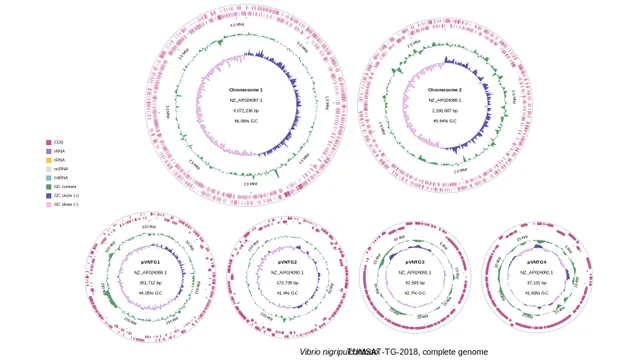</a>

The complete genome of <i>Vibrio nigripulchritudo</i> TUMSAT-TG-2018 from one RefSeq GenBank file: two chromosomes and four plasmids, each drawn as its own circle with GC content and GC skew. Automatic sizing gives longer replicons larger circles while keeping the small plasmids readable, with the chromosomes in the first row and the plasmids in the second. Compare chromosome 1 (4,072,236 bp) with the smallest plasmid, pVNTG4 (37,131 bp).

[Open in the interactive Gallery](https://gbdraw.app/gallery/#Vnig_TUMSAT-TG-2018)

### Shared gene order between neighboring genomes (Hepatoplasmataceae)

<a href="https://gbdraw.app/gallery/#hepatoplasmataceae_collinear">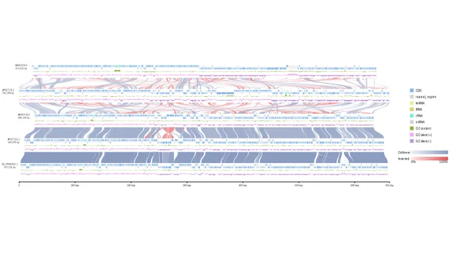</a>

Five Hepatoplasmataceae genomes, one per row. LOSATP collinear blocks join protein matches that keep the same local order between neighboring rows: blue for the same orientation, red for inverted, darker for higher identity. Long blue blocks join the last three genomes, while blocks between the first three rows are short, cross each other, and are often inverted.

[Open in the interactive Gallery](https://gbdraw.app/gallery/#hepatoplasmataceae_collinear) | [Tutorial: Show where neighboring Hepatoplasmataceae genomes keep the same gene order](./TUTORIALS/compare-proteins-losatp-collinear.md)

### Collinearity analysis of multi-replicon bacterial genomes (<i>Vibrio</i> spp.)

<a href="https://gbdraw.app/gallery/#vibrio-harveyi-group-collinear">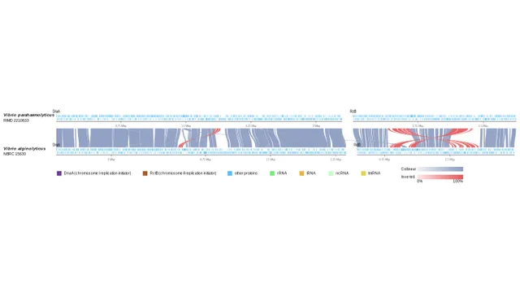</a>

Two <i>Vibrio</i> genomes, each with two chromosomes. Each chromosome is rotated in gbdraw to start at its replication initiator gene — <i>dnaA</i> on chromosome I and <i>rctB</i> on chromosome II — so records that NCBI starts at unrelated positions line up. Inversions occur within each chromosome, but collinear blocks rarely connect chromosome I to chromosome II.

[Open in the interactive Gallery](https://gbdraw.app/gallery/#vibrio-harveyi-group-collinear)

### Protein similarity groups across five genomes (Hepatoplasmataceae)

<a href="https://gbdraw.app/gallery/#hepatoplasmataceae_orthogroup">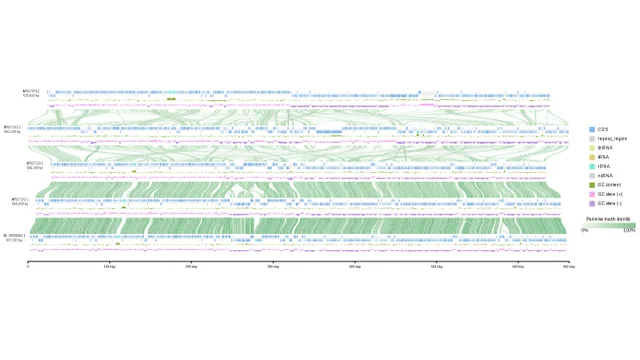</a>

The five Hepatoplasmataceae genomes of the collinear example, linked by LOSATP similarity groups instead of collinear blocks. Similarity groups searches every pair of genomes and groups proteins that match; links join group members in neighboring rows, darker for higher identity. Compare the parallel links between the last three genomes with the crossing links between the first three; the links show protein similarity, not orthology.

[Open in the interactive Gallery](https://gbdraw.app/gallery/#hepatoplasmataceae_orthogroup)

### Protein similarity among aminoglycoside biosynthetic gene clusters (<i>Streptomyces</i> spp.)

<a href="https://gbdraw.app/gallery/#BGC0000708-BGC0000713">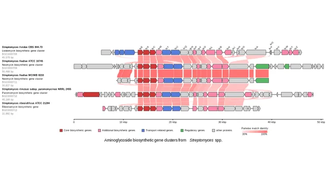</a>

Five aminoglycoside biosynthetic gene clusters from MIBiG (lividomycin, two neomycin, paromomycin, and ribostamycin), colored by antiSMASH gene kind and linked by LOSATP similarity groups at 30% identity or more. The records are aligned on the group of the ABC transporter <i>neoU</i> from the first neomycin cluster; the lividomycin cluster has two members of that group, and its <i>livU</i> is the anchor. Only the lividomycin cluster shows gene labels. A run of core biosynthetic genes links through all five clusters, while regulatory genes appear only in the two neomycin clusters; the links show protein similarity, not phylogenetic orthology.

[Open in the interactive Gallery](https://gbdraw.app/gallery/#BGC0000708-BGC0000713) | [Tutorial: Find shared proteins across five aminoglycoside gene clusters](./TUTORIALS/compare-proteins-losatp.md)

### Protein similarity across nine majanivirus genomes

<a href="https://gbdraw.app/gallery/#majanivirus_orthogroup">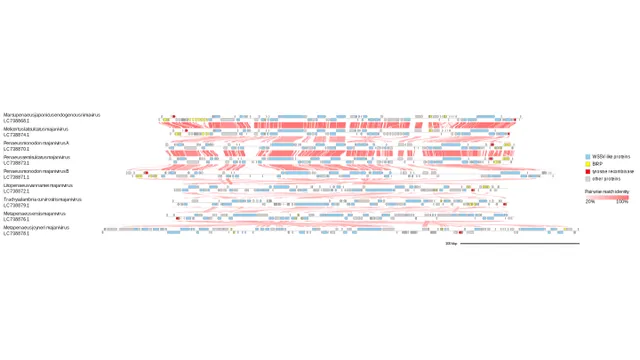</a>

Nine majanivirus genomes from penaeid shrimp, one per row, linked by LOSATP similarity groups at 20% identity or more. A color table marks WSSV-like proteins, BIRP, and tyrosine recombinase by product name. The first five genomes share dense, high-identity links, while links further down are paler and sparser; the links show protein similarity, not orthology.

[Open in the interactive Gallery](https://gbdraw.app/gallery/#majanivirus_orthogroup)

## More figures

Static figures that are not Web Gallery examples. Click a figure to open it at full size.

<table>
  <tr>
    <td width="50%" valign="top">
      <a href="../examples/NC_001879_regions.svg">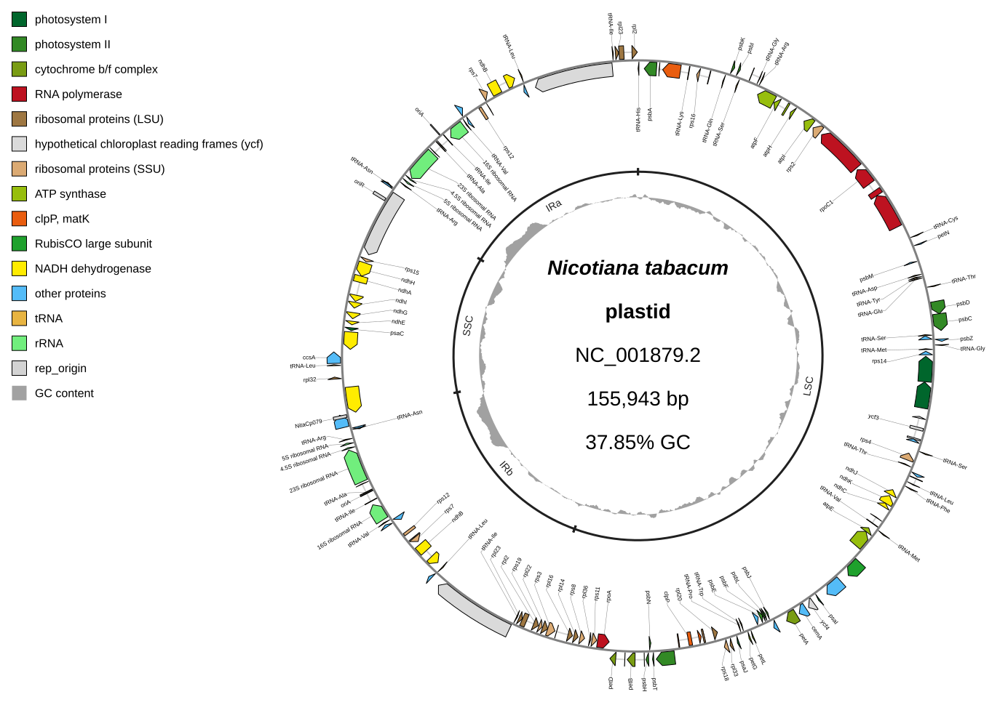</a> 
      <strong>Chloroplast regions from the command line (<em>Nicotiana tabacum</em>)</strong> 
      Feature labels, a GC-content track, and LSC, SSC, IRa, and IRb region brackets. Made in the <a href="./TUTORIALS/build-an-annotated-chloroplast-map.md">annotated chloroplast Tutorial</a>.
    </td>
    <td width="50%" valign="top">
      <a href="../examples/HmmtDNA_qualifier_priority_soft_pastels.svg">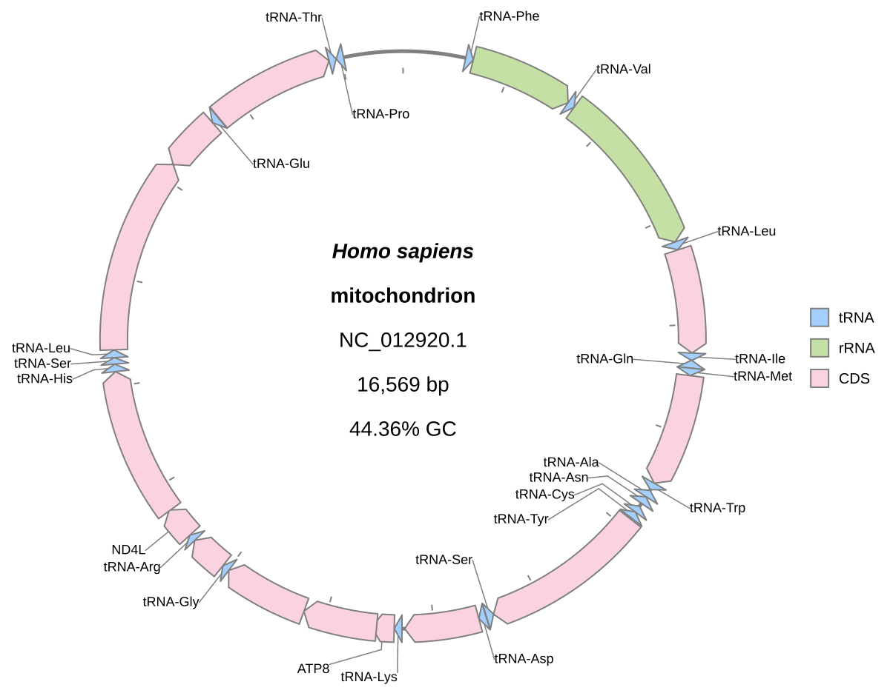</a> 
      <strong>Labels inside and outside the ring (human mitochondrial genome)</strong> 
      Qualifier-based labels with the <code>soft_pastels</code> palette. See the <a href="./REFERENCE/palettes-feature-rules-labels-shapes-and-tracks.md#feature-presentation">feature-presentation technical documentation</a>.
    </td>
  </tr>
  <tr>
    <td width="50%" valign="top">
      <a href="../examples/M16-5_fugaku.svg">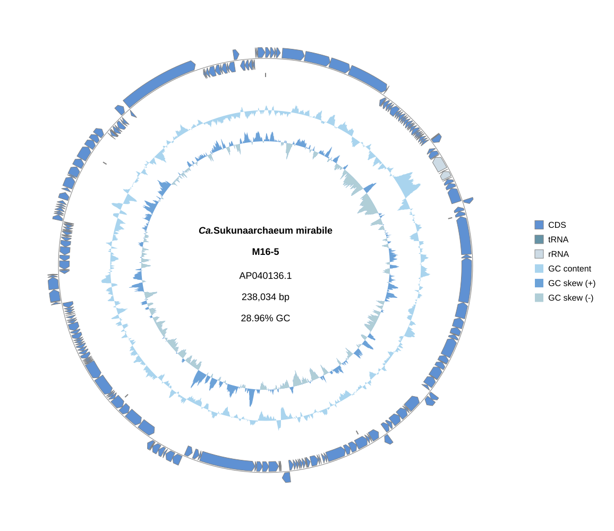</a> 
      <strong>A compact archaeal genome (<em>Ca.</em> Sukunaarchaeum mirabile)</strong> 
      Separated strands, a centered feature track, and the <code>fugaku</code> palette. The input is not bundled with gbdraw; try <code>fugaku</code> on your own genome in the <a href="https://gbdraw.app/gallery/palettes/">Circular Palette Explorer</a>.
    </td>
    <td width="50%" valign="top">
      <a href="../examples/Pandoravirus_salinus_forest.svg">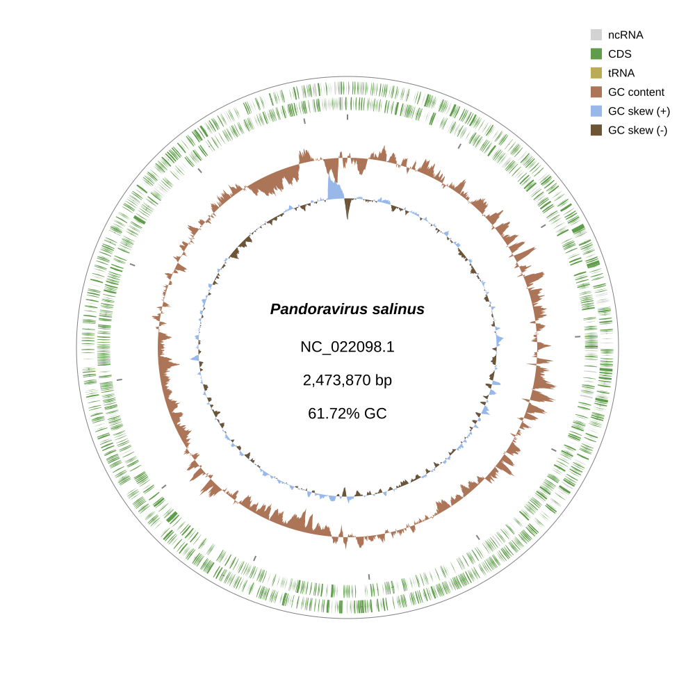</a> 
      <strong>Dense annotation of a giant virus genome (<em>Pandoravirus salinus</em>)</strong> 
      Forward- and reverse-strand features with the <code>forest</code> palette. The input is not bundled with gbdraw; try <code>forest</code> on your own genome in the <a href="https://gbdraw.app/gallery/palettes/">Circular Palette Explorer</a>.
    </td>
  </tr>
  <tr>
    <td width="50%" valign="top">
      <a href="../examples/Escherichia_Shigella_pair.svg">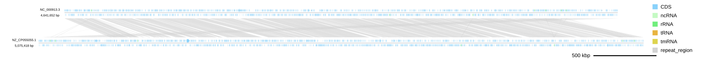</a> 
      <strong>Where two bacterial genomes match (<em>Escherichia coli</em> and <em>Shigella dysenteriae</em>)</strong> 
      Nucleotide-match ribbons between two records with separated feature strands. See the <a href="./REFERENCE/web-app.md#comparison-surfaces">web app comparison documentation</a>.
    </td>
    <td width="50%" valign="top">
       
      <strong>Matches across four bacterial genomes (<em>Escherichia</em> and <em>Shigella</em>)</strong> 
      Nucleotide comparisons between neighboring records on one canvas.
    </td>
  </tr>
  <tr>
    <td width="50%" valign="top">
       
      <strong>Selected virulence genes (<em>Escherichia coli</em> O157:H7)</strong> 
      A label whitelist keeps attention on selected features. See the <a href="./REFERENCE/palettes-feature-rules-labels-shapes-and-tracks.md#feature-presentation">feature-presentation technical documentation</a>.
    </td>
    <td width="50%" valign="top">
      <a href="../examples/tutorial-6-depth-circular.svg">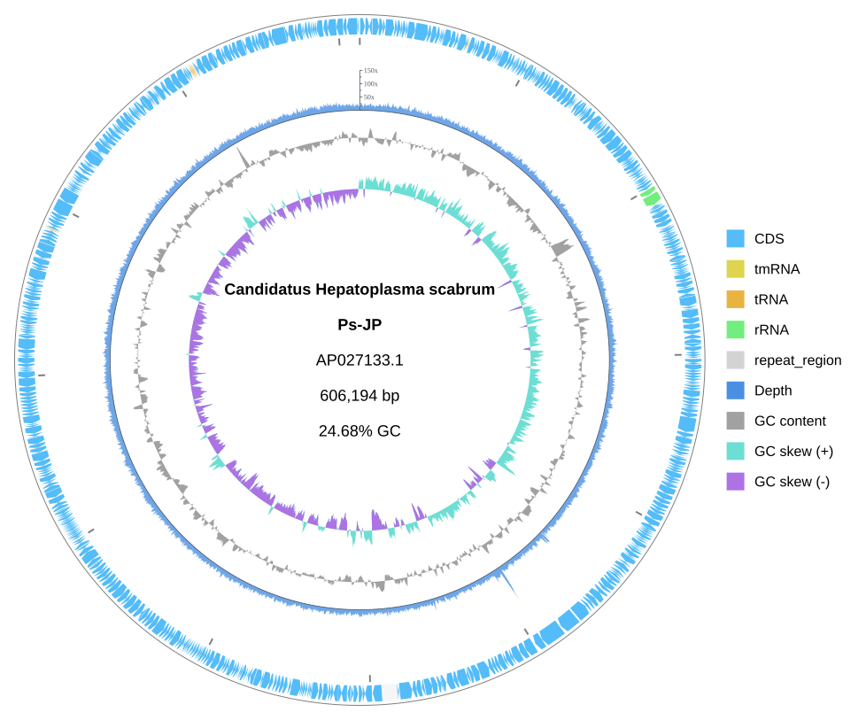</a> 
      <strong>Read depth around a bacterial genome</strong> 
      A circular depth profile with a quantitative axis. Made in the <a href="./TUTORIALS/build-a-quantitative-genome-map.md">quantitative genome map Tutorial</a>.
    </td>
  </tr>
  <tr>
    <td width="50%" valign="top">
      <a href="../examples/tutorial-9-feature-shapes.svg">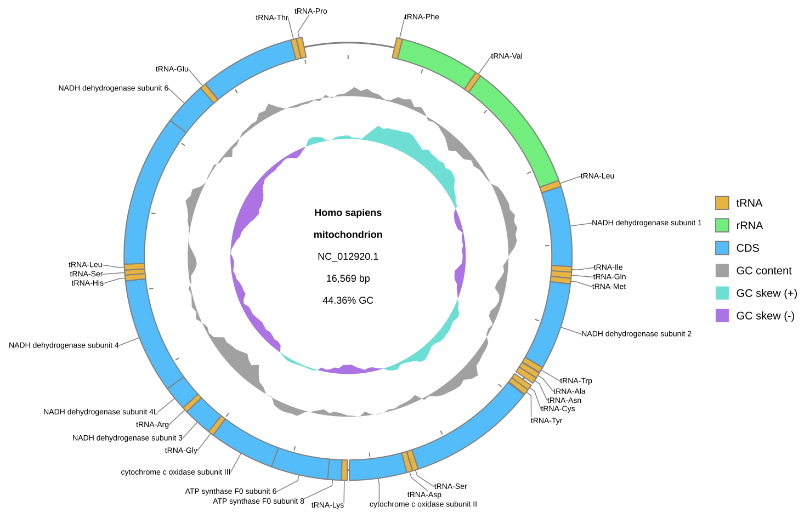</a> 
      <strong>Rectangles instead of arrows (human mitochondrial genome)</strong> 
      CDS, rRNA, and tRNA features drawn as rectangles. Made in the <a href="./TUTORIALS/highlight-mitochondrial-features.md">mitochondrial feature Tutorial</a>.
    </td>
    <td width="50%" valign="top">
      <a href="https://gbdraw.app/gallery/palettes/">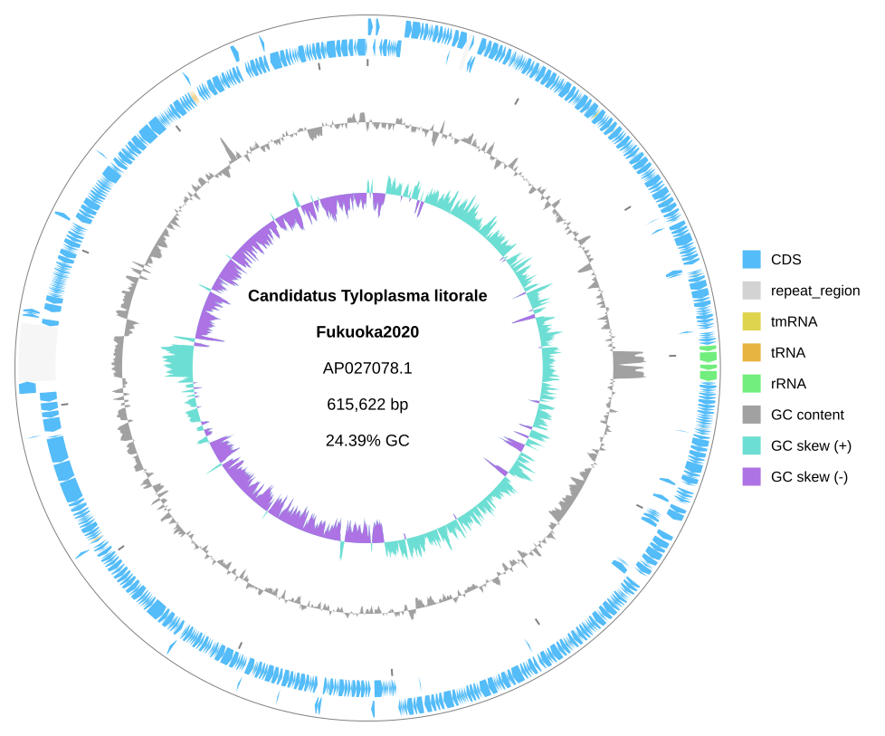</a> 
      <strong>Built-in color palettes</strong> 
      Recolor one Circular map with any built-in palette in the <a href="https://gbdraw.app/gallery/palettes/">Circular Palette Explorer</a>. The <a href="../examples/color_palette_examples.md">palette reference</a> lists the colors.
    </td>
  </tr>
  <tr>
    <td colspan="2" valign="top">
      <a href="../examples/majani.svg">Open the full-size SVG</a> 
      <strong>Translated nucleotide matches across majanivirus genomes</strong> 
      Ten viral records connected by translated-nucleotide matches, with product-based feature colors. For a protein-similarity version, open the <a href="https://gbdraw.app/gallery/#majanivirus_orthogroup">Web Gallery example</a>.
    </td>
  </tr>
</table>

To make your own figure, use the [web app](https://gbdraw.app/), follow a [Tutorial](./TUTORIALS/README.md), or start from a command in [Recipes](./RECIPES.md).

[Documentation home](./DOCS.md) | [Tutorials](./TUTORIALS/README.md) | [Technical documentation](./REFERENCE/README.md) | [FAQ](./FAQ.md) | **Gallery** | [Installation](./INSTALL.md) | [About](./ABOUT.md)
