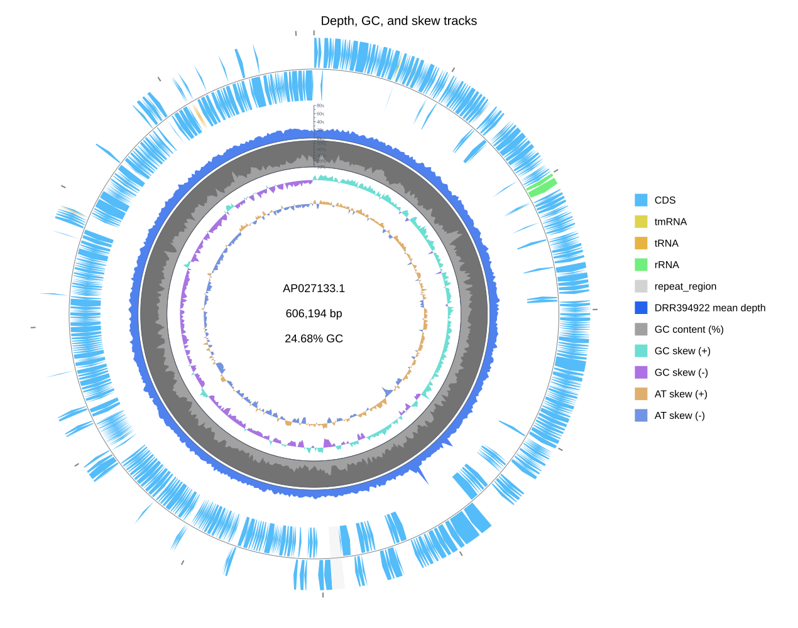

[Documentation home](../../DOCS.md) | [CLI how-to guides](README.md) | [Track reference](../../REFERENCE/palettes-feature-rules-labels-shapes-and-tracks.md) | [CLI reference](../../REFERENCE/command-line.md)

# How to add depth, GC content, and skew tracks

Draw one measured sequencing-depth series beside GC content, GC skew, and AT
skew on a complete circular genome. The command fixes the series mapping,
track order, numeric ranges, axes, ticks, colors, and legend labels.

## Prerequisites

- Install gbdraw with its standard plotting dependencies.
- Start in an empty working directory.
- Copy [`AP027133.gb`](../../../gbdraw/web/tutorial-data/depth-1kb/AP027133.gb)
  and [`AP027133.DRR394922.depth-1kb.tsv`](../../../gbdraw/web/tutorial-data/depth-1kb/AP027133.DRR394922.depth-1kb.tsv)
  into it.

The GenBank file is the complete 606,194 bp circular `AP027133.1` record. The
TSV contains 607 arithmetic means from consecutive 1 kbp bins of DRR394922
per-base depth. Each row is already aggregated and uses its 1-based bin start,
so use `--depth_window 1 --depth_step 1000`. Averaging it with a larger depth
window would summarize the means a second time.

## Draw the quantitative stack

<!-- executable:H-CLI-09:start -->
```bash
gbdraw circular \
  --gbk AP027133.gb \
  --depth_track AP027133.DRR394922.depth-1kb.tsv \
  --depth_track_label 'DRR394922 mean depth' \
  --depth_track_color '#2563EB' \
  --depth_window 1 \
  --depth_step 1000 \
  --depth_min 0 \
  --depth_max 80 \
  --no_depth_log_scale \
  --show_depth_axis \
  --show_depth_ticks \
  --depth_large_tick_interval 20 \
  --depth_small_tick_interval 10 \
  --gc \
  --skew \
  --window 1000 \
  --step 1000 \
  --gc_content_mode percent \
  --gc_content_min_percent 10 \
  --gc_content_max_percent 55 \
  --show_gc_content_axis \
  --show_gc_content_ticks \
  --gc_content_large_tick_interval 10 \
  --gc_content_small_tick_interval 5 \
  --circular_track_slot 'ticks:ticks@side=outside,tick_label_layout=label_out_tick_in' \
  --circular_track_slot 'features:features@side=overlay,lane_direction=split,w=48px' \
  --circular_track_slot 'depth_1:depth@track_index=0,side=inside,w=52px,legend_label=DRR394922 mean depth' \
  --circular_track_slot 'gc_content:dinucleotide_content@side=inside,w=42px,nt=GC,legend_label=GC content (%)' \
  --circular_track_slot 'gc_skew:dinucleotide_skew@side=inside,w=34px,nt=GC,legend_label=GC skew' \
  --circular_track_slot 'at_skew:dinucleotide_skew@side=inside,w=34px,nt=AT,positive_color=#DEAF6E,negative_color=#7294E3,legend_label=AT skew' \
  --separate_strands \
  --labels none \
  --plot_title 'Depth, GC, and skew tracks' \
  --plot_title_position top \
  --plot_title_font_size 20 \
  --legend right \
  -o cli_quantitative_tracks \
  -f svg
```
<!-- executable:H-CLI-09:end -->

## Verification

The output contains one blue depth ring with all 607 input values. Its linear
axis runs from 0x to 80x, with major ticks every 20x and minor ticks every 10x.
The GC-content axis runs from 10% to 55%; GC skew and AT skew are signed
sequence-derived tracks. From outside to inside, the stack is coordinate
ticks, features, depth, GC content, GC skew, and AT skew.



## Add more measured depth series

Repeat `--depth_track` once per logical series, then provide one label, color,
and optional per-track tick interval for each series. For a multi-record
figure, one repeated group contains the files for that series in displayed
record order. Use an empty quoted argument where a record has no measurement;
do not substitute an unrelated sample or treat a missing measurement as zero.

Use `--depth_log_scale` only when the range justifies it. Set a positive
`--depth_min` for a logarithmic axis and report that choice with the figure.
`--hide_scale` affects the genome-coordinate ticks, not the quantitative depth
or GC-content axes.

## Troubleshooting

- The depth ring is empty: the depth reference name must match `AP027133.1`.
- The ring has too few points: keep `--depth_window 1 --depth_step 1000` for
  this pre-aggregated fixture.
- A custom depth slot reports a missing series: `track_index=0` selects the
  first `--depth_track` group.
- Labels overlap the quantitative rings: keep feature labels off for this
  dense 606 kbp record, or apply a whitelist.

Run `python docs/recipes/run_cli_scenarios.py --scenario H-CLI-09` from a
source checkout to regenerate and validate the published SVG.
