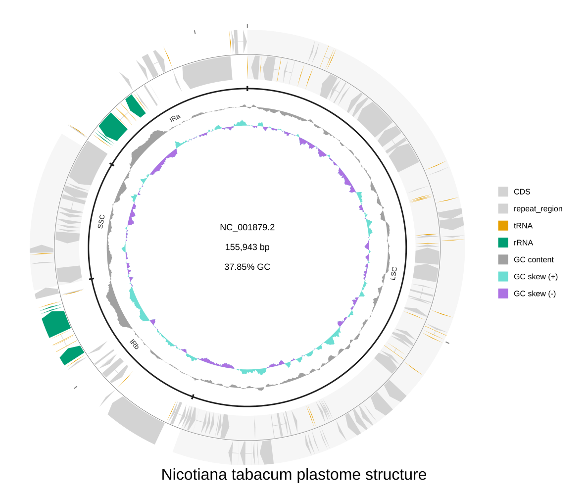

[Documentation home](../../DOCS.md) | [CLI how-to guides](README.md) | [Input table schemas](../../REFERENCE/input-formats-and-tsv-schemas.md) | [Track ownership](../../EXPLANATION/understand-tracks-axes-and-layout.md)

# How to add region annotations and custom track slots

Place four named structural regions on a complete tobacco plastome and assign
each renderer to an explicit Circular slot. This keeps annotation ownership,
slot order, side, width, and axis placement visible in the command.

## Prerequisites

- Install gbdraw so that `gbdraw circular -h` succeeds.
- Start in an empty working directory.
- Copy all four files from the
  [`tobacco-plastome-regions`](../../../gbdraw/web/tutorial-data/tobacco-plastome-regions/NC_001879.gbk)
  fixture: `NC_001879.gbk`, `nicotiana-tabacum-regions.tsv`,
  `modified_default_colors.tsv`, and `qualifier_priority.tsv`.

The GenBank file is the complete 155,943 bp circular `NC_001879.2` plastome.
The annotation table contains one `plastome_regions` set with `lsc`, `irb`,
`ssc`, and `ira` bracket rows. Their four ranges cover the source record
without cropping it.

## Draw the annotation and slot layout

<!-- executable:H-CLI-10:start -->
```bash
gbdraw circular \
  --gbk NC_001879.gbk \
  --annotation_table nicotiana-tabacum-regions.tsv \
  -d modified_default_colors.tsv \
  --qualifier_priority qualifier_priority.tsv \
  --circular_track_slot 'ticks:ticks@side=outside,tick_label_layout=label_out_tick_in' \
  --circular_track_slot 'features:features@side=overlay,lane_direction=split,w=48px' \
  --circular_track_slot 'plastome_regions:annotations@set_id=plastome_regions,side=inside,w=30px,show_labels=true,padding_px=1,overflow=compress' \
  --circular_track_slot 'gc_content:dinucleotide_content@side=inside,w=36px,nt=GC,legend_label=GC content' \
  --circular_track_slot 'gc_skew:dinucleotide_skew@side=inside,w=32px,nt=GC,legend_label=GC skew' \
  --separate_strands \
  --track_type tuckin \
  --labels none \
  --plot_title 'Nicotiana tabacum plastome structure' \
  --plot_title_position bottom \
  --legend right \
  -o cli_annotations_slots \
  -f svg
```
<!-- executable:H-CLI-10:end -->

## Verification

The outside coordinate ticks precede the feature slot. The feature slot owns
the genome axis, and `lane_direction=split` draws features on both sides of
it. The `plastome_regions` annotation renderer owns one inner
30 px slot and reads only the table rows whose `set_id` matches. LSC, IRb, SSC,
and IRa remain in lane 0 and retain their tangent labels. GC content and GC
skew occupy the two innermost slots.



## Choose annotation targets and lanes

Each annotation row requires `set_id`, `id`, and `mark`. Define either a
coordinate target (`record`, `start`, and `end`) or a feature target
(`record` and `feature_selector`), never both. Circular coordinates are 1-based
and inclusive. Set `wraps_origin=true` only for a range that crosses a circular
origin. `lane` is zero-based; separate lanes are useful when marks overlap.

An annotation renderer owns a named set, not every row in the file. Add a
second slot with a different `set_id` when two annotation sets need independent
widths or sides. Overlay annotations also require an enabled drawable anchor
slot and a compatible z-layer.

For a Linear diagram, use the same annotation table with a
`--linear_track_slot` definition, for example
`'regions:annotations@set_id=plastome_regions,side=below,h=24px'`. Repeated
Linear slots keep command order. Linear coordinate annotations cannot wrap the
origin, so split an origin-crossing range into two rows before rendering it.

## Troubleshooting

- `annotation set ... is missing`: match the slot's `set_id` to the table.
- A bracket is clipped: increase the annotation slot width or use
  `overflow=compress` with a smaller label offset.
- The axis is misplaced: keep exactly one feature slot and assign it
  `side=overlay,lane_direction=split`.
- A region targets no record: use `NC_001879.2`, including the version suffix.

Run `python docs/recipes/run_cli_scenarios.py --scenario H-CLI-10` from a
source checkout to reproduce the published artifact and inspect annotation
IDs, lanes, renderer ownership, slot order, sides, and axis placement.
