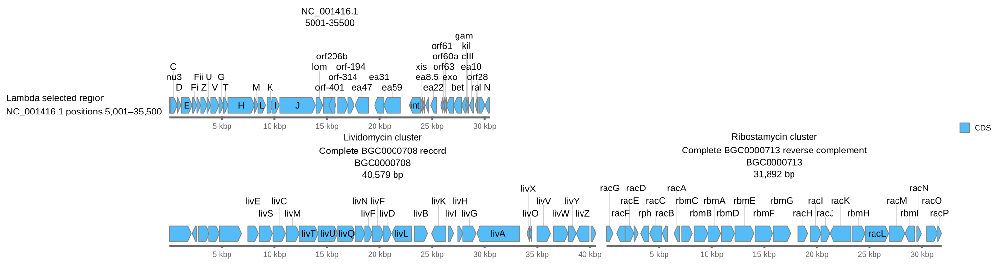

[Documentation home](../../DOCS.md) | [CLI how-to guides](README.md) | [Input formats](../../REFERENCE/input-formats-and-tsv-schemas.md) | [CLI reference](../../REFERENCE/command-line.md)

# How to arrange linear records, regions, orientation, labels, and rulers

Build a two-row Linear figure from three complete source records. The first row
shows a selected Lambda coordinate range. The second row keeps two independent
BGC records intact and reverses the display orientation of one record.

## Prerequisites

- Install gbdraw so that `gbdraw -h` succeeds.
- Start in an empty working directory.
- Copy these packaged files into it:
  - [`NC_001416.gb`](../../../gbdraw/web/tutorial-data/lambda/NC_001416.gb);
  - [`BGC0000708.gbk`](../../../gbdraw/web/tutorial-data/aminoglycoside-bgc-five/BGC0000708.gbk);
  - [`BGC0000713.gbk`](../../../gbdraw/web/tutorial-data/aminoglycoside-bgc-five/BGC0000713.gbk);
  - [`cds_gene_qualifier_priority.tsv`](../../../gbdraw/web/tutorial-data/shared/cds_gene_qualifier_priority.tsv).

The GenBank files contain three separate natural records. None was produced by
splitting another sequence. The Lambda source remains the complete 48,502 bp
`NC_001416.1` record even though the finished figure displays one coordinate
range. `BGC0000708` is a complete 40,579 bp record, and `BGC0000713` is a
complete 31,892 bp record. The [fixture manifest](../../../gbdraw/web/tutorial-data/manifest.json)
records the source and checksum for every input.

## Run the complete layout recipe

<!-- executable:H-CLI-04:start -->
```bash
gbdraw linear \
  --gbk NC_001416.gb BGC0000708.gbk BGC0000713.gbk \
  --record_id NC_001416.1 \
  --record_id BGC0000708 \
  --record_id BGC0000713 \
  --region NC_001416.1:5001-35500 \
  --reverse_complement false \
  --reverse_complement false \
  --reverse_complement true \
  --multi_record_position '#1@1' \
  --multi_record_position '#2@2' \
  --multi_record_position '#3@2' \
  --record_label 'Lambda selected region' \
  --record_label 'Lividomycin cluster' \
  --record_label 'Ribostamycin cluster' \
  --record_subtitle 'NC_001416.1 positions 5,001–35,500' \
  --record_subtitle 'Complete BGC0000708 record' \
  --record_subtitle 'Complete BGC0000713 reverse complement' \
  --qualifier_priority cds_gene_qualifier_priority.tsv \
  --show_labels all \
  --track_layout above \
  --scale_style ruler \
  --ruler_on_axis \
  --linear_record_gap 28 \
  --keep_definition_left_aligned \
  --legend right \
  -o linear_layout_cli \
  -f svg
```
<!-- executable:H-CLI-04:end -->



## Read the selectors and ranges

Each `--record_id` selects the named record from its corresponding input file.
`--region NC_001416.1:5001-35500` displays bases 5,001 through 35,500 without
changing the packaged source. The first ruler therefore runs from 5 kbp to
30 kbp and the definition reports `5001-35500`.

Use a region when the biological question concerns that interval. If the whole
record belongs in the figure, omit its `--region` value.

## Read the rows and orientation

The placement values put Lambda on row 1 and the two complete BGC records on row
2. Record order on row 2 follows input order: `BGC0000708` appears on the left
and `BGC0000713` on the right.

The three `--reverse_complement` values align with the three input files. Only
the third is `true`. Its local ruler still reads from 5 kbp through 30 kbp from
left to right. Reverse complementation changes feature placement: `racG`
appears to the left of `racP` in the third record. The source file remains
unchanged, and the layout does not claim comparison evidence between records.

## Verification

The executable check confirms:

- row 1 contains the Lambda range with 43 CDS features;
- row 2 contains all 30 CDS features from `BGC0000708` followed by all 26 from
  `BGC0000713`;
- the selected range, record order, row coordinates, labels, subtitles, and
  both rulers match the command and ascend from 5 kbp through 30 kbp;
- `racG` is left of `racP`, confirming the displayed orientation of
  `BGC0000713`;
- the standard SVG has no scripts, event handlers, or external links.

Open `linear_layout_cli.svg` at a readable scale. Confirm that Lambda occupies
the first row, the two BGC records share the second row without overlap, and
the labels remain connected to their features.

Run `python docs/recipes/run_cli_scenarios.py --scenario H-CLI-04` from a
repository checkout to regenerate the figure. Use a
[`--records_table`](use-input-tables.md) when a larger layout needs the same
per-record settings in a reviewable TSV file.

## Troubleshooting

### `multi_record_position must provide exactly 3 entry(ies).`

Keep one `--multi_record_position` value for every loaded record. Each selector
must occur exactly once.

### `Invalid reverse_complement value`

Use `true` or `false` for each repeated `--reverse_complement` value, in the
same order as the input files.

### `racG` or `racP` is missing

Keep `--show_labels all` and copy `cds_gene_qualifier_priority.tsv` into the
working directory. The qualifier-priority table makes the gene names available
for the orientation check.
