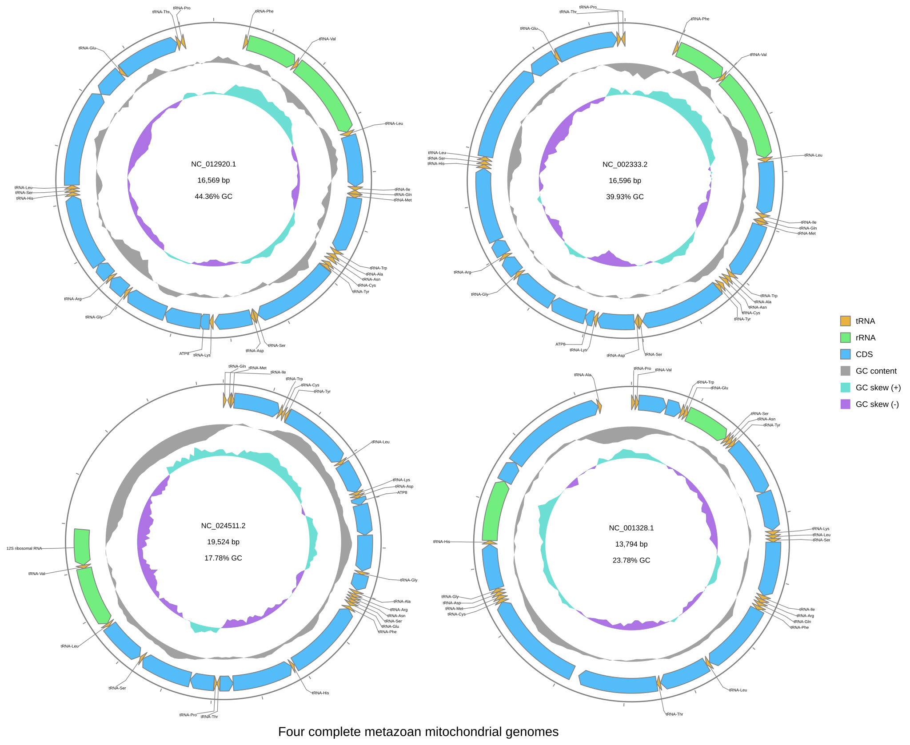

[Documentation home](../../DOCS.md) | [CLI how-to guides](README.md) | [Track and style reference](../../REFERENCE/palettes-feature-rules-labels-shapes-and-tracks.md) | [CLI reference](../../REFERENCE/command-line.md)

# How to arrange multiple circular records and tracks

Place four complete metazoan mitochondrial genomes on one Circular canvas.
The command fixes a 2x2 grid, equal diagram sizes, CDS gene labels, track
order, and the axis boundary. It does not calculate a comparison between the
records.

## Prerequisites

- Install gbdraw so that `gbdraw -h` succeeds.
- Start in an empty working directory.
- Copy these packaged GenBank files into it:
  - [`HmmtDNA.gbk`](../../../gbdraw/web/tutorial-data/human-mitochondrion/HmmtDNA.gbk),
    human `NC_012920.1` (16,569 bp);
  - [`NC_002333.2.gb`](../../../gbdraw/web/tutorial-data/metazoan-mitochondria-four/NC_002333.2.gb),
    zebrafish `NC_002333.2` (16,596 bp);
  - [`NC_024511.2.gb`](../../../gbdraw/web/tutorial-data/metazoan-mitochondria-four/NC_024511.2.gb),
    fruit fly `NC_024511.2` (19,524 bp);
  - [`NC_001328.1.gb`](../../../gbdraw/web/tutorial-data/metazoan-mitochondria-four/NC_001328.1.gb),
    nematode `NC_001328.1` (13,794 bp).
- Copy the shared
  [`cds_gene_qualifier_priority.tsv`](../../../gbdraw/web/tutorial-data/shared/cds_gene_qualifier_priority.tsv)
  label rule into the same directory.

All four files are complete, naturally circular RefSeq mitochondrial records.
No record is cropped, concatenated, or split. The
[fixture manifest](../../../gbdraw/web/tutorial-data/manifest.json) records
their species, topology, length, checksum, and feature counts.

## Put the four records in a 2x2 grid

Run this command in the directory containing the four files:

<!-- executable:H-CLI-03:start -->
```bash
gbdraw circular \
  --gbk HmmtDNA.gbk NC_002333.2.gb NC_024511.2.gb NC_001328.1.gb \
  --multi_record_canvas \
  --multi_record_size_mode equal \
  --multi_record_position '#1@1' \
  --multi_record_position '#2@1' \
  --multi_record_position '#3@2' \
  --multi_record_position '#4@2' \
  --circular_track_order ticks,features,gc_content,gc_skew \
  --circular_track_axis_index 1 \
  --qualifier_priority cds_gene_qualifier_priority.tsv \
  --labels out \
  --label_font_size 10 \
  --plot_title 'Four complete metazoan mitochondrial genomes' \
  --plot_title_position bottom \
  --legend right \
  -o multi_record_circular_cli \
  -f svg
```
<!-- executable:H-CLI-03:end -->

`--multi_record_canvas` produces one SVG instead of one file per input record.
The first two position tokens assign records 1 and 2 to row 1. The other two
assign records 3 and 4 to row 2. Input order determines left-to-right order
within a row. `equal` gives all four diagrams the same radius even though their
sequence lengths differ.



The finished SVG identifies all four record IDs and lengths. The input list
above maps each accession to its species. The SVG contains 147 displayed
features: 37 each for human, zebrafish, and fruit fly, and 36 for the nematode.
Each CDS label uses the feature's concise `gene` value; longer `product`
descriptions are not used as labels.

## Control track order and the axis boundary

The comma-separated order is outside to inside. Axis index `1` places the
boundary after slot 0: `ticks` stays outside, while `features`, `gc_content`, and
`gc_skew` are inside.

Every loaded record must receive exactly one placement when explicit positions
are used. You can replace `#1` through `#4` with stable record IDs when input
order may change.

## Verification

The executable check confirms:

- the four source entries are raw, complete, circular RefSeq records with the
  documented accessions and lengths;
- the SVG keeps input order and forms two left-to-right rows of two records;
- all 147 displayed features remain present;
- all four records retain their CDS gene labels, with no CDS product text used
  as a label;
- every record uses `ticks`, `features`, `gc_content`, and `gc_skew` in that
  order, with exactly one axis after `ticks`;
- the output is standard SVG with no scripts, event handlers, or external
  links.

Run `python docs/recipes/run_cli_scenarios.py --scenario H-CLI-03` from a
repository checkout to regenerate the published figure in a clean directory.

## Troubleshooting

### A record is missing from the grid

Keep one `--multi_record_position` for every loaded record. A missing selector,
duplicate selector, or row number below 1 is rejected before rendering.

### The circles have different radii

Keep `--multi_record_size_mode equal`. The `auto` and `linear` modes scale
records according to length and can make the 19,524 bp fruit-fly diagram larger
than the others.

### A track appears on the wrong side of the axis

The axis index is a boundary in the ordered slot list. With index `1`, only
`ticks` is outside. Changing it to `2` moves `features` outside as well.
