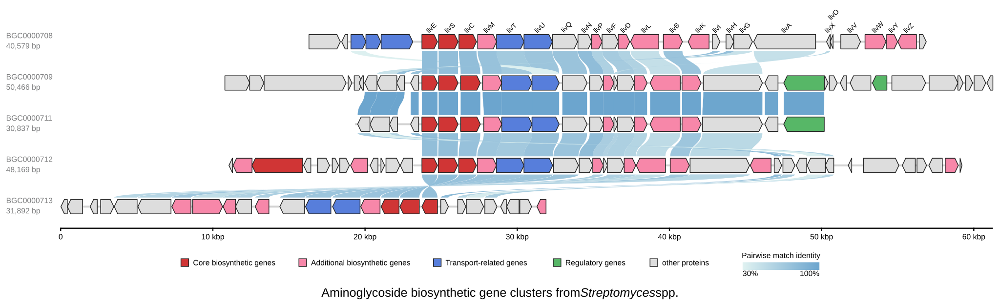

[Documentation home](../../DOCS.md) | [CLI how-to guides](README.md) | [Comparison semantics](../../REFERENCE/comparison-programs-thresholds-and-results.md) | [CLI reference](../../REFERENCE/command-line.md)

# How to create protein similarity groups with LOSATP

Reproduce the Gallery-style five-record aminoglycoside figure with
search-derived protein Similarity groups, concise gene labels, category colors,
and one shared alignment target.

## Prerequisites

- Use a Linux x86_64 gbdraw installation containing bundled LOSAT 0.1.0.
- Start in an empty working directory.
- Copy all five GenBank files and both color tables from the
  [`aminoglycoside-bgc-five` fixture](../../../gbdraw/web/tutorial-data/aminoglycoside-bgc-five/BGC0000708.gbk).
- Copy [`cds_gene_qualifier_priority.tsv`](../../../gbdraw/web/tutorial-data/shared/cds_gene_qualifier_priority.tsv)
  into the same directory.

The five inputs are complete `BGC0000708`, `BGC0000709`, `BGC0000711`,
`BGC0000712`, and `BGC0000713` records, not fragments made from one source.
The [fixture manifest](../../../gbdraw/web/tutorial-data/manifest.json) records
their fixed order, lengths, 155 displayed CDS features, and checksums.

## Build and align the Similarity groups

<!-- executable:H-CLI-07:start -->
```bash
gbdraw linear \
  --gbk BGC0000708.gbk BGC0000709.gbk BGC0000711.gbk BGC0000712.gbk BGC0000713.gbk \
  --protein_blastp_mode orthogroup \
  --losatp_threads 1 \
  --identity 30 \
  --align_orthogroup_feature CAG38695.1 \
  -k CDS,rRNA,tRNA,tmRNA,ncRNA,repeat_region \
  -p orange \
  -d BGC0000708-BGC0000713_default_colors.tsv \
  -t BGC0000708-BGC0000713_specific_colors.tsv \
  --qualifier_priority cds_gene_qualifier_priority.tsv \
  --show_labels first \
  --label_placement above_feature \
  --label_rotation 45 \
  --pairwise_match_style curve \
  --scale_style ruler \
  --plot_title 'Aminoglycoside biosynthetic gene clusters from <i>Streptomyces</i> spp.' \
  --keep_definition_left_aligned \
  --block_stroke_width 2 \
  --block_stroke_color '#262626' \
  --line_stroke_width 2 \
  --axis_stroke_width 5 \
  --legend_box_size 20 \
  --legend_font_size 20 \
  --label_font_size 18 \
  --feature_height 75 \
  --ruler_label_font_size 20 \
  --definition_line_style name:size=20,weight=bold \
  --definition_line_style subtitle:size=20 \
  --definition_line_style 'accession:size=20,color=#7b7c7d' \
  --definition_line_style 'length:size=20,color=#7b7c7d' \
  --legend bottom \
  -o cli_losatp_groups \
  -f svg
```
<!-- executable:H-CLI-07:end -->



## Interpret `orthogroup` as a compatibility token

The CLI value is `orthogroup`, but the result is a gbdraw Similarity-group
view derived from retained LOSATP relationships. It is not a phylogenetic
orthology analysis. Group IDs such as `og_1` are stable only for the pinned
inputs, order, program version, and settings used here.

`CAG38695.1` is the `livE` protein in `BGC0000708`. Its group is `og_1` in this
run and contains one aligned member in each of the five records. The option
shifts record placement so the five feature centers share one x coordinate; it
does not crop, rotate, or rewrite a source record.

The two color tables preserve the Gallery categories, and the qualifier table
selects concise gene names. `--show_labels first` labels the first record only,
which keeps all five full records readable at the published width.

## Verification

The executable check confirms:

- bundled LOSAT 0.1.0 runs with one thread on all five complete inputs;
- the SVG contains all five record IDs and all 155 CDS features;
- 77 adjacent-record curves belong to 21 exact displayed Similarity-group IDs;
- `og_1` forms a four-edge chain across all five records, and its five feature
  centers align to the same global x coordinate;
- the first record keeps the expected `liv*` labels, including `livE`;
- every comparison path is marked `orthogroup`, not Pairwise or Collinear.

Run `python docs/recipes/run_cli_scenarios.py --scenario H-CLI-07` from a
repository checkout to regenerate the figure in a clean directory.

## Troubleshooting

### `CAG38695.1` cannot be resolved

Keep the five source files in the documented order and do not filter out the
CDS containing that protein ID. Alignment fails rather than guessing another
feature.

### Labels show product descriptions instead of gene names

Copy `cds_gene_qualifier_priority.tsv` into the working directory and keep the
documented `--qualifier_priority` option.

### Group IDs or counts differ

Confirm `losat --version`, the one-thread setting, input checksums, order, and
thresholds. Treat a result from another runtime or setting as a new analysis,
not as the qualified artifact shown here.
