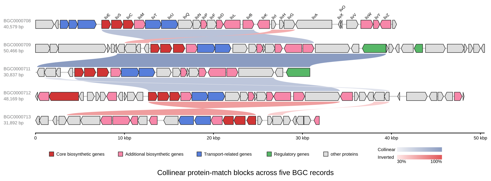

[Documentation home](../../DOCS.md) | [CLI how-to guides](README.md) | [Comparison semantics](../../REFERENCE/comparison-programs-thresholds-and-results.md) | [CLI reference](../../REFERENCE/command-line.md)

# How to draw collinear protein-match blocks with LOSATP

Combine retained LOSATP anchors into locally ordered blocks across the same
five complete aminoglycoside BGC records. Encode block orientation by color
family and average identity by shade.

## Prerequisites

- Use a Linux x86_64 gbdraw installation containing bundled LOSAT 0.1.0.
- Start in an empty working directory.
- Copy all five GenBank files and both color tables from the
  [`aminoglycoside-bgc-five` fixture](../../../gbdraw/web/tutorial-data/aminoglycoside-bgc-five/BGC0000708.gbk).
- Copy [`cds_gene_qualifier_priority.tsv`](../../../gbdraw/web/tutorial-data/shared/cds_gene_qualifier_priority.tsv)
  into the same directory.

The fixed inputs are five separate complete records with 155 displayed CDS
features. Their provenance and checksums are in the
[fixture manifest](../../../gbdraw/web/tutorial-data/manifest.json).

## Draw the ordered blocks

<!-- executable:H-CLI-08:start -->
```bash
gbdraw linear \
  --gbk BGC0000708.gbk BGC0000709.gbk BGC0000711.gbk BGC0000712.gbk BGC0000713.gbk \
  --protein_blastp_mode collinear \
  --losatp_threads 1 \
  --identity 30 \
  --collinear_search_scope adjacent \
  --collinear_min_anchors 2 \
  --collinear_max_unit_gap 1 \
  --collinear_max_diagonal_drift 1 \
  --collinear_color_mode orientation_identity \
  -k CDS,rRNA,tRNA,tmRNA,ncRNA,repeat_region \
  -p orange \
  -d BGC0000708-BGC0000713_default_colors.tsv \
  -t BGC0000708-BGC0000713_specific_colors.tsv \
  --qualifier_priority cds_gene_qualifier_priority.tsv \
  --show_labels first \
  --label_placement above_feature \
  --label_rotation 45 \
  --pairwise_match_style curve \
  --scale_style ruler \
  --plot_title 'Collinear protein-match blocks across five BGC records' \
  --keep_definition_left_aligned \
  --block_stroke_width 2 \
  --block_stroke_color '#262626' \
  --line_stroke_width 2 \
  --axis_stroke_width 5 \
  --legend_box_size 20 \
  --legend_font_size 20 \
  --label_font_size 18 \
  --feature_height 75 \
  --ruler_label_font_size 20 \
  --definition_line_style name:size=20,weight=bold \
  --definition_line_style subtitle:size=20 \
  --definition_line_style 'accession:size=20,color=#7b7c7d' \
  --definition_line_style 'length:size=20,color=#7b7c7d' \
  --legend bottom \
  -o cli_losatp_collinear \
  -f svg
```
<!-- executable:H-CLI-08:end -->



## Read scope, anchors, gaps, and colors

`--collinear_search_scope adjacent` limits displayed evidence to the four
neighboring record pairs. It does not compare `BGC0000708` directly with
`BGC0000713`.

A block needs at least two compatible anchors. Neighboring anchors may skip one
unit in either record and may drift by one position from the block diagonal.
These are order-space rules; they do not define an orthology model.

`orientation_identity` uses blue shades for plus-orientation blocks and red
shades for minus-orientation blocks. Shade intensity follows the block's
average protein identity. The result contains seven blocks: four plus and three
minus, with 13, 3, 21, 2, 15, 13, and 2 anchors by block ID order.

## Verification

The executable check confirms:

- bundled LOSAT 0.1.0 runs with one thread against all five complete records;
- all 155 CDS features remain in the SVG;
- exactly seven `collinear` paths carry stable block IDs, adjacent endpoints,
  anchor counts, ordered unit lists, orientation, score, and color-mode data;
- each query and subject unit list has the declared number of anchors;
- four plus blocks use blue fills and three minus blocks use red fills;
- no block directly connects `BGC0000708` and `BGC0000713`.

Run `python docs/recipes/run_cli_scenarios.py --scenario H-CLI-08` from a
repository checkout to regenerate the figure in a clean directory.

## Troubleshooting

### Only singleton matches are expected

This recipe deliberately removes them with `--collinear_min_anchors 2`. Use
Pairwise mode when individual retained rows, rather than ordered runs, are the
object of the figure.

### Blocks merge too broadly or split too often

Review `--collinear_max_unit_gap` and `--collinear_max_diagonal_drift` together.
Changing either value defines a new block result, so record the new settings
with the output.

### Colors no longer separate orientations

Keep `--collinear_color_mode orientation_identity`. `average_identity` does not
reserve separate color families for plus and minus blocks.
