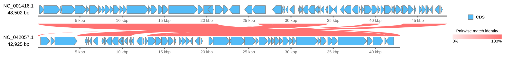

[Documentation home](../../DOCS.md) | [CLI how-to guides](README.md) | [Comparison semantics](../../REFERENCE/comparison-programs-thresholds-and-results.md) | [CLI reference](../../REFERENCE/command-line.md)

# How to draw comparisons from precomputed BLAST results

Use one frozen LOSATN table to draw six links between two complete phage
records. The Circular example uses three frozen TLOSATX tables from four
complete metazoan mitochondrial genomes. These commands read prepared
evidence; they do not start a LOSAT search.

## Prerequisites

- Install gbdraw so that `gbdraw -h` succeeds.
- Start in an empty working directory.
- Copy these packaged files into it:
  - [`NC_001416.gb`](../../../gbdraw/web/tutorial-data/lambda/NC_001416.gb);
  - [`NC_042057.1.gb`](../../../gbdraw/web/tutorial-data/de3/NC_042057.1.gb);
  - [`lambda-de3.losatn.tsv`](../../../gbdraw/web/tutorial-data/lambda-de3-comparison/lambda-de3.losatn.tsv);
  - [`HmmtDNA.gbk`](../../../gbdraw/web/tutorial-data/human-mitochondrion/HmmtDNA.gbk);
  - the three frozen TLOSATX tables in
    [`metazoan-mitochondria-comparison`](../../../gbdraw/web/tutorial-data/metazoan-mitochondria-comparison/danio-human.tlosatx.tsv);
  - [`cds_gene_qualifier_priority.tsv`](../../../gbdraw/web/tutorial-data/shared/cds_gene_qualifier_priority.tsv).

The inputs are the complete 48,502 bp Lambda `NC_001416.1` record and the
complete 42,925 bp DE3 `NC_042057.1` record. The table contains six BLAST
outfmt 6 rows produced by LOSATN 0.1.0 `megablast` in a serial, one-thread
browser run. The [fixture manifest](../../../gbdraw/web/tutorial-data/manifest.json)
records the source checksums, search arguments, table checksums, and
repeated-run qualification. The mtDNA tables use each non-human record from
[`metazoan-mitochondria-four`](../../../gbdraw/web/tutorial-data/metazoan-mitochondria-four/NC_002333.2.gb)
as query and the complete human record as subject. The command reads the frozen
tables, so those three query GenBank files need not be copied into the working
directory.

## Draw the Linear links and Circular rings

<!-- executable:H-CLI-05:start -->
```bash
gbdraw linear \
  --gbk NC_001416.gb NC_042057.1.gb \
  --record_id NC_001416.1 \
  --record_id NC_042057.1 \
  --blast lambda-de3.losatn.tsv \
  --bitscore 50 \
  --evalue 1e-2 \
  --identity 0 \
  --alignment_length 0 \
  --pairwise_match_style curve \
  --show_labels none \
  --track_layout above \
  --scale_style ruler \
  --ruler_on_axis \
  --legend right \
  -o linear_precomputed_comparison \
  -f svg
gbdraw circular \
  --gbk HmmtDNA.gbk \
  --conservation_blast danio-human.tlosatx.tsv drosophila-human.tlosatx.tsv caenorhabditis-human.tlosatx.tsv \
  --conservation_reference subject \
  --conservation_labels 'Danio rerio (NC_002333.2)' 'Drosophila melanogaster (NC_024511.2)' 'Caenorhabditis elegans (NC_001328.1)' \
  --conservation_colors '#4E79A7' '#F28E2B' '#59A14F' \
  --bitscore 50 \
  --evalue 1e-5 \
  --identity 40 \
  --alignment_length 50 \
  --conservation_ring_width 18 \
  --conservation_ring_gap 4 \
  --track_type middle \
  --qualifier_priority cds_gene_qualifier_priority.tsv \
  --labels out \
  --plot_title 'Complete metazoan mitochondrial TLOSATX evidence' \
  --plot_title_position top \
  --legend right \
  -o circular_conservation_ring \
  -f svg
```
<!-- executable:H-CLI-05:end -->




## Keep the table direction explicit

Every row names `NC_001416.1` as query and `NC_042057.1` as subject. The Linear
command loads the records in that order, so each curve connects the recorded
query and subject coordinates without remapping either side.

The Circular command displays the complete human mitochondrial genome.
`--conservation_reference subject` paints the subject spans from the zebrafish,
fruit-fly, and nematode comparisons. The rings are views of retained search
spans, not claims that every base inside a span is conserved. All four source
records are complete and naturally circular; the example does not crop or
split a linear sequence.

The thresholds are written out so a later default change cannot silently alter
the recipe. All six LOSATN rows pass the Linear thresholds. The Circular
thresholds retain 68 zebrafish, 24 fruit-fly, and 14 nematode spans. For several
prepared Linear tables or non-positional endpoints, use a
[`--comparisons_table`](../../REFERENCE/command-line.md#comparison-boundary)
instead of adding ambiguous file order to a long command.

## Verification

The executable check confirms:

- the Linear output contains all 73 Lambda CDS features, all 57 DE3 CDS
  features, and exactly six curved Pairwise links;
- every link maps query `NC_001416.1` to subject `NC_042057.1`;
- the retained alignment lengths are 21,232, 6,412, 5,205, 1,914, 1,620, and
  254 bp;
- the Circular output contains three `sequence_conservation` slots with the
  declared species labels and 106 total hits bound to human on the subject
  reference side;
- the Circular output shows the 13 human CDS `gene` values, not their product
  descriptions;
- both outputs are standard SVG with no scripts, event handlers, or external
  links.

Run `python docs/recipes/run_cli_scenarios.py --scenario H-CLI-05` from a
repository checkout to regenerate both figures in clean-directory mode.

## Troubleshooting

### No Linear curves appear

Check that both record IDs in the table match the loaded record IDs, including
their version suffixes. Also confirm that the explicit thresholds were not
made stricter.

### The Circular rings are empty or use the wrong coordinates

Keep `--conservation_reference subject` for these tables. Choosing `query`
asks gbdraw to place comparison-species coordinates on the displayed human
record.

### The table is mistaken for a live search request

LOSATN and TLOSATX are prepared-input paths in the CLI. Use `--blast`,
`--comparisons_table`, or `--conservation_blast`; the CLI protein-search modes
run LOSATP or a compatible BLASTP runtime instead.
