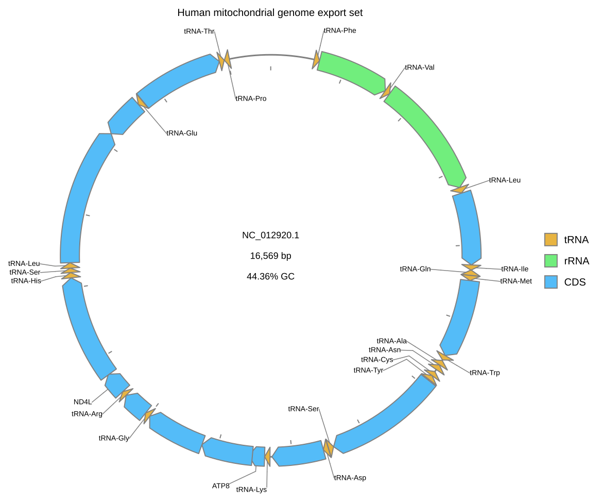
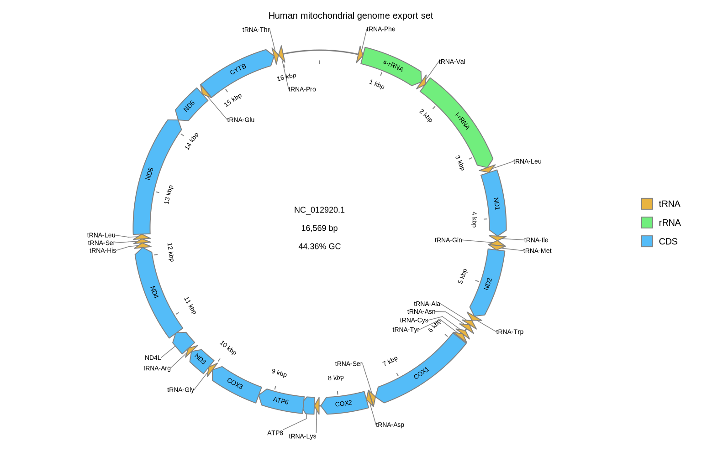

[Documentation home](../../DOCS.md) | [CLI how-to guides](README.md) | [Output formats](../../REFERENCE/output-formats-and-export.md) | [Publication guidance](../../EXPLANATION/prepare-publication-and-reproducible-figures.md)

# How to export static and interactive outputs

Render one complete record once, then write the static SVG master, standalone
interactive SVG, PNG, PDF, EPS, and PS derivatives with predictable names.

## Prerequisites

- Install gbdraw with the export extra so that `python -c "import cairosvg"`
  succeeds. SVG and interactive SVG do not require CairoSVG; PNG, PDF, EPS,
  and PS do.
- Start in an empty working directory.
- Download the complete `NC_012920.1` GenBank record from
  [NCBI EFetch](https://eutils.ncbi.nlm.nih.gov/entrez/eutils/efetch.fcgi?db=nuccore&id=NC_012920.1&rettype=gbwithparts&retmode=text)
  and save it as `HmmtDNA.gbk`.
- Copy the repository support table
  [`cds_gene_qualifier_priority.tsv`](../../../gbdraw/web/tutorial-data/shared/cds_gene_qualifier_priority.tsv)
  into the same directory.

See [Get the tutorial files](../../GETTING_TUTORIAL_DATA.md) for the
authoritative-download and accession-check procedure.

## Export every CLI format

<!-- executable:H-CLI-13:start -->
```bash
gbdraw circular \
  --gbk HmmtDNA.gbk \
  --species '<i>Homo sapiens</i>' \
  --qualifier_priority cds_gene_qualifier_priority.tsv \
  --labels both \
  --track_type middle \
  --plot_title 'Human mitochondrial genome export set' \
  --plot_title_position top \
  --plot_title_font_size 20 \
  --legend right \
  -o cli_export \
  -f svg,interactive_svg,png,pdf,eps,ps
```
<!-- executable:H-CLI-13:end -->

The command writes:

| Requested format | Output name |
|---|---|
| `svg` | `cli_export.svg` |
| `interactive_svg` | `cli_export.interactive.svg` |
| `png` | `cli_export.png` |
| `pdf` | `cli_export.pdf` |
| `eps` | `cli_export.eps` |
| `ps` | `cli_export.ps` |

The base SVG is written once even when both `svg` and `interactive_svg` are
requested. Existing targets are refused as a set unless `--overwrite` is
given.

## Verify the export set

The executable validator parses both SVG files as XML, checks the PNG signature
and dimensions, checks the PDF header, cross-reference trailer, and end marker,
and verifies the DSC PostScript signature and trailer for both EPS and PS.
Every file must be nonempty. The interactive SVG must contain embedded feature
metadata, zoom, reset, and search controls; the static SVG must contain no
script.





Open `cli_export.interactive.svg` in a browser to use feature search, hover
summaries, detail tabs, and sequence actions. Some desktop image viewers block
embedded scripts and show only the static artwork.

## Choose a delivery format

- Keep SVG as the editable vector master.
- Use PDF for print or submission workflows that accept vector figures.
- Use PNG only when a fixed raster is required; verify its pixel dimensions at
  the final physical size.
- Use EPS or PS only when a legacy workflow asks for it, and proof text,
  transparency, and strokes in the receiving application.
- Use interactive SVG for browser inspection, not as a substitute for a static
  publication figure. Keep a session alongside it when future editing matters.

## Troubleshooting

- Only SVG files appear: install the export extra and confirm CairoSVG imports
  in the same environment as `gbdraw`.
- A target already exists: choose a new prefix or review all six exact paths
  before adding `--overwrite`.
- Browser controls do not work: open `.interactive.svg`, not the static `.svg`,
  and try a browser rather than a desktop previewer.
- Text changes after conversion: install the original fonts and proof the PDF,
  EPS, or PS on the destination system.

Run `python docs/recipes/run_cli_scenarios.py --scenario H-CLI-13` from a
source checkout to regenerate and validate all six artifacts.
