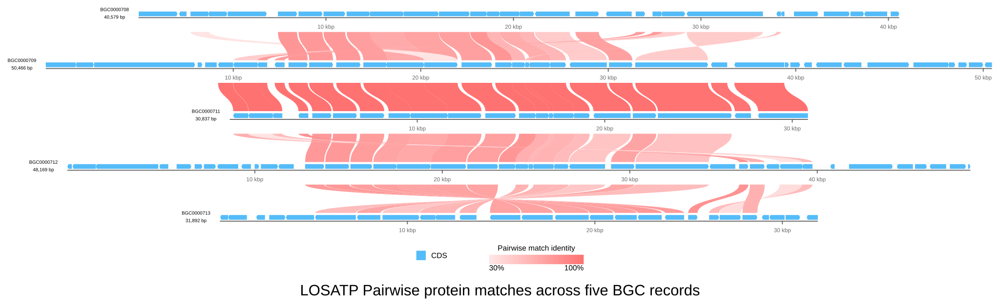

[Documentation home](../../DOCS.md) | [CLI how-to guides](README.md) | [Comparison semantics](../../REFERENCE/comparison-programs-thresholds-and-results.md) | [CLI reference](../../REFERENCE/command-line.md)

# How to run Pairwise protein searches with LOSATP

Search adjacent pairs across five complete aminoglycoside biosynthetic gene
cluster records. Save the hydrated raw LOSATP rows and draw each retained hit
as an individual curve.

This is a focused Pairwise-output example, not the representative Gallery
analysis for these records. Use the [Similarity-group guide](create-protein-similarity-groups.md)
for the Gallery-aligned five-record comparison.

## Prerequisites

- Use a Linux x86_64 gbdraw installation that contains the bundled LOSAT 0.1.0
  runtime.
- Start in an empty working directory.
- Download the five versioned MIBiG GenBank records, preserving these local
  names:
  - [`BGC0000708.gbk`](https://mibig.secondarymetabolites.org/repository/BGC0000708.5/BGC0000708.gbk);
  - [`BGC0000709.gbk`](https://mibig.secondarymetabolites.org/repository/BGC0000709.5/BGC0000709.gbk);
  - [`BGC0000711.gbk`](https://mibig.secondarymetabolites.org/repository/BGC0000711.5/BGC0000711.gbk);
  - [`BGC0000712.gbk`](https://mibig.secondarymetabolites.org/repository/BGC0000712.5/BGC0000712.gbk);
  - [`BGC0000713.gbk`](https://mibig.secondarymetabolites.org/repository/BGC0000713.5/BGC0000713.gbk).

See [Get the tutorial files](../../GETTING_TUTORIAL_DATA.md) for the
authoritative-download and record-identity procedure.

These are five separate complete MIBiG records in the fixed order shown above.
Together they contain the 155 CDS features used by this workflow.

## Run Pairwise mode and save its raw rows

<!-- executable:H-CLI-06:start -->
```bash
gbdraw linear \
  --gbk BGC0000708.gbk BGC0000709.gbk BGC0000711.gbk BGC0000712.gbk BGC0000713.gbk \
  --protein_blastp_mode pairwise \
  --losatp_threads 1 \
  --protein_blastp_max_hits 1 \
  --protein_blastp_output cli_losatp_pairwise.tsv \
  --identity 30 \
  --pairwise_match_style curve \
  --show_labels none \
  --track_layout above \
  --scale_style ruler \
  --ruler_on_axis \
  --align_center \
  --plot_title 'LOSATP Pairwise protein matches across five BGC records' \
  --legend bottom \
  -o cli_losatp_pairwise \
  -f svg
```
<!-- executable:H-CLI-06:end -->



The same run writes the
[`cli_losatp_pairwise.tsv`](../../images/h-cli-06/cli_losatp_pairwise.tsv)
evidence file. Comment lines identify each adjacent record pair; every other
line has the 12 BLAST outfmt 6 columns. gbdraw resolves internal runtime handles
to stable, percent-encoded protein IDs before writing the file.

## Separate raw rows from displayed links

Pairwise mode searches four adjacent pairs: 0708→0709, 0709→0711, 0711→0712,
and 0712→0713. It does not run or imply a direct 0708→0713 comparison.

LOSAT keeps at most one HSP for a given query-subject protein combination. The
four raw sections contain 204, 220, 160, and 207 rows, for 791 rows total.
`--protein_blastp_max_hits 1` then retains the strongest distinct subject per
query protein for display. After the 30% identity and default e-value/bit-score
filters, the SVG contains 19, 21, 19, and 17 curves: 76 individual links.

`--losatp_threads 1` controls the native runtime worker count. The verified
recipe uses automatic runtime selection, and its executable check verifies
`losat 0.1.0`. Use an explicit `--losatp_bin` only when you intend to change
that provenance.

## Verification

The executable check confirms:

- the bundled native runtime reports `losat 0.1.0` and receives one thread;
- the raw export has four ordered adjacent-pair sections, 791 rows, 12 columns
  per row, and no session-internal `h_...` handles;
- the SVG contains all five record IDs, all 155 CDS features, and exactly 76
  `pairwise` match paths;
- no Similarity-group or Collinear block metadata appears in those paths;
- no path directly connects `BGC0000708` to `BGC0000713`.

Run `python docs/recipes/run_cli_scenarios.py --scenario H-CLI-06` from a
repository checkout to regenerate the TSV and SVG from one clean search run.

## Troubleshooting

### LOSAT cannot be found

The verified environment uses the bundled Linux x86_64 executable. On another
platform, install LOSAT or NCBI BLAST+ and follow the runtime boundary in the
[comparison reference](../../REFERENCE/comparison-programs-thresholds-and-results.md).
Results from another program or version may not have the same rows or links.

### The raw TSV already exists

gbdraw refuses to replace raw evidence or diagram output by default. Rename the
output or review the existing files, then add `--overwrite` deliberately.

### The raw count is larger than the curve count

That is expected. The raw file preserves search rows; thresholds and the
one-subject display cap select the curves drawn in the SVG.
