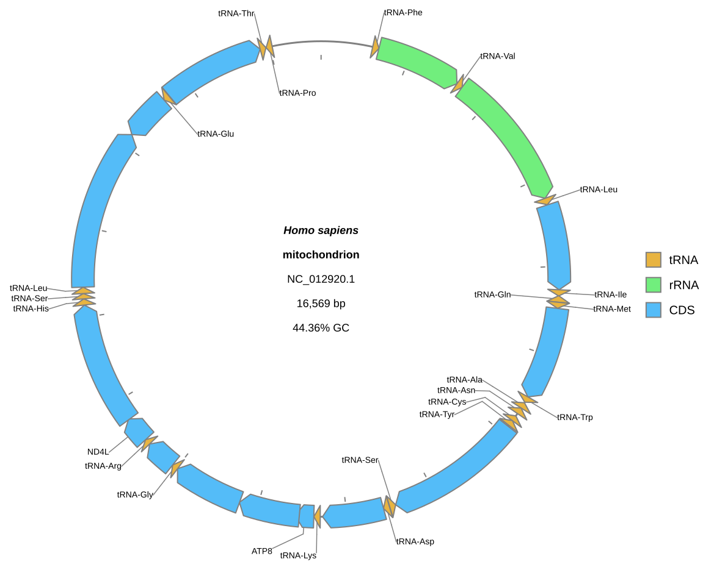

[Documentation home](../../DOCS.md) | [CLI how-to guides](README.md) | [Session compatibility](../../REFERENCE/session-and-request-compatibility.md) | [CLI reference](../../REFERENCE/command-line.md)

# How to save and regenerate sessions safely

Save one current CLI request as plain JSON, replay it without the original
GenBank file beside the session, and write an equivalent gzip-compressed
handoff. The replay uses explicit overwrite permission only after the CLI has
proved that the existing diagram is protected by default.

## Prerequisites

- Install gbdraw so that `gbdraw circular -h` succeeds.
- Start in an empty working directory.
- Download the complete `NC_012920.1` GenBank record from
  [NCBI EFetch](https://eutils.ncbi.nlm.nih.gov/entrez/eutils/efetch.fcgi?db=nuccore&id=NC_012920.1&rettype=gbwithparts&retmode=text)
  and save it as `HmmtDNA.gbk`.
- Copy the repository support table
  [`cds_gene_qualifier_priority.tsv`](../../../gbdraw/web/tutorial-data/shared/cds_gene_qualifier_priority.tsv)
  into the same directory.

See [Get the tutorial files](../../GETTING_TUTORIAL_DATA.md) for the
authoritative-download and accession-check procedure. The session replay below
uses only `cli_session.json`, which the first command creates from that source
record; it never loads a prebuilt session.

The source file contains the complete 16,569 bp circular human mitochondrial
record. A session embeds its input resources, settings, canonical render
request, and saved result; replay does not depend on a GenBank path remaining
valid.

## Save plain JSON, then replay to gzip

<!-- executable:H-CLI-12:start -->
```bash
gbdraw circular \
  --gbk HmmtDNA.gbk \
  --species '<i>Homo sapiens</i>' \
  --qualifier_priority cds_gene_qualifier_priority.tsv \
  --labels both \
  --track_type middle \
  --session_output cli_session.json \
  -o cli_session_roundtrip \
  -f svg

gbdraw circular \
  --session cli_session.json \
  --session_output cli_session.json.gz \
  --overwrite \
  -o cli_session_roundtrip \
  -f svg
```
<!-- executable:H-CLI-12:end -->

The `.gz` suffix selects lossless gzip compression. `--session_output` implies
`--save_session`; omit it and use `--save_session` only when the default
`<output>.gbdraw-session.json` name is suitable.

## Verification

The first command creates `cli_session.json` and
`cli_session_roundtrip.svg`. Before the documented replay runs, the executable
validator repeats it without `--overwrite` and confirms that the existing SVG
is refused and left byte-for-byte unchanged. The second command then replaces
that SVG intentionally and writes `cli_session.json.gz`.

Both sessions use current session version 40 and canonical render-request
schema 5. They preserve the same record resource, configuration, and requested
SVG result. The replayed SVG is byte-identical to the first render.



## Replay rules

Use the same `circular` or `linear` subcommand that created the session. Along
with `--session`, the CLI accepts output and format overrides plus
`--save_session`, `--session_output`, and `--overwrite`. Other diagram options
are rejected because they would create an ambiguous mix of persisted and new
settings.

Do not edit a session's `version`, request schema, embedded resource hashes, or
runtime bindings by hand. Current readers accept the version ranges listed in
the [session compatibility reference](../../REFERENCE/session-and-request-compatibility.md);
development-only or unknown versions fail before output is written.

## Troubleshooting

- `Output file(s) already exist`: choose a new prefix, or add `--overwrite`
  only after confirming the exact target.
- `Unsupported session version`: regenerate from a supported release or use a
  documented migration path; changing the number is not a migration.
- The web app cannot load the file: select the `.json` or `.json.gz` session,
  not the interactive SVG.
- Replay rejects other plot flags: make those changes in the GUI after loading
  the session, or create a fresh CLI request.

Run `python docs/recipes/run_cli_scenarios.py --scenario H-CLI-12` from a
source checkout to exercise plain and gzip reads, byte-stable replay,
overwrite refusal, and incompatible-version rejection.
