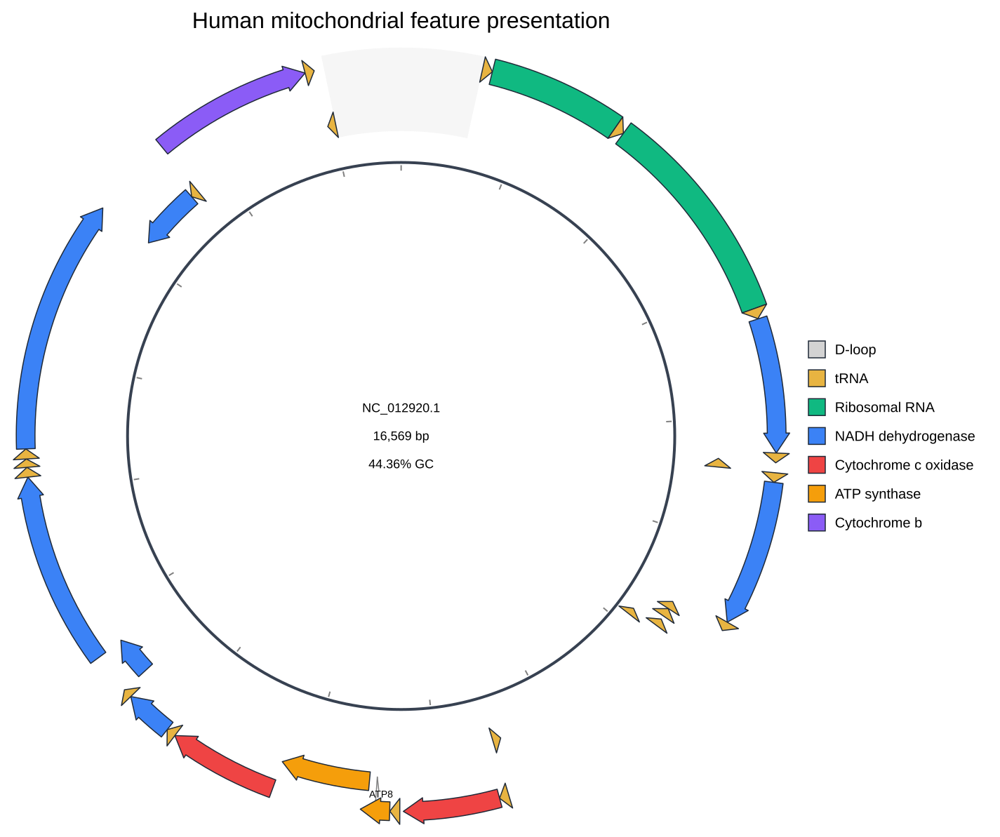

[Documentation home](../../DOCS.md) | [CLI how-to guides](README.md) | [Presentation reference](../../REFERENCE/palettes-feature-rules-labels-shapes-and-tracks.md) | [CLI reference](../../REFERENCE/command-line.md)

# How to set colors, labels, visibility, shapes, and strokes

Style a complete human mitochondrial record without changing its annotation.
The recipe combines a base palette with feature-specific colors, selects and
renames labels, applies visibility rules, chooses feature shapes, resolves
overlaps, and fixes stroke geometry.

## Prerequisites

- Install gbdraw so that `gbdraw circular -h` succeeds.
- Start in an empty working directory and create a `tables` directory.
- Copy [`HmmtDNA.gbk`](../../../gbdraw/web/tutorial-data/human-mitochondrion/HmmtDNA.gbk),
  [`HmmtDNA_feature_visibility.tsv`](../../../gbdraw/web/tutorial-data/human-mitochondrion/HmmtDNA_feature_visibility.tsv),
  and [`cds_gene_qualifier_priority.tsv`](../../../gbdraw/web/tutorial-data/shared/cds_gene_qualifier_priority.tsv)
  into it.

The source is the complete circular 16,569 bp `NC_012920.1` record.

## Create the feature-color rules

Save this as `tables/presentation_colors.tsv`:

```tsv
CDS	gene	^ND(4L|[1-6])$	#3B82F6	NADH dehydrogenase
CDS	gene	^COX[1-3]$	#EF4444	Cytochrome c oxidase
CDS	gene	^ATP[68]$	#F59E0B	ATP synthase
CDS	gene	^CYTB$	#8B5CF6	Cytochrome b
rRNA	gene	^RNR[12]$	#10B981	Ribosomal RNA
```

Columns are feature type, qualifier, case-insensitive regular expression,
color, and optional legend caption. These specific rules override the selected
`colorblind` palette only when they match.

Use `-d/--default_colors` when the base feature-type table itself needs to be
changed; omitted rows retain the built-in defaults. `--palette` chooses a named
base palette, while `-t/--table` or `--specific_colors` applies the matching
qualifier rules shown above.

## Select and rename labels

Save this whitelist as `tables/presentation_labels.tsv`:

```tsv
CDS	gene	^(ND1|COX2|ATP8|ATP6|COX3|CYTB)$
rRNA	gene	^RNR[12]$
```

Save these post-filter replacements as
`tables/presentation_label_overrides.tsv`:

```tsv
record_id	feature_type	qualifier	value	label_text
NC_012920.1	CDS	label	^ND1$	Complex I (ND1)
NC_012920.1	CDS	label	^COX2$	Oxidase II
NC_012920.1	rRNA	label	^s-rRNA$	12S rRNA
NC_012920.1	rRNA	label	^l-rRNA$	16S rRNA
```

The qualifier-priority file chooses `gene` for CDS labels. The whitelist then
retains named examples, and the override table replaces selected resolved label
text. Ordinary label overrides do not restore a label removed by the
whitelist.

## Draw the styled figure

<!-- executable:H-CLI-11:start -->
```bash
gbdraw circular \
  --gbk HmmtDNA.gbk \
  -k CDS,rRNA,tRNA \
  --palette colorblind \
  --table tables/presentation_colors.tsv \
  --qualifier_priority cds_gene_qualifier_priority.tsv \
  --label_whitelist tables/presentation_labels.tsv \
  --label_table tables/presentation_label_overrides.tsv \
  --feature_visibility_table HmmtDNA_feature_visibility.tsv \
  --feature_shape CDS=arrow \
  --feature_shape rRNA=rectangle \
  --feature_shape tRNA=arrow \
  --feature_shape D-loop=underlay \
  --arrow_head_length_ratio auto \
  --arrow_shaft_width_ratio 0.72 \
  --resolve_overlaps \
  --separate_strands \
  --track_type spreadout \
  --labels both \
  --label_rendering auto \
  --block_stroke_color '#1F2937' \
  --block_stroke_width 1.5 \
  --axis_stroke_color '#374151' \
  --axis_stroke_width 4 \
  --line_stroke_color '#9CA3AF' \
  --line_stroke_width 1.5 \
  --species '<i>Homo sapiens</i>' \
  --plot_title 'Human mitochondrial feature presentation' \
  --plot_title_position top \
  --legend right \
  -o cli_feature_presentation \
  -f svg
```
<!-- executable:H-CLI-11:end -->

## Verification

The output still represents one complete record and contains 37 visible
feature identities. The visibility table adds the origin-spanning D-loop,
hides COX1, and keeps ATP6 visible while excluding it only from protein-search
inputs. The D-loop is a full-band underlay; rRNAs are rectangles; CDS and tRNA
features remain directional arrows with 0.72-width shafts.

The selected color rules produce five semantic legend categories. Visible
labels include `Complex I (ND1)`, `Oxidase II`, `12S rRNA`, and `16S rRNA`;
unselected product descriptions do not appear. Overlap resolution may add
feature lanes, but it does not crop coordinates or alter comparison evidence.



## Precedence to remember

1. `-k/--features` sets baseline feature types.
2. A matching visibility `show` or specific-color rule can reveal another
   feature; visibility `off` removes it.
3. Specific-color rules override the palette for matching visible features.
4. Qualifier priority selects candidate label text, then whitelist or blacklist
   filtering runs, followed by ordinary label overrides.
5. Shape and stroke settings change rendering, not biological identity.

`--label_whitelist` and `--label_blacklist` are mutually exclusive. Use
`exclude_matching` when a visible CDS should be omitted from a protein search;
use `off` when its glyph should also disappear.

## Troubleshooting

- Colors stay at palette defaults: verify the feature qualifier and anchor the
  regular expression when an exact match is intended.
- Labels show product descriptions: keep the supplied qualifier-priority file.
- COX1 still appears: preserve the versioned record ID in the visibility table.
- An underlay disappears with custom slots: keep exactly one enabled feature
  slot so the automatic underlay has an anchor.

Run `python docs/recipes/run_cli_scenarios.py --scenario H-CLI-11` from a
source checkout to regenerate the SVG and compare colors, label text, feature
geometry, strokes, visibility, and overlap lanes semantically.
