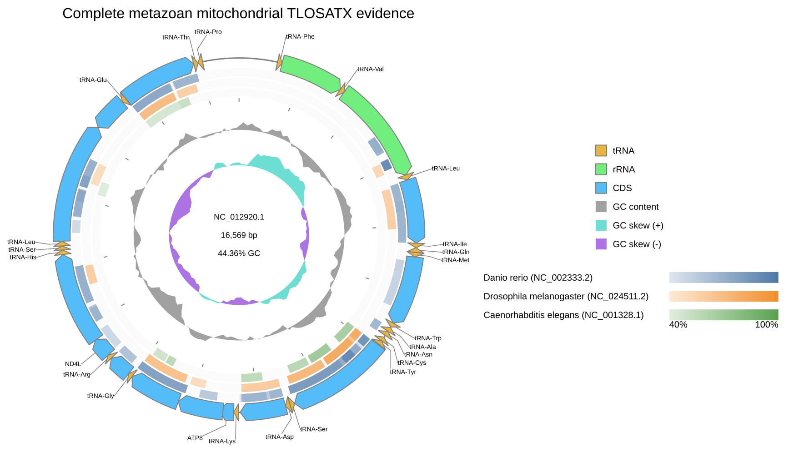
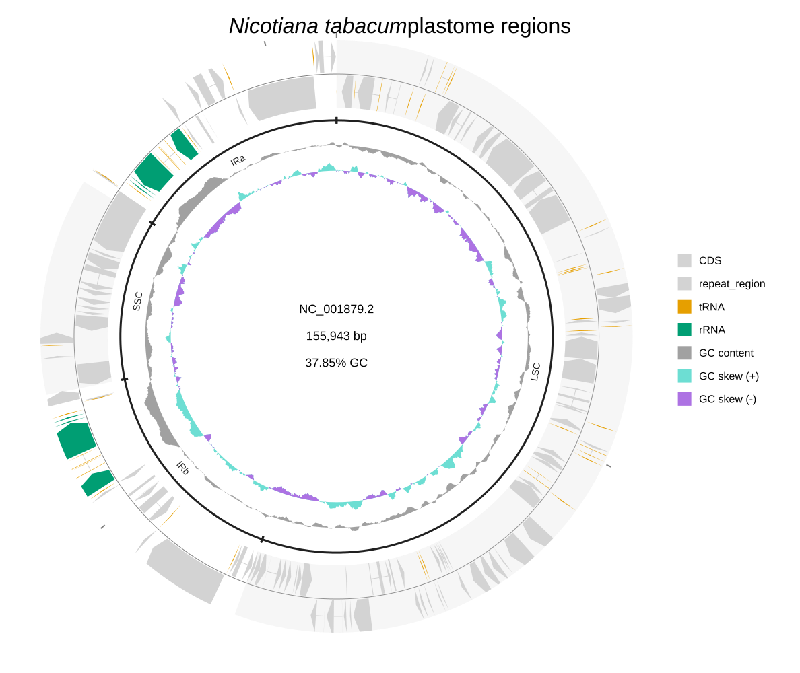
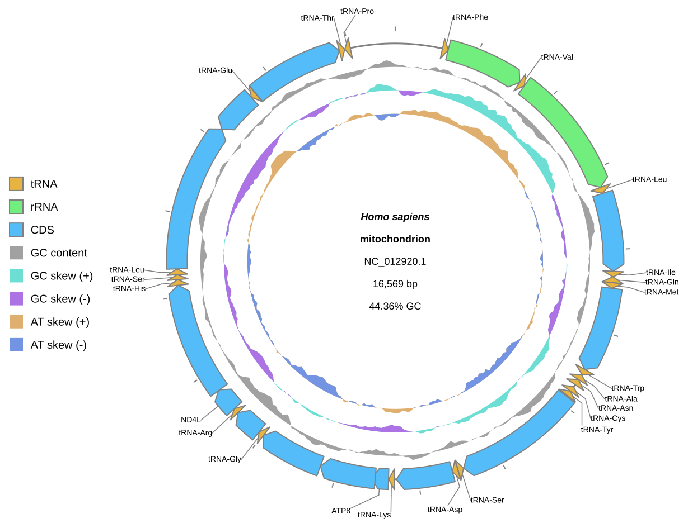

[Documentation home](../../DOCS.md) | [CLI how-to guides](README.md) | [Input table schemas](../../REFERENCE/input-formats-and-tsv-schemas.md) | [CLI reference](../../REFERENCE/command-line.md)

# How to use record, comparison, conservation, annotation, and track tables

Use TSV tables when paths, record placement, comparison endpoints, annotation
sets, or Circular slots should be reviewed as data. The five recipes below run
independently and cover one table type each.

## Prerequisites

- Install gbdraw so that `gbdraw -h` succeeds.
- Start in an empty working directory and create a `tables` directory.
- Download the accession-pinned sequence records named in each section into
  the working directory. Keep the sequence files at the top level; the table
  examples use `../` paths on purpose.
- Copy the shared
  [`cds_gene_qualifier_priority.tsv`](../../../gbdraw/web/tutorial-data/shared/cds_gene_qualifier_priority.tsv)
  rule into the working directory.
- Save every table as UTF-8 TSV with real tab characters.

Use [Get the tutorial files](../../GETTING_TUTORIAL_DATA.md) for the
authoritative-download and accession-check procedure. Repository links below
provide only support tables and annotations, not sequence records.

Relative paths in a table resolve from the directory containing that table,
not from the shell's current directory. Unknown columns and incomplete rows
are rejected.

## 1. Place complete records with a records table

Download these complete mitochondrial GenBank records from NCBI EFetch,
preserving the exact local names shown:

- [`NC_012920.1`](https://eutils.ncbi.nlm.nih.gov/entrez/eutils/efetch.fcgi?db=nuccore&id=NC_012920.1&rettype=gbwithparts&retmode=text)
  as `HmmtDNA.gbk`;
- [`NC_002333.2`](https://eutils.ncbi.nlm.nih.gov/entrez/eutils/efetch.fcgi?db=nuccore&id=NC_002333.2&rettype=gbwithparts&retmode=text)
  as `NC_002333.2.gb`;
- [`NC_024511.2`](https://eutils.ncbi.nlm.nih.gov/entrez/eutils/efetch.fcgi?db=nuccore&id=NC_024511.2&rettype=gbwithparts&retmode=text)
  as `NC_024511.2.gb`;
- [`NC_001328.1`](https://eutils.ncbi.nlm.nih.gov/entrez/eutils/efetch.fcgi?db=nuccore&id=NC_001328.1&rettype=gbwithparts&retmode=text)
  as `NC_001328.1.gb`.

Save this as `tables/records.tsv`:

```tsv
gbk	record_label	record_subtitle	record_id	order	row	column
../HmmtDNA.gbk	Human mitochondrion	Complete RefSeq record	NC_012920.1	1	1	1
../NC_002333.2.gb	Zebrafish mitochondrion	Complete RefSeq record	NC_002333.2	2	1	2
../NC_024511.2.gb	Fruit fly mitochondrion	Complete RefSeq record	NC_024511.2	3	2	1
../NC_001328.1.gb	Nematode mitochondrion	Complete RefSeq record	NC_001328.1	4	2	2
```

Each row is one displayed record. These are four independent, naturally
circular RefSeq records; none is cropped, split, or synthesized. `order`
controls input order, while `row` and `column` define the complete 2x2 grid.

## 2. Map prepared links with a comparisons table

Download complete Lambda
[`NC_001416.1`](https://eutils.ncbi.nlm.nih.gov/entrez/eutils/efetch.fcgi?db=nuccore&id=NC_001416.1&rettype=gbwithparts&retmode=text)
as `NC_001416.gb` and complete DE3
[`NC_042057.1`](https://eutils.ncbi.nlm.nih.gov/entrez/eutils/efetch.fcgi?db=nuccore&id=NC_042057.1&rettype=gbwithparts&retmode=text)
as `NC_042057.1.gb`. Copy the repository support table
[`lambda-de3.losatn.tsv`](../../../gbdraw/web/tutorial-data/lambda-de3-comparison/lambda-de3.losatn.tsv).
Save this as `tables/comparisons.tsv`:

```tsv
blast	query	subject
../lambda-de3.losatn.tsv	NC_001416.1	NC_042057.1
```

`query` and `subject` identify the displayed endpoints. They can be unique
record IDs or `#index` selectors. A comparisons table is Linear-only and
cannot be combined with `--blast`.

## 3. Describe a Circular conservation ring

Download complete human mitochondrial
[`NC_012920.1`](https://eutils.ncbi.nlm.nih.gov/entrez/eutils/efetch.fcgi?db=nuccore&id=NC_012920.1&rettype=gbwithparts&retmode=text)
as `HmmtDNA.gbk`. Copy the three frozen TLOSATX support tables from the
[`metazoan-mitochondria-comparison`](../../../gbdraw/web/tutorial-data/metazoan-mitochondria-comparison/danio-human.tlosatx.tsv)
fixture. Each table compares one complete mitochondrial genome with the
complete human mitochondrial reference. Save this as
`tables/conservation.tsv` beside the other tables:

```tsv
blast	label	color
../danio-human.tlosatx.tsv	Danio rerio (NC_002333.2)	#4E79A7
../drosophila-human.tlosatx.tsv	Drosophila melanogaster (NC_024511.2)	#F28E2B
../caenorhabditis-human.tlosatx.tsv	Caenorhabditis elegans (NC_001328.1)	#59A14F
```

`blast` is required. `label`, `color`, and `comparison_fasta` are optional.
The displayed reference is the complete 16,569 bp human mitochondrial record.
The table supplies three rings derived from complete, naturally circular
RefSeq records; `--conservation_reference subject` selects the human side of
each table.

## 4. Load region annotations

Download complete tobacco plastome
[`NC_001879.2`](https://eutils.ncbi.nlm.nih.gov/entrez/eutils/efetch.fcgi?db=nuccore&id=NC_001879.2&rettype=gbwithparts&retmode=text)
as `NC_001879.gbk`. Copy the repository support tables
[`nicotiana-tabacum-regions.tsv`](../../../gbdraw/web/tutorial-data/tobacco-plastome-regions/nicotiana-tabacum-regions.tsv),
[`modified_default_colors.tsv`](../../../gbdraw/web/tutorial-data/tobacco-plastome-regions/modified_default_colors.tsv),
and [`qualifier_priority.tsv`](../../../gbdraw/web/tutorial-data/tobacco-plastome-regions/qualifier_priority.tsv).
The annotation table assigns LSC, IRb, SSC, and IRa brackets to the complete
155,943 bp record. Annotation tables require `set_id`, `id`, and `mark`; each
row then supplies exactly one coordinate or feature target.

## 5. Define Circular slots with a track table

Download complete human mitochondrial
[`NC_012920.1`](https://eutils.ncbi.nlm.nih.gov/entrez/eutils/efetch.fcgi?db=nuccore&id=NC_012920.1&rettype=gbwithparts&retmode=text)
as `HmmtDNA.gbk`, then copy the repository support table
[`cds_gene_qualifier_priority.tsv`](../../../gbdraw/web/tutorial-data/shared/cds_gene_qualifier_priority.tsv).
Save this as `tables/tracks.tsv`:

```tsv
id	renderer	side	r	w	inner_gap_px	outer_gap_px	z	params
ticks	ticks	outside						tick_label_layout=label_out_tick_in
features	features	axis						
gc_content	dinucleotide_content	inside		0.10	3	3		nt=GC,legend_label=GC content
gc_skew	dinucleotide_skew	inside		0.10	3	3		nt=GC,legend_label=GC skew
at_skew	dinucleotide_skew	inside		0.10	3	3		nt=AT,positive_color=#deaf6e,negative_color=#7294e3,legend_label=AT skew
```

Table row order is slot order. The sole `side=axis` row must use the
`features` renderer. Structural values belong in their dedicated columns;
`params` is for renderer settings such as `nt` and `legend_label`.

## Run all five recipes

<!-- executable:H-CLI-02:start -->
```bash
gbdraw circular \
  --records_table tables/records.tsv \
  --multi_record_canvas \
  --multi_record_size_mode equal \
  --circular_track_order ticks,features,gc_content,gc_skew \
  --circular_track_axis_index 1 \
  --qualifier_priority cds_gene_qualifier_priority.tsv \
  --labels out \
  --label_font_size 10 \
  --plot_title 'Four complete metazoan mitochondrial genomes' \
  --plot_title_position bottom \
  --legend right \
  -o record_table \
  -f svg

gbdraw linear \
  --gbk NC_001416.gb NC_042057.1.gb \
  --record_id NC_001416.1 \
  --record_id NC_042057.1 \
  --comparisons_table tables/comparisons.tsv \
  --bitscore 50 \
  --evalue 1e-2 \
  --identity 0 \
  --alignment_length 0 \
  --pairwise_match_style curve \
  --show_labels none \
  --track_layout above \
  --scale_style ruler \
  --ruler_on_axis \
  --legend right \
  -o comparison_table \
  -f svg

gbdraw circular \
  --gbk HmmtDNA.gbk \
  --conservation_table tables/conservation.tsv \
  --conservation_reference subject \
  --bitscore 50 \
  --evalue 1e-5 \
  --identity 40 \
  --alignment_length 50 \
  --conservation_ring_width 18 \
  --conservation_ring_gap 4 \
  --track_type middle \
  --qualifier_priority cds_gene_qualifier_priority.tsv \
  --labels out \
  --plot_title 'Complete metazoan mitochondrial TLOSATX evidence' \
  --plot_title_position top \
  --legend right \
  -o conservation_table \
  -f svg

gbdraw circular \
  --gbk NC_001879.gbk \
  --annotation_table nicotiana-tabacum-regions.tsv \
  -d modified_default_colors.tsv \
  --qualifier_priority qualifier_priority.tsv \
  --circular_track_slot 'ticks:ticks@side=outside,tick_label_layout=label_out_tick_in' \
  --circular_track_slot 'features:features@side=overlay,lane_direction=split,w=48px' \
  --circular_track_slot 'plastome_regions:annotations@set_id=plastome_regions,side=inside,w=30px,show_labels=true,padding_px=1,overflow=compress' \
  --circular_track_slot 'gc_content:dinucleotide_content@side=inside,w=36px,nt=GC,legend_label=GC content' \
  --circular_track_slot 'gc_skew:dinucleotide_skew@side=inside,w=32px,nt=GC,legend_label=GC skew' \
  --separate_strands \
  --track_type tuckin \
  --labels none \
  --plot_title '<i>Nicotiana tabacum</i> plastome regions' \
  --plot_title_position top \
  --legend right \
  -o annotation_table \
  -f svg

gbdraw circular \
  --gbk HmmtDNA.gbk \
  --circular_track_table tables/tracks.tsv \
  --track_type middle \
  --window 500 \
  --step 50 \
  --species '<i>Homo sapiens</i>' \
  --qualifier_priority cds_gene_qualifier_priority.tsv \
  --labels out \
  --legend left \
  -o track_table \
  -f svg
```
<!-- executable:H-CLI-02:end -->

## Verification

The commands create five SVG files. `record_table.svg` contains four complete
mitochondrial records in the declared 2x2 grid. `comparison_table.svg` retains
the six Lambda-versus-DE3 HSPs with the declared endpoints.
`conservation_table.svg` contains 68 zebrafish, 24 fruit-fly, and 14 nematode
TLOSATX spans on the complete human mitochondrial reference.
`annotation_table.svg` contains the four named plastome brackets.
`track_table.svg` renders the five table rows in order, with the feature row
owning the axis.

Every CDS label in `record_table.svg` and `conservation_table.svg` comes from
its `gene` qualifier. No product description is used as a CDS label.








## Troubleshooting

- `uses undeclared` or `file not found`: keep the fixture names unchanged and
  check the `../` path from `tables`, not from the shell.
- `cannot mix gbk with gff/fasta`: use one representation for every records
  table row.
- `query and subject must be different`: fix the endpoint columns; row order
  does not replace endpoint identity.
- `side=axis is only supported for renderer=features`: move axis ownership to
  the feature row.

Run `python docs/recipes/run_cli_scenarios.py --scenario H-CLI-02` from a
source checkout to reproduce the five published artifacts in clean temporary
storage. See the [input table schema reference](../../REFERENCE/input-formats-and-tsv-schemas.md)
for the complete column inventory and exclusivity rules.
