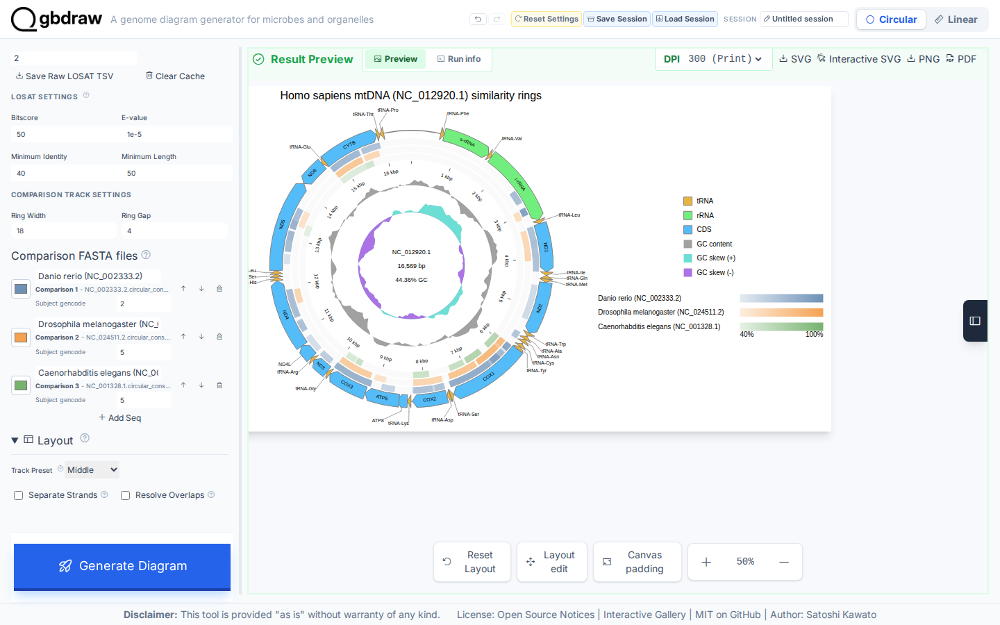
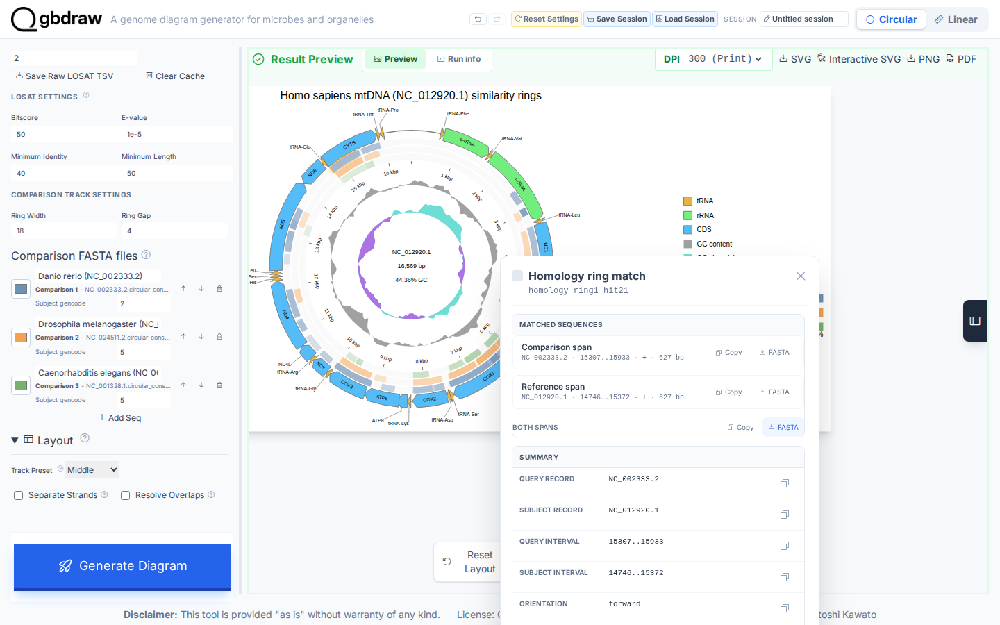

[Documentation home](../../DOCS.md) | [How-to guides](../README.md) | [GUI how-to guides](./README.md)

# How to add circular sequence-similarity rings

Circular comparison rings require a complete record whose source topology is
circular. This recipe uses complete human mitochondrial DNA as the displayed
reference and compares it with three other complete, naturally circular
mitochondrial genomes. No linear phage genome or partial region is drawn as a
circle.

## Before you start

Download the displayed record from NCBI as **GenBank (full)**. Download each
comparison record as **FASTA** because **Run LOSAT** accepts FASTA files for
the three rings.

| Role | Organism | Authoritative record | Format | Save as | Length | Topology |
|---|---|---|---|---|---:|---|
| Displayed reference | *Homo sapiens* | [NCBI `NC_012920.1`](https://www.ncbi.nlm.nih.gov/nuccore/NC_012920.1) | GenBank (full) | `HmmtDNA.gbk` | 16,569 bp | Circular |
| Ring 1 | *Danio rerio* | [NCBI `NC_002333.2`](https://www.ncbi.nlm.nih.gov/nuccore/NC_002333.2) | FASTA | `NC_002333.2.fna` | 16,596 bp | Circular |
| Ring 2 | *Drosophila melanogaster* | [NCBI `NC_024511.2`](https://www.ncbi.nlm.nih.gov/nuccore/NC_024511.2) | FASTA | `NC_024511.2.fna` | 19,524 bp | Circular |
| Ring 3 | *Caenorhabditis elegans* | [NCBI `NC_001328.1`](https://www.ncbi.nlm.nih.gov/nuccore/NC_001328.1) | FASTA | `NC_001328.1.fna` | 13,794 bp | Circular |

See [Get the tutorial inputs](../../GETTING_TUTORIAL_DATA.md) for browser
download and accession checks. Each comparison FASTA must contain the complete
record. Do not trim it or split it into mock contigs.

## Load the complete circular reference

1. Select **Circular** and **GenBank**.
2. Upload `HmmtDNA.gbk` under **GenBank/DDBJ File**.
3. Set **Species** to `<i>Homo sapiens</i>`.
4. Set **Output Prefix** to `circular_similarity_rings`.
5. Open **Layout**, set **Track Preset** to **Middle**, and turn off **Separate Strands**.

Open **Labels**, choose **Out**, and upload
[`cds_gene_qualifier_priority.tsv`](../../../gbdraw/web/tutorial-data/shared/cds_gene_qualifier_priority.tsv)
under **Priority File (TSV)**. The file contains `CDS` followed by `gene`, so
the 13 mitochondrial CDS labels use `gene`. Product descriptions are not used
as CDS labels.

## Add three translated-nucleotide rings

Open **Pairwise Comparisons**, select **Run LOSAT**, and choose **TLOSATX**.
Set the reference gencode to `2`, then add the three complete comparison FASTA
files in this order:

| Ring | File | Label | Subject gencode |
|---:|---|---|---:|
| 1 | `NC_002333.2.fna` | `Danio rerio (NC_002333.2)` | `2` |
| 2 | `NC_024511.2.fna` | `Drosophila melanogaster (NC_024511.2)` | `5` |
| 3 | `NC_001328.1.fna` | `Caenorhabditis elegans (NC_001328.1)` | `5` |

Keep the three automatically assigned series colors. They are distinct and
remain tied to the documented ring order.

Use these comparison filters:

| Control | Value |
|---|---:|
| Bitscore | `50` |
| E-value | `1e-5` |
| Minimum Identity | `40` |
| Minimum Length | `50` |
| Ring Width | `18` |
| Ring Gap | `4` |

Open **Title & Legend**, set the title to
`Homo sapiens mtDNA (NC_012920.1) similarity rings`, place it at the top, and
put the legend on the right.

## Generate and inspect one HSP

Select **Generate Diagram**, then zoom to 50%.

The displayed human record is the TLOSATX subject. Each ring keeps its source
accession and shows at least one retained HSP, with every interval falling
within the displayed human reference (1–16,569).

Select one colored HSP to open **Homology ring match**. The popup shows both
record IDs, aligned coordinates, orientation, identity, and alignment length.
Use the combined **FASTA** button. The browser downloads
`<match-id>_both.fna`, where `<match-id>` is the match ID in the popup. Rename
the file to `comparison_spans.fasta`; it should contain two non-empty records,
one for each side of the match.

Select **SVG** to save `circular_similarity_rings.svg`. The finished diagram
should show three rings in the documented order, the complete 16,569 bp
human reference, all four accessions and species labels, 13 CDS `gene`
labels, and zero CDS `product` labels.

## Troubleshooting

- **A comparison FASTA produces no ring:** check that it contains one complete
  mitochondrial record and use the matching mitochondrial genetic code.
- **The reference side is wrong:** with browser LOSAT, the displayed circular
  record is the subject and each comparison FASTA is a query.
- **Labels show product descriptions:** upload
  `cds_gene_qualifier_priority.tsv` and generate again.
- **The source record is linear or partial:** use a Linear diagram. Circular
  rings do not make linear or partial input circular.

## Related guides

- [Arrange multiple complete Circular records](./arrange-multiple-circular-records.md)
- [Use TLOSATX for translated nucleotide comparisons](./use-tlosatx.md)
