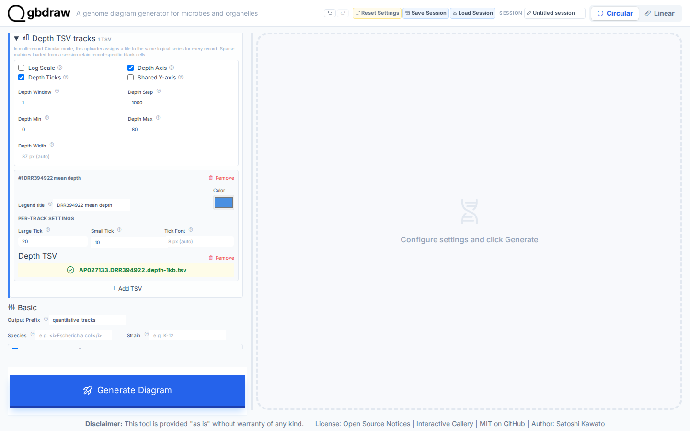
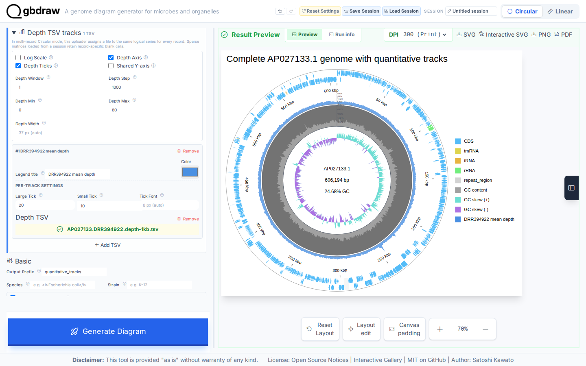

[Documentation home](../../DOCS.md) | [How-to guides](../README.md) | [GUI how-to guides](./README.md)

# How to add depth, GC content, and skew tracks

Use this workflow to place read depth, absolute GC percentage, and GC skew on
one Circular diagram. The example uses the complete `AP027133.1` record and a
deterministic 1 kbp depth derivative. The genome itself is neither cropped nor
split.

## Before you start

Download the sequence from NCBI and the pre-aggregated depth series from the
repository:

| Input | Acquisition | Save as | Purpose |
|---|---|---|---|
| Genome `AP027133.1` | [Official NCBI Revision History snapshot](https://www.ncbi.nlm.nih.gov/sviewer/viewer.cgi?tool=portal&save=file&db=nuccore&report=gbwithparts&id=AP027133.1&sat=3&satkey=69902298), **GenBank (full)** | `AP027133.gb` | Complete circular record, 606,194 bp |
| DRR394922 mean depth | [Support download](../../../gbdraw/web/tutorial-data/depth-1kb/AP027133.DRR394922.depth-1kb.tsv) | `AP027133.DRR394922.depth-1kb.tsv` | 607 consecutive non-overlapping depth bins |

See [Get the tutorial inputs](../../GETTING_TUTORIAL_DATA.md) for browser
download and file identity checks.

Only the quantitative measurements are reduced. Each TSV value is the
arithmetic mean of the original per-base integer depths in that 1 kbp bin. The
first bin starts at 1, the last starts at 606,001, and the frozen means range
from 12.446x to 74.546x.

## Load the complete record and depth series

1. Select **Circular** and **GenBank**.
2. Upload `AP027133.gb` under **GenBank/DDBJ File**.
3. Set **Output Prefix** to `quantitative_tracks`.
4. Open **Depth TSV tracks** and upload
   `AP027133.DRR394922.depth-1kb.tsv`.
5. Set **Depth Window** to `1` and **Depth Step** to `1000`. These values tell
   gbdraw that the uploaded rows are already aggregated at 1 kbp starts.

Keep **Log Scale** off. Turn on **Depth Axis** and **Depth Ticks**, then use:

| Control | Value |
|---|---:|
| Depth Min | `0` |
| Depth Max | `80` |
| Legend title | `DRR394922 mean depth` |
| Large Tick | `20` |
| Small Tick | `10` |

Open **Dinucleotide content/skew**, set **GC Content Mode** to **Percent**, and
turn on **Percent Axis** and **Percent Ticks**. The percent axis uses its
visible 0–100% range and 20% major ticks.

Open **Custom Track Slots**, turn on **Use custom stack**, and leave the
generated rows in this order: Features, Ticks, Depth, GC content, and GC skew.
This makes the plotted order explicit without changing the source binding.

## Generate and check the axes

Open **Title & Legend**, use the title
`Complete AP027133.1 genome with quantitative tracks`, choose **Top**, set the
definition font size to `17`, and put the legend on the **Right**. Click
**Generate Diagram**.

Check the result before exporting:

| Check | Expected result |
|---|---|
| Record | `AP027133.1`, 606,194 bp, complete and circular |
| Displayed features | 576 |
| Logical depth series | One, labeled `DRR394922 mean depth` |
| Depth major ticks | 0x, 20x, 40x, 60x, 80x |
| GC percentage ticks | 0%, 20%, 40%, 60%, 80%, 100% |
| Skew legend | `GC skew (+)` and `GC skew (-)` |

Select **SVG** to save `quantitative_tracks.svg`. The downloaded SVG should
show the record, the tracks in the order set above, depth and percentage
axes, the legend text, and all 607 depth values plotted.

## Troubleshooting

- **Show Depth is unavailable:** upload the Depth TSV before configuring the
  layout.
- **The depth curve is unexpectedly smoothed:** use window `1` and step `1000`
  for this pre-aggregated fixture.
- **Only min/max labels appear:** set the per-track **Large Tick** value to
  `20`.
- **Simple controls are disabled:** custom slots are authoritative while
  **Use custom stack** is on. Edit the slot rows or turn the custom stack off.

## Related guides

- [Understand tracks, axes, and layout ownership](../../EXPLANATION/understand-tracks-axes-and-layout.md)
- [Input formats and TSV schemas](../../REFERENCE/input-formats-and-tsv-schemas.md)
