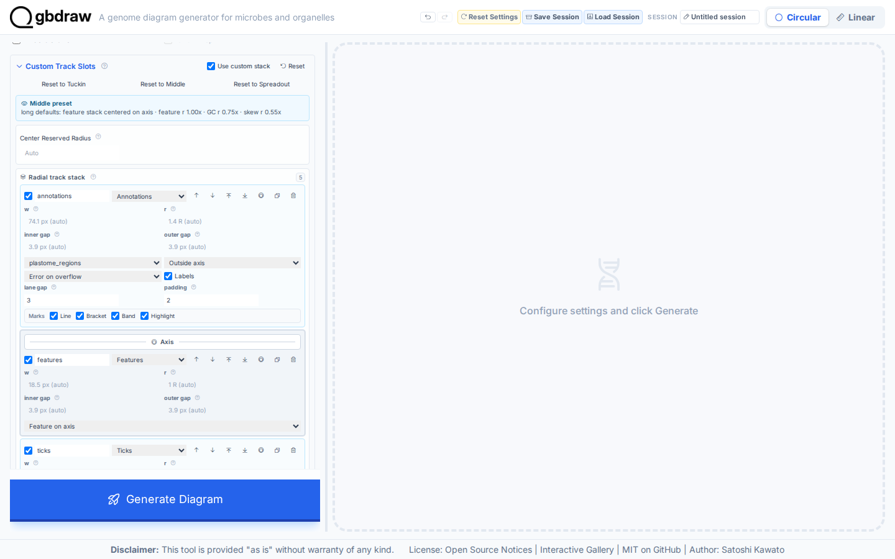
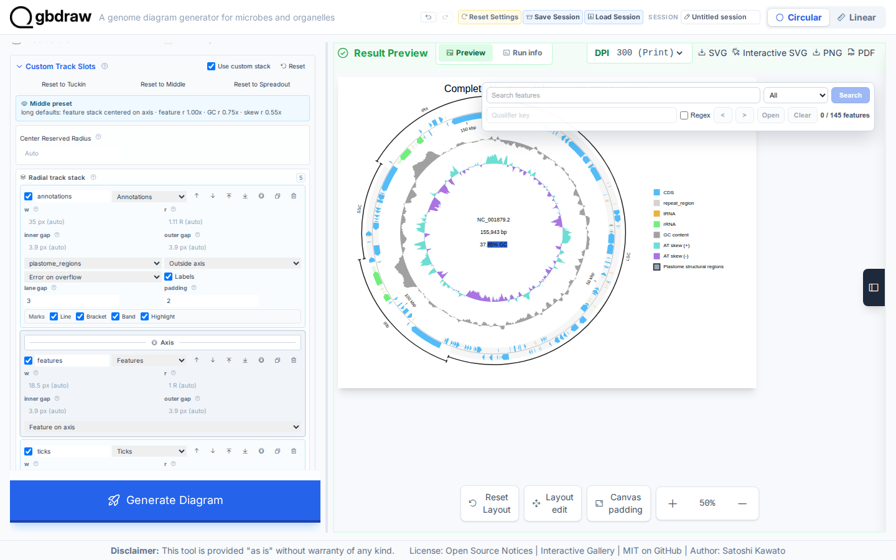

[Documentation home](../../DOCS.md) | [How-to guides](../README.md) | [GUI how-to guides](./README.md)

# How to add region annotations and custom track slots

Use a region table and an explicit Circular stack when named genome regions
must remain readable beside quantitative tracks. This example draws four
structural regions on the complete tobacco plastome `NC_001879.2`; it does not
turn a partial linear region into a circle.

## Before you start

Use these bundled files:

- [`NC_001879.gbk`](../../../gbdraw/web/tutorial-data/tobacco-plastome-regions/NC_001879.gbk)
  — one complete circular plastome, 155,943 bp.
- [`nicotiana-tabacum-regions.tsv`](../../../gbdraw/web/tutorial-data/tobacco-plastome-regions/nicotiana-tabacum-regions.tsv)
  — four source-coordinate bracket annotations in one set.

The table has this frozen layout:

| ID | Label | Inclusive source coordinates | Lane |
|---|---|---:|---:|
| `lsc` | LSC | 1–86,686 | 0 |
| `irb` | IRb | 86,687–112,029 | 0 |
| `ssc` | SSC | 112,030–130,600 | 0 |
| `ira` | IRa | 130,601–155,943 | 0 |

Every row targets `NC_001879.2`, belongs to `plastome_regions`, and uses the
`bracket` renderer.

## Import the four regions

1. Select **Circular** and **GenBank**.
2. Upload `NC_001879.gbk` under **GenBank/DDBJ File**.
3. Set **Output Prefix** to `region_annotations_and_slots`.
4. Choose **Middle** under **Track Preset**.
5. Open **Region Annotations**, select **Import TSV**, and choose
   `nicotiana-tabacum-regions.tsv`.
6. Confirm that the set ID is `plastome_regions`, that four target-record
   fields resolve to `NC_001879.2`, and set the legend label to
   `Plastome structural regions`.
7. Set the four visible **Annotation lane** values, in table order, to `0`,
   `1`, `0`, and `1`. The source table deliberately begins with lane 0 for all
   four rows; separating adjacent boundary labels here prevents the explicit
   LSC–IRb and SSC–IRa brackets from colliding.

If a target record is unresolved, correct the TSV `record` value instead of
removing it. The accession is what prevents a region from being applied to the
wrong sequence.

## Build the explicit stack

Open **Custom Track Slots** and turn on **Use custom stack**. In the existing
`gc_skew` row, change **dinucleotide** to `AT` and **legend label** to
`AT skew`. Then:

1. Choose **Annotations** in **New circular track renderer**.
2. Select **Add track**.
3. Bind the new `annotations` row to `plastome_regions`.
4. Use **Move outside Axis** on that row and keep **Labels** on. The placement
   field now reads **Outside axis**.

The resulting outside-to-inside order is Annotations, Features, Ticks, GC
content, and AT skew. The annotation row owns the four brackets outside the
axis; the AT-skew row remains a numeric track inside it.

## Generate and verify the labels

Open **Title & Legend**, use the title
`Complete Nicotiana tabacum plastome regions`, choose **Top**, set the
definition font size to `17`, and put the legend on the **Right**. Click
**Generate Diagram**.

The finished diagram must show all four labels—LSC, IRb, SSC, and IRa—in two
annotation lanes without
changing the complete 155,943 bp record. It also contains 145 displayed
logical features (195 SVG feature elements after compound locations are
expanded), one `annotations` SVG slot bound to `plastome_regions`, and the
`AT skew (+)` and `AT skew (-)` legend entries.

Select **SVG** to save `region_annotations_and_slots.svg`. The executable
capture checks each annotation ID, label, record binding, mark, lane source,
custom-slot order, outside placement, and downloaded SVG safety.

## Troubleshooting

- **No annotation slot can be added:** import the TSV first. An annotation
  renderer needs an available annotation set.
- **Labels are missing:** turn on **Show annotation labels** in the annotation
  slot and keep its placement outside the axis.
- **An explicit-lane conflict is reported:** assign adjacent region boundaries
  to alternating lanes `0,1,0,1` as shown above.
- **The wrong record is listed:** use the exact `NC_001879.2` accession in the
  table's `record` column.
- **AT skew still reads GC skew:** change the dinucleotide and legend label in
  the custom `gc_skew` row; the global simple setting no longer controls an
  active custom stack.

## Related guides

- [Add depth, GC content, and skew tracks](./add-depth-gc-and-skew-tracks.md)
- [Input formats and TSV schemas](../../REFERENCE/input-formats-and-tsv-schemas.md)
- [Palettes, feature rules, labels, shapes, and tracks](../../REFERENCE/palettes-feature-rules-labels-shapes-and-tracks.md)
