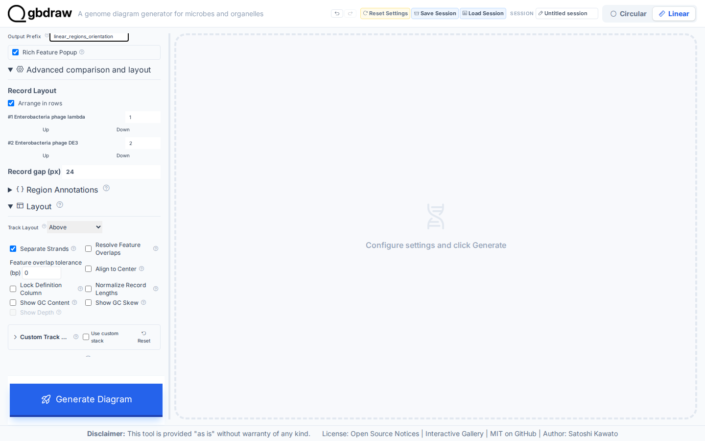
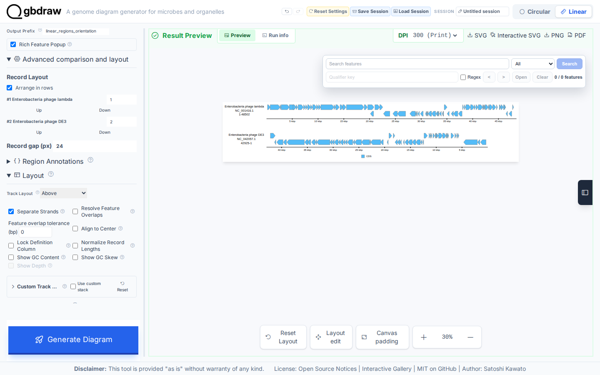

[Documentation home](../../DOCS.md) | [How-to guides](../README.md) | [GUI how-to guides](./README.md)

# How to arrange linear records, regions, and orientation

Use the Linear record controls to set order, rows, coordinate bounds, and
orientation. This example keeps both source genomes complete. Lambda is shown
as submitted, while DE3 is reverse complemented across its full 42,925 bp.

## Before you start

Download both records from NCBI. On each record page, select **Send to**,
**File**, and **GenBank (full)**, then use the exact save name below.

| Record | Authoritative download | Save as | Expected length |
|---|---|---|---:|
| Enterobacteria phage lambda | [NCBI `NC_001416.1`](https://www.ncbi.nlm.nih.gov/nuccore/NC_001416.1) | `NC_001416.gb` | 48,502 bp |
| Enterobacteria phage DE3 | [NCBI `NC_042057.1`](https://www.ncbi.nlm.nih.gov/nuccore/NC_042057.1) | `NC_042057.1.gb` | 42,925 bp |

See [Get the tutorial inputs](../../GETTING_TUTORIAL_DATA.md) for the complete
browser download and accession check.

Do not split either genome into mock contigs. The Start and End values below
cover every nucleotide in each source record.

## Load the records

1. Select **Linear** and **GenBank**.
2. Select **No comparison**.
3. Upload `NC_001416.gb` under sequence 1.
4. Select **Add Seq**, then upload `NC_042057.1.gb` under sequence 2.
5. Set **Output Prefix** to `linear_regions_orientation`.

Enter these values in the two sequence cards:

| Sequence | Definition | Start | End | Reverse complement |
|---:|---|---:|---:|---|
| 1 | `Enterobacteria phage lambda` | `1` | `48502` | Off |
| 2 | `Enterobacteria phage DE3` | `1` | `42925` | On |

The DE3 orientation changes, but its sequence is not shortened.

## Set rows and the ruler

Turn on **Arrange in rows** under **Record Layout**. Put sequence 1 on row 1
and sequence 2 on row 2, then set **Record gap (px)** to `24`.

Open **Layout** and choose **Above** for **Track Layout**. Open
**Axis & Scale**, turn on **Show Coordinate Scale**, choose **Ruler (Ticks)**,
and turn on **Ruler on Axis**.

Select **Generate Diagram**. Zoom to 30% to inspect both complete rows.

The result shows `1-48502` for `NC_001416.1` and `42925-1` for
`NC_042057.1`. The descending DE3 range records the reverse orientation. Row
1 stays Lambda and row 2 stays DE3 in the generated controls, the two record
groups in the SVG do not overlap, and only DE3 carries the
reverse-complement flag.

Select **SVG** to save `linear_regions_orientation.svg`.

## Troubleshooting

- **A length is smaller than the source record:** restore Start to `1` and End
  to `48502` for Lambda or `42925` for DE3.
- **DE3 arrows point in the original direction:** turn on **Reverse
  complement** in sequence 2 before generating again.
- **The bottom ruler is still visible:** **Ruler on Axis** requires an Above or
  Below track layout and the Ruler scale style.
- **A circular plot appears:** switch to **Linear**. Both phage records are
  annotated as linear.

## Related guides

- [Create a first Linear diagram](../../TUTORIALS/GUI/first-linear-genome-diagram.md)
- [Use uploaded BLAST results](./use-uploaded-blast-results.md)
