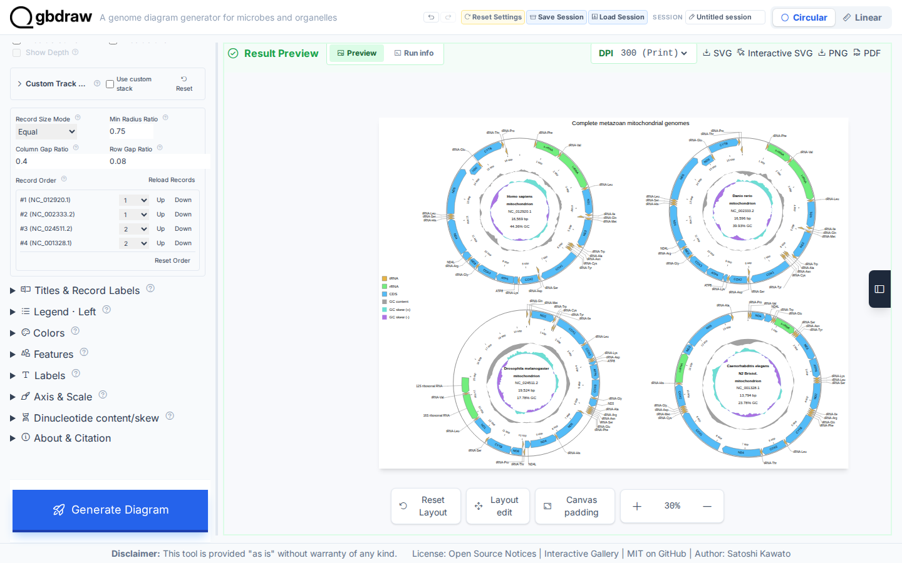

[Documentation home](../../DOCS.md) | [How-to guides](../README.md) | [GUI how-to guides](./README.md)

# How to arrange multiple circular records

Use a multi-record Circular canvas when every input is a complete, naturally
circular sequence. This example compares four complete mitochondrial RefSeq
records. It does not crop a record, split a sequence into artificial contigs, or
turn a linear region into a circle.

## Before you start

The browser journey uses these records in this order:

| Row | Organism | RefSeq | Length | Source topology |
|---:|---|---|---:|---|
| 1 | *Homo sapiens* | `NC_012920.1` | 16,569 bp | Circular |
| 1 | *Danio rerio* | `NC_002333.2` | 16,596 bp | Circular |
| 2 | *Drosophila melanogaster* | `NC_024511.2` | 19,524 bp | Circular |
| 2 | *Caenorhabditis elegans* | `NC_001328.1` | 13,794 bp | Circular |

The frozen files are
[`HmmtDNA.gbk`](../../../gbdraw/web/tutorial-data/human-mitochondrion/HmmtDNA.gbk),
[`NC_002333.2.gb`](../../../gbdraw/web/tutorial-data/metazoan-mitochondria-four/NC_002333.2.gb),
[`NC_024511.2.gb`](../../../gbdraw/web/tutorial-data/metazoan-mitochondria-four/NC_024511.2.gb),
and
[`NC_001328.1.gb`](../../../gbdraw/web/tutorial-data/metazoan-mitochondria-four/NC_001328.1.gb).
Each file contains one complete record annotated as circular.

The Circular uploader accepts one GenBank container. Put the four unchanged
GenBank entries in one file; do not concatenate their nucleotide sequences. The
executable capture builds `complete_metazoan_mitochondria.gb` by joining the four
file byte streams, so each entry keeps its own `LOCUS` line and `//` terminator.

## Load all four complete records

1. Select **Circular** and **GenBank**.
2. Upload `complete_metazoan_mitochondria.gb`.
3. Set **Output Prefix** to `multi_record_circular`.
4. Turn on **Multi-Record Canvas**.

Wait for **Record Order** to list `NC_012920.1`, `NC_002333.2`, `NC_024511.2`,
and `NC_001328.1`. If an accession is absent, stop and repair the GenBank
container before drawing.

## Set the 2 by 2 grid

Use these layout values:

| Control | Value |
|---|---|
| Record Size Mode | Equal |
| Min Radius Ratio | `0.75` |
| Column Gap Ratio | `0.40` |
| Row Gap Ratio | `0.08` |
| `NC_012920.1`, `NC_002333.2` | Row 1 |
| `NC_024511.2`, `NC_001328.1` | Row 2 |

Open **Title & Legend**, set **Plot Title** to
`Complete metazoan mitochondrial genomes`, choose **Top**, set
**Definition Font Size** to `20`, and turn on
**Keep Full Definition with Plot Title**. The last setting keeps every organism
name in its own circle.

Open **Labels** and use these values:

| Control | Value |
|---|---|
| Label Mode | Out |
| Priority File (TSV) | `cds_gene_qualifier_priority.tsv` |
| Label Font Size | `16` |

The priority file contains `CDS<TAB>gene`. It makes CDS labels use concise gene
symbols such as `COX1`, `CYTB`, and `ND5`, rather than the longer `product`
descriptions. **Out** applies the labels independently to all four records.

## Generate and verify the grid

Click **Generate Diagram**. The result must contain four circles in two rows,
with no circle or record definition overlapping another. Zoom the preview to
30% to inspect the complete canvas, then use **SVG** to download
`multi_record_circular.svg`.

The generated SVG contains all four RefSeq accessions, all four complete
lengths, the four organism labels, 147 displayed mitochondrial features, and
the GC content and GC skew tracks. Every circle has feature labels. CDS labels
come from `gene`; CDS `product` descriptions are not used as label text.

## Troubleshooting

- **Only one record appears:** make sure the upload is a multi-record GenBank
  container and that every entry ends with `//`.
- **Organism names are missing:** use a top or bottom plot title and enable
  **Keep Full Definition with Plot Title**.
- **CDS labels are long product descriptions:** upload
  `cds_gene_qualifier_priority.tsv` under **Labels** and regenerate the diagram.
- **The grid is crowded:** keep two records on each row and increase the row or
  column gap ratio.
- **A source record is linear or partial:** use a Linear diagram. Circular mode
  must not be used to disguise a partial genomic region as a complete circle.

## Related guides

- [Draw a first Circular diagram](../../TUTORIALS/GUI/first-circular-genome-diagram.md)
- [Web app control reference](../../REFERENCE/web-app.md)
