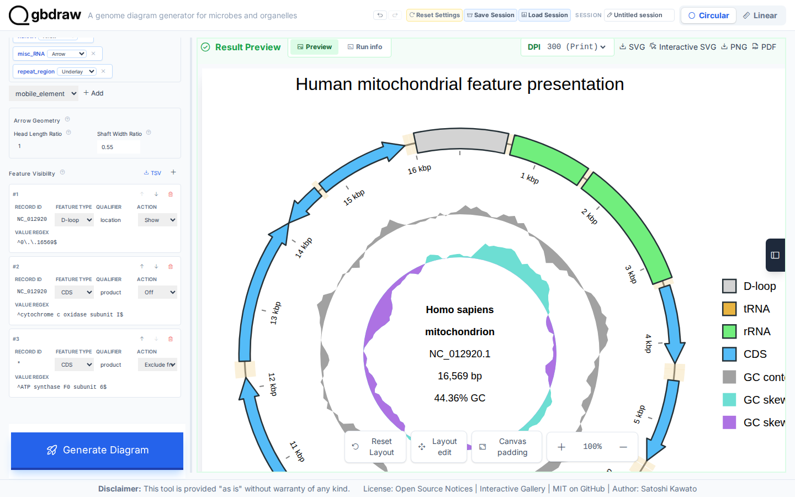
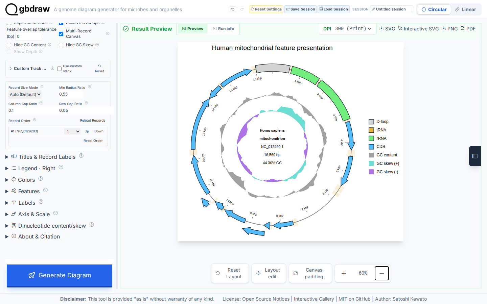

[Documentation home](../../DOCS.md) | [How-to guides](../README.md) | [GUI how-to guides](./README.md)

# How to control feature visibility, shapes, strokes, and overlaps

Use the **Features** controls to reveal or hide selected annotations, change
their glyphs, set stroke geometry, and resolve crowded features. This example
starts from the raw, complete 16,569 bp `NC_012920.1` GenBank record. It does
not load a prepared session or turn a partial linear region into a circle.

## Before you start

Open the authoritative [NCBI `NC_012920.1`
record](https://www.ncbi.nlm.nih.gov/nuccore/NC_012920.1), download it as
**GenBank (full)**, and save it as `HmmtDNA.gbk`. It contains one complete
circular *Homo sapiens* mitochondrial record. See [Get the tutorial
inputs](../../GETTING_TUTORIAL_DATA.md) for browser download and accession
checks.

The same three rules used below are available as the support download
[`HmmtDNA_feature_visibility.tsv`](../../../gbdraw/web/tutorial-data/human-mitochondrion/HmmtDNA_feature_visibility.tsv).
For this GUI workflow, add them with the visible controls so each field and
action can be reviewed before generation.

## Load the record and choose overlap handling

1. Select **Circular** and **GenBank**.
2. Upload `HmmtDNA.gbk` under **GenBank/DDBJ File**.
3. Set **Output Prefix** to `feature_visibility_shapes`.
4. Under **Layout**, select **Middle**.
5. Turn off **Separate Strands**, then turn on **Resolve Overlaps**.

Overlap resolution can place crowded foreground glyphs on additional radial
lanes. It does not crop coordinates or edit the source annotation. The control
is unavailable while **Separate Strands** owns the lane arrangement.

## Choose shapes and arrow geometry

Open **Features** and use these renderings:

| Feature type | Rendering |
|---|---|
| CDS | Arrow |
| rRNA | Rectangle |
| tRNA | Underlay |

Set **Head Length Ratio** to `1` and **Shaft Width Ratio** to `0.55`.
CDS glyphs remain directional, rRNA glyphs become nondirectional blocks, and
each of the 22 tRNAs becomes a full-band highlight behind the foreground
features.

## Add the visibility rules

Under **Feature Visibility**, choose **+** three times and enter these rows in
order:

| Rule | Record ID | Feature type | Qualifier | Value regex | Action |
|---:|---|---|---|---|---|
| 1 | `NC_012920.1` | D-loop | `location` | `^0\.\.16569$` | Show |
| 2 | `NC_012920.1` | CDS | `product` | `^cytochrome c oxidase subunit I$` | Off |
| 3 | `*` | CDS | `product` | `^ATP synthase F0 subunit 6$` | Exclude from matching |

Rules are evaluated from top to bottom. **Show** adds the origin-spanning
D-loop even though it is not among the normal CDS/rRNA/tRNA baseline types.
**Off** removes COX1 from the diagram and protein-search inputs.
**Exclude from matching** leaves ATP6 visible but omits it only from protein
matching; it is not another hide action.

## Set strokes, title, and legend

Keep **Block stroke color mode** and **Line stroke color mode** set to a fixed
color, then enter:

| Control | Value |
|---|---|
| Block stroke color | `#263238` |
| Block Stroke Width | `2.5` |
| Line stroke color | `#455a64` |
| Line Stroke Width | `2` |

Open **Title & Legend**, set **Plot Title** to
`Human mitochondrial feature presentation`, choose **Top**, set
**Legend Position** to **Right**, and turn on
**Keep Full Definition with Plot Title**.

## Generate and verify the result

Select **Generate Diagram**, move the preview search palette away from the
title if necessary, and zoom out until the full canvas is visible.

The visible total remains 37: the D-loop is added, COX1 is removed, and ATP6
remains visible. Check these details before export:

| Check | Expected result |
|---|---|
| Record | `NC_012920.1`, 16,569 bp, complete and circular |
| Visible feature identities | 37 |
| D-loop | Visible as a gray foreground block |
| COX1 | Not visible |
| ATP6 | Visible, but excluded from protein matching |
| tRNA | 22 underlay bands |
| rRNA | Green rectangles |
| CDS | Blue arrows with narrow shafts |
| Foreground stroke | `#263238`, 2.5 px |
| Overlap policy | Enabled, with additional radial lanes where needed |

Select **SVG** to save `feature_visibility_shapes.svg`. The downloaded SVG
should show the record identity, the feature and underlay counts, the mixed
shape geometry from the table above, the foreground stroke, and multiple
overlap lanes where features collide.

## Troubleshooting

- **Resolve Overlaps is disabled:** turn off **Separate Strands** first.
- **The D-loop does not appear:** keep the versioned record ID and escape both
  dots in the location expression.
- **COX1 remains visible:** use `product` and the complete anchored product
  expression from rule 2.
- **ATP6 disappears:** choose **Exclude from matching**, not **Off**.
- **Underlays cover foreground arrows:** make sure only tRNA uses **Underlay**;
  the renderer places automatic underlays behind foreground glyphs.

## Related guides

- [Style features, labels, titles, and legends](style-features-labels-titles-and-legends.md)
- [Palettes, feature rules, labels, shapes, and track renderers](../../REFERENCE/palettes-feature-rules-labels-shapes-and-tracks.md)
