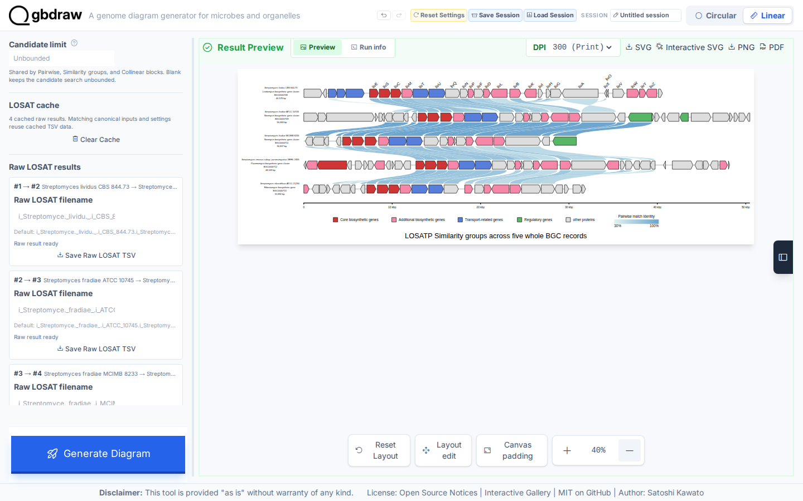
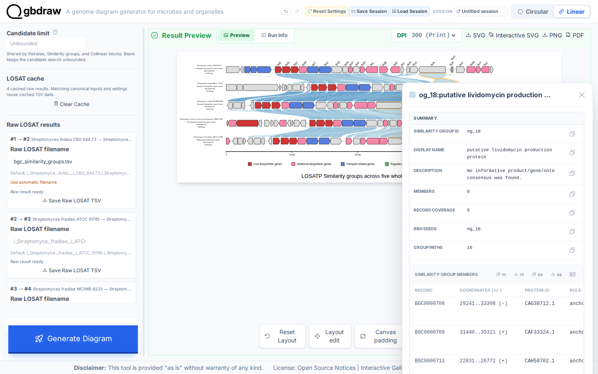

[Documentation home](../../DOCS.md) | [How-to guides](../README.md) | [GUI how-to guides](./README.md)

# How to create protein similarity groups with LOSATP

Use this task when you want one stable group identity to follow related
proteins across several annotated Linear records. The example uses the five
whole BGC records `BGC0000708`, `BGC0000709`, `BGC0000711`, `BGC0000712`, and
`BGC0000713` in that order.

## Before you start

Download the five GenBank records from their versioned MIBiG repository URLs.
Use the exact local filenames and order shown below.

| Order | Record | Authoritative download | Save as |
|---:|---|---|---|
| 1 | `BGC0000708` | [MIBiG `BGC0000708.5`](https://mibig.secondarymetabolites.org/repository/BGC0000708.5/BGC0000708.gbk) | `BGC0000708.gbk` |
| 2 | `BGC0000709` | [MIBiG `BGC0000709.5`](https://mibig.secondarymetabolites.org/repository/BGC0000709.5/BGC0000709.gbk) | `BGC0000709.gbk` |
| 3 | `BGC0000711` | [MIBiG `BGC0000711.5`](https://mibig.secondarymetabolites.org/repository/BGC0000711.5/BGC0000711.gbk) | `BGC0000711.gbk` |
| 4 | `BGC0000712` | [MIBiG `BGC0000712.5`](https://mibig.secondarymetabolites.org/repository/BGC0000712.5/BGC0000712.gbk) | `BGC0000712.gbk` |
| 5 | `BGC0000713` | [MIBiG `BGC0000713.5`](https://mibig.secondarymetabolites.org/repository/BGC0000713.5/BGC0000713.gbk) | `BGC0000713.gbk` |

Download these gbdraw-specific support tables separately:

| Purpose | Support download | Save as |
|---|---|---|
| Default color overrides | [`BGC0000708-BGC0000713_default_colors.tsv`](../../../gbdraw/web/tutorial-data/aminoglycoside-bgc-five/BGC0000708-BGC0000713_default_colors.tsv) | `BGC0000708-BGC0000713_default_colors.tsv` |
| Specific color rules | [`BGC0000708-BGC0000713_specific_colors.tsv`](../../../gbdraw/web/tutorial-data/aminoglycoside-bgc-five/BGC0000708-BGC0000713_specific_colors.tsv) | `BGC0000708-BGC0000713_specific_colors.tsv` |
| CDS gene-label priority | [`cds_gene_qualifier_priority.tsv`](../../../gbdraw/web/tutorial-data/shared/cds_gene_qualifier_priority.tsv) | `cds_gene_qualifier_priority.tsv` |

See [Get the tutorial inputs](../../GETTING_TUTORIAL_DATA.md) for the file
labels and identity checks used in these guides.

## Configure the search

1. Select **Linear** and upload the five MIBiG GenBank downloads in table order
   without setting regions. Keep the first four orientations unchanged and
   turn on **Reverse complement** only for `BGC0000713`, matching the Gallery
   layout. Turn off **Separate Strands** so each record uses one feature track.
2. Select **Run LOSAT**, **LOSATP**, and **Similarity groups**.
3. Set **Execution** to **Serial**, **Total threads** to `1`, **Parallel runs**
   to `1 run`, and **Threads per run** to `1`.
4. Use bitscore `50`, E-value `0.01`, minimum identity `30`, and minimum length
   `0`.
5. Set **Output Prefix** to `bgc_similarity_groups`.
6. Match the Interactive SVG Gallery presentation: choose the Orange palette,
   upload `BGC0000708-BGC0000713_default_colors.tsv` as **Override File (-d)**,
   and upload `BGC0000708-BGC0000713_specific_colors.tsv` as **Specific Table
   (-t)**. Set **Show Labels** to **First record**, upload
   `cds_gene_qualifier_priority.tsv` as **Priority File (TSV)**, then use label
   font size `18`, placement **Above feature**, and rotation `45`. Set
   **Feature Height** to `75`, **Block Stroke Width** and **Line Stroke Width**
   to `2`, turn on **Show Coordinate Scale (Linear)** with the **Ruler** style,
   and set **Axis Stroke Width** to `5`.

## Generate and verify the groups

Select **Generate Diagram**. The output has 155 CDS features, 23
groups, and 77 links. Links connect adjacent displayed records only:
`0708→0709→0711→0712→0713`. A shared group can span all five records without a
direct first-to-last ribbon. Select **Zoom out** six times to reach **40%**,
then drag the preview horizontally until the complete diagram is centered
before capture or export. Only `BGC0000708` carries labels, and its CDS labels
use `gene` values rather than `product` descriptions.

Select a link to inspect its group. Confirm that the popup shows a stable
`og_*` ID, member count, record coverage, and member protein table.

Save the first raw adjacent result as `bgc_similarity_groups.tsv`, then select
**SVG** to save `bgc_similarity_groups.svg`. The TSV should have 232
twelve-column LOSATP rows, and the SVG should retain the same 77 group links.

## When to use another mode

- Use **Pairwise** when independent top hits are the result you need.
- Use **Collinear blocks** when gene order and block orientation matter.
- Do not render these linear BGC-region records as circular genomes.

## Related guides

- [Compare annotated proteins Tutorial](../../TUTORIALS/GUI/compare-proteins-losatp.md)
- [Draw Collinear protein-match blocks](./draw-collinear-protein-blocks.md)
- [Comparison programs, thresholds, and result semantics](../../REFERENCE/comparison-programs-thresholds-and-results.md)
