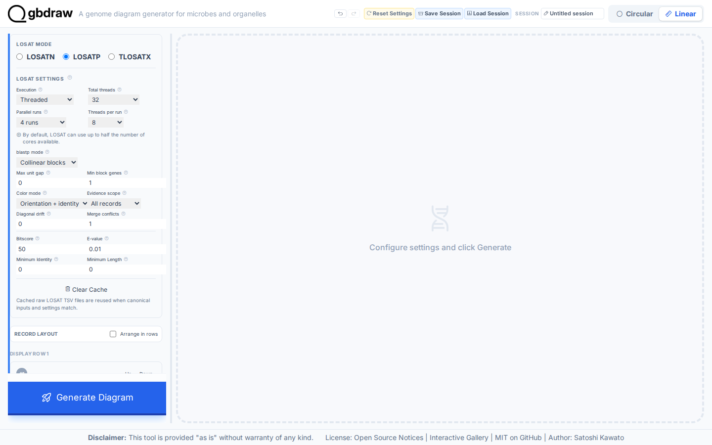
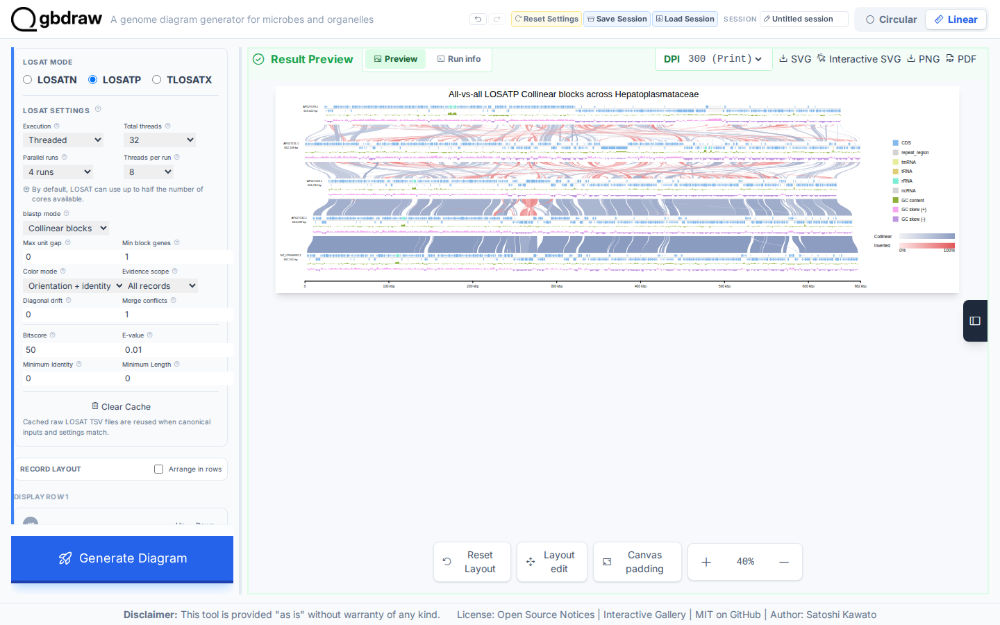
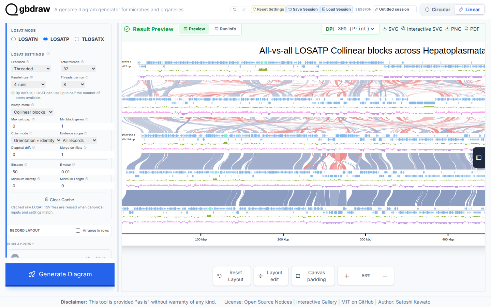
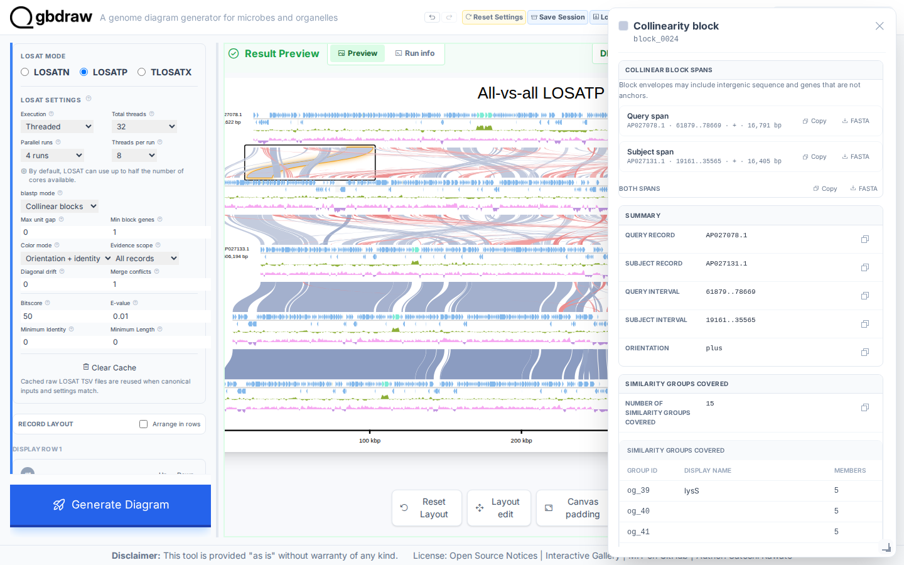

[Documentation home](../../DOCS.md) | [How-to guides](../README.md) | [GUI how-to guides](./README.md)

# How to draw collinear protein-match blocks with LOSATP

Use **Collinear blocks** when conserved gene order is part of the comparison.
This workflow downloads five complete Hepatoplasmataceae genomes, runs an
All-record LOSATP search, and reduces compatible protein groups to ordered
blocks. It starts on a fresh web app page with no session or comparison cache
loaded. The genomes remain complete records; the Linear view only arranges them
as comparison rows.

## Before you start

Download each record from the linked NCBI Revision History snapshot in
**GenBank (full)** format. Keep the versioned accession and save the file with
the exact local name shown below.

| Order | Record | Organism | Authoritative download | Save as | Length |
|---:|---|---|---|---|---:|
| 1 | `AP027078.1` | *Candidatus Tyloplasma litorale* | [NCBI Revision History snapshot](https://www.ncbi.nlm.nih.gov/sviewer/viewer.cgi?tool=portal&save=file&db=nuccore&report=gbwithparts&id=AP027078.1&sat=3&satkey=69902295) | `AP027078.gb` | 615,622 bp |
| 2 | `AP027131.1` | *Candidatus Hepatoplasma vulgare* | [NCBI Revision History snapshot](https://www.ncbi.nlm.nih.gov/sviewer/viewer.cgi?tool=portal&save=file&db=nuccore&report=gbwithparts&id=AP027131.1&sat=3&satkey=69902296) | `AP027131.gb` | 662,108 bp |
| 3 | `AP027133.1` | *Candidatus Hepatoplasma scabrum* | [NCBI Revision History snapshot](https://www.ncbi.nlm.nih.gov/sviewer/viewer.cgi?tool=portal&save=file&db=nuccore&report=gbwithparts&id=AP027133.1&sat=3&satkey=69902298) | `AP027133.gb` | 606,194 bp |
| 4 | `AP027132.1` | *Candidatus Hepatoplasma crinochetorum* | [NCBI Revision History snapshot](https://www.ncbi.nlm.nih.gov/sviewer/viewer.cgi?tool=portal&save=file&db=nuccore&report=gbwithparts&id=AP027132.1&sat=3&satkey=69902297) | `AP027132.gb` | 643,039 bp |
| 5 | `NZ_CP006932.1` | *Candidatus Hepatoplasma crinochetorum* Av | [NCBI Revision History snapshot](https://www.ncbi.nlm.nih.gov/sviewer/viewer.cgi?tool=portal&save=file&db=nuccore&report=gbwithparts&id=NZ_CP006932.1&sat=60&satkey=39275474) | `NZ_CP006932.gb` | 657,101 bp |

All five links are official NCBI Revision History downloads pinned to the
annotation revisions used here. The `sat=3` pins are `AP027078.1` with
`satkey=69902295`, `AP027131.1` with `satkey=69902296`, `AP027133.1` with
`satkey=69902298`, and `AP027132.1` with `satkey=69902297`;
`NZ_CP006932.1` uses `sat=60` and `satkey=39275474`. The record IDs and
sequence lengths remain those in the table. Save each NCBI response under its
listed local filename; do not substitute a repository copy or a Gallery
session.

See [Get the tutorial inputs](../../GETTING_TUTORIAL_DATA.md) for format and
accession checks after download. All five source records must be complete and
naturally circular.

## Upload the five records

1. Open a fresh gbdraw web app page. Do not load a Gallery project or session.
2. Select **Linear**, **GenBank**, and **No comparison**.
3. Upload `AP027078.gb` under sequence 1.
4. Select **Add sequence**, then upload `AP027131.gb` under sequence 2.
5. Add sequence 3 and upload `AP027133.gb`.
6. Add sequence 4 and upload `AP027132.gb`.
7. Add sequence 5 and upload `NZ_CP006932.gb`.
8. Confirm that the five sequence cards follow the table order and that none
   has a Start, End, or **Reverse complement** override.

The web app uses a Linear presentation so homologous intervals can be connected
between rows. It does not change the complete circular source records.

## Configure Collinear blocks

Set **Track Layout** to **Features on axis**. Turn on **Separate Strands**,
**Align to Center**, **Show GC Content**, and **Show GC Skew**. Choose the
**Ajisai** palette. Under **Axis & Scale**, turn on **Show Coordinate Scale
(Linear)** and select **Ruler (Ticks)**. Under **Title & Legend**, enter
`All-vs-all LOSATP Collinear blocks across Hepatoplasmataceae`, choose **Top**,
and place the legend on the **Right**.

Select **Run LOSAT**, **LOSATP**, and **Collinear blocks**, then set:

| Control | Value |
|---|---|
| Execution | Threaded |
| Total threads | `32` |
| Parallel runs | `4 runs` |
| Threads per run | `8` |
| Max unit gap | `0` |
| Min block genes | `1` |
| Evidence scope | All records |
| Diagonal drift | `0` |
| Merge conflicts | `1` |
| Color mode | Orientation + identity |
| Bitscore / E-value | `50` / `0.01` |
| Minimum identity / length | `0` / `0` |
| Pairwise Match Style | Curve |
| Output Prefix | `hepatoplasmataceae_collinear` |

The captured `32` / `4 runs` / `8` plan requires a browser that reports at
least 32 logical processors. If **Total threads** does not offer `32`, choose
**Safe** and leave **Parallel runs** and **Threads per run** at **Auto**. This
keeps the All-record 25-job search; only its scheduling and completion time
change.

## Generate and inspect the blocks

Select **Generate Diagram** and wait for LOSATP to finish. This fresh run
executes all 25 directional and self search jobs; it has no preloaded result to
reuse. Block construction uses evidence from every record pair, while the
finished ribbons connect adjacent display rows to keep the figure readable.
Select **Zoom out** six times to reach **40%**, then drag the preview
horizontally until the complete diagram is centered.

Keep the **40%** view for the complete five-record overview. Select **Zoom in**
four times to reach **80%**, then drag the preview horizontally to the right
until **Pairwise match 1** is wholly inside **Result Preview**. Use this closer
view to distinguish individual block boundaries and orientation colors.

Check the generated result before export:

| Check | Expected result |
|---|---|
| Complete records | Five, in the upload order above |
| Rendered feature elements | 2,994 |
| Rendered Collinear match elements | 500 |
| Evidence scope | All records |
| Displayed ribbon endpoints | Each adjacent pair of display rows |
| Block orientation | Both plus and minus |
| Color mode | Orientation + identity |

Focus the first visible block and press **Enter**. Drag the popup by its header
to the opposite top corner so it does not cover the selected block. The top of
the popup shows the query and subject spans and three FASTA downloads,
including **Both spans FASTA**.

Use **Both spans FASTA**. The browser names the download from its generated
match ID, for example `comparison1_match1_both.fna`. Rename that file to
`collinear_members.fasta`. It should contain two non-empty nucleotide envelope
sequences, one matching each block's source genome. Then scroll within the
popup to inspect its orientation, covered Similarity groups, and anchors. Close
the block popup, then select **SVG** to save
`hepatoplasmataceae_collinear.svg`.

## Troubleshooting

- **Many short links appear:** confirm that **Collinear blocks**, not
  **Pairwise**, is selected.
- **LOSATP does not start:** confirm that **Run LOSAT**, **LOSATP**, and
  **Collinear blocks** are selected and that all five records are uploaded.
- **Threaded execution is unavailable:** use the hosted app or start the local
  app with `gbdraw gui`; threaded LOSAT requires a cross-origin-isolated page.
- **Only adjacent evidence is used:** change **Evidence scope** to **All
  records**.
- **A Circular diagram appears:** switch back to **Linear** for the comparison
  view. This does not change the complete circular source records.

## Related guides

- [Create protein similarity groups](./create-protein-similarity-groups.md)
- [Compare annotated proteins Tutorial](../../TUTORIALS/GUI/compare-proteins-losatp.md)
- [Comparison programs, thresholds, and result semantics](../../REFERENCE/comparison-programs-thresholds-and-results.md)
