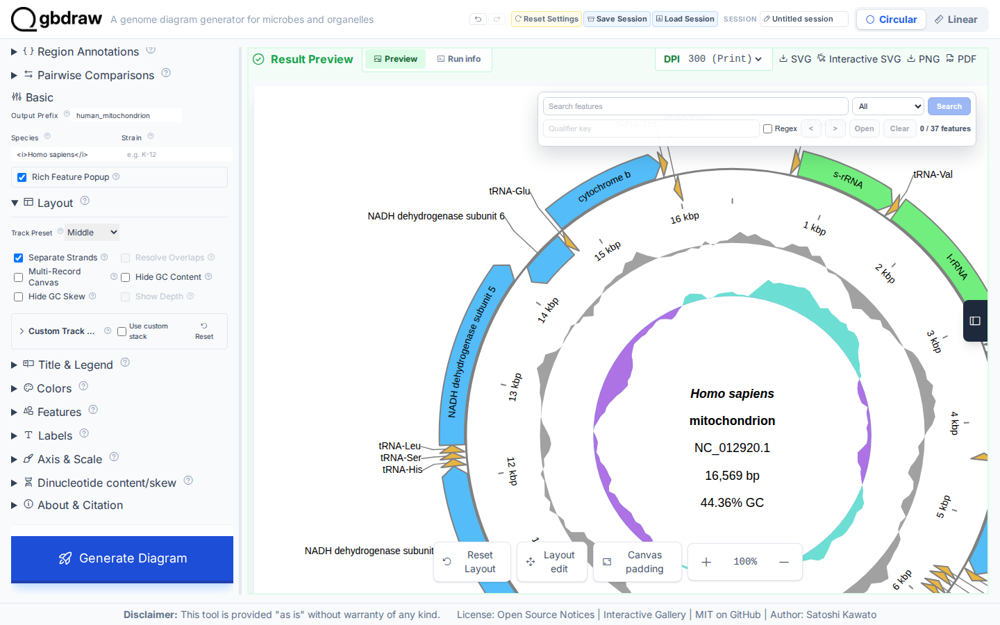
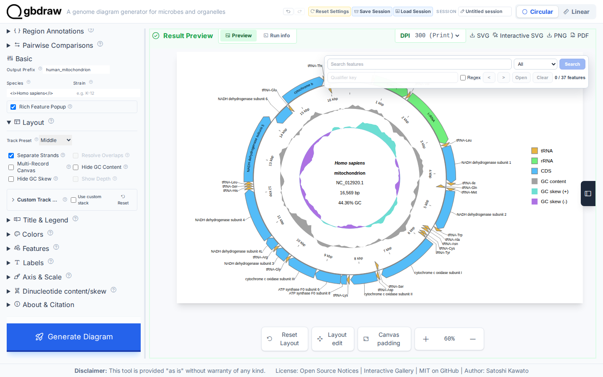

[Documentation home](../../DOCS.md) | [How-to guides](../README.md) | [GUI how-to guides](./README.md)

# How to export publication and interactive figures

The web app exports the current result as static SVG, standalone interactive
SVG, PNG, or PDF. This workflow builds the finished diagram directly from the
raw, complete 16,569 bp human mitochondrial record `NC_012920.1`, then clicks
and validates every real export action.

## Prepare the finished result

Upload
[`HmmtDNA.gbk`](../../../gbdraw/web/tutorial-data/human-mitochondrion/HmmtDNA.gbk)
as a Circular GenBank input. Set **Output Prefix** to
`human_mitochondrion`, **Species** to `<i>Homo sapiens</i>`, **Track Preset** to
**Middle**, and enable **Separate Strands**. Keep GC content and skew visible,
use external labels, place the legend on the right, and choose **Generate
Diagram**.

The preview should show all 37 mitochondrial CDS, rRNA, and tRNA features,
`NC_012920.1`, `16,569 bp`, feature labels, a complete legend, GC content, and
both GC-skew directions.

## Choose an export

Set **DPI** to **300 (Print)** for the PNG used in this workflow. The DPI choice
does not change SVG or PDF geometry.

Use the format that matches the destination:

| Action | Download | Best use | Executable check |
|---|---|---|---|
| **SVG** | `human_mitochondrion.svg` | Publication layout, vector editing, conversion | XML root, dimensions, record/features/tracks, and no script, event handler, or unsafe link |
| **Interactive SVG** | `human_mitochondrion.interactive.svg` | A browser-viewed figure with search and feature popups | XML, embedded schema-3 catalog, bundled style/runtime, live popup and search behavior, and no external link |
| **PNG** | `human_mitochondrion.png` | Slides, word processors, and raster-only systems | PNG signature and pixel dimensions equal to SVG dimensions multiplied by `300 / 96` |
| **PDF** | `human_mitochondrion.pdf` | Vector page exchange and print workflows | PDF signature, EOF marker, and page MediaBox matching the SVG canvas |

Click each action and keep the exact suggested filename. The interactive SVG
preserves the static figure's original canvas geometry in its gbdraw metadata,
then uses a responsive `100vw` by `100vh` browser viewport. Only the interactive
file contains `gbdraw-interactive-feature-metadata`, its bundled style, and its
bundled script.

## Check the interactive file

Open `human_mitochondrion.interactive.svg` directly in a browser. Click a
feature to open its metadata popup. Expand feature search, enter `COX1`, and
choose **Search**; exactly one rendered feature should be highlighted. The
artifact is self-contained and does not need the gbdraw web app or a remote
service after download.

Do not substitute the interactive SVG for the static publication file without
checking the target journal or editor. The interactive artifact intentionally
contains an embedded script; the standard SVG intentionally contains none.

## Troubleshooting

- **PNG is larger than expected:** its pixel dimensions scale with DPI. Use 96
  DPI for screen-only work or 300 DPI for print.
- **Interactive controls do not appear in an image viewer:** open the file in a
  modern web browser; many desktop image viewers intentionally do not execute
  SVG scripts.
- **A journal rejects the SVG:** use the static SVG, or export PDF/PNG according
  to the journal's accepted-format policy.
- **The output name is `gbdraw.*`:** set **Output Prefix** before generating,
  then regenerate so the current result owns the intended name.

## Related guides

- [Inspect and edit a finished diagram](inspect-and-edit-a-diagram.md)
- [Save, restore, undo, and reproduce your work](save-restore-undo-and-reproduce-work.md)
- [Output format and export reference](../../REFERENCE/output-formats-and-export.md)
