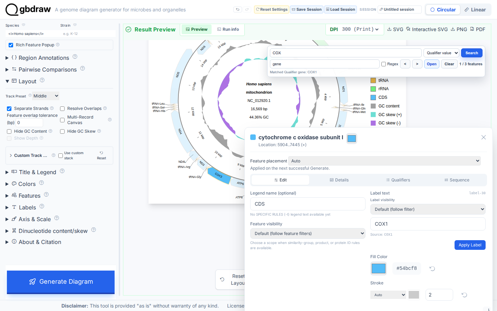
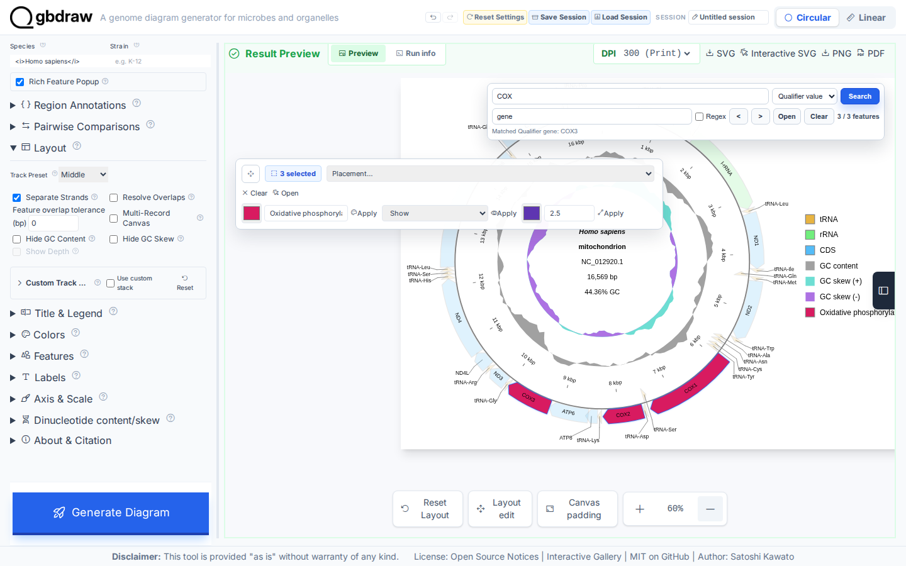
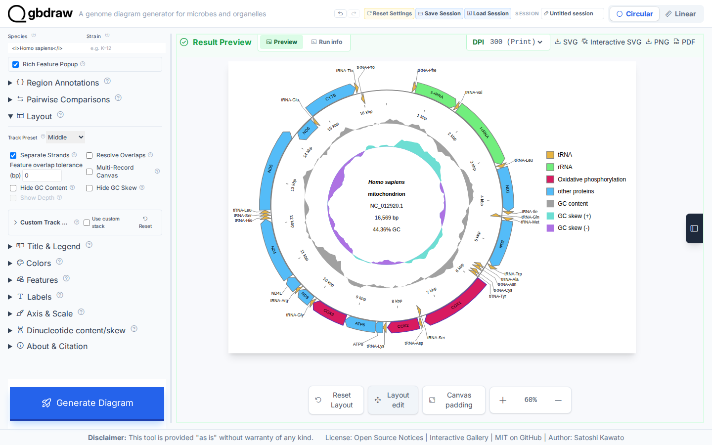
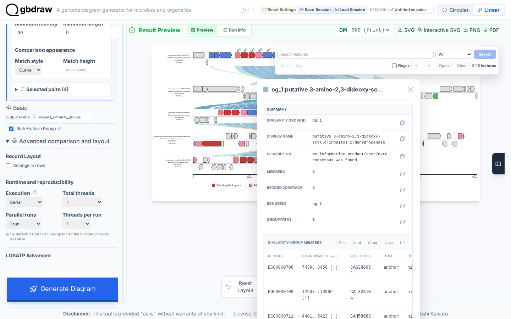
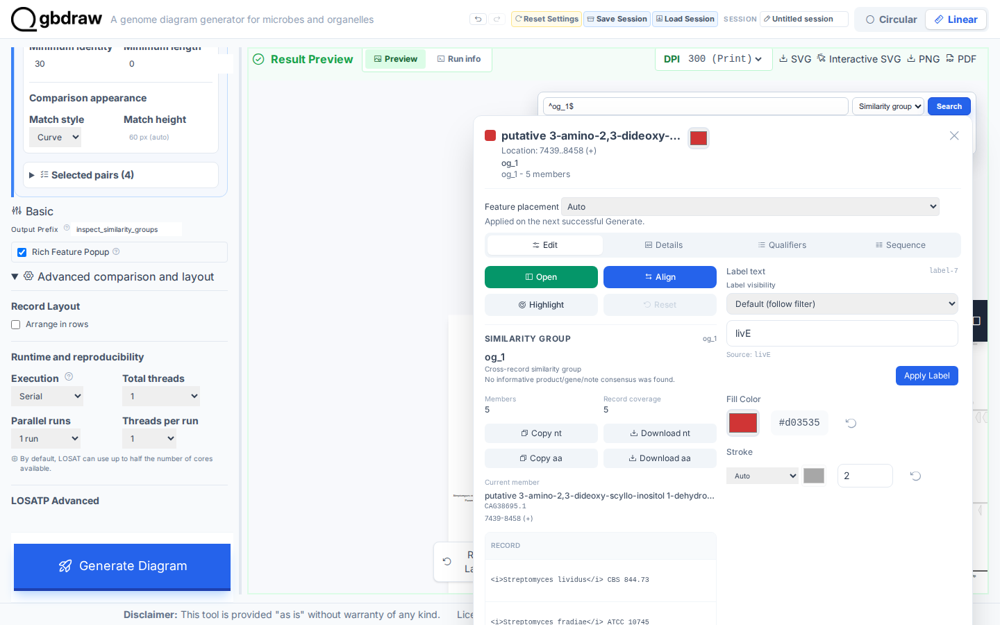

[Documentation home](../../DOCS.md) | [How-to guides](../README.md) | [GUI how-to guides](./README.md)

# How to inspect and edit a finished diagram

Use the preview tools to find a feature, inspect its metadata, edit several
features together, and reposition the legend. This workflow begins with the
raw, complete 16,569 bp human mitochondrial record `NC_012920.1`; it does not
load a prepared session. A second fresh-browser run creates real LOSATP
Similarity groups from five complete linear BGC records so that the match and
group popups can also be inspected.

## Generate the finished mitochondrial diagram

Download [NCBI record
`NC_012920.1`](https://www.ncbi.nlm.nih.gov/nuccore/NC_012920.1) as **GenBank
(full)**, save it as `HmmtDNA.gbk`, and upload it as a Circular GenBank input.
See [Get the tutorial inputs](../../GETTING_TUTORIAL_DATA.md) for browser
download and accession checks. Set **Output Prefix** to `edited_diagram`,
**Species** to `<i>Homo sapiens</i>`, **Track Preset** to **Middle**, and turn on
**Separate Strands**. Keep GC content and GC skew visible. Set **Legend
Position** to **Right** and **Label Mode** to **Out**, then choose **Generate
Diagram**.

The result must still contain all 37 CDS, rRNA, and tRNA features, the complete
`NC_012920.1` coordinate range, and both GC tracks.

## Search for and inspect COX features

In the search palette above the preview:

1. Select **Qualifier value** under **Search field**.
2. Enter `gene` under **Qualifier key**.
3. Search for `COX`.
4. Check that the status reads **1 / 3 features**, then choose **Open**.

The active result opens in the feature popup. Its feature identity, location,
strand, qualifiers, and sequences all refer to the same highlighted SVG
feature.

## Bulk-edit COX1, COX2, and COX3

Close the popup. Ctrl-click the active result, choose **Next match**, and repeat
until all three COX features are selected. In the selected-feature controls,
apply these values:

| Control | Value |
|---|---|
| Feature color | `#d81b60` |
| Legend caption | `Oxidative phosphorylation` |
| Visibility | **Show** |
| Stroke color | `#5e35b1` |
| Stroke width | `2.5` |

Use each **Apply** button. These are feature-specific edits; the GenBank source
file is unchanged.

Close the editor, then choose **Generate Diagram** again. The three feature
fills and strokes and the new legend caption must remain. The unedited CDS
entries are now represented by **other proteins** in the legend.

Choose **Layout edit**, then drag the legend slightly upward and inward. Turn
**Layout edit** off when the legend is in place.

Choose **SVG** to save `edited_diagram.svg`. The download should keep the
same three feature IDs, colors, strokes, legend text, and legend position
you set above: the feature-color edits survive the diagram regeneration from
the previous section, and the legend position survives export, so neither is
a temporary, browser-only visual change.

## Inspect LOSATP match and Similarity group popups

For protein evidence, follow [Create protein similarity groups with
LOSATP](create-protein-similarity-groups.md) from its five authoritative MIBiG
GenBank downloads. Use serial, one-thread LOSATP in **Similarity groups** mode.
The expected result has 155 CDS features, 23 groups, and 77 links between
adjacent records. There is no invented direct `BGC0000708` to `BGC0000713`
edge.

Click an `og_1` rendered link. The match popup identifies its Similarity group
and lists the member evidence.

Close the match popup. In feature search, select **Similarity group**, enable
**Regex**, enter `^og_1$`, and choose **Search**. The anchors avoid also
matching IDs such as `og_10`. Confirm that the status reads `1 / 5 features`,
then choose **Open**. The feature popup includes the `og_1` group ID, member
count, record coverage, individual records, coordinates, proteins, and
sequence actions. The same five-member group is available from the
**Similarity groups** tab in the Orthogroup Editor.

## Troubleshooting

- **Qualifier key is disabled:** select **Qualifier value**, and keep the rich
  feature popup enabled.
- **The edit controls do not appear:** Ctrl-click a rendered feature or the
  active search result. A normal click opens the single-feature popup instead.
- **Edits disappear after regeneration:** use the popup or selected-feature
  **Apply** actions; browser developer tools only change transient SVG markup.
- **A BGC match is labelled Collinear:** rerun LOSATP in **Similarity groups**
  mode. Collinear blocks come from a different analysis and show a different
  popup.

## Related guides

- [Save, restore, undo, and reproduce your work](save-restore-undo-and-reproduce-work.md)
- [Export publication and interactive figures](export-publication-and-interactive-figures.md)
- [Interactive SVG and semantic hooks](../../REFERENCE/interactive-svg-and-semantic-hooks.md)
