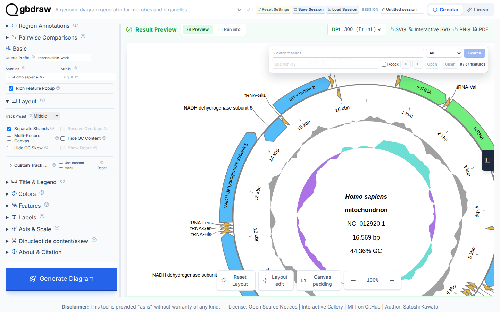
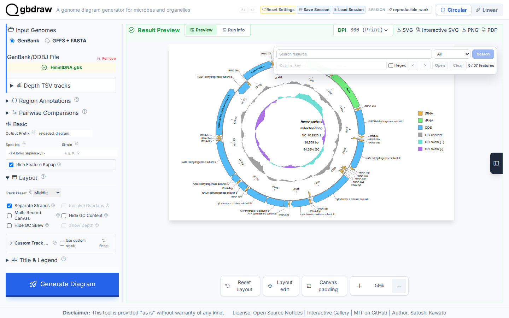

[Documentation home](../../DOCS.md) | [How-to guides](../README.md) | [GUI how-to guides](./README.md)

# How to save, restore, undo, and reproduce your work

A gbdraw session stores the input resources, current render request, result,
and supported editor state needed to continue later. This workflow creates the
state from the raw, complete `NC_012920.1` GenBank record, exercises history and
reset, downloads the actual current-format session, and loads it in a wholly
fresh browser context.

## Create the state you want to preserve

Upload
[`HmmtDNA.gbk`](../../../gbdraw/web/tutorial-data/human-mitochondrion/HmmtDNA.gbk)
as a Circular GenBank input. Set **Output Prefix** to `reproducible_work`,
**Species** to `<i>Homo sapiens</i>`, **Track Preset** to **Middle**, enable
**Separate Strands**, keep GC content and skew visible, put the legend on the
right, and choose external labels. Select **Generate Diagram**.

This is the same accepted presentation state as the first Circular tutorial:
one complete 16,569 bp record, 37 features, external labels, a right-side
legend, GC content, and positive and negative GC skew.

## Check undo, redo, and reset

Open **Title & Legend**, enter a temporary plot title, and leave the field.
The **Undo** action becomes available.

1. Choose **Undo** and confirm that the temporary title is removed.
2. Choose **Redo** and confirm that it returns.
3. Choose **Reset Settings** and accept the confirmation.

Reset restores web-app defaults but deliberately keeps uploaded files and the
current result. Confirm that `HmmtDNA.gbk` is still selected and the existing
preview remains visible. Reapply the accepted presentation settings above and
generate once more before saving.

## Download the current session

Choose **Save Session**, enter `reproducible_work` as the session title, and
save `reproducible_work.gbdraw-session.json.gz`.

The `.gz` file is a real gzip archive, not a renamed JSON file. For gbdraw
0.14.0b0, the executable workflow verifies session version `40`, render-request
schema `5`, the committed Circular result and editor catalog, and an embedded
GenBank resource whose bytes exactly match `HmmtDNA.gbk`. See [Session and
request compatibility](../../REFERENCE/session-and-request-compatibility.md)
before exchanging sessions with another gbdraw release.

## Restore in a fresh context

Close the first browser context or open a separate private window. Start gbdraw
again without uploading a file, choose **Load Session**, and select the session
you just saved. Accept the **Session loaded successfully!** message.

The restored preview must contain the same record ID, feature IDs, feature and
track text, labels, group counts, record placement, and legend placement as the
source result. Set **Output Prefix** to `reloaded_diagram`, choose **Generate
Diagram**, then select **SVG** to save `reloaded_diagram.svg`.

The executable capture compares semantic SVG content before saving, after
fresh-context loading, after regeneration, and in the downloaded SVG. A
matching screenshot alone is not treated as a successful round trip.

## Troubleshooting

- **Save Session asks you to generate again:** the current result or feature
  catalog is stale. Choose **Generate Diagram**, then save again.
- **The session does not load:** confirm that the file is intact and that its
  version is listed in the compatibility reference.
- **Reset removed a setting you needed:** reset is broader than undo. Reapply
  the intended settings before saving the handoff.
- **A loaded result differs after regeneration:** check the gbdraw version and
  source-resource checksums before treating the session as reproducible.

## Related guides

- [Inspect and edit a finished diagram](inspect-and-edit-a-diagram.md)
- [Export publication and interactive figures](export-publication-and-interactive-figures.md)
- [Prepare publication and reproducible figures](../../EXPLANATION/prepare-publication-and-reproducible-figures.md)
