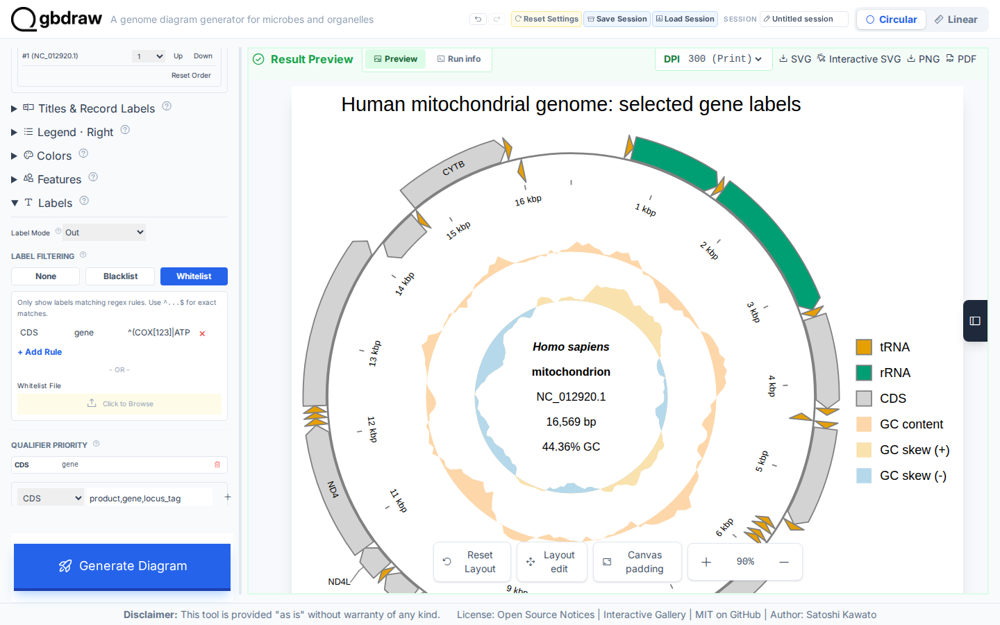
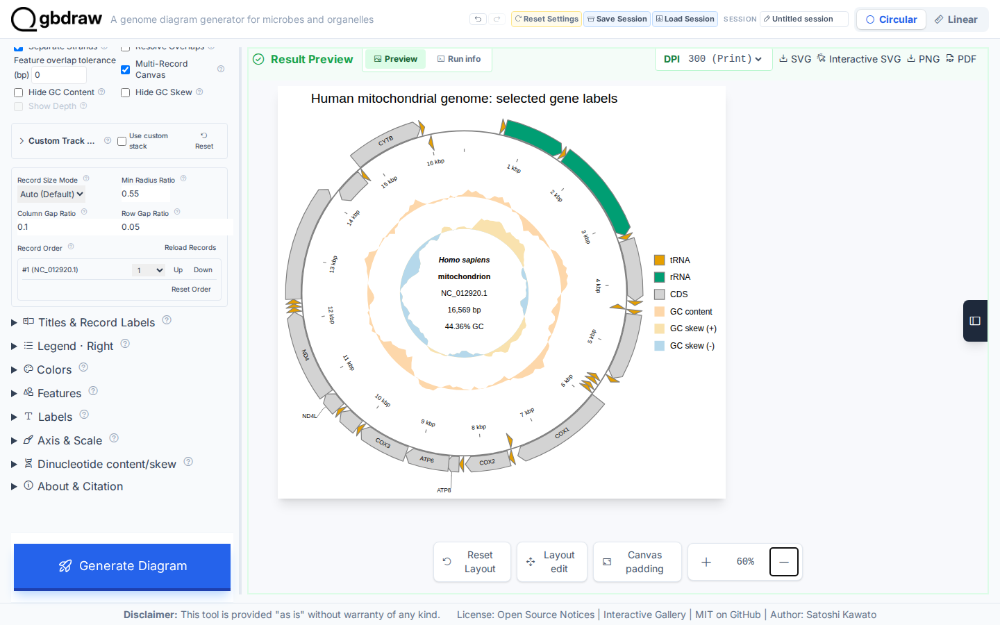

[Documentation home](../../DOCS.md) | [How-to guides](../README.md) | [GUI how-to guides](./README.md)

# How to style features, labels, titles, and legends

Use this workflow to give a complete Circular record a consistent palette,
feature colors, selected gene labels, a title, and an ordered legend. The input
is the complete 16,569 bp human mitochondrial RefSeq record `NC_012920.1`; it is
not cropped or split.

## Before you start

Use these bundled files:

- [`HmmtDNA.gbk`](../../../gbdraw/web/tutorial-data/human-mitochondrion/HmmtDNA.gbk)
  — one complete circular *Homo sapiens* mitochondrial record.
- [`modified_default_colors.tsv`](../../../gbdraw/web/tutorial-data/tobacco-plastome-regions/modified_default_colors.tsv)
  — default colors for CDS, rRNA, tRNA, and other feature types.
- [`cds_gene_qualifier_priority.tsv`](../../../gbdraw/web/tutorial-data/shared/cds_gene_qualifier_priority.tsv)
  — selects the `gene` qualifier for CDS label text.

The qualifier-priority file is deliberately separate from the color table. It
contains `CDS` and `gene`, so labels such as `COX1` and `ATP6` are used instead
of long `product` descriptions.

## Load the complete record

1. Select **Circular** and **GenBank**.
2. Upload `HmmtDNA.gbk` under **GenBank/DDBJ File**.
3. Set **Output Prefix** to `styled_features_labels_legend`.
4. Set **Species** to `<i>Homo sapiens</i>`.
5. Under **Layout**, select **Middle** and turn on **Separate Strands**.

## Set the palette and feature colors

Open **Colors**, choose `soft_pastels` under **Default Colors**, and upload
`modified_default_colors.tsv` as **Override File (-d)**.

The palette supplies the GC-content and GC-skew colors. The override file then
sets visible feature colors to:

| Feature type | Fill |
|---|---|
| CDS | `#d3d3d3` |
| rRNA | `#009e73` |
| tRNA | `#e69f00` |

This order matters: a matching value in the uploaded table takes precedence
over that feature type's palette default.

## Select CDS gene labels

Open **Labels** and make these choices:

1. Set **Label Mode** to **Out**.
2. Select **Whitelist**, then choose **+ Add Rule**.
3. Enter `CDS` for **Feat**, `gene` for **Qual**, and
   `^(COX[123]|ATP[68]|CYTB|ND4L|ND4)$` for **Pattern**.
4. Upload `cds_gene_qualifier_priority.tsv` as **Priority File (TSV)**.

The priority table chooses the CDS `gene` value first. The whitelist then keeps
only `COX1`, `COX2`, `COX3`, `ATP6`, `ATP8`, `CYTB`, `ND4L`, and `ND4`.
Do not use `product` for this label rule: it would produce descriptive protein
names rather than the gene symbols shown here.

Open **Title & Legend**, set **Plot Title** to
`Human mitochondrial genome: selected gene labels`, choose **Top**, set
**Legend Position** to **Right**, and turn on
**Keep Full Definition with Plot Title**.

## Generate and verify the result

Select **Generate Diagram**. Move the preview search palette aside if it covers
the title, then use the zoom controls to inspect the whole figure.

Check the result before exporting:

| Check | Expected result |
|---|---|
| Record | `NC_012920.1`, 16,569 bp, complete and circular |
| Visible feature glyphs | 37 CDS, rRNA, and tRNA features |
| CDS label source | `gene`, never `product` |
| Selected labels | `COX1`, `COX2`, `COX3`, `ATP6`, `ATP8`, `CYTB`, `ND4L`, `ND4` |
| Legend order | tRNA, rRNA, CDS, GC content, GC skew (+), GC skew (-) |
| Title | `Human mitochondrial genome: selected gene labels` |

Select **SVG** to save `styled_features_labels_legend.svg`. The downloaded
file should contain all 37 feature glyphs, the three feature fills, the
palette-derived GC colors, every selected gene label, the exact title, and
the legend order set above.

## Troubleshooting

- **Long protein descriptions appear as labels:** upload the qualifier-priority
  file and keep `gene` in the whitelist rule.
- **No CDS labels appear:** use the anchored regular expression exactly as
  shown and make sure **Whitelist** is selected.
- **Feature colors ignore the palette:** the override table intentionally wins
  for CDS, rRNA, and tRNA. GC content and skew still show the selected palette.
- **The title or legend is outside the preview:** zoom out and drag the preview
  canvas; the exported SVG retains the complete canvas.

## Related guides

- [Control feature visibility, shapes, strokes, and overlaps](control-feature-visibility-shapes-strokes-and-overlaps.md)
- [Palettes, feature rules, labels, shapes, and track renderers](../../REFERENCE/palettes-feature-rules-labels-shapes-and-tracks.md)
