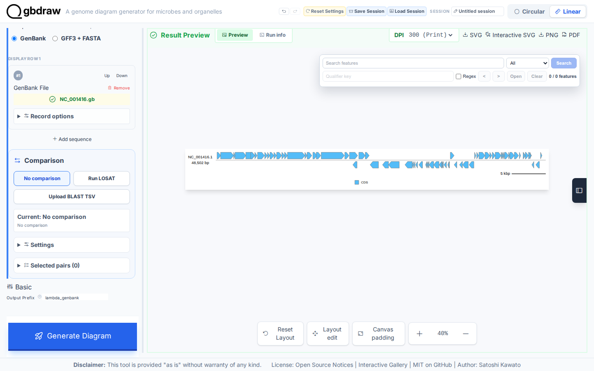
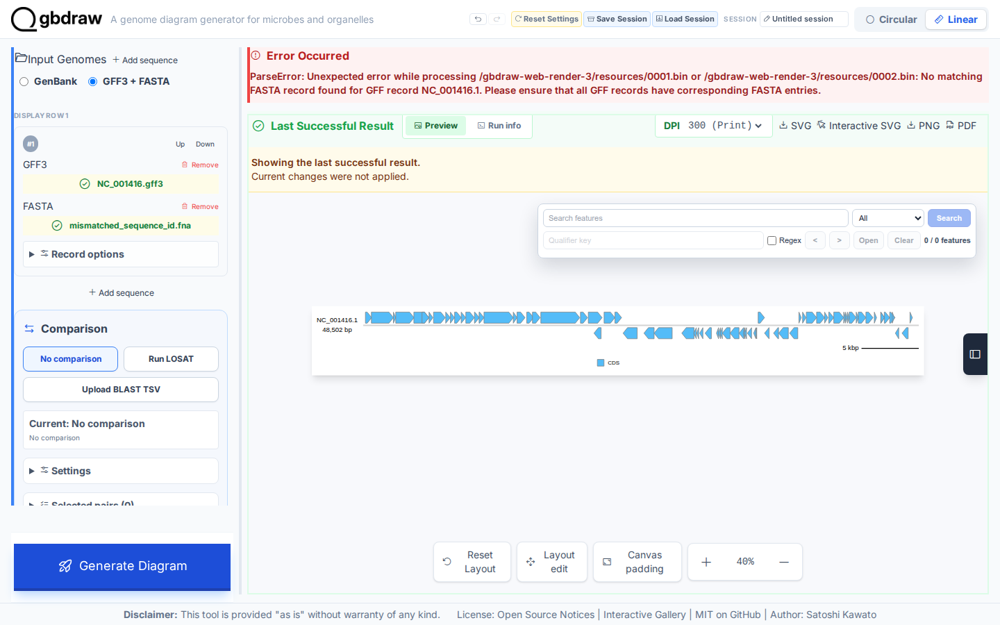

[Documentation home](../../DOCS.md) | [How-to guides](../README.md) | [GUI how-to guides](./README.md)

# How to use GenBank and GFF3 + FASTA inputs

Use either one annotated GenBank file or one matched GFF3 and FASTA pair for a
Linear diagram. Both paths use the complete Lambda record `NC_001416.1`, so
their results can be checked against the same biological source.

## Before you start

Download the two sequence files from the authoritative NCBI record. The GFF3
annotation is repository support data derived from the same complete record.

| Input | Acquisition | Format | Save as |
|---|---|---|---|
| Annotated sequence | [NCBI `NC_001416.1`](https://www.ncbi.nlm.nih.gov/nuccore/NC_001416.1) | GenBank (full) | `NC_001416.gb` |
| Annotation | [Support download](../../../gbdraw/web/tutorial-data/lambda-gff3/NC_001416.gff3) | GFF3 | `NC_001416.gff3` |
| Sequence for the GFF3 path | [NCBI `NC_001416.1`](https://www.ncbi.nlm.nih.gov/nuccore/NC_001416.1) | FASTA | `NC_001416.fna` |

See [Get the tutorial inputs](../../GETTING_TUTORIAL_DATA.md) for browser
download and accession checks. All three files represent the complete `NC_001416.1` record and do not crop or split the 48,502 bp sequence.

## Use the GenBank input

1. Select **Linear**, **GenBank**, and **No comparison**.
2. In **GenBank File**, choose `NC_001416.gb`.
3. Select **Generate Diagram**.



*The generated map identifies `NC_001416.1` and `48,502 bp`. The preview contains all 73 CDS features on both strands.*

## Use a matched GFF3 and FASTA pair

1. Select **GFF3 + FASTA**.
2. In **GFF3**, choose `NC_001416.gff3`.
3. In **FASTA**, choose `NC_001416.fna`.
4. Set **Output Prefix** to `lambda_gff3`, then select **Generate Diagram**.


*The matched pair produces the same complete record and the same 73 rendered CDS features as the GenBank input.*

The first GFF3 column and the FASTA header must use the same record ID. For these files, both values are `NC_001416.1`:

```text
NC_001416.1  RefSeq-extract  CDS  ...
>NC_001416.1 Enterobacteria phage lambda, complete genome
```

Select **SVG** in the result toolbar to save `lambda_gff3.svg`.

## Diagnose a record-ID mismatch

If the GFF3 record ID has no exact match in the FASTA file, generation stops and the error panel includes this message:

```text
No matching FASTA record found for GFF record NC_001416.1. Please ensure that all GFF records have corresponding FASTA entries.
```



*This captured failure keeps the complete Lambda sequence but changes its temporary FASTA header to `MISMATCHED_ID`. No output replaces the last valid result.*

Compare the GFF3 column 1 value with the first word after `>` in each FASTA header. Correct the differing ID, reselect the corrected file, and generate again.

## Verify the result

Both valid input paths should have these values:

| Check | Expected value |
| --- | --- |
| Record ID | `NC_001416.1` |
| Sequence length | 48,502 bp |
| Rendered CDS features | 73 |
| Positive-strand CDS | 47 |
| Negative-strand CDS | 26 |

Matching these values confirms that the two input formats preserve the same record and CDS orientations.

## Related guides

- [GFF3 + FASTA format details](../../GFF3_FASTA.md)
- [Input formats and TSV schemas](../../REFERENCE/input-formats-and-tsv-schemas.md)
- [Create your first Linear diagram](../../TUTORIALS/GUI/first-linear-genome-diagram.md)
