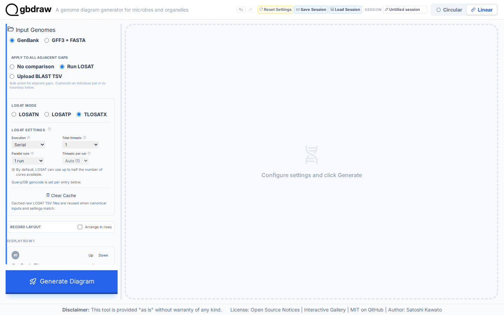
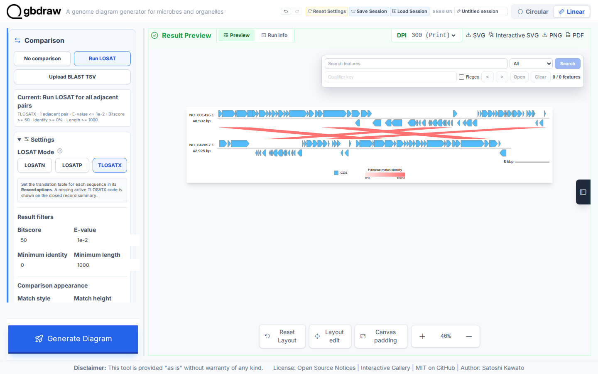

[Documentation home](../../DOCS.md) | [How-to guides](../README.md) | [GUI how-to guides](./README.md)

# How to use TLOSATX for translated nucleotide comparisons

TLOSATX translates both nucleotide records in six frames before comparing
them. The browser recipe below runs against complete Lambda and DE3 genomes
with fixed serial settings, then saves the raw evidence and the diagram.

## Before you start

Download the bundled complete records:

- [`NC_001416.gb`](../../../gbdraw/web/tutorial-data/lambda/NC_001416.gb),
  `NC_001416.1`, 48,502 bp.
- [`NC_042057.1.gb`](../../../gbdraw/web/tutorial-data/de3/NC_042057.1.gb),
  `NC_042057.1`, 42,925 bp.

The frozen reference output is
[`lambda-de3.tlosatx.tsv`](../../../gbdraw/web/tutorial-data/lambda-de3-comparison/lambda-de3.tlosatx.tsv).
It contains 397 rows from LOSAT 0.1.0 running in the browser (WASM); two
separate serial runs produced byte-identical results.

## Configure TLOSATX

1. Select **Linear**, **GenBank**, and **Run LOSAT**.
2. Upload Lambda as sequence 1 and DE3 as sequence 2.
3. Select **TLOSATX**.
4. Set **Execution** to **Serial**, **Total threads** to `1 thread`, and
   **Parallel runs** to `1 run`. **Threads per run** remains fixed at 1.
5. Set the gencode for both records to `1`.
6. Set **Output Prefix** to `lambda-de3-tlosatx` and **Raw LOSAT filename** to
   `lambda-de3.tlosatx.tsv`.
7. Open **Pairwise Match** and set **Minimum Length** to `1000`.

The Minimum Length filter affects the diagram, not the raw TSV download. It
retains seven links for display while keeping all 397 search rows in the saved
evidence.

## Run the search and save both outputs

Select **Generate Diagram**. The browser runs TLOSATX locally, applies the
display filter, and draws seven links.

Select **Save Raw LOSAT TSV** to download `lambda-de3.tlosatx.tsv`, then select
**SVG** to download `lambda-de3-tlosatx.svg`.

Your downloaded TSV should have 397 rows and match the frozen reference
output above. The SVG should show seven links, the complete 48,502 bp and
42,925 bp records, and no coordinates outside either genome.

## Troubleshooting

- **The run uses more than one job:** set **Execution**, **Total threads**, and
  **Parallel runs** again before generating.
- **The raw TSV has more rows than the diagram:** this is expected. The raw
  download precedes the 1,000-length display filter.
- **The result is empty:** confirm that both gencode fields are `1` and that
  the records are in Lambda to DE3 order.
- **The subject accession is not `NC_042057.1`:** replace it with the complete
  DE3 record before running the documented search.

## Related guides

- [Use uploaded BLAST results](./use-uploaded-blast-results.md)
- [Compare two genomes with LOSATN](../../TUTORIALS/GUI/compare-genomes-losatn.md)
- [Choose a genome comparison method](../../EXPLANATION/choose-a-genome-comparison-method.md)
