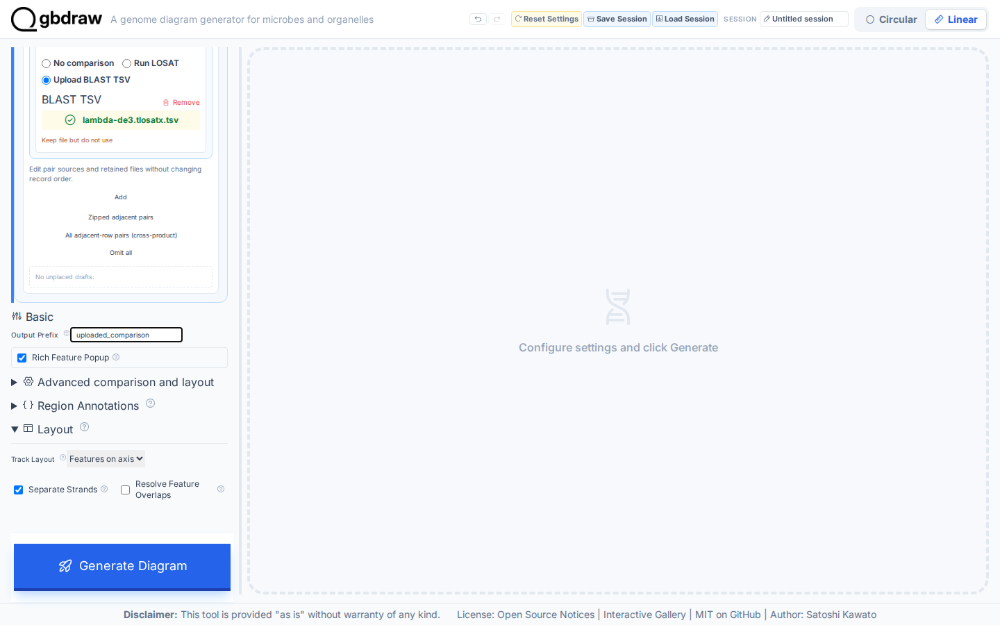
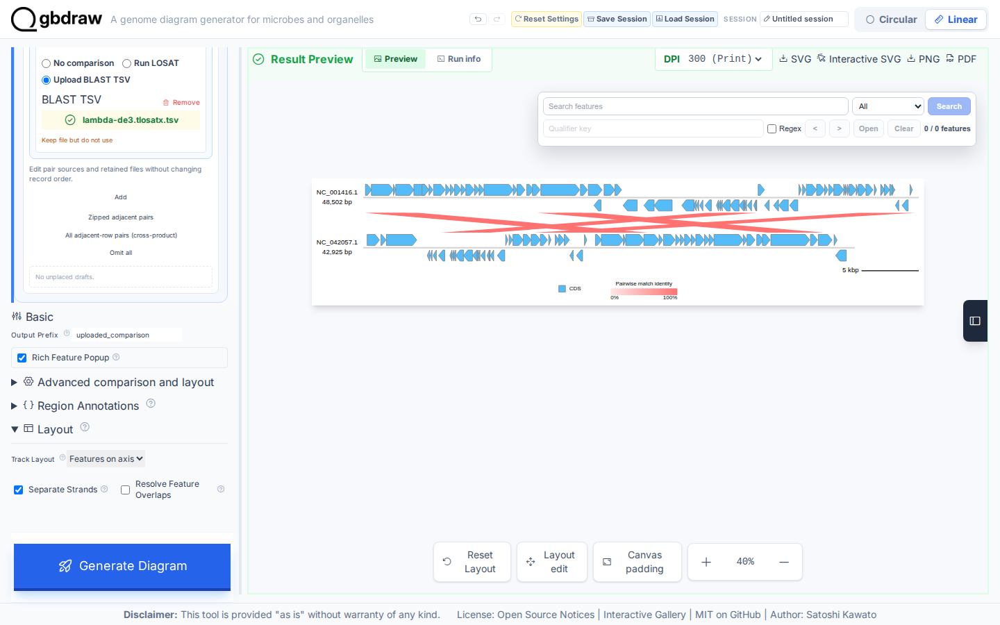

[Documentation home](../../DOCS.md) | [How-to guides](../README.md) | [GUI how-to guides](./README.md)

# How to use uploaded BLAST results

Use **Upload BLAST TSV** when comparison evidence already exists. This recipe
draws seven selected TLOSATX links between complete Lambda and complete DE3.
It does not rerun LOSAT.

## Before you start

Use these bundled files:

- [`NC_001416.gb`](../../../gbdraw/web/tutorial-data/lambda/NC_001416.gb),
  complete Lambda `NC_001416.1`, 48,502 bp.
- [`NC_042057.1.gb`](../../../gbdraw/web/tutorial-data/de3/NC_042057.1.gb),
  complete DE3 `NC_042057.1`, 42,925 bp.
- [`lambda-de3.tlosatx.tsv`](../../../gbdraw/web/tutorial-data/lambda-de3-comparison/lambda-de3.tlosatx.tsv),
  397 frozen TLOSATX outfmt 6 rows with Lambda as query and DE3 as subject.

Every row in the TSV uses those two accessions. The source records are not
cropped, split, or relabeled.

## Assign the uploaded evidence

1. Select **Linear** and **GenBank**.
2. Upload `NC_001416.gb` under sequence 1.
3. Select **Add Seq**, then upload `NC_042057.1.gb` under sequence 2.
4. Under **Adjacent gaps**, select **Upload BLAST TSV** for the sequence 1 to
   sequence 2 edge.
5. Upload `lambda-de3.tlosatx.tsv` for that edge.
6. Set **Output Prefix** to `uploaded_comparison`.

Open **Pairwise Match** and set **Minimum Length** to `1000`. Seven of the 397
rows meet that threshold. The comparison plan must name sequence 1 as the
query endpoint, sequence 2 as the subject endpoint, and `Upload BLAST TSV` as
the active source.

## Generate and verify the links

Select **Generate Diagram**, then zoom to 40%.

Check the result:

| Check | Expected result |
|---|---|
| Query | `NC_001416.1`, 48,502 bp |
| Subject | `NC_042057.1`, 42,925 bp |
| Uploaded rows | 397 |
| Displayed links | 7 |
| Minimum displayed alignment length | 1,000 |

Select **SVG** to save `uploaded_comparison.svg`. Each of the seven links in
the downloaded SVG should carry its query, subject, coordinates, identity,
alignment length, E-value, and bit score from the uploaded TSV.

## Troubleshooting

- **No links appear:** check that the query and subject accessions in the TSV
  match the two uploaded records.
- **Too many links appear:** set **Minimum Length** to `1000` and generate
  again.
- **The edge points the wrong way:** keep Lambda as sequence 1 and DE3 as
  sequence 2. The frozen table uses that direction.
- **The subject accession is not `NC_042057.1`:** use the bundled Lambda and
  DE3 evidence so the table endpoints match the uploaded records.

## Related guides

- [Run TLOSATX in the browser](./use-tlosatx.md)
- [Arrange Linear records and orientation](./arrange-linear-records-regions-and-orientation.md)
- [Comparison input reference](../../REFERENCE/input-formats-and-tsv-schemas.md)
