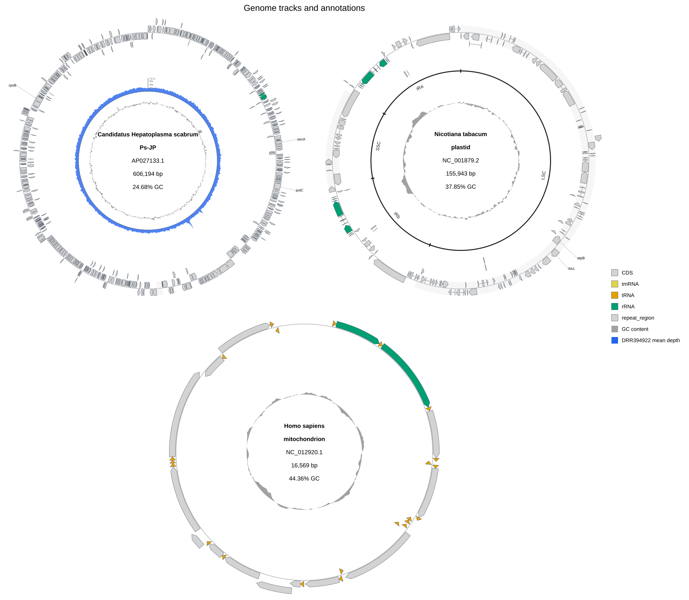

[Documentation home](../../DOCS.md) | [Python API](../../REFERENCE/python-api.md) | [Python how-to guides](README.md)

# How to add tracks, annotations, colors, and labels from Python

Draw three complete circular genomes in one SVG. The first panel has a
pre-aggregated sequencing-depth track, the second marks the four tobacco
plastome regions, and the third provides a compact mitochondrial example. One
typed slot list controls the track order across all three panels.

## Prerequisites

- Install gbdraw in a Python 3.10 or newer environment.
- Start in an empty working directory.
- Copy these public fixtures into that directory:
  - [`AP027133.gb`](../../../gbdraw/web/tutorial-data/depth-1kb/AP027133.gb),
    SHA-256 `913af50dd9d37cc2107be5e46484b885c5d586fb414b4b501380fc8f17a659d6`;
  - [`AP027133.DRR394922.depth-1kb.tsv`](../../../gbdraw/web/tutorial-data/depth-1kb/AP027133.DRR394922.depth-1kb.tsv),
    SHA-256 `6f57cfd89a165ad97a162aa2f0b1f3b3ad21fb5638f4f9ac5cbd069badd6aab7`;
  - [`NC_001879.gbk`](../../../gbdraw/web/tutorial-data/tobacco-plastome-regions/NC_001879.gbk),
    SHA-256 `25c5b39fd25d702c0a390fe5e7480eda0ccc1e4d6d7c388445b4686049412a24`;
  - [`nicotiana-tabacum-regions.tsv`](../../../gbdraw/web/tutorial-data/tobacco-plastome-regions/nicotiana-tabacum-regions.tsv),
    SHA-256 `3a85aed5145c88f93b4478d1901fab53714b9d47afc754d32cc9e5c0b8412b88`;
  - [`modified_default_colors.tsv`](../../../gbdraw/web/tutorial-data/tobacco-plastome-regions/modified_default_colors.tsv),
    SHA-256 `e48654dfc5225c8c1eec251f773fc07892228dee906cb1e105e4d24cb5ae8bc1`;
  - [`qualifier_priority.tsv`](../../../gbdraw/web/tutorial-data/tobacco-plastome-regions/qualifier_priority.tsv),
    SHA-256 `2f40dedf957041e3093a1d1a4dc8f6c2d1a0843ebf5367f0ae78f0e75769eaa1`;
  - [`HmmtDNA.gbk`](../../../gbdraw/web/tutorial-data/human-mitochondrion/HmmtDNA.gbk),
    SHA-256 `7530d659e7174272372814edfecb2ece1f87a444395a861fcdf1b977c4aa5c1f`.

The [fixture manifest](../../../gbdraw/web/tutorial-data/manifest.json) records
the provenance and biological metadata. `AP027133.1`, `NC_001879.2`, and
`NC_012920.1` are complete records whose source topology is circular.

The depth TSV already contains one arithmetic mean at each 1-based 1 kbp bin
start. Set `depth_window=1` and `depth_step=1000`; a larger window would average
those means a second time.

## Draw the figure

Save this program as `draw_python_tracks.py` beside the seven fixture files:

<!-- executable:H-PY-03:start -->
```python
from pathlib import Path

from pandas import DataFrame

from gbdraw import (
    CircularLayout,
    CircularOptions,
    CircularTrackOptions,
    DepthTrackOptions,
    Diagram,
    FeatureOptions,
    LabelOptions,
    TitleOptions,
    draw_circular,
    read_genbank,
)
from gbdraw.api import AnnotationOptions, CircularTrackSlot, ScalarSpec


records = read_genbank(
    [Path("AP027133.gb"), Path("NC_001879.gbk"), Path("HmmtDNA.gbk")]
)
assert [(record.id, len(record)) for record in records] == [
    ("AP027133.1", 606_194),
    ("NC_001879.2", 155_943),
    ("NC_012920.1", 16_569),
]
assert all(record.annotations.get("topology") == "circular" for record in records)

label_whitelist = DataFrame(
    [
        [
            "CDS",
            "gene",
            "^(rpoB|secA|polC|rbcL|psaA|atpB|ndhF|"
            "ND1|COX1|ATP6|CYTB)$",
        ]
    ],
    columns=["feature_type", "qualifier", "keyword"],
)

track_slots = (
    CircularTrackSlot(
        id="features",
        renderer="features",
        side="overlay",
        params={"lane_direction": "split"},
    ),
    CircularTrackSlot(
        id="plastome_regions",
        renderer="annotations",
        side="inside",
        radius=ScalarSpec(0.70),
        width=ScalarSpec(24, "px"),
        params={
            "set_id": "plastome_regions",
            "show_labels": True,
            "padding_px": 1,
            "overflow": "compress",
        },
        inner_gap_px=2,
        outer_gap_px=2,
    ),
    CircularTrackSlot(
        id="depth",
        renderer="depth",
        side="inside",
        radius=ScalarSpec(0.59),
        width=ScalarSpec(0.10),
        params={"track_index": 0, "legend_label": "DRR394922 mean depth"},
        inner_gap_px=3,
        outer_gap_px=3,
    ),
    CircularTrackSlot(
        id="gc_content",
        renderer="dinucleotide_content",
        side="inside",
        radius=ScalarSpec(0.45),
        width=ScalarSpec(0.08),
        params={"nt": "GC", "legend_label": "GC content"},
        inner_gap_px=3,
        outer_gap_px=3,
    ),
)

options = CircularOptions(
    features=FeatureOptions(
        types=("CDS", "rRNA", "tRNA", "tmRNA", "repeat_region"),
        default_colors=Path("modified_default_colors.tsv"),
    ),
    labels=LabelOptions(
        whitelist=label_whitelist,
        qualifier_priority=Path("qualifier_priority.tsv"),
    ),
    annotations=AnnotationOptions(table_file="nicotiana-tabacum-regions.tsv"),
    tracks=CircularTrackOptions(slots=track_slots, center_reserved_radius=56),
    depth_tracks=(
        DepthTrackOptions(
            source=(Path("AP027133.DRR394922.depth-1kb.tsv"), None, None),
            label="DRR394922 mean depth",
            color="#2563eb",
            large_tick_interval=20,
            small_tick_interval=10,
        ),
    ),
    depth_window=1,
    depth_step=1000,
    title=TitleOptions(
        text="Genome tracks and annotations",
        position="top",
        font_size=26,
    ),
    legend="right",
    keep_full_definition_with_title=True,
    config_overrides={
        "canvas.strandedness": True,
        "canvas.resolve_overlaps": True,
        "canvas.circular.track_type": "tuckin",
        "labels.circular.scope": "outer",
        "labels.circular.placement": "horizontal",
        "labels.font_size.long": 11,
        "objects.features.block_stroke_color": "#4b5563",
        "objects.features.block_stroke_width.long": 0.8,
        "objects.features.line_stroke_color": "#9ca3af",
        "objects.features.line_stroke_width.long": 1.5,
    },
)

tracks_diagram = draw_circular(
    records,
    options=options,
    layout=CircularLayout(size="equal", positions=("#1@1", "#2@1", "#3@2")),
)
tracks_svg = tracks_diagram.to_svg()
tracks_bytes = tracks_diagram.to_bytes("svg")
tracks_path = tracks_diagram.save(Path("python_tracks_annotations.svg"))

assert isinstance(tracks_diagram, Diagram)
assert tracks_diagram.mode == "circular"
assert tracks_svg.encode("utf-8") == tracks_bytes == tracks_path.read_bytes()
print("Saved python_tracks_annotations.svg")
```
<!-- executable:H-PY-03:end -->

Run it from the working directory:

```bash
python draw_python_tracks.py
```

## Verification

The left panel is the complete 606,194 bp `AP027133.1` record. Its blue ring
plots all 607 pre-aggregated DRR394922 means. The upper-right panel is the
complete 155,943 bp `NC_001879.2` plastome, with LSC, IRb, SSC, and IRa bracket
annotations. The lower panel is the complete 16,569 bp human mitochondrial
record.



The selected CDS labels come from the `gene` qualifier because
`qualifier_priority.tsv` puts `gene` before `old_locus_tag`. The in-memory
whitelist limits the figure to named examples; it does not remove features.

The executable validator checks the three accessions, source lengths and
topologies, all 758 displayed features, the depth-table positions and values,
the four annotation identities, the typed slot order, feature colors, selected
gene labels, and byte equality across the three output methods.

## Troubleshooting

- `Depth track 1 has 1 source(s); expected 3`: keep the three-item source tuple.
  `None` is the explicit no-depth value for the plastome and mitochondrial
  panels.
- The depth ring is missing: keep the depth TSV as the first item in that tuple,
  matching the order of `records`.
- The four region labels are missing: keep `NC_001879.gbk` and
  `nicotiana-tabacum-regions.tsv` together. The table targets `NC_001879.2`.
- Labels show product descriptions: use the supplied `qualifier_priority.tsv`;
  its CDS rule starts with `gene`.

See the [Python API reference](../../REFERENCE/python-api.md) for the
beginner-facing option types, the [presentation reference](../../REFERENCE/palettes-feature-rules-labels-shapes-and-tracks.md)
for table precedence, and [track ownership](../../EXPLANATION/understand-tracks-axes-and-layout.md)
for slot and axis behavior.
