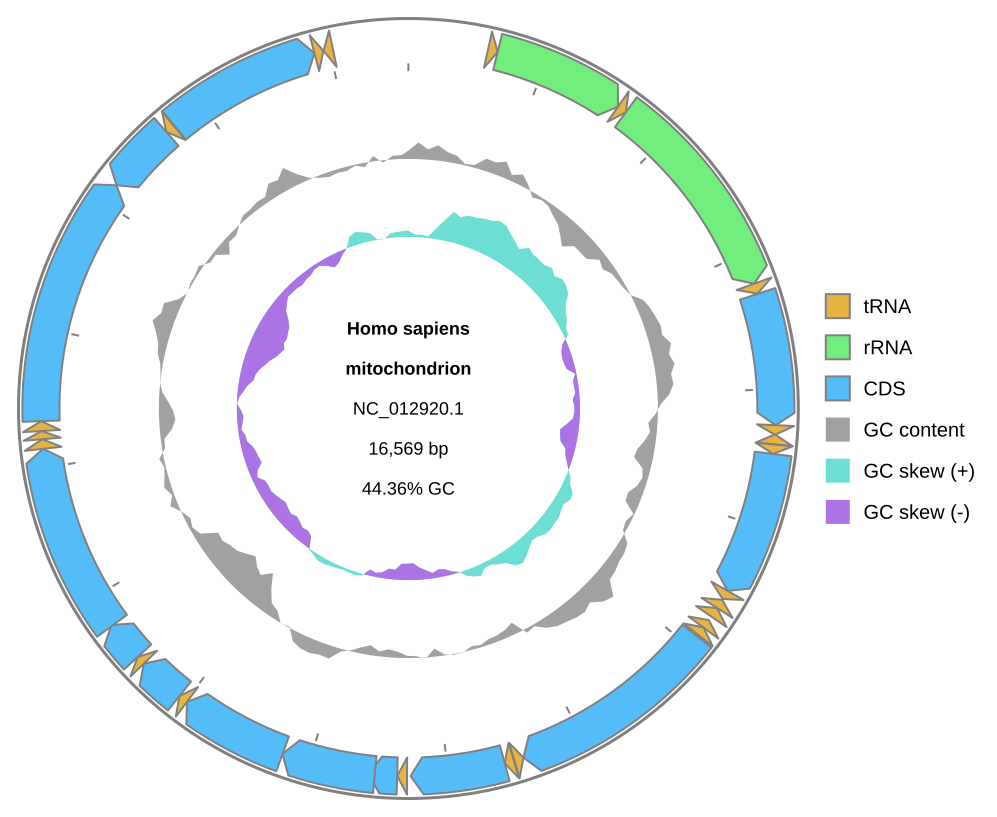

[Documentation home](../../DOCS.md) | [Typed requests](../../REFERENCE/typed-requests.md) | [Python how-to guides](README.md)

# How to build typed requests and round-trip sessions

Plan and render a mode-specific request, save a current session, replay it from
embedded resources, and confirm that a wrong-mode field is rejected.

## Prerequisites

- Install gbdraw in a Python 3.10 or newer environment.
- Start in an empty working directory.
- Download the complete GenBank record for [NCBI accession
  NC_012920.1](https://www.ncbi.nlm.nih.gov/nuccore/NC_012920.1) and save it in
  that directory as `HmmtDNA.gbk`.

See [Get the tutorial files](../../GETTING_TUTORIAL_DATA.md) for NCBI browser,
`curl`, and PowerShell download steps. Confirm that the downloaded record ID is
`NC_012920.1` before continuing.

## Build, render, save, and replay the request

Save this program as `typed_session.py` beside `HmmtDNA.gbk`:

<!-- executable:H-PY-05:start -->
```python
from datetime import datetime, timezone
from pathlib import Path
from tempfile import TemporaryDirectory

from gbdraw.api import (
    CircularDiagramOptions,
    CircularDiagramRequest,
    CircularOutputOptions,
    CircularRequestPlan,
    CircularRequestTrackOptions,
    InMemoryRecordSource,
    PreparedDiagramRequest,
    RecordInput,
    RenderOutputRequest,
    RequestRenderResult,
    SessionConversionError,
    SessionDocument,
    build_request_plan_diagram,
    load_gbks,
    load_session_document,
    materialize_session,
    plan_request,
    render_prepared_request,
    render_session,
    save_session_document,
    session_to_request,
)


record = load_gbks(["HmmtDNA.gbk"])[0]
request = CircularDiagramRequest(
    records=(
        RecordInput(
            source=InMemoryRecordSource(record),
            record_key="human-mitochondrion",
        ),
    ),
    options=CircularDiagramOptions(
        tracks=CircularRequestTrackOptions(),
        output=CircularOutputOptions(legend="right"),
    ),
    output=RenderOutputRequest(
        output_prefix="typed_request",
        formats=("svg",),
    ),
)

plan = plan_request(request)
assert isinstance(plan, CircularRequestPlan)
assert plan.mode == "circular"
plan.preflight_outputs()

prepared = build_request_plan_diagram(plan)
assert isinstance(prepared, PreparedDiagramRequest)

result = render_prepared_request(prepared)
assert isinstance(result, RequestRenderResult)
assert result.mode == "circular"
assert tuple(path.name for path in result.output_paths) == ("typed_request.svg",)
rendered_svg_bytes = result.output_paths[0].read_bytes()

session_path = Path("typed_request.session.json")
session_document = save_session_document(
    session_path,
    request,
    title="Typed human mitochondrial diagram",
    created_at=datetime(2026, 8, 3, tzinfo=timezone.utc),
)
assert isinstance(session_document, SessionDocument)

loaded_document = load_session_document(session_path)
assert loaded_document.mode == "circular"
assert loaded_document.has_canonical_request

with TemporaryDirectory(prefix="gbdraw-session-replay-") as replay_directory:
    with materialize_session(
        loaded_document,
        output_directory=replay_directory,
    ) as materialized:
        replay_request = session_to_request(materialized)
        assert isinstance(replay_request, CircularDiagramRequest)
        replay_result = render_session(materialized)
        assert isinstance(replay_result, RequestRenderResult)
        replayed_svg_bytes = replay_result.output_paths[0].read_bytes()
    resources_expired = not materialized.active
replay_output_removed = not Path(replay_directory).exists()

assert rendered_svg_bytes == replayed_svg_bytes
assert resources_expired
assert replay_output_removed

wrong_mode_payload = loaded_document.to_dict()
wrong_mode_payload["renderRequest"]["diagramOptions"]["tracks"][
    "linearTrackAxisIndex"
] = 0
wrong_mode_document = load_session_document(wrong_mode_payload)
wrong_mode_error = ""

with TemporaryDirectory(prefix="gbdraw-wrong-mode-") as invalid_output_directory:
    with materialize_session(
        wrong_mode_document,
        output_directory=invalid_output_directory,
    ) as invalid_materialized:
        try:
            session_to_request(invalid_materialized)
        except SessionConversionError as error:
            wrong_mode_error = str(error)
        else:
            raise AssertionError("The wrong-mode session was accepted")

assert "Circular request cannot contain Linear track values" in wrong_mode_error

print("Rendered typed_request.svg")
print("Replayed the current Circular session")
print(f"Rejected wrong-mode session: {wrong_mode_error}")
```
<!-- executable:H-PY-05:end -->

The fixed `created_at` value makes this example session byte-reproducible.
Applications can omit it to record the time at which the session is saved.

Run the program:

```bash
python typed_session.py
```

It leaves two files in the working directory: `typed_request.svg` and
`typed_request.session.json`. Replay output is written inside a temporary
directory and removed after its bytes have been checked.

## Verification

The SVG is the direct typed-request render:



The published [current session](../../images/h-py-05/typed_request.session.json)
reloads as a Circular request. The negative check adds a Linear track-axis value
to a detached copy and requires `SessionConversionError`; it does not modify the
saved session.

## Troubleshooting

- `Output file already exists`: use an empty directory. Typed output preflight
  rejects an existing target unless the request sets `overwrite=True`.
- `Materialized session resources are no longer active`: call
  `session_to_request()` or `render_session()` inside the
  `materialize_session()` context.
- `A Circular request cannot contain Linear track values`: construct Circular
  requests only with Circular options. The last part of this procedure triggers
  that error deliberately.

See the [typed request reference](../../REFERENCE/typed-requests.md) for the
public types and the [session compatibility reference](../../REFERENCE/session-and-request-compatibility.md)
for current writer and accepted reader versions.
