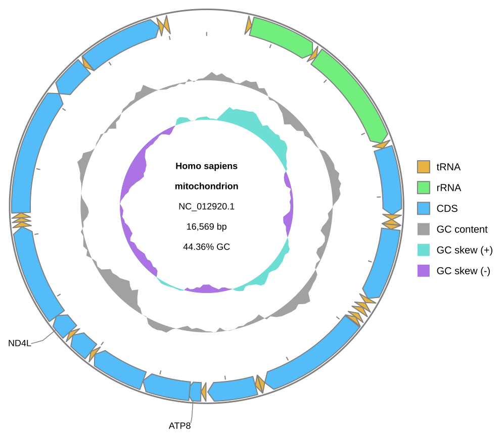
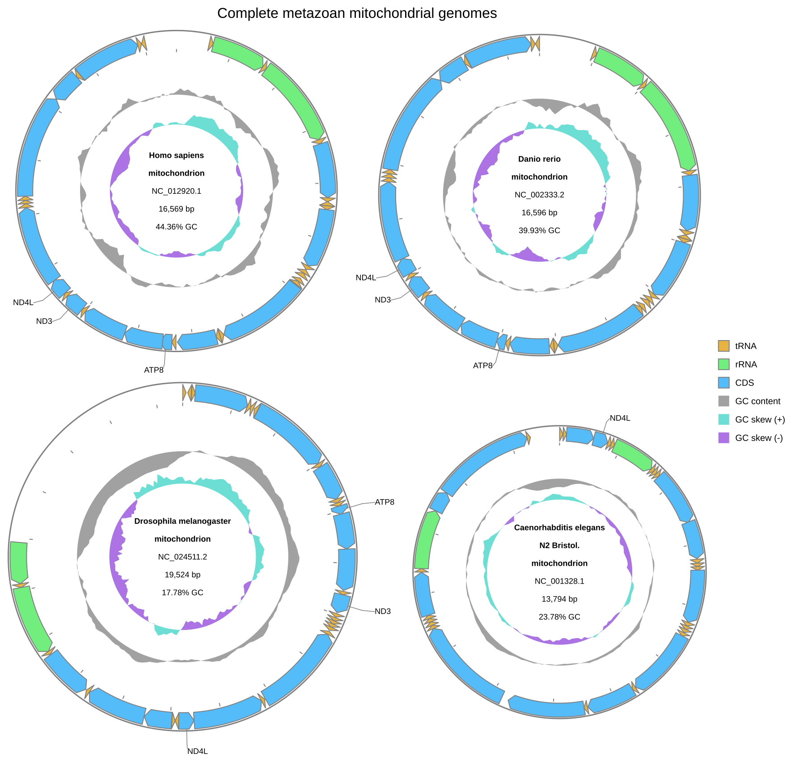

[Documentation home](../../DOCS.md) | [Python API](../../REFERENCE/python-api.md) | [Python how-to guides](README.md)

# How to draw Circular and multi-record diagrams from Python

Create one Circular diagram for a circular genome and one Circular grid from four
whole mitochondrial genomes. The saved files match the SVG bytes returned in memory.

## Prerequisites

- Install gbdraw in a Python 3.10 or newer environment.
- Start in an empty working directory.
- Download these complete GenBank records from NCBI and save them with the
  exact local filenames shown:
  - `HmmtDNA.gbk` from [NCBI accession
    NC_012920.1](https://www.ncbi.nlm.nih.gov/nuccore/NC_012920.1);
  - `NC_002333.2.gb` from [NCBI accession
    NC_002333.2](https://www.ncbi.nlm.nih.gov/nuccore/NC_002333.2);
  - `NC_024511.2.gb` from [NCBI accession
    NC_024511.2](https://www.ncbi.nlm.nih.gov/nuccore/NC_024511.2);
  - `NC_001328.1.gb` from [NCBI accession
    NC_001328.1](https://www.ncbi.nlm.nih.gov/nuccore/NC_001328.1).
- Download the supplied label rule into the same directory:
  - [`cds_gene_qualifier_priority.tsv`](../../../gbdraw/web/tutorial-data/shared/cds_gene_qualifier_priority.tsv),
    SHA-256 `1d3c787c5768b52191cc7e8a325cd00fdc4b1e9b495d37e580c3a69dec21b87a`.

See [Get the tutorial files](../../GETTING_TUTORIAL_DATA.md) for NCBI browser,
`curl`, and PowerShell download steps. The grid uses four complete, naturally
circular metazoan mitochondrial genomes: human, zebrafish, fruit fly, and
nematode.

## Draw and save both diagrams

Save this program as `draw_circular_records.py` beside the five input files:

<!-- executable:H-PY-01:start -->
```python
from pathlib import Path

from Bio.SeqRecord import SeqRecord
from pandas import DataFrame

from gbdraw import (
    CircularOptions,
    Diagram,
    LabelOptions,
    TitleOptions,
    draw_circular,
    read_genbank,
)


cds_label_whitelist = DataFrame(
    [("CDS", "gene", ".+")],
    columns=["feature_type", "qualifier", "keyword"],
)
labels = LabelOptions(
    whitelist=cds_label_whitelist,
    qualifier_priority=Path("cds_gene_qualifier_priority.tsv"),
)
label_overrides = {
    "labels.circular.scope": "outer",
    "labels.circular.placement": "horizontal",
    "labels.font_size.short": 18,
    "labels.font_size.long": 18,
}


circular_record = read_genbank(Path("HmmtDNA.gbk"))[0]
assert isinstance(circular_record, SeqRecord)
assert (circular_record.id, len(circular_record)) == ("NC_012920.1", 16_569)

circular_options = CircularOptions(
    labels=labels,
    config_overrides=label_overrides,
)
circular_diagram = draw_circular(circular_record, options=circular_options)
circular_svg = circular_diagram.to_svg()
circular_bytes = circular_diagram.to_bytes("svg")
circular_path = circular_diagram.save(Path("python_circular.svg"))

assert isinstance(circular_diagram, Diagram)
assert circular_diagram.mode == "circular"
assert circular_svg.encode("utf-8") == circular_bytes
assert circular_path.read_bytes() == circular_bytes

multi_records = read_genbank(
    [
        Path("HmmtDNA.gbk"),
        Path("NC_002333.2.gb"),
        Path("NC_024511.2.gb"),
        Path("NC_001328.1.gb"),
    ]
)
assert [(record.id, len(record)) for record in multi_records] == [
    ("NC_012920.1", 16_569),
    ("NC_002333.2", 16_596),
    ("NC_024511.2", 19_524),
    ("NC_001328.1", 13_794),
]
assert all(record.annotations.get("topology") == "circular" for record in multi_records)

multi_record_options = CircularOptions(
    labels=labels,
    title=TitleOptions(
        text="Complete metazoan mitochondrial genomes",
        position="top",
    ),
    keep_full_definition_with_title=True,
    config_overrides=label_overrides,
)
multi_record_diagram = draw_circular(multi_records, options=multi_record_options)
multi_record_svg = multi_record_diagram.to_svg()
multi_record_bytes = multi_record_diagram.to_bytes("svg")
multi_record_path = multi_record_diagram.save(Path("python_multi_record.svg"))

assert isinstance(multi_record_diagram, Diagram)
assert multi_record_diagram.mode == "circular"
assert len(multi_record_diagram.records) == 4
assert multi_record_svg.encode("utf-8") == multi_record_bytes
assert multi_record_path.read_bytes() == multi_record_bytes

print("Saved python_circular.svg and python_multi_record.svg")
```
<!-- executable:H-PY-01:end -->

Run it from the working directory:

```bash
python draw_circular_records.py
```

The final line is:

```text
Saved python_circular.svg and python_multi_record.svg
```

## Verification

Open both files. The first identifies `NC_012920.1` and `16,569 bp`; its CDS
labels use compact gene symbols such as `COX1`, `ATP6`, and `CYTB`, not long
product descriptions:



The second contains a Circular grid of the four complete mitochondrial genomes. Each
center names the organism and accession so that the records remain identifiable without
consulting the recipe, while outer labels identify every CDS by its `gene` qualifier:



The executable recipe also checks the SVG structure, record IDs and lengths, 37
displayed human mitochondrial features, 147 displayed grid features, every expected
CDS `gene` label in all four records, the absence of CDS product descriptions, and byte
equality across `to_svg()`, `to_bytes()`, and `save()`.

## Troubleshooting

- `Output file already exists`: use an empty directory or remove the old output
  after confirming that it is no longer needed. `Diagram.save()` does not
  overwrite by default.
- The grid contains fewer than four records: confirm that all four GenBank files
  are present and that their filenames are unchanged.

See the [Python API reference](../../REFERENCE/python-api.md) for the drawing and
output boundaries, and [Choose Circular or Linear](../../EXPLANATION/choose-circular-or-linear.md)
for layout guidance.
