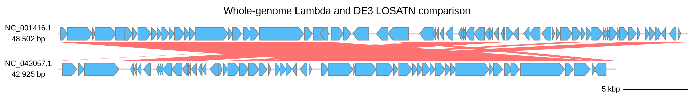

[Documentation home](../../DOCS.md) | [Python API](../../REFERENCE/python-api.md) | [Python how-to guides](README.md)

# How to draw Linear diagrams and comparisons from Python

Draw a whole-genome Lambda/DE3 comparison from fixed LOSATN evidence. The two
complete records occupy separate Linear rows.

## Prerequisites

- Install gbdraw in a Python 3.10 or newer environment.
- Start in an empty working directory.
- Download these complete GenBank records from NCBI and save them with the
  exact local filenames shown:
  - `NC_001416.gb` from [NCBI accession
    NC_001416.1](https://www.ncbi.nlm.nih.gov/nuccore/NC_001416.1);
  - `NC_042057.1.gb` from [NCBI accession
    NC_042057.1](https://www.ncbi.nlm.nih.gov/nuccore/NC_042057.1).
- Download the supplied comparison table into the same directory:
  - [`lambda-de3.losatn.tsv`](../../../gbdraw/web/tutorial-data/lambda-de3-comparison/lambda-de3.losatn.tsv),
    SHA-256 `703b0ac749669152a8e6d5fa6fb246cf5973cb1a3e0ca9db2f346ee33628317c`.

See [Get the tutorial files](../../GETTING_TUTORIAL_DATA.md) for NCBI browser,
`curl`, and PowerShell download steps. Lambda (`NC_001416.1`, 48,502 bp) and
DE3 (`NC_042057.1`, 42,925 bp) are complete genomes.
`lambda-de3.losatn.tsv` is the fixed six-row LOSATN result for that pair.

## Draw the comparison

Save this program as `draw_linear_examples.py` beside the three input files:

<!-- executable:H-PY-02:start -->
```python
from pathlib import Path

from Bio.SeqRecord import SeqRecord

from gbdraw import (
    Diagram,
    FeatureOptions,
    LinearComparisonOptions,
    LinearOptions,
    Thresholds,
    TitleOptions,
    draw_linear,
    read_genbank,
)


comparison_records = read_genbank(
    [Path("NC_001416.gb"), Path("NC_042057.1.gb")]
)
assert [(record.id, len(record)) for record in comparison_records] == [
    ("NC_001416.1", 48_502),
    ("NC_042057.1", 42_925),
]
assert all(isinstance(record, SeqRecord) for record in comparison_records)

comparison_options = LinearComparisonOptions(
    blast_files=("lambda-de3.losatn.tsv",),
)
comparison_diagram = draw_linear(
    comparison_records,
    options=LinearOptions(
        features=FeatureOptions(types=("CDS",)),
        comparisons=comparison_options,
        thresholds=Thresholds(evalue=1e-5),
        title=TitleOptions(text="Whole-genome Lambda and DE3 LOSATN comparison", position="top"),
        legend="none",
    ),
)
comparison_svg = comparison_diagram.to_svg()
comparison_bytes = comparison_diagram.to_bytes("svg")
comparison_path = comparison_diagram.save(Path("python_linear_comparison.svg"))

assert isinstance(comparison_diagram, Diagram)
assert comparison_diagram.mode == "linear"
assert comparison_svg.encode("utf-8") == comparison_bytes
assert comparison_path.read_bytes() == comparison_bytes

print("Saved python_linear_comparison.svg")
```
<!-- executable:H-PY-02:end -->

Run it from the working directory:

```bash
python draw_linear_examples.py
```

## Verification

The comparison has two complete record rows and six ribbons. Each ribbon is read
from the fixed LOSATN table; the program does not run a search.



The recipe runner executes the literal code in a clean directory. It verifies the
two record identities and lengths, 130 displayed features, the two-row topology,
and all six LOSATN endpoint pairs.

## Troubleshooting

- `Could not find comparison file`: keep `lambda-de3.losatn.tsv` beside the
  program. It is a precomputed table, not an input genome.
- The comparison has fewer than six ribbons: retain the documented
  `Thresholds(evalue=1e-5)` setting. It includes every fixed row.
- The two record rows overlap: use the default Linear layout and keep both whole
  GenBank inputs in the documented order.

See the [Python API reference](../../REFERENCE/python-api.md) for Linear option
types and the [comparison result reference](../../REFERENCE/comparison-programs-thresholds-and-results.md)
for table fields and threshold meaning.
