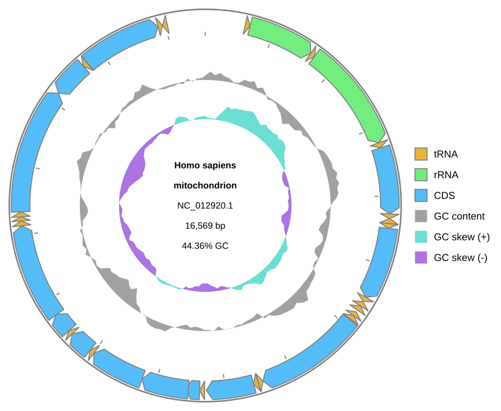

[Documentation home](../../DOCS.md) | [Python API](../../REFERENCE/python-api.md) | [Python how-to guides](README.md)

# How to use GFF3, in-memory records, and byte output

Load a complete GFF3 and FASTA pair, draw an existing `SeqRecord`, and write the
exact SVG bytes returned by each `Diagram`.

## Prerequisites

- Install gbdraw and Biopython in a Python 3.10 or newer environment.
- Start in an empty working directory.
- Download the supplied GFF3 support file into that directory:
  - [`NC_001416.gff3`](../../../gbdraw/web/tutorial-data/lambda-gff3/NC_001416.gff3),
    SHA-256 `d53e05de87933104cd26111bca42006cce9b5e903fb5b187740f963b3a2098cb`.
- Download the complete FASTA record for [NCBI accession
  NC_001416.1](https://www.ncbi.nlm.nih.gov/nuccore/NC_001416.1) and save it as
  `NC_001416.fna`.
- Download the complete GenBank record for [NCBI accession
  NC_012920.1](https://www.ncbi.nlm.nih.gov/nuccore/NC_012920.1) and save it as
  `HmmtDNA.gbk`.

See [Get the tutorial files](../../GETTING_TUTORIAL_DATA.md) for NCBI browser,
`curl`, and PowerShell download steps, including the FASTA format choice. The
Lambda GFF3 and accession-matched FASTA describe one complete 48,502 bp record.
It is not cropped or divided into artificial contigs.

## Load paths and an in-memory file object

Save this program as `draw_from_python_sources.py` beside the three input files:

<!-- executable:H-PY-04:start -->
```python
from io import StringIO
from pathlib import Path

from Bio import SeqIO
from Bio.SeqRecord import SeqRecord

from gbdraw import Diagram, draw_circular, draw_linear, read_gff


gff_records = read_gff(
    Path("NC_001416.gff3"),
    Path("NC_001416.fna"),
    features=("CDS", "gene"),
)
assert len(gff_records) == 1
gff_record = gff_records[0]
assert isinstance(gff_record, SeqRecord)
assert (gff_record.id, len(gff_record)) == ("NC_001416.1", 48_502)

gff_diagram = draw_linear(gff_record)
gff_svg = gff_diagram.to_svg()
gff_bytes = gff_diagram.to_bytes("svg")
gff_path = Path("python_gff3.svg")
gff_path.write_bytes(gff_bytes)

assert isinstance(gff_diagram, Diagram)
assert gff_diagram.mode == "linear"
assert gff_svg.encode("utf-8") == gff_bytes
assert gff_path.read_bytes() == gff_bytes

genbank_text = Path("HmmtDNA.gbk").read_text(encoding="utf-8")
memory_record = SeqIO.read(StringIO(genbank_text), "genbank")
assert isinstance(memory_record, SeqRecord)
assert (memory_record.id, len(memory_record)) == ("NC_012920.1", 16_569)

memory_diagram = draw_circular(memory_record)
memory_svg = memory_diagram.to_svg()
memory_bytes = memory_diagram.to_bytes("svg")
memory_path = Path("python_memory.svg")
memory_path.write_bytes(memory_bytes)

assert isinstance(memory_diagram, Diagram)
assert memory_diagram.mode == "circular"
assert memory_svg.encode("utf-8") == memory_bytes
assert memory_path.read_bytes() == memory_bytes

print("Wrote python_gff3.svg and python_memory.svg")
```
<!-- executable:H-PY-04:end -->

Run it from the working directory:

```bash
python draw_from_python_sources.py
```

## Verification

`python_gff3.svg` identifies the one complete Lambda record and shows its 73 CDS
features:


`python_memory.svg` identifies the `SeqRecord` parsed from the in-memory
`StringIO` object:



The documented code proves that `to_svg()` returns text and `to_bytes("svg")`
returns the same UTF-8 payload. The committed runner repeats those assertions in
a clean temporary directory.

`read_gff()` and `read_genbank()` accept filesystem paths. For a file-like object,
parse it with Biopython as shown above, then pass the resulting `SeqRecord` to a
drawing function.

## Troubleshooting

- `GFF3 and FASTA inputs must contain the same number of paths`: supply one FASTA
  path for each GFF3 path.
- `No matching FASTA record found for GFF record NC_001416.1`: keep the same
  sequence ID in the GFF3 and FASTA files. The linked GFF3 and the
  accession-matched NCBI FASTA agree.
- `StringIO` parsing fails: read GenBank text as UTF-8 and pass `"genbank"` to
  `SeqIO.read()`.

See the [input format reference](../../REFERENCE/input-formats-and-tsv-schemas.md)
for GFF3 identity rules and the [Python API reference](../../REFERENCE/python-api.md)
for accepted source and output types.
