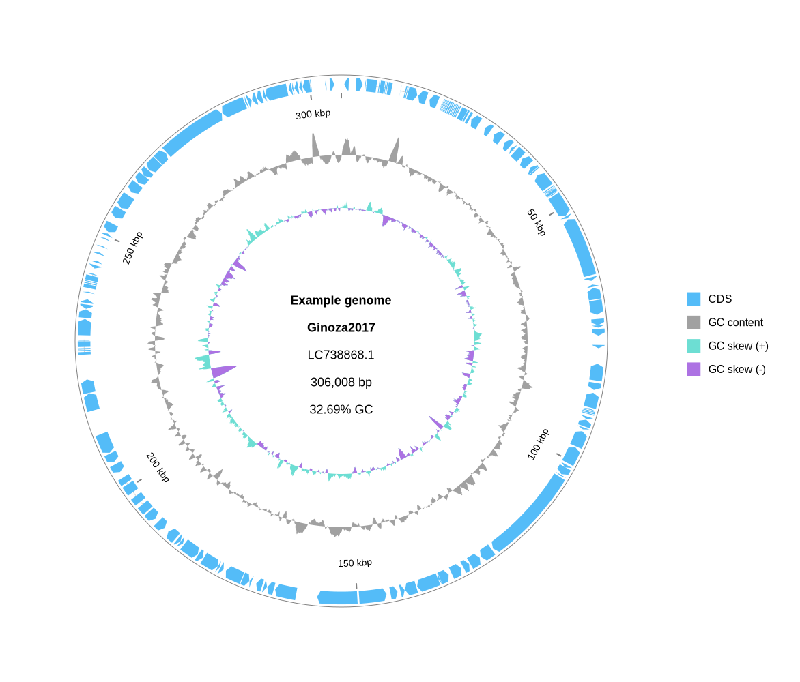
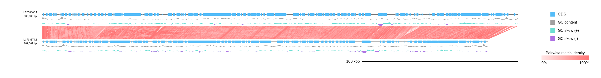

[Home](./DOCS.md) | [Tutorials](./TUTORIALS/TUTORIALS.md) | [Workflow guide](./WORKFLOW_GUIDE.md) | **Python API** | [Export](./EXPORT.md)

# Build diagrams with the Python API

Use `gbdraw.api` as the supported library entry point. Imports from internal modules may change without the compatibility guarantees of this namespace.

The [`DiagramOptions` field audit](./DIAGRAM_OPTIONS_AUDIT.md) lists all 71 fields,
the builders that read them, their final consumers, and mode-specific constraints.
The high-level builders reject non-default options that belong to another mode;
this prevents a Circular-only or Linear-only value from being silently ignored.

## Capability matrix

| Workflow | Public entry point |
|---|---|
| Circular, one record | `build_circular_diagram` |
| Circular, multi-record grid | `build_circular_multi_diagram` + `CircularMultiRecordOptions` |
| Linear and pairwise comparison | `build_linear_diagram` + `DiagramOptions` |
| Records, conservation, circular-track, annotation TSV | `read_*_table` in `gbdraw.api` |
| Label whitelist/priority/override TSV | `read_label_*_table`, `read_qualifier_priority_table` |
| Rich standalone interactive SVG | `build_interactive_svg_context`, `render_to_bytes`, `save_figure_to` |
| SVG and binary export | `render_to_bytes`, `save_figure_to` |
| Session v32 load/save/render | `load_session_document`, `materialize_session`, `session_to_request`, `render_session` |

## Circular example

The example reads one GenBank record, builds a circular diagram, writes SVG, and
also keeps SVG bytes in memory. The bundled `MjeNMV.gb` record has `CDS`
annotations but no rRNA or tRNA annotations, so the example selects only `CDS`.
Set `GBDRAW_EXAMPLE_GBK` when the input is not named `MjeNMV.gb`; the
documentation test uses this variable to run the block against the repository
fixture.

```python
import os
from pathlib import Path

from gbdraw.api import (
    DiagramOptions,
    OutputOptions,
    build_circular_diagram,
    load_gbks,
    render_to_bytes,
    save_figure_to,
)

input_path = Path(os.environ.get("GBDRAW_EXAMPLE_GBK", "MjeNMV.gb"))
output_dir = Path(os.environ.get("GBDRAW_API_OUTPUT_DIR", "."))
examples_dir = Path(os.environ.get("GBDRAW_EXAMPLES_DIR", input_path.parent))
test_inputs_dir = Path(os.environ.get("GBDRAW_TEST_INPUTS_DIR", input_path.parent))

record = load_gbks([str(input_path)], mode="circular")[0]
options = DiagramOptions(
    selected_features_set=["CDS"],
    species="Example genome",
    output=OutputOptions(output_prefix="api_circular", legend="right"),
)
canvas = build_circular_diagram(record, options=options)
paths = save_figure_to(
    canvas,
    "svg",
    output_dir=str(output_dir),
    output_prefix="api_circular",
    overwrite=True,
)
svg_bytes = render_to_bytes(canvas, "svg")

assert paths == [str(output_dir / "api_circular.svg")]
assert svg_bytes.startswith(b"<svg")
```

The resulting circular diagram:



## Circular multi-record canvas

The multi-record builder keeps grid-only values out of the general diagram option bundle.

```python
from gbdraw.api import CircularMultiRecordOptions, build_circular_multi_diagram

multi_records = load_gbks(
    [str(examples_dir / "MjeNMV.gb"), str(examples_dir / "MelaMJNV.gb")],
    mode="circular",
)
multi_canvas = build_circular_multi_diagram(
    multi_records,
    options=DiagramOptions(output=OutputOptions(legend="right")),
    layout=CircularMultiRecordOptions(
        multi_record_size_mode="auto",
        multi_record_positions=["#1@1", "#2@1"],
    ),
)
assert render_to_bytes(multi_canvas, "svg").startswith(b"<svg")
```

## Linear nucleotide and precomputed protein comparisons

`blast_files` accepts nucleotide BLAST outfmt 6/7 files. `protein_comparisons` accepts already-computed DataFrames with the standard twelve BLAST columns, so an external search is not required during rendering.

```python
from gbdraw.api import build_linear_diagram

linear_records = load_gbks(
    [str(examples_dir / "MjeNMV.gb"), str(examples_dir / "MelaMJNV.gb")],
    mode="linear",
    load_comparison=True,
)
linear_canvas = build_linear_diagram(
    linear_records,
    options=DiagramOptions(
        blast_files=[str(examples_dir / "MjeNMV.MelaMJNV.tblastx.out")],
        identity=0,
        bitscore=0,
    ),
)
assert render_to_bytes(linear_canvas, "svg").startswith(b"<svg")
```

The resulting pairwise comparison:



```python
import pandas as pd

comparison_columns = [
    "query", "subject", "identity", "alignment_length", "mismatches",
    "gap_opens", "qstart", "qend", "sstart", "send", "evalue", "bitscore",
]
precomputed_protein_hits = pd.DataFrame(columns=comparison_columns)
precomputed_canvas = build_linear_diagram(
    linear_records,
    options=DiagramOptions(protein_comparisons=[precomputed_protein_hits]),
)
assert render_to_bytes(precomputed_canvas, "svg").startswith(b"<svg")
```

For an in-process protein search, set `protein_blastp_mode` to `pairwise`, `orthogroup`, or `collinear` and configure the LOSAT executable fields. The default collinearity anchor mode is `rbh`; `all` and `one_to_one` are also honored.

## Depth, conservation, and custom track slots

Depth and conservation accept either file paths or DataFrames. Custom slots are parsed before assembly and can be carried in `TrackOptions`.
For a single Circular record, use `depth_table`/`depth_file` or a one-element
`depth_tables`/`depth_files` sequence. Mixed forms, empty sequences, and multiple
plural entries raise `ValidationError` instead of selecting only the first entry.

```python
from gbdraw.api import TrackOptions, parse_circular_track_slots

slots = parse_circular_track_slots([
    "features:features@side=overlay,lane_direction=split",
    "depth:depth@side=inside,track=1",
])
depth_options = DiagramOptions(
    depth_file=str(test_inputs_dir / "MjeNMV.DRR271272.depth.tsv"),
    tracks=TrackOptions(circular_track_slots=slots, circular_track_axis_index=0),
)
depth_canvas = build_circular_diagram(record, options=depth_options)
assert render_to_bytes(depth_canvas, "svg").startswith(b"<svg")
```

```python
conservation_record = load_gbks(
    [str(test_inputs_dir / "AP027078.gb")], mode="circular"
)[0]
conservation_canvas = build_circular_diagram(
    conservation_record,
    options=DiagramOptions(
        conservation_blast_files=[
            str(test_inputs_dir / "AP027078_AP027131.tblastx.out")
        ],
        conservation_reference="query",
        conservation_labels=["AP027131"],
    ),
)
assert render_to_bytes(conservation_canvas, "svg").startswith(b"<svg")
```

## Region annotations

Annotation data and track placement use separate typed objects. Targets can use 1-based inclusive coordinates or existing feature qualifiers.

```python
from gbdraw.api import (
    AnnotationOptions,
    AnnotationSet,
    CoordinateSpan,
    RegionAnnotation,
    RegionAnnotationStyle,
    TrackOptions,
    parse_circular_track_slots,
)

regions = AnnotationSet(
    id="review",
    annotations=(
        RegionAnnotation(
            id="window",
            target=CoordinateSpan(record=None, start=1000, end=5000),
            label="Review window",
            mark="band",
            style=RegionAnnotationStyle(fill="#f59e0b", fill_opacity=0.25),
            legend_label="Review region",
        ),
    ),
)
annotation_canvas = build_circular_diagram(
    record,
    options=DiagramOptions(
        annotations=AnnotationOptions(sets=(regions,)),
        tracks=TrackOptions(
            circular_track_slots=parse_circular_track_slots([
                "review:annotations@set_id=review,side=outside,w=28px",
                "features:features@side=overlay,lane_direction=split",
                "ticks:ticks@side=inside",
            ])
        ),
    ),
)
assert render_to_bytes(annotation_canvas, "svg").startswith(b"<svg")
```

Use `FeatureSpan` with one or more `FeatureSelector` values when a region should follow feature coordinates after record selection, cropping, or reverse complementation. `AnnotationOptions` accepts exactly one source: materialized `sets`, a DataFrame in `table`, or `table_file`.

## Label tables and rich interactive SVG

File and DataFrame forms are mutually exclusive for each label table. The same validated DataFrames can be reused when building interactive popup metadata.

```python
from gbdraw.api import (
    build_interactive_svg_context,
    read_label_override_table,
    read_label_whitelist_table,
    read_qualifier_priority_table,
)

whitelist = read_label_whitelist_table(
    str(test_inputs_dir / "NC_010162.whitelist.tsv")
)
priority = read_qualifier_priority_table(
    str(test_inputs_dir / "NC_010162.qualifier_priority.tsv")
)
label_override = read_label_override_table(
    str(test_inputs_dir / "label_override.tsv")
)
label_options = DiagramOptions(
    label_whitelist_table=whitelist,
    qualifier_priority_table=priority,
    label_override_table=label_override,
)
label_canvas = build_circular_diagram(record, options=label_options)
context = build_interactive_svg_context(
    [record],
    selected_features_set=label_options.selected_features_set,
)
interactive_bytes = render_to_bytes(
    label_canvas,
    "interactive_svg",
    interactive_context=context,
)
assert b"gbdraw-interactive-feature-metadata" in interactive_bytes
```

## Output choices

- `render_to_bytes(canvas, "svg")` returns SVG without writing a file.
- `save_figure_to` writes to an explicit directory/prefix and refuses to overwrite by default.
- `png`, `pdf`, `eps`, and `ps` require the optional CairoSVG dependency.
- `interactive_svg` creates the normal `.svg` plus `.interactive.svg`; supply an interactive context when rich popup metadata is required.
- `save_figure_to` is strict: if any explicitly requested format cannot be generated, it raises instead of returning a path that does not exist. CLI export remains warning-and-skip for optional binary formats.

```python
from gbdraw.exceptions import GbdrawError

try:
    png_bytes = render_to_bytes(canvas, "png")
except GbdrawError:
    png_bytes = None  # CairoSVG is optional.

assert png_bytes is None or png_bytes.startswith(b"\x89PNG")
```

## Session files

Version 31 sessions store a CLI-independent typed `renderRequest` and embedded
resources. Decode and render inside the materialization context because every file
path in the request is temporary and becomes invalid when the context exits.

```python
from gbdraw.api import (
    CircularDiagramRequest,
    InMemoryRecordSource,
    RecordInput,
    RenderOutputRequest,
    load_session_document,
    materialize_session,
    render_session,
    save_session_document,
)

session_path = output_dir / "api_session.gbdraw-session.json"
session_request = CircularDiagramRequest(
    records=(RecordInput(source=InMemoryRecordSource(record)),),
    output=RenderOutputRequest(
        output_prefix="api_session",
        output_directory=output_dir,
        overwrite=True,
    ),
)
save_session_document(session_path, session_request)
document = load_session_document(session_path)
with materialize_session(document, output_directory=output_dir) as materialized:
    result = render_session(materialized)

assert all(path.exists() for path in result.output_paths)
```

Build a new document from a typed request with `build_session_document`, or write it
atomically with `save_session_document`. `CircularDiagramRequest` and
`LinearDiagramRequest` accept file-backed or in-memory record sources and a
`RenderOutputRequest`.

The public Python functions in this section accept version 31 session files. Older
files remain usable from the command line with the same diagram mode that created
them, for example `gbdraw circular --session old.gbdraw-session.json` or
`gbdraw linear --session old.gbdraw-session.json`. gbdraw 0.12.0 and 0.12.1 wrote
version 29 files and accepted versions 27–29; gbdraw 0.13.0 wrote version 30 files
and accepted versions 27–30. `session_to_request` cannot convert versions 27–30 and
raises `SessionVersionError` for them.

Session failures are grouped under `SessionError`, with specific
`SessionFormatError`, `SessionVersionError`, `SessionResourceError`,
`SessionConversionError`, and `SessionRenderError` subclasses.

## Linear multi-record layout and selected comparisons

Use a non-`None` `LinearMultiRecordOptions` to authorize row placement. `grid_row` groups records vertically and `grid_column` orders them from left to right. Stable `record_key` values survive canonical request and session round-trips.

```python
from pathlib import Path

from gbdraw.api import (
    DiagramOptions,
    GenBankInputSource,
    LinearDiagramRequest,
    LinearMultiRecordOptions,
    RecordInput,
    RecordPresentation,
    RenderOutputRequest,
)

paths = [
    examples_dir / name
    for name in ("MjeNMV.gb", "PemoMJNVA.gb", "MelaMJNV.gb", "PeseMJNV.gb")
]
placements = ((1, 1), (1, 2), (2, 1), (2, 2))
records = tuple(
    RecordInput(
        source=GenBankInputSource(path),
        record_key=f"record-{index + 1}",
        presentation=RecordPresentation(grid_row=row, grid_column=column),
    )
    for index, (path, (row, column)) in enumerate(zip(paths, placements))
)

request = LinearDiagramRequest(
    records=records,
    layout=LinearMultiRecordOptions(record_gap_px=28),
    options=DiagramOptions(
        protein_blastp_mode="pairwise",
        protein_comparison_pairs=((0, 2), (1, 3)),
    ),
    output=RenderOutputRequest(
        output_prefix="selected_pairs",
        output_directory=output_dir,
        formats=("svg",),
        overwrite=True,
    ),
)
assert request.options.protein_comparison_pairs == ((0, 2), (1, 3))
```

For precomputed matches, construct `LinearComparison(query_record_index, subject_record_index, matches)` values and pass them as `DiagramOptions(linear_comparisons=...)`. The `matches` DataFrame uses the canonical comparison columns exported as `COMPARISON_COLUMNS`. Same-row, self, and row-skipping comparisons raise `ValidationError`.

## Errors and stability

Catch `gbdraw.exceptions.GbdrawError` for expected gbdraw failures and `ValidationError` for invalid inputs or options. `ExportError` is a `GbdrawError` subclass used for converter failures. Treat exported names in `gbdraw.api` as the stable-ish public surface; option fields may grow additively, while internal assembly modules are not API documentation.

Pin a gbdraw version in reproducible pipelines and test representative output after upgrading. SVG geometry can change intentionally even when the Python call remains valid.

[Home](./DOCS.md) | [Tutorials](./TUTORIALS/TUTORIALS.md) | [Workflow guide](./WORKFLOW_GUIDE.md) | **Python API**
