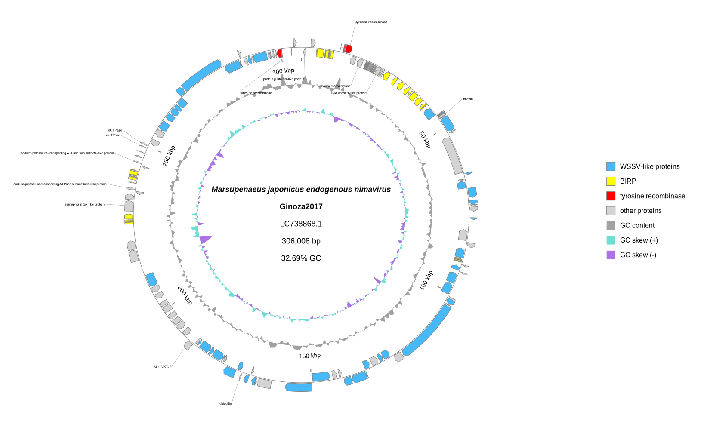
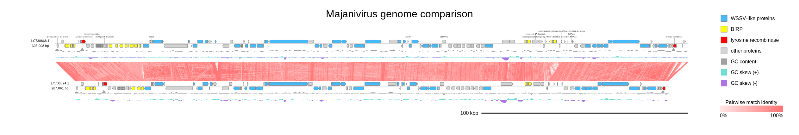

[Home](./DOCS.md) | [Tutorials](./TUTORIALS/TUTORIALS.md) | [Workflow guide](./WORKFLOW_GUIDE.md) | **Python API** | [Export](./EXPORT.md)

# Draw genome diagrams from Python

The supported Python workflow has four steps:

1. Read or create Biopython `SeqRecord` values.
2. Call `draw_circular` or `draw_linear`.
3. Inspect the returned `Diagram` in memory.
4. Call `Diagram.save()` or `Diagram.to_bytes()`.

Import the main interface directly from `gbdraw`. The `gbdraw.api` package contains
lower-level integration and session components used by the CLI and web app; a normal
drawing workflow does not need them.

## Circular quick start

`read_genbank` always returns a list because one GenBank file can contain multiple
records. Pass either one record or a record sequence to `draw_circular`.

```python
import os
from pathlib import Path

from gbdraw import (
    CircularOptions,
    CircularTrackOptions,
    FeatureOptions,
    LabelOptions,
    draw_circular,
    read_genbank,
)

input_path = Path(os.environ.get("GBDRAW_EXAMPLE_GBK", "MjeNMV.gb"))
output_dir = Path(os.environ.get("GBDRAW_API_OUTPUT_DIR", "."))
examples_dir = Path(os.environ.get("GBDRAW_EXAMPLES_DIR", input_path.parent))
test_inputs_dir = Path(os.environ.get("GBDRAW_TEST_INPUTS_DIR", input_path.parent))

record = read_genbank(input_path)[0]
options = CircularOptions(
    features=FeatureOptions(
        types=("CDS",),
        color_table=examples_dir / "custom_color_table.tsv",
        default_colors=examples_dir / "modified_default_colors.tsv",
    ),
    labels=LabelOptions(
        whitelist=examples_dir / "python-api-label-whitelist.tsv",
    ),
    tracks=CircularTrackOptions(
        slots=(
            "features:features",
            "ticks:ticks",
            "gc_content:dinucleotide_content@nt=GC",
            "gc_skew:dinucleotide_skew@nt=GC",
        ),
    ),
    species="<i>Marsupenaeus japonicus endogenous nimavirus</i>",
    strain="Ginoza2017",
    legend="right",
    config_overrides={
        "canvas.show_gc": True,
        "canvas.show_skew": True,
        "canvas.strandedness": True,
        "canvas.circular.track_type": "middle",
        "labels.circular.scope": "both",
        "objects.features.block_stroke_color": "gray",
        "objects.features.block_stroke_width.long": 1.0,
        "objects.features.line_stroke_color": "lightgray",
        "objects.features.line_stroke_width.long": 2.0,
    },
)
diagram = draw_circular(record, options=options)
output_path = diagram.save(output_dir / "api_circular.svg", overwrite=True)

assert output_path == output_dir / "api_circular.svg"
assert diagram.to_svg().startswith("<svg")
```

This LC738868.1 example keeps selected functional labels, feature-specific fills,
gray block outlines, light-gray connector lines, record metadata, GC content, GC
skew, and the complete legend visible:



## The same function handles multiple circular records

Pass a sequence to create a shared circular grid. `CircularLayout` is optional for
multiple records; omit it to use the automatic layout. You can also pass a layout
with one record to produce an explicit 1×1 grid.

```python
from gbdraw import CircularLayout

multi_records = read_genbank(
    [examples_dir / "MjeNMV.gb", examples_dir / "MelaMJNV.gb"]
)
multi_diagram = draw_circular(
    multi_records,
    options=CircularOptions(features=FeatureOptions(types=("CDS",))),
    layout=CircularLayout(
        size="auto",
        positions=("#1@1", "#2@1"),
    ),
)
assert multi_diagram.to_svg().startswith("<svg")
```

`size` accepts `auto`, `equal`, or `linear`. Grid-only values remain in
`CircularLayout`; they are not mixed into drawing and feature options.

## Linear diagrams and comparisons

`draw_linear` also accepts one record or a sequence. Put Linear-only comparison
settings in `LinearComparisonOptions`; Circular options cannot be passed accidentally.

```python
from gbdraw import (
    LinearComparisonOptions,
    LinearOptions,
    Thresholds,
    TitleOptions,
    draw_linear,
)

linear_records = read_genbank(
    [examples_dir / "MjeNMV.gb", examples_dir / "MelaMJNV.gb"]
)
linear_diagram = draw_linear(
    linear_records,
    options=LinearOptions(
        features=FeatureOptions(
            types=("CDS",),
            color_table=examples_dir / "custom_color_table.tsv",
            default_colors=examples_dir / "modified_default_colors.tsv",
        ),
        labels=LabelOptions(
            whitelist=examples_dir / "python-api-label-whitelist.tsv",
        ),
        title=TitleOptions(
            text="Majanivirus genome comparison",
            position="top",
        ),
        comparisons=LinearComparisonOptions(
            blast_files=(str(examples_dir / "MjeNMV.MelaMJNV.tblastx.out"),),
        ),
        thresholds=Thresholds(evalue=1e-5, identity=0, bitscore=0),
        legend="right",
        config_overrides={
            "canvas.show_gc": True,
            "canvas.show_skew": True,
            "canvas.strandedness": True,
            "canvas.linear.align_center": True,
            "labels.linear.scope": "first",
            "objects.features.block_stroke_color": "gray",
            "objects.features.block_stroke_width.long": 1.0,
            "objects.features.line_stroke_color": "lightgray",
            "objects.features.line_stroke_width.long": 2.0,
        },
    ),
)
assert linear_diagram.to_svg().startswith("<svg")
```

The pairwise comparison retains accession and length metadata for both records,
selected labels on the first record, feature fills and lines, GC tracks, BLAST
ribbons, and both legends:



Use `LinearLayout` only when records need explicit multi-row placement:

```python
from gbdraw import LinearLayout

linear_grid = draw_linear(
    linear_records,
    layout=LinearLayout(record_gap=28, positions=("#1@1", "#2@2")),
)
assert linear_grid.to_svg().startswith("<svg")
```

For precomputed matches, set `comparisons` to `LinearComparison` values or set
`protein_comparisons` to DataFrames. In-process protein comparison settings are also
grouped in `LinearComparisonOptions`.

## Depth tracks

Each `DepthTrackOptions` contains the data and styling for one logical track. For one
record, `source` is a path or DataFrame. For multiple records, pass one source per
record. This replaces the singular, plural, and nested depth arguments of the
lower-level rendering engine.

```python
from gbdraw import DepthTrackOptions

depth_diagram = draw_circular(
    record,
    options=CircularOptions(
        features=FeatureOptions(types=("CDS",)),
        depth_tracks=(
            DepthTrackOptions(
                source=test_inputs_dir / "MjeNMV.DRR271272.depth.tsv",
                label="Coverage",
                color="#2563eb",
            ),
        ),
    ),
)
assert depth_diagram.to_svg().startswith("<svg")
```

Set `height` on a Linear depth track. Circular diagrams reject a non-default height
because circular track width is controlled by the circular track layout.

## Sequence-similarity comparison rings

`ComparisonRingTrackOptions` binds each BLAST or LOSAT result path, or a DataFrame
with the same tabular hits, to its label and color. The resulting ring displays
sequence-similarity hits. It does not by itself establish biological conservation.
All rings in one diagram must use the same source kind.

For interactive SVG output, set `comparison_sequence_source` to a FASTA path, one
`SeqRecord`, or a sequence of records to enable the comparison-span FASTA actions
for that ring. Static geometry does not depend on this optional source.

```python
from gbdraw import ComparisonRingOptions, ComparisonRingTrackOptions

comparison_record = read_genbank(test_inputs_dir / "AP027078.gb")[0]
comparison_diagram = draw_circular(
    comparison_record,
    options=CircularOptions(
        comparison_rings=ComparisonRingOptions(
            reference="query",
            tracks=(
                ComparisonRingTrackOptions(
                    source=test_inputs_dir / "AP027078_AP027131.tblastx.out",
                    label="AP027131",
                ),
            ),
        ),
    ),
)
assert comparison_diagram.to_svg().startswith("<svg")
```

`CircularOptions.comparison_rings` is the canonical field.
`CircularOptions.conservation` remains a runtime constructor and attribute alias for
existing code. Both names address the same stored option; use the canonical name in
new code and when calling `dataclasses.replace()`. Passing non-`None` values for both
names is rejected.
The lower-level request transport retains its
`conservation_*` field names. The older `ConservationOptions` and
`ConservationTrackOptions` class names are identity aliases for
`ComparisonRingOptions` and `ComparisonRingTrackOptions`.

## Coordinate-scale visibility

Use the shared canonical override `objects.scale.show` to hide the primary
genome-coordinate scale. The same path works with both diagram modes:

```python
scale_free_circular = draw_circular(
    record,
    options=CircularOptions(
        features=FeatureOptions(types=("CDS",)),
        config_overrides={"objects.scale.show": False},
    ),
)
scale_free_linear = draw_linear(
    linear_records,
    options=LinearOptions(
        features=FeatureOptions(types=("CDS",)),
        config_overrides={"objects.scale.show": False},
    ),
)

assert scale_free_circular.to_svg().startswith("<svg")
assert scale_free_linear.to_svg().startswith("<svg")
```

The override hides Circular coordinate ticks in an implicit layout, or the
Linear bottom scale and record-axis coordinate ticks and labels. It does not
hide the Circular axis, Linear record axes, GC-content axes, Depth axes, or
Linear definition text.

`objects.scale.style` remains a separate `bar` or `ruler` choice. When
`CircularOptions.tracks` supplies `CircularTrackOptions(slots=...)`, that
explicit list is authoritative: an enabled `ticks` slot is rendered even when
`objects.scale.show` is `False`.

## Feature colors, visibility, and labels

Table inputs accept either a path or a validated DataFrame. One field represents one
source, so callers do not need separate `_table` and `_file` arguments.

```python
from gbdraw import LabelOptions

styled_diagram = draw_circular(
    record,
    options=CircularOptions(
        features=FeatureOptions(
            types=("CDS",),
            palette="default",
        ),
        labels=LabelOptions(
            whitelist=test_inputs_dir / "NC_010162.whitelist.tsv",
            qualifier_priority=test_inputs_dir / "NC_010162.qualifier_priority.tsv",
            overrides=test_inputs_dir / "label_override.tsv",
        ),
    ),
)
assert styled_diagram.to_svg().startswith("<svg")
```

Use `FeatureOptions.color_table`, `default_colors`, `visibility`, and `shapes` for
the corresponding feature controls.

`FeatureOptions.shapes` accepts `arrow`, `rectangle`, and `underlay`. Tune the
global arrow head length and shaft width through canonical configuration
overrides:

```python
narrow_arrow_diagram = draw_linear(
    linear_records,
    options=LinearOptions(
        features=FeatureOptions(
            types=("CDS", "rRNA"),
            shapes={"CDS": "arrow", "rRNA": "arrow"},
        ),
        config_overrides={
            "objects.features.arrow_geometry.head_length_ratio": 1.0,
            "objects.features.arrow_geometry.shaft_width_ratio": 0.5,
        },
    ),
)
assert narrow_arrow_diagram.to_svg().startswith("<svg")
```

Set `head_length_ratio` to `"auto"` for a head that starts from the existing
mode-specific length and grows by the thickness removed from a narrowed shaft.
Numeric values must be positive, measure head length relative to the full
rendered feature thickness, and do not depend on shaft width.
`shaft_width_ratio` must be in `(0, 1]` and applies to every feature type
rendered as `arrow`. Its default is `1.0`, which preserves the legacy full-width
outline; smaller values produce a centered, narrower shaft. An arrow with no
positive shaft length is rendered as a triangle.

### Canonical label configuration overrides

`config_overrides` accepts canonical dotted leaf paths. Label configuration has
three separate concerns:

| Path | Accepted values | Meaning |
|---|---|---|
| `labels.circular.scope` | `none`, `outer`, `both` | Whether Circular labels are hidden, outer-side only, or allowed on both outer and inner sides |
| `labels.circular.placement` | `horizontal`, `radial` | Orientation of external Circular labels |
| `labels.linear.scope` | `none`, `all`, `first`, `orthogroup_top` | Which Linear records or similarity-group members are eligible for labels (`orthogroup_top` is the compatibility token) |
| `labels.linear.placement` | `auto`, `above_feature` | Linear label geometry |
| `labels.linear.rotation` | float | Linear label rotation in degrees |
| `labels.rendering` | `auto`, `embedded_only`, `external_only` | Shared policy for embedding labels in feature bodies or routing them externally |

For example, Circular labels can use both outer and inner sides with radial
external text:

```python
circular_label_diagram = draw_circular(
    record,
    options=CircularOptions(
        features=FeatureOptions(types=("CDS",)),
        config_overrides={
            "labels.circular.scope": "both",
            "labels.circular.placement": "radial",
            "labels.rendering": "auto",
        },
    ),
)
assert circular_label_diagram.to_svg().startswith("<svg")
```

The Linear equivalents use their own scope vocabulary and also expose
placement and rotation:

```python
linear_label_diagram = draw_linear(
    linear_records,
    options=LinearOptions(
        features=FeatureOptions(types=("CDS",)),
        config_overrides={
            "labels.linear.scope": "first",
            "labels.linear.placement": "above_feature",
            "labels.linear.rotation": 45.0,
            "labels.rendering": "auto",
        },
    ),
)
assert linear_label_diagram.to_svg().startswith("<svg")
```

`scope` selects eligible records or Circular label sides, `placement` controls
text geometry, and only `labels.rendering` is the embedded/external rendering
policy. Fresh Python requests reject the retired flat `show_labels` and
`allow_inner_labels` aliases and the old `canvas.show_labels`,
`canvas.circular.show_labels`, `canvas.linear.show_labels`, and
`canvas.circular.allow_inner_labels` paths. Supported persisted-data readers
migrate those keys; they are not canonical override examples for new code.

## GFF3 and FASTA

`read_gff` accepts one paired input or equally sized path sequences.

```python
from gbdraw import read_gff

gff_records = read_gff(
    examples_dir / "gff3_lambda/lambda_two_contigs.gff3",
    examples_dir / "gff3_lambda/lambda_two_contigs.fna",
    features=("CDS", "gene"),
)
assert [item.id for item in gff_records] == ["lambda_left", "lambda_right"]
```

## In-memory and file output

`Diagram` hides the underlying SVG implementation and provides four output forms:

- `to_svg()` returns SVG text.
- `to_svg(interactive=True)` returns an interactive SVG with feature metadata.
- `to_bytes(format)` returns SVG, interactive SVG, PNG, PDF, EPS, or PS bytes.
- `save(path)` infers the format and writes exactly the requested file.

```python
svg_bytes = diagram.to_bytes("svg")
interactive_path = diagram.save(
    output_dir / "api_circular.interactive.svg",
    overwrite=True,
)

assert svg_bytes.startswith(b"<svg")
assert interactive_path.name == "api_circular.interactive.svg"
```

PNG, PDF, EPS, and PS require the optional CairoSVG dependency. Pass
`overwrite=True` to replace an existing file. Unknown filename extensions require an
explicit `format` argument.

## Errors and integrations

Catch `gbdraw.exceptions.GbdrawError` for expected gbdraw failures and
`ValidationError` for invalid records or options. Mode-specific option classes reject
Circular/Linear mix-ups before rendering.

The package-root API is the ordinary Python drawing interface. Integrations that
need explicit input sources, output policy, request planning, or session round
trips use the models under `gbdraw.api`. See
[Build typed render requests](./TYPED_API.md).

For accepted persisted versions, retired inputs, and migration limits, see
[Session and request compatibility](./SESSION_COMPATIBILITY.md).

Pin a gbdraw version in reproducible pipelines and test representative output after
upgrading. SVG geometry can change intentionally even when the Python call remains
valid.

[Home](./DOCS.md) | [Tutorials](./TUTORIALS/TUTORIALS.md) | [Workflow guide](./WORKFLOW_GUIDE.md) | **Python API** | [Typed API](./TYPED_API.md) | [Session compatibility](./SESSION_COMPATIBILITY.md)
