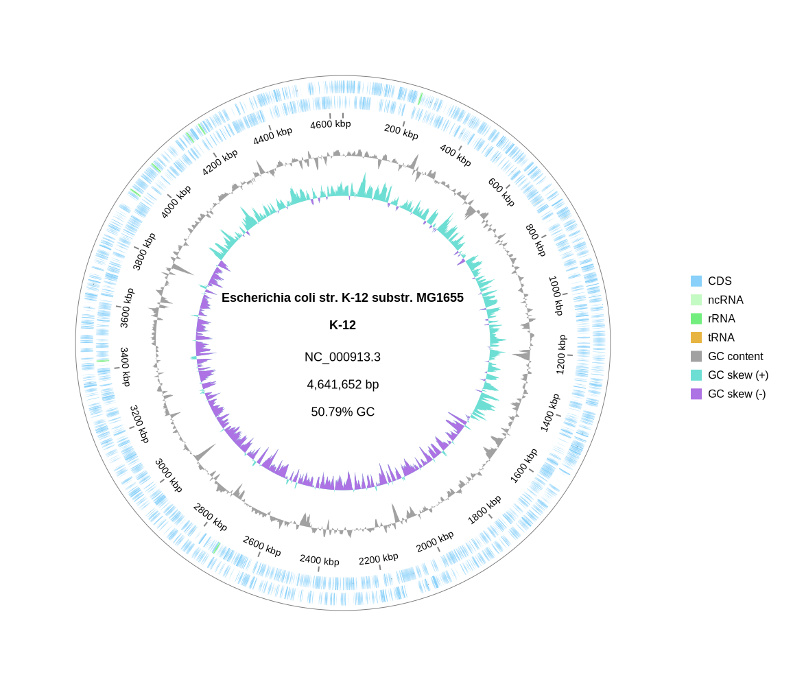

[Home](./DOCS.md) | [Installation](./INSTALL.md) | **Quickstart** | [Tutorials](./TUTORIALS/TUTORIALS.md) | [Gallery](./GALLERY.md) | [FAQ](./FAQ.md) | [ABOUT](./ABOUT.md)

[< Back to Installation](./INSTALL.md)　　　　　　[Go to Tutorials >](./TUTORIALS/TUTORIALS.md)
# Quickstart: Your First Plot in 5 Minutes

This tutorial will guide you from a fresh installation to generating your first circular genome plot.

### 1. Prerequisites

Ensure you have `gbdraw` installed locally via one of the methods described on the **[Installation](./INSTALL.md)** page. Make sure your conda environment is activated.

### 2. Get Sample Data

For this tutorial, we will use the GenBank file for [*Escherichia coli* K-12](https://www.ncbi.nlm.nih.gov/nuccore/NC_000913.3/). Download and decompress it with the following commands:

```bash
# Escherichia coli str. K-12 substr. MG1655 (NC_000913.3)
wget "https://eutils.ncbi.nlm.nih.gov/entrez/eutils/efetch.fcgi?db=nuccore&id=NC_000913.3&rettype=gbwithparts&retmode=text" -O NC_000913.gbk
```

This will give you the file `NC_000913.gbk`.


### 3. Generate the Plot
In the same directory as the downloaded file, run the following command:
```bash
gbdraw circular --gbk NC_000913.gbk -o ecoli_k12_plot -f svg --separate_strands
```

This command tells gbdraw to:

- `circular`: Create a circular diagram.

- `--gbk ...`: Use the specified GenBank file as input.

- `-o ecoli_k12_plot`: Set the prefix for the output filename.

- `-f svg`: Set the output format to SVG (a scalable vector format).
- `--separate_strands`: Place forward and reverse-oriented features on different strands.

### 4. Check Your Output

A new file named `ecoli_k12_plot.svg` will appear in your directory. Open it in a web browser or vector graphics editor (like Inkscape or Illustrator). You should see a complete genome map of *E. coli*!




### 5. Next Steps

Congratulations on creating your first plot!

To learn how to change colors, add titles, and show labels, continue to [Tutorial 1: Customizing Your Plot](./TUTORIALS/1_Customizing_Plots.md).

To see more examples of what `gbdraw` can do, check out the [Gallery](./GALLERY.md).

[< Back to Installation](./INSTALL.md)　　　　　　[Go to Tutorials >](./TUTORIALS/TUTORIALS.md)

[Home](./DOCS.md) | [Installation](./INSTALL.md) | **Quickstart** | [Tutorials](./TUTORIALS/TUTORIALS.md) | [Gallery](./GALLERY.md) | [FAQ](./FAQ.md) | [ABOUT](./ABOUT.md)