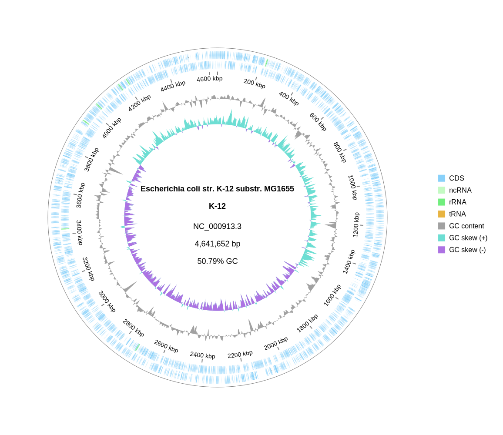

[Home](./DOCS.md) | [Installation](./INSTALL.md) | **Quickstart** | [Tutorials](./TUTORIALS/TUTORIALS.md) | [Recipes](./RECIPES.md) | [CLI Reference](./CLI_Reference.md) | [Gallery](./GALLERY.md) | [FAQ](./FAQ.md) | [About](./ABOUT.md)

[< Back to Installation](./INSTALL.md) | [Go to Tutorials >](./TUTORIALS/TUTORIALS.md)

# Quickstart

This guide walks through a first circular plot with the CLI. If you prefer a GUI, use [https://gbdraw.app/](https://gbdraw.app/) or run `gbdraw gui` locally after installation.

## 1. Confirm the Installation

Make sure `gbdraw` is available in your environment:

```bash
gbdraw -h
```

## 2. Download a Sample GenBank File

This example uses the *Escherichia coli* K-12 reference genome.

```bash
wget "https://eutils.ncbi.nlm.nih.gov/entrez/eutils/efetch.fcgi?db=nuccore&id=NC_000913.3&rettype=gbwithparts&retmode=text" -O NC_000913.gbk
```

## 3. Generate a Circular Plot

```bash
gbdraw circular \
  --gbk NC_000913.gbk \
  -o ecoli_k12_plot \
  -f svg \
  --separate_strands
```

This command:

- reads `NC_000913.gbk`
- writes `ecoli_k12_plot.svg`
- draws a circular plot
- separates forward and reverse strands into different feature tracks

## 4. Inspect the Output

Open the resulting SVG in a browser or vector editor.



## 5. Optional: Add Labels or a Centered Definition

Show labels on smaller genomes:

```bash
gbdraw circular \
  --gbk NC_000913.gbk \
  -o ecoli_k12_labeled \
  -f svg \
  --track_type middle \
  --labels
```

Add centered organism text:

```bash
gbdraw circular \
  --gbk NC_000913.gbk \
  -o ecoli_with_title \
  -f svg \
  --separate_strands \
  --species "<i>Escherichia coli</i>" \
  --strain "K-12"
```

## 6. Optional: Linear Mode Selectors

Linear mode can target specific records or regions:

- `--record_id`: select a record by ID or `#index`
- `--reverse_complement`: reverse-complement per input file
- `--region`: crop a region with `record_id:start-end[:rc]`

Example:

```bash
gbdraw linear \
  --gbk NC_000913.gbk \
  --record_id NC_000913.3 \
  --region NC_000913.3:100000-250000 \
  -o ecoli_linear_region \
  -f svg
```

If you need an index selector in the shell, quote it:

```bash
gbdraw linear \
  --gbk Genome1.gbk Genome2.gbk \
  --record_id Genome1_Chr1 '#0' \
  --reverse_complement false true \
  -o genome_pair_selected \
  -f svg
```

## Next Steps

- Continue to [Tutorial 1: Customizing Your Plot](./TUTORIALS/1_Customizing_Plots.md)
- Browse [Recipes](./RECIPES.md) for common command patterns
- Use the [CLI Reference](./CLI_Reference.md) for the full option list
- Explore more figures in the [Gallery](./GALLERY.md)

[< Back to Installation](./INSTALL.md) | [Go to Tutorials >](./TUTORIALS/TUTORIALS.md)

[Home](./DOCS.md) | [Installation](./INSTALL.md) | **Quickstart** | [Tutorials](./TUTORIALS/TUTORIALS.md) | [Recipes](./RECIPES.md) | [CLI Reference](./CLI_Reference.md) | [Gallery](./GALLERY.md) | [FAQ](./FAQ.md) | [About](./ABOUT.md)
