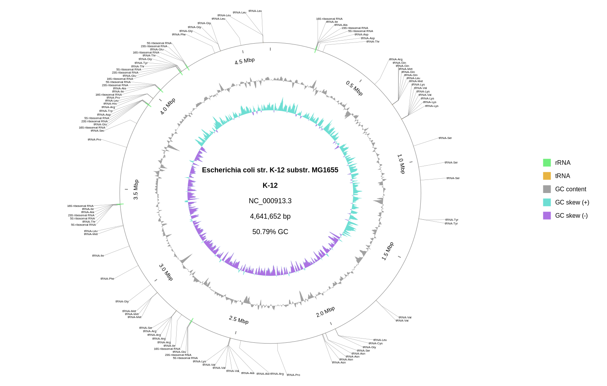

[Home](./DOCS.md) | [Installation](./INSTALL.md) | **Quickstart** | [Tutorials](./TUTORIALS/TUTORIALS.md) | [Recipes](./RECIPES.md) | [CLI Reference](./CLI_Reference.md) | [Gallery](./GALLERY.md) | [FAQ](./FAQ.md) | [About](./ABOUT.md)

[< Back to Installation](./INSTALL.md) | [Go to Tutorials >](./TUTORIALS/TUTORIALS.md)

# Quickstart

This under-10-minute quickstart draws one circular genome diagram with the CLI. If you prefer a GUI, use the [Beginner circular tutorial](https://gbdraw.app/gallery/#HmmtDNA_basic_circular) or run `gbdraw gui` locally.

## 1. Confirm the installation

Make sure `gbdraw` is available in your environment:

```bash
gbdraw -h
```

## 2. Download a sample GenBank file

This example uses the *Escherichia coli* K-12 reference genome.

```bash
wget "https://eutils.ncbi.nlm.nih.gov/entrez/eutils/efetch.fcgi?db=nuccore&id=NC_000913.3&rettype=gbwithparts&retmode=text" -O NC_000913.gbk
```

With `curl`:

```bash
curl -L "https://eutils.ncbi.nlm.nih.gov/entrez/eutils/efetch.fcgi?db=nuccore&id=NC_000913.3&rettype=gbwithparts&retmode=text" -o NC_000913.gbk
```

The same accession can be downloaded from [NCBI Nucleotide](https://www.ncbi.nlm.nih.gov/nuccore/NC_000913.3) by choosing the GenBank format.

## 3. Generate a circular genome diagram

```bash
gbdraw circular \
  --gbk NC_000913.gbk \
  -o ecoli_k12_plot \
  -f svg \
  --separate_strands
```

This command:

- reads `NC_000913.gbk`
- writes `ecoli_k12_plot.svg`
- draws a circular genome diagram
- separates forward and reverse strands into different feature tracks

## 4. Inspect the output

Open the resulting SVG in a browser or vector editor.


## 5. Optional: add feature labels or a center label

Show labels for a focused set of RNA features. Restricting this large *E. coli* genome to rRNA and tRNA features keeps the labels readable:

```bash
gbdraw circular \
  --gbk NC_000913.gbk \
  -o ecoli_k12_labeled \
  -f svg \
  --track_type middle \
  --features rRNA,tRNA \
  --labels
```



Add a species and strain to the center of the diagram:

```bash
gbdraw circular \
  --gbk NC_000913.gbk \
  -o ecoli_with_title \
  -f svg \
  --separate_strands \
  --species "<i>Escherichia coli</i>" \
  --strain "K-12"
```


## Next steps

- Create a one-record linear figure in the [Beginner linear Gallery tutorial](https://gbdraw.app/gallery/#lambda_basic_linear).
- Select linear records or regions in [Arrange linear tracks, record labels, and rulers](./TUTORIALS/7_Linear_Layout.md#7-select-records-regions-and-orientation).
- Continue with [Style a circular genome diagram](./TUTORIALS/1_Customizing_Plots.md).
- Use [Draw protein matches from annotated CDS features](./TUTORIALS/4_Protein_Comparisons.md) to run protein searches during diagram generation.
- Use [TSV manifests for CLI inputs](./TUTORIALS/5_Table_Driven_Inputs.md) when records need separate labels, selectors, crops, or orientations.
- Browse [Recipes](./RECIPES.md) for common command patterns.
- Use the [CLI Reference](./CLI_Reference.md) for the full option list.
- Explore more figures in the [Gallery](./GALLERY.md).

[< Back to Installation](./INSTALL.md) | [Go to Tutorials >](./TUTORIALS/TUTORIALS.md)

[Home](./DOCS.md) | [Installation](./INSTALL.md) | **Quickstart** | [Tutorials](./TUTORIALS/TUTORIALS.md) | [Recipes](./RECIPES.md) | [CLI Reference](./CLI_Reference.md) | [Gallery](./GALLERY.md) | [FAQ](./FAQ.md) | [About](./ABOUT.md)
