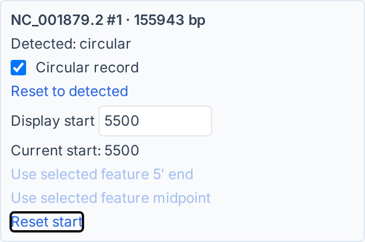
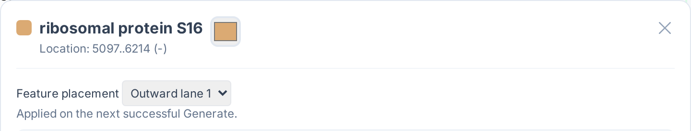

[Documentation home](../DOCS.md) | [Web app Tutorials](../TUTORIALS/GUI/README.md) | [Technical documentation](README.md) | [FAQ](../FAQ.md) | [Gallery](../GALLERY.md)

# Web app

The hosted application at [gbdraw.app](https://gbdraw.app/) and local
`gbdraw gui` command expose the same single-page interface.

## Execution, privacy, and offline use

The hosted site downloads the application and its packaged runtimes from
`gbdraw.app`. After those assets load, the browser parses genome files, runs
LOSAT searches, renders diagrams, manages sessions, and exports files. These
operations do not require an application-server upload. The hosted site uses
Google Analytics 4 for aggregate page-usage metrics, but uploaded genome files
and generated diagrams are not analytics payloads.

`gbdraw gui` serves the application and runtimes from the installed Python
package. Its normal drawing workflow works without an internet connection once
gbdraw is installed. Browser security policy still applies. Threaded LOSAT
also requires a cross-origin-isolated page. Select **Serial** under
**Execution** when that capability is unavailable. Where threaded execution is
available, **Safe** is the conservative **Total threads** choice.

A saved session embeds input resources and should be protected like those
inputs. Browser extensions, proxies, the operating system, and downloaded
files remain outside gbdraw's privacy boundary. Runtime cost depends on record
length, feature density, record and comparison counts, search mode and
thresholds, memory, and CPU. There is no universal maximum genome size.
For a reproducible comparison, begin with **Serial** and one worker, then raise
concurrency only after measuring the same inputs. Large assemblies, dense
all-pairs searches, and large depth tables are better suited to a controlled
local environment or prepared command-line evidence.

## Modes and inputs

| Mode | Primary browser input | Result |
|---|---|---|
| Circular | One GenBank/GBFF container or one matched GFF3 + FASTA pair | One Circular result, separate results, or one multi-record canvas |
| Linear | Ordered GenBank rows or matched GFF3 + FASTA rows | One Linear result with an independent comparison plan |

A Circular GenBank upload uses **GenBank/DDBJ File**. Each Linear record card
starts with its **GenBank File** uploader, or its matched GFF3 and FASTA
uploaders, followed by a closed **Record options** disclosure. **Add sequence**
is visible in the **Input Genomes** header. A GenBank file may contain several
biological records. GFF3 input requires the matching FASTA sequence and exact
sequence-ID agreement. See [Input formats and TSV
schemas](input-formats-and-tsv-schemas.md) for the file contract.

## Main workflow

1. Select **Circular** or **Linear**.
2. Add the biological inputs and resolve any validation message.
3. Set layout, tracks, comparisons, labels, and output values.
4. Select **Generate Diagram**.
5. Inspect **Result Preview**, then export a file or select **Save Session**.

Settings are committed to a result only after generation succeeds. The form
may contain newer draft values than the visible result, so a session records
the committed request together with supported editable state.

For Linear diagrams, the DOM and keyboard order is **Input Genomes**,
**Comparison**, **Basic**, **Generate Diagram**, then **Advanced comparison and
layout**. The fixed Generate bar remains visible while its DOM anchor stays in
that order.

## Circular multi-record canvas

Turn on **Multi-Record Canvas** to place every selected record from one
multi-record Circular input on a shared canvas. The browser's Circular uploader
accepts one input container; use the command line or Python API when the records
must remain in separate source files. Use Circular layout only for complete
records whose biological topology is circular.

To combine separate files for browser upload, concatenate the complete GenBank
flat files in the intended record order without editing their contents. Every
record must retain its terminating `//`. If an expected accession is absent
from **Record Order**, stop and repair the container before generating.

```bash
cat record-a.gb record-b.gb > combined.gb
```

**Record Size Mode** accepts **Auto (Default)**, **Linear**, and **Equal**.
**Equal** gives every record the same radius, **Linear** scales radius with
record length, and **Auto (Default)** applies bounded automatic scaling.
**Min Radius Ratio** accepts 0.01 through 1. **Column Gap Ratio** defaults to
0.10 and **Row Gap Ratio** defaults to 0.05; both add clearance between visible
record bounds.

**Record Order** controls row assignment and left-to-right order. Every loaded
record appears exactly once. A top or bottom plot title can use **Keep Full
Definition with Plot Title** to keep each record definition inside its own
circle.

## Record selection and layout

Each Linear input card owns its record selector, inclusive **Start** and
**End** coordinates, **Reverse complement** state, definition, and row
placement. A region changes the displayed interval, not the source file.
Reverse complementation changes displayed coordinates, feature orientation,
and comparison endpoint mapping without rewriting the input.

Turn on **Arrange in rows** to assign records to rows. Record-card order is the
left-to-right order within a row, and **Record gap (px)** separates records in
that row. Records that share a row use one bp-per-pixel scale. Row placement is
independent of the comparison plan: **No comparison** draws the records without
links.

**Show Coordinate Scale** controls coordinate ticks and labels while retaining
the record axes. **Ruler on Axis** uses each record axis as its ruler only when
the scale is visible, **Ruler (Ticks)** is selected, and **Track Layout** is
**Above** or **Below**. Titles, record definitions, and legends do not change
biological coordinates.

## Browser defaults

| Setting | Circular | Linear |
|---|---|---|
| Separate strands | On | On |
| Legend | Left | Bottom |
| Feature placement | Tuckin preset | Features on axis |
| Comparison | No rings until configured | No comparison until a command creates a plan |

Loading a session restores its saved values instead of applying these
defaults. Turning off **Use custom stack** preserves its draft slots. **Reset
Settings** rebuilds settings from the browser defaults while retaining uploaded
files and the current generated result. For Linear diagrams, Reset returns the
active comparison plan to **No comparison** while keeping uploaded comparison
files and custom raw-result names as inactive drafts.

The custom-stack editor cannot add an `annotations` slot until an annotation
table has been imported and an annotation set is available.

## Comparison surfaces

The browser runs LOSATN, TLOSATX, and LOSATP. Linear **Comparison** follows the
record list. Its **No comparison**, **Run LOSAT**, and **Upload BLAST TSV**
buttons are bulk commands for all adjacent pairs, not radio options. A separate
**Current:** status reports the effective plan. A selected or mixed plan shows
**Current: Selected pairs (N; ...)** with a **Custom** badge instead of making
one of the three commands look selected. Fresh Linear pages and **Reset
Settings** use **No comparison**. Loading a saved Web session restores its
saved comparison intent.

Select **Run LOSAT** explicitly to enable a browser search, then open the
initially closed **Settings** disclosure. The three **LOSAT Mode** buttons
select **LOSATN**, **LOSATP**, or **TLOSATX**. When **LOSATP** is active,
the **LOSATP mode** menu selects
**Similarity groups**, **Collinear blocks**, or **Pairwise matches**. Selected
or mixed pair plans allow LOSATN, TLOSATX, and LOSATP Pairwise matches.
Similarity groups and Collinear blocks require all-adjacent LOSAT; **Use all
adjacent LOSAT** changes the topology only after an explicit selection.

Open the initially closed **Selected pairs (N)** disclosure to change a pair's
source, bind an uploaded table, omit a pair, or add a non-adjacent pair. Pair
editors are not inserted between record cards. An uploaded edge participates
only when it has an active file; an omitted edge draws no link and starts no
search.

**Settings** shows only controls used by the active LOSAT program and, for
LOSATP, its presentation. LOSATN shows **LOSATN task**. TLOSATX keeps each record's
active genetic code in that record's **Record options**. LOSATP **Pairwise
matches** shows **Max hits per protein**; **Similarity groups** shows **Member
hits per protein**; **Collinear blocks** shows its primary block, scope, and
color controls. Shared result filters appear in the same disclosure. LOSATN,
TLOSATX, LOSATP Pairwise matches, and uploaded evidence also show **Comparison
appearance**, with **Match style** and **Match height**. Similarity groups and
Collinear blocks keep those appearance drafts but hide the controls. To
reproduce a Curve-based recipe from fresh state, select **LOSATP** under
**LOSAT Mode**, choose **Pairwise matches** under **LOSATP mode**, set **Match
style** to **Curve**, then choose the final LOSATP mode. Changing either mode
control does not rewrite the saved style.

Similarity groups always computes all-vs-all protein-search evidence across
the loaded records; it has no evidence-scope selector. Collinear blocks uses
**Evidence scope**. Fresh pages and **Reset Settings** default that control to
**All records**. A session that explicitly saved **Adjacent pairs** restores
that value. Evidence scope controls the search expansion, not which record
pairs receive displayed links.

**Advanced comparison and layout** is closed by default and appears after
**Generate Diagram** in the DOM. It owns **Record Layout**, LOSAT
**Execution**, thread allocation, cache controls, and advanced Collinear
search details. Its **Raw LOSAT results** section groups each pair's filename,
retained-artifact status, and **Save Raw LOSAT TSV** action. Closing any of
these disclosures does not disable comparison work or discard its values.

TLOSATX translates each sequence with its selected genetic code. In Linear
mode, each card's **Gencode (this entry)** control, with accessible name
**TLOSATX gencode for sequence N**, supplies the code for that endpoint. In
Circular mode, **Reference gencode** applies to the displayed subject. Each
comparison-FASTA row's visible **Subject gencode** control applies to that
comparison sequence, even though the search passes the sequence as its query.

The common Linear filters are **Bitscore**, **E-value**, **Minimum identity**,
and **Minimum length**. Collinear settings include **Max unit gap**, **Min
block genes**, **Diagonal drift**, **Merge conflicts**, **Evidence scope**
(**Adjacent pairs** or **All records**), and **Color mode** (**Average
identity**, **Orientation**, or **Orientation + identity**). Scientific
meanings and limits belong to the comparison reference below.

Circular **Pairwise Comparisons** selects **Run LOSAT** or **Upload BLAST**.
Uploaded evidence uses **BLAST outfmt 6/7 files** and **Reference side**
(**Auto (...)**, **Query**, or **Subject**). A browser-generated Circular
comparison uses the displayed Circular record as the search subject and each
**Comparison FASTA** as a query. **Ring Width** and **Ring Gap** control the
ordered evidence tracks. **Save Raw LOSAT TSV** exports generated search rows.

See [Comparison programs, thresholds, and result
semantics](comparison-programs-thresholds-and-results.md) for search boundaries,
filters, direction, and interpretation.

## Preview, search, and editor

**Result Preview** exposes records, feature and quantitative tracks,
comparisons, definitions, ticks, legends, and annotations as semantic SVG
objects. Feature search can target **All**, **Label**, **Feature type**,
**Record ID**, **Location**, **Strand**, or **Similarity group**. When rich
feature popups are enabled, the **Field** menu also includes **Qualifier key**,
**Qualifier value**, **Nucleotide**, and **Amino acid**. Search may use a
literal value or **Regex**, and the previous and next controls move through
rendered matches.

A normal feature click opens its identity, location, strand, qualifiers, and
available sequence actions. Match popups report mapped endpoints and evidence;
Similarity-group and Collinear popups add member or anchor context. Sequence
downloads are available only when the required source sequence and metadata
are present.

Ctrl-click selects features for bulk color, legend-caption, visibility, and
stroke edits. Use the visible **Apply** action to make an edit part of the
editor state. **Apply to all label** and **Apply to all source label** become
one anchored qualifier rule only when the selected features share one feature
type, qualifier, and value and that rule matches exactly the intended loaded
features. Otherwise the editor keeps one exact `hash` rule per biological
feature. Identical duplicate records can share the same hash, so a regenerated
diagram cannot preserve a one-instance-only rule for indistinguishable
duplicates.

**Layout edit** moves supported legends and other layout objects without
changing record geometry. **Undo** and **Redo** traverse supported form and
editor changes. **Reset Settings** is broader than undo and requires
confirmation. Regenerate after rule-backed edits when the exported figure must
match the current form state.

The export actions and session handoff rules are documented in [Output formats
and export](output-formats-and-export.md) and [Session and request
compatibility](session-and-request-compatibility.md).

## Accessibility

Primary controls have stable accessible names: **Circular**, **Linear**,
**GenBank/DDBJ File**, **GenBank File**, **Add sequence**, **Output Prefix**,
**Species**, **Track Preset**, **Separate Strands**, **Hide GC Content**,
**Hide GC Skew**, **Label Mode**, **Legend Position**, **Generate Diagram**,
**Result Preview**, and **SVG**. The visible **Show Coordinate Scale** control
has the mode-qualified accessible name **Show Coordinate Scale (Circular)** or
**Show Coordinate Scale (Linear)**. The visible annotation **Labels** toggle
uses **Show annotation labels**. Mode buttons expose pressed state, file
controls are labelled, and the preview is a named region.

The Linear comparison command group is named **Set all adjacent comparisons**.
Its buttons are named **Set no comparison**, **Run LOSAT for all adjacent
pairs**, and **Use uploaded BLAST TSV for all adjacent pairs**. The buttons do
not expose pressed state because they are commands. The separate current-plan
status, native disclosure summaries, record uploaders, and pair actions remain
keyboard reachable.

## Rotate a record and place a feature

After loading a saved session, click **Load record rotation controls** if its
record rows are not yet shown. For a complete record, use its **Records** row in Circular mode or
**Record options** in Linear mode. **Detected** reports the source topology;
**Circular record** overrides it and **Reset to detected** removes that override.
Enter a 1-based source coordinate in **Display start**. It becomes the base at
12 o'clock in Circular or at the left edge of a wrapped Linear record after
**Generate Diagram**. **Reset start** restores no additional shift, which differs
from explicit 1 when reverse complemented.

For a shortcut, select exactly one source-bound feature in the current Result
and choose **Use selected feature 5′ end** or **Use selected feature midpoint**.
The midpoint counts covered bases in biological order, excluding introns, and
uses the earlier central base for an even length. Mixed/unknown strand, multiple
selection, another record, or a replaced source disables the shortcut. Crop,
non-circular topology or unknown length disables the start control with a reason.
Turning **Circular record** off retains the inactive start draft; turning it back
on restores that value.

Open the feature popup and choose **Feature placement**: Auto, Main, or an
available directional lane 1. Bulk selection uses **Selected feature placements**.
The [resolved-layout and resolver tables](palettes-feature-rules-labels-shapes-and-tracks.md#manual-feature-placement)
explain availability and conflicts. **Feature overlap tolerance (bp)** defaults
to 0. Generate applies these drafts together; Undo/Redo and Save/Load retain the
draft separately from the last successful Result. On a freshly loaded session,
Generate rebuilds the final slot geometry before Main/side choices become
available. Auto removal can use the saved source binding without decoding inputs.

**Run Info** describes the successful Result. **Source recipe** reconstructs it
from embedded original inputs and public CLI settings; **Exact replay** uses its
saved canonical session and analysis artifacts. Both downloads refer to the
successful Result, even when controls hold a newer draft. An unavailable Source
recipe includes a reason; it does not silently omit unsupported settings.
Rotation may split one logical comparison match into several SVG paths. Popups
and sequence downloads still refer to one source match. Gapped matches are split
by endpoint interpolation, not by reconstructing their aligned bases.

The following crops use the [annotated chloroplast Tutorial](../TUTORIALS/GUI/build-an-annotated-chloroplast-map.md)
with **Separate Strands** off, **Resolve Overlaps** on, display start `5500`
and tolerance `1`. In the Feature Editor search for `ribosomal protein S16`,
choose **Edit**, and set **Outward lane 1**. The multipart rps16 CDS keeps its
source identity `protein_id=NP_054479.1`; both exons move together.





Close the popup and click **Generate Diagram**, then **Save Session**. Load that
session to restore the controls and Result. The equivalent complete
[CLI](command-line.md#rotate-a-plastome-and-place-a-multipart-feature) and
[Python](python-api.md#combined-rotation-and-placement-example) recipes produce the
rotated map with its labels, legend, region annotations and GC track.
