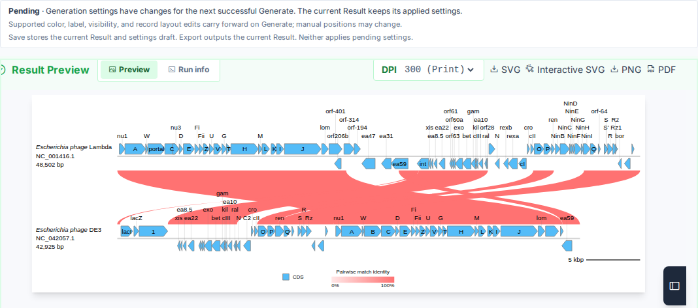
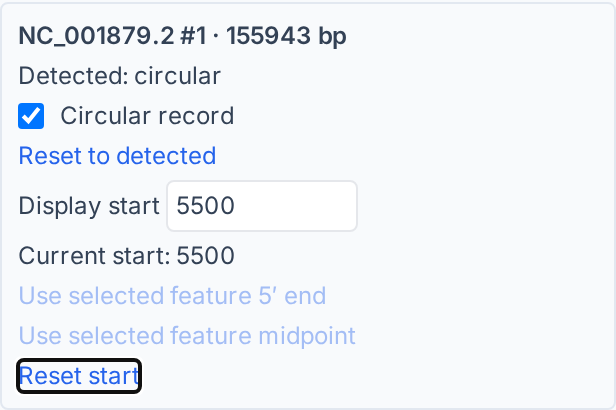
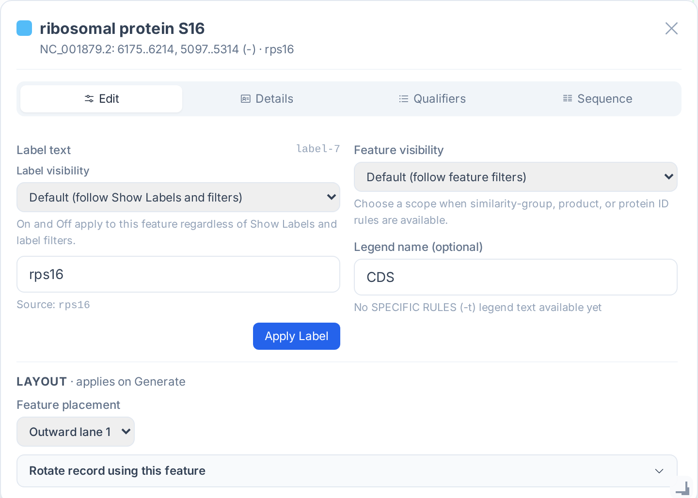

[Documentation home](../DOCS.md) | [Tutorials](../TUTORIALS/README.md) | [Technical documentation](README.md) | [FAQ](../FAQ.md) | [Gallery](../GALLERY.md)

# Web app

The hosted application at [gbdraw.app](https://gbdraw.app/) and local
`gbdraw gui` command expose the same single-page interface.

## Execution, privacy, and offline use

The hosted site downloads the application and its packaged runtimes from
`gbdraw.app`. After those assets load, the browser parses genome files, runs
LOSAT searches, renders diagrams, manages sessions, and exports files. These
operations do not require an application-server upload. The hosted site uses
Google Analytics 4 for aggregate page-usage metrics, but uploaded genome files
and generated diagrams are not analytics payloads.

`gbdraw gui` serves the application and runtimes from the installed Python
package. Its normal drawing workflow works without an internet connection once
gbdraw is installed. Browser security policy still applies. Threaded LOSAT
also requires a cross-origin-isolated page. Select **Serial** under
**Execution** when that capability is unavailable; the **Threaded** choice then
reads **Threaded (unavailable here)**, and Generate with uncached LOSAT jobs
reports `LOSAT_THREADING_UNAVAILABLE` at the `losat` stage. Where threaded execution is
available, **Safe** is the conservative **Total threads** choice.

A saved session embeds input resources and should be protected like those
inputs. Browser extensions, proxies, the operating system, and downloaded
files remain outside gbdraw's privacy boundary. Runtime cost depends on record
length, feature density, record and comparison counts, search mode and
thresholds, memory, and CPU. There is no universal maximum genome size.
For a reproducible comparison, begin with **Serial** and one worker, then raise
concurrency only after measuring the same inputs. Large assemblies, dense
all-pairs searches, and large depth tables are better suited to a controlled
local environment or to prepared command-line runs.

## Modes and inputs

| Mode | Primary browser input | Result |
|---|---|---|
| Circular | One GenBank/GBFF container or one matched GFF3 + FASTA pair | One Circular result, separate results, or one multi-record canvas |
| Linear | Ordered GenBank rows or matched GFF3 + FASTA rows | One Linear result with an independent comparison plan |

Circular and Linear each keep their own settings and edits: the form and
advanced settings, palette and color rules, filters, Legend edits, feature and
label edits, Feature placements, annotation sets, Depth series, custom track
stacks, and the layout positions. A change made in one mode stays in that mode,
including a Generate; switching modes changes no setting and shows that mode's
settings and Result. **Reset Settings** resets both modes, and one **Undo**
restores both. The input files, LOSAT run settings (run mode and threads), and
the rich feature popup are shared. A saved Session keeps each mode's settings
(Session 46, [compatibility](session-and-request-compatibility.md)).

A Circular GenBank upload uses **GenBank/DDBJ File**. Each Linear **File** card
starts with its **GenBank / DDBJ File** uploader, or its matched GFF3 and FASTA
uploaders, followed by **File defaults (applied to all records)** and a closed
**Record options** disclosure. Use the up and down buttons in a File header to
move that source. Every record in a multi-record GenBank or GFF3 + FASTA source
moves together, while the record order inside the source stays unchanged. When
each File uses its own consecutive rows, the File moves as one block of rows and
the row positions follow the new File order. If Files share a row or another
File's row separates a File's rows, File movement is unavailable; use **Record
Layout** to edit or normalize that custom placement first.
Uploading a GenBank file gives each of its records a **Definition** inferred
from that record's own `/organism` and `/strain` qualifiers, so a File of
several organisms shows each organism's name. The file default **Organism /
strain** and **Subtitle / title** stay yours to fill: a subtitle names one
replicon rather than the whole file. The prominent
**Add sequence** action appears below the Linear File list. A GenBank file may
contain several biological records. GFF3 input requires the matching FASTA
sequence and exact sequence-ID agreement. See [Input formats and TSV
schemas](input-formats-and-tsv-schemas.md) for the file format.

The **Add sequence** action and the **Remove** action shown for multiple Files
add or remove whole File cards. Clearing a populated Linear primary uploader
opens a choice: **Clear file only** keeps a pristine blank File in the same
position, while **Delete card**
removes that File and all records it supplied. Either operation removes its
record selectors, crop and reverse-complement drafts, labels, Depth file assignments,
comparison endpoints, and source-derived state as one undoable change. The only
File cannot be deleted. Removing an empty final File is immediate; removing a
populated final File asks for confirmation. Cancel and Escape change nothing.

Replacing a File with one that holds several records expands it into one row
per record. The new rows keep only File-level values (the File, its Depth TSV,
and the file defaults); the crop, reverse complement, **Definition**, and
**Subtitle** of the replaced File's row do not carry over. Replacing a single-record
File with another single-record File keeps them.

Each Linear File card starts with its **Depth TSV** disclosure closed. Its
summary line reports how many Depth tracks the File has attached, for example
"No depth track attached". Click the summary, or focus it and press Enter or
Space, to open the disclosure; the open state is not saved. Inside, each logical
series reports whether its file is attached to all, some, or none of the File's
records. Use **Add Depth TSV series** there to add one logical series
for every record while preserving existing assignments. A new series has no file,
so it adds no track row; see [Custom Track Slots](#custom-track-slots).

## Main workflow

1. Select **Circular** or **Linear**.
2. Add the biological inputs and resolve any validation message.
3. Set layout, tracks, comparisons, labels, and output values.
4. Select **Generate Diagram**.
5. Inspect **Result Preview**, then export a file or select **Save Session**.

The operation labels below state when each kind of edit reaches the Result.
Settings marked **Applies on Generate** stay in the settings draft until the
next successful **Generate Diagram**; until then the Result keeps its applied
settings. The app does not show a separate always-on application status.

| Operation label | When the Result changes |
|---|---|
| **Applies on Generate** | A successful **Generate Diagram** applies crop, row layout, Definition Lock, scale label sizes, track slots, **Species**, **Strain**, plot title and record-label settings, the legend position, swatch size, and font size, the Linear comparison **Result filters** (**Bitscore**, **E-value**, **Minimum identity**, **Minimum length**), and the global block, line, axis, and scale stroke colors and widths. |
| **Live edit** | Feature color, label text, and visibility, including **Feature Visibility** rules, update the current Result directly; geometry changes may rerender automatically. A label rerender uses the settings of the last Generate plus the current feature, label, color, and legend edits. Legend text, order, stroke, and removal, and stroke edits on selected features, are live. Palette selection is live when **Instant Preview** is on. |
| **Apply required** | Alignment choices stay in the review draft until **Apply** succeeds. |

A live edit can succeed while other settings stay in the draft. **Live edit
applying** and **Live edit failed** appear above the Result while a live
rerender runs or after it fails. A rerender failure keeps any direct edit already applied and keeps the previous
diagram geometry. **Live edit failed** names the cause. It suggests retrying the live edit only
when the same request can succeed, such as after a background-process failure.
Otherwise, change the edit, or change the settings and select **Generate
Diagram**. An unapplied alignment
review is a local selection, not an applied Result or a generation-setting change.

**Generate Diagram** recalculates placement and resets zoom. Supported color,
label, visibility, legend text and order, canvas padding, and record-layout
edits are carried forward. Generate places legend entries in the edited order
on its new layout; an entry that appears later follows them. Generate may not
draw a legend row, such as GC content while it is off or a Depth row while
**Show Depth** is off. If you rename such a row, the new name waits with the
colors and applies when a later Generate draws the row. Removing the row's data
also discards the waiting name and colors. Canvas padding
applies once to every Result, including each Result of a batch. For the same
diagram, a manually moved legend, plot title, or Linear scale keeps its offset
from the newly calculated position. The absolute position can change when
settings change. Other manual positions have no new regeneration guarantee.
**Undo** restores the previous Result. Failed, canceled, or superseded
generation keeps the last successful Result. While a diagram is generating,
**Undo** and **Redo** and their keyboard shortcuts are unavailable, and the
header names the reason; settings edits stay available and are recorded.

**Save Session** saves the current Result and supported settings draft together.
**Load Session** displays that saved Result without applying a newer draft.
**SVG**, **PNG**, and **PDF** export the current Result. Save and Export do not
Generate or apply draft settings. A review's guide, candidate numbers, and
unapplied choices are not included in saved or exported files.

For Linear diagrams, the sections appear on screen and in keyboard order as
**Input Genomes**, **Comparison**, **Basic**, then **Advanced comparison and
layout**. In both
modes, **Generate Diagram** is the last keyboard stop of the settings panel,
after every section, and its bar stays fixed at the bottom of the panel.

### Save and Load Sessions

**Save Session** asks for a **Session title** when none is set and downloads
`<title>.gbdraw-session.json.gz`. Saving again under the same file name first
asks whether to download that file again. When the compressed Session is larger
than 50 MiB, Save reports its size and asks whether to continue. **Cancel** in
either dialog saves nothing. **Load Session** accepts `.gbdraw-session.json` and
`.gbdraw-session.json.gz` files. On gbdraw.app, **Load example** in the header
and **Load an example** in the empty Preview list the Gallery examples and load
the chosen one's Session, asking first when the current work has unsaved
changes. The local `gbdraw gui` ships no Gallery and shows neither button.

While **Saving session…** or **Loading session…** is shown, the operation works
on one consistent document. **Generate Diagram**, file inputs, mode, settings,
editor changes, **Undo**, **Redo**, **Reset Settings**, and the other Session
button stay unavailable until it finishes. You can still scroll the settings,
pan and zoom the Preview, and type in feature search. A second **Save Session**
click during a save does not download a second file. While a diagram is
generating or updating, **Save Session** and **Load Session** are unavailable,
and the header names the reason, such as **Generating diagram. Retry after
generation finishes.**

A plain Session file larger than 200 MiB, or a gzip Session that expands beyond
512 MiB, is rejected. Save needs browser gzip compression. Load needs Web
Workers and, for `.gz` files, gzip decompression. A rejected or failed Save or
Load shows an **Operation error** and keeps the current Result, settings, and
Undo history.

Before the first **Generate Diagram**, Save needs every input of the active
mode, the same check that Generate uses; an empty card or a missing FASTA is
reported by its **Sequence** number. A Result loaded from a Session saved before
Session 40 has no current feature metadata: a notice above the Result says so,
and **Save Session** reports that one Generate is needed and offers **Generate**.
After that Generate, Save writes the current Session format.

A loaded Circular Session shows its saved Result without reading the embedded
source again. **Source records** shows **Records not inspected**, and **Record**
lists no records. Select **Inspect source records** to list them and show their
rotation rows; the Result and Undo history do not change. **Generate Diagram**
inspects the source before rendering, and uploading a new file inspects it at
once. Loading a saved preview does not start LOSATP. The diagram engine starts
during Load only to validate saved settings that have no web control, such as
the configuration that a command-line Session stores.

### Operation errors and diagnostics

A failed operation shows a short cause and correction or recovery action under
its own heading, such as **Generation Error**, **Alignment error**, or an export
error. The summary stays visible. **Details** is optional and initially closed;
it can be opened with the keyboard. **Copy diagnostics** copies only the safe
information displayed there, after an explicit action. If Clipboard access is
unavailable or rejected, **Select diagnostics** selects the text for manual
copying; the cause and recovery controls stay available.

Diagnostics contain a short failure code, the operation, the stage where the
failure is known to have happened, and allowed context such as the field, table
row, or Python character position. They also report any failure while cleaning
up. The summary names the location it knows: **Sequence N**,
**Line N**, **Track row N**, **Depth series N**, the setting path, or the
available radial band in px for a Circular track that does not fit. The panel
offers only actions that work there: **Generate** when a fresh Result is the
correction, and no **Save Session** when Save itself failed. For an unknown failure, the panel shows a failure code and the stage where it
happened, and it does not guess a cause. A failure in the diagram engine's drawing stage
that no validation classifies names the Python exception class (for example
`ValueError`) and offers **Save Session** instead of **Retry Generate**, because
the same inputs fail the same way. Original patterns, sequences, file or record
names, paths, SVG, raw exception text, traceback, stdout and stderr are excluded
from diagnostics and automatic console output. A saved Session can contain
private inputs, so share one only deliberately.

After a failed Generate, the message tells you which case applies: no successful
Result yet, the previous Result unchanged, the rollback completed, or the
rollback failed. After a failed rollback, the message does not claim that the
previous state was restored. Canceling an operation, replacing it with a newer one, or receiving a late
answer from an old one shows no new failure and does not apply the old result. Align failures keep the review choices and the last successful Result, so you can correct the choices and select **Apply** again.

### Numeric settings

Generate sends every numeric setting as you typed it. An empty field means Auto
or the documented default. A number is passed unchanged, so the diagram engine
either accepts it or reports the field and the accepted range, as the command
line does. Text that is not a number is rejected with the field name. Generate never
rewrites a setting; after a failure the field still shows the rejected value.
Comparison thresholds (**E-value**, **Bitscore**, **Identity**, **Alignment
length**) are checked before LOSAT runs against the same accepted ranges.

### Circular track Width and Radius

In **Layout → Custom Track Slots**, **Width** and **Radius** each have a
numeric text field and a **px** / **×R** selector. R is the base circle radius;
`0.65 ×R` means 65% of that radius. Existing `65%` values display as `0.65`
with **×R** selected. Complete `20px` or `65%` input is also accepted and
separated into its numeric value and unit. Reading a saved value does not
rewrite it. Decimal and exponent input keep their precision and are not rounded for display.

A plain number uses the selected unit: `1.5` with **px** means 1.5 pixels,
while `1.5` with **×R** means 1.5 times R. Changing the selector keeps the
number and changes its meaning; it does not convert the physical size.
Manual numeric and unit edits support **Undo** and **Redo**. Effective changes
reach the diagram on the next successful **Generate Diagram**. Export
continues to use the current Result.

Clear the numeric field for **Auto**. Its resolved geometry appears separately
with units. While the field is empty, the selector chooses the next input's
unit only; it does not change Auto geometry, create a History step, or enter
the Session. That preference starts at **×R** and resets when the panel is
remounted or settings are loaded or reset. History restores a manual value
and its unit, or Auto's empty value; it does not promise to restore Auto's
next-input preference.

Incomplete or invalid input stays visible with its selected unit and a field
error. Zero, negative values, nonfinite values and unsupported units are
invalid, not Auto. A failed Generate keeps the previous committed request
and Result; correct the field and Generate again. A valid Session saves the
editing draft separately from the committed Result, including disabled and
inactive track values. Loading it shows the saved preview; Generate applies
the restored draft. Invalid drafts cannot be saved as valid Sessions.

### Custom Track Slots

**Use custom stack** draws the saved stack. Turning it on for the first time
uses the saved default stack as it is, including its **Ticks** row. **Reset**
and, in Circular, the **Tuckin**, **Middle**, or **Spreadout** button under
**Reset to preset** rebuild the stack from **Show Coordinate Scale**,
**Hide GC Content**, **Hide GC Skew**, and the loaded Depth series.

Depth rows follow Depth files the same way in Circular and Linear. When a
logical Depth series gets its first file, the stack gains one Depth row for it,
unless a row, enabled or disabled, already references that series. When the
series loses its last file, the rows that still have their default settings are
removed. This happens whether or not the custom stack is in use. Other settings
never add, re-enable, or move a Depth row, so a row you removed, disabled, or
moved stays as you left it. **Add Depth TSV series** and a series **Remove**
add no row.

An enabled Depth row whose series has no file, for example after a Linear
File's Depth TSV is cleared, shows "Depth track '<id>' has no logical Depth
source." **Generate Diagram** then stops on that row. Add a file, or disable or
remove the row. A Session whose inactive custom stack has no Depth row does not
gain one when you turn the stack on; use **Reset**.

**Hide GC Content** and **Hide GC Skew** disable the matching enabled rows
that use the **Dinucleotide** setting, whether or not the custom stack is in
use, and turning the option off enables those rows again. A row with another
dinucleotide, such as an AT skew row, is not affected. Rows you disabled yourself stay disabled. A row's resolved
**(auto)** geometry comes from the last generated diagram and appears only for
rows it drew; any other row, and every row before the first Generate, shows an
estimate written as "≈ … (estimate)". A ticks row's **Radius** note is the tick
anchor, the radius that a typed **Radius** pins, not the centre of its band.

### Follow a Result and its settings draft

For a small Linear comparison, download the complete GenBank records
[Lambda (NC_001416.1)](https://eutils.ncbi.nlm.nih.gov/entrez/eutils/efetch.fcgi?db=nuccore&id=NC_001416.1&rettype=gbwithparts&retmode=text)
and [DE3 (NC_042057.1)](https://eutils.ncbi.nlm.nih.gov/entrez/eutils/efetch.fcgi?db=nuccore&id=NC_042057.1&rettype=gbwithparts&retmode=text).
Save them as `NC_001416.1.gb` and `NC_042057.1.gb`. Check the VERSION lines and
complete lengths, 48,502 and 42,925 bp, before uploading them to two Linear File
cards. A sequence version does not freeze its annotation table; the capture's
exact source retrieval and hashes are recorded in the
[reproduction receipt](../capture/linear-live-edit-source-verification.json).

1. Open **Advanced comparison and layout**, enable **Arrange in rows**, and put
   both records in row 1. The Auto explanation describes hiding Accession and
   Length throughout the next generated diagram. Follow **Record Labels:
   Accession** to its unchanged Auto selection. Choose Show for both fields,
   then put DE3 in row 2 to return to a stacked comparison.
2. In **Linear Layout**, turn **Lock Definition Column** OFF and back ON.
   Choose **Run LOSAT**, keep LOSATN, and enable all labels under **Labels**.
   To reproduce the figure, set **Label Font Size** and Record Labels' **Default
   font size** to `24`, and upload `cds_gene_qualifier_priority.tsv` as the
   **Priority File (TSV)**. Generate.
3. Open **Editor**, turn **Auto Reflow** off for this direct-label example,
   find the Lambda portal protein, and use **Edit** and **Apply Label** to change
   its label to `portal`. Close the popup and Editor.
   This live edit is already part of the current Result.
4. Under **Axis & Scale**, set **Scale Font Size** to `19`. The settings draft
   now differs; the current Result still contains its earlier scale and the
   live label.
5. Save as `lambda_de3_pending`, then Load that downloaded Session. The draft
   scale font size returns with the saved Result. Export SVG to obtain the
   saved Result with the live label, without applying the new scale font size.
6. Generate to apply the draft. Undo restores the saved Result with its draft;
   Redo restores the regenerated Result.

Create `cds_gene_qualifier_priority.tsv` with this one tab-separated line:

```tsv
CDS	gene
```



The figure uses a gene-label priority rule and uses larger label fonts for
readability. Use preview zoom and pan to inspect individual features. The
[documentation capture instructions](../capture/README.md#linear-result-and-draft-checkpoints)
regenerate the image and verify all checkpoints through the UI.

## Circular source records and one-record settings

The browser inspects a Circular source as soon as you choose a **GenBank/DDBJ
File**, or both the **GFF3 File** and **FASTA File**; no separate load action is
needed. **Source records** shows **Inspecting source records…** and then the
count, such as **1 source record(s) inspected**. Each record's rotation row
appears at the same time, before **Generate Diagram**. A GFF3 file alone shows
**Upload both GFF3 and FASTA files to inspect records.** Replacing the file
inspects the new source. For GFF3 + FASTA, the records are the sequences that have GFF3 rows, in FASTA
order, as on the command line. A FASTA sequence with no GFF3 row is not offered.
To draw it, add a `region` row to the GFF3.

If a source cannot be inspected, **Source records** reports the failure and
offers **Retry source inspection**. Replace or remove the file to continue. The
current Result stays in the Preview until the next successful Generate.

**Record** chooses the records drawn by the next Circular Generate:

| Source | **Record** choice | Next Generate |
|---|---|---|
| One record | **Automatic (only record)** | One diagram of that record |
| Several records | **All records (separate diagrams)** | One diagram per record |
| Several records | One listed record | One diagram of that record |

**Multi-Record Canvas** is on in new pages and after **Reset Settings**. It
draws every record on one grid, so **Record** is unavailable and reads **Multi-Record
Canvas uses a grid. Turn it off to select one record.** Select **Show
Multi-Record Canvas setting** to move to that checkbox.

**Single-record crop, orientation and titles** contains **Record label**,
**Subtitle**, **Region (optional)** with 1-based inclusive **Start** and **End**,
and **Reverse complement**. These controls are editable only when the next
diagram draws one record: **Multi-Record Canvas** is off, and the source has one
record or **Record** names one. With several records and **All records**, the
app shows **Select one record to edit crop, orientation, and title lines.** The
section opens when an upload, a **Record** choice, or turning off
**Multi-Record Canvas** makes it editable, and focus stays on the control you
used. After you close it, later edits leave it closed. The app does not choose a
record or change **Multi-Record Canvas** for you. Empty **Record label** and
**Subtitle** keep the inferred title lines. A region needs both coordinates
within the record. These settings apply on **Generate Diagram**.

**Region Annotations** offers the records the next Circular Generate draws. One
selected record offers that record alone; **All records**, or **Multi-Record
Canvas** on, offers every record, and each annotation then needs an explicit
target record, which binds it to that record.

## Circular multi-record canvas

Turn on **Multi-Record Canvas** to place every selected record from one
multi-record Circular input on a shared canvas. The browser's Circular uploader
accepts one input container; use the command line or Python API when the records
must remain in separate source files. Use Circular layout only for complete
records whose biological topology is circular.

To combine separate files for browser upload, concatenate the complete GenBank
flat files in the intended record order without editing their contents. Every record must keep its terminating `//`. If an expected accession is absent
from **Record Order**, stop and repair the container before generating.

```bash
cat record-a.gb record-b.gb > combined.gb
```

**Record Size Mode** accepts **Auto (Default)**, **Linear**, and **Equal**.
**Equal** gives every record the same radius, **Linear** scales radius with
record length, and **Auto (Default)** applies bounded automatic scaling.
**Min Radius Ratio** accepts 0.01 through 1. **Column Gap Ratio** defaults to
0.10 and **Row Gap Ratio** defaults to 0.05; both add clearance between visible
record bounds.

**Record Order** controls row assignment and left-to-right order. Every loaded
record appears exactly once. A top or bottom plot title can use **Keep Full
Definition with Plot Title** to keep each record definition inside its own
circle.

The canvas decides record placement only. Track slots and the shared legend
follow the same rules as a single-record Circular diagram, so a one-record
canvas matches the single-record figure. Without depth input, no depth slot is
reserved.

## Record selection and layout

Each Linear input card holds its record selector, inclusive **Start** and
**End** coordinates, **Reverse complement** state, definition, and row
placement. A record's definition is, in order, the value typed on the record, the file
default you typed on the File card, and the definition inferred from that
record's `/organism` and `/strain`. A record without its own subtitle inherits
the file default subtitle. A record that inherits a file default you typed is marked
**Using file default**; typing a value overrides it, and **Reset to default**
restores inheritance. Choosing another record in a row infers the definition of
that record again for a GenBank File. A region changes the displayed interval, not the source file.
Reverse complementation changes displayed coordinates and feature orientation
without rewriting the input. Comparison tables keep the search frame of the
cropped record, and gbdraw maps their rows onto the displayed orientation; see
[Comparison and numeric tables](input-formats-and-tsv-schemas.md#comparison-and-numeric-tables).

Turn on **Arrange in rows** to assign records to rows. Record-card order is the
left-to-right order within a row, and **Record gap (px)** separates records in
that row. Records that share a row use one bp-per-pixel scale. Row placement is
independent of the comparison plan: **No comparison** draws the records without
links. A normal layout gives each File its own consecutive rows: one row for all
of its records, or one row per record as a CLI Session loads them. Moving a File
in that layout exchanges its block of rows with the adjacent File's block, so the
row positions follow the new File-card order and each record keeps its row
within its File. A custom layout—Files sharing a row, or a File's rows separated
by another File's row—keeps Record Layout in control and disables File movement
rather than discarding the custom placement. This rule also applies while
**Arrange in rows** is off, because its row assignments are kept in case you turn the setting on again. In a
normal layout, moving a File while row arrangement is off also moves those saved
row assignments to follow the new File order. An organism or subtitle shared by every record of a row is drawn once beside
that row. A value that varies within the row, such as a per-record replicon
name, is drawn above its own record. A row whose records disagree on the
organism gets no row-level text.

New Web diagrams and **Reset Settings** start with **Lock Definition Column**
on. Definitions then share a left edge, with the configured definition gap
before the nearest sequence. Turn it off explicitly to use a common column
center that follows each row's horizontal offset. Shorter text can leave more
space; record-local text stays above its own sequence. Apply either selection
with **Generate Diagram**.

Loading a session preserves its saved ON or OFF selection and its saved Result.
Supported older sessions that omitted the setting keep their former OFF meaning.
The CLI and Python API still default to OFF when the option is omitted.

**Show Replicon** controls one automatic name per record, taking the first available
source qualifier in the order chromosome, plasmid, organelle. It is off by default.
Automatic names use the **Replicon** line style; explicit subtitles use **Subtitle**
and stay visible independently, even when their text matches the automatic name.
Apply these settings with **Generate**. Saved subtitles and previews keep their values on load; see [Session compatibility](session-and-request-compatibility.md#linear-file-level-defaults).

Under **Titles & Record Labels**, **Accession** and **Length / Coordinates**
each start at **Auto** on fresh pages and **Reset Settings**, with independent
**Show** and **Hide** alternatives. Auto is shown
as **Auto · Shown** while every rendered row contains one record. If any rendered
row contains two or more records, that Auto field becomes **Auto · Hidden** for
the entire diagram. Turning **Arrange in rows** off ignores dormant shared-row
assignments. Changing the layout recalculates Auto but never rewrites an explicit
Show or Hide selection. **Replicon** stays a separate checkbox.

The Auto explanation in **Linear Layout** and **Record Labels** names the affected
fields. It describes the current Result when that Result already shows or hides
them as Auto now would, and otherwise the next successful Generate. Select **Record Labels: Accession** or **Record Labels: Length /
Coordinates** beside that explanation to open the label controls and focus the
matching selection. This navigation changes no value and creates no Undo entry.
Choose **Show** yourself if shared rows should keep that field, then Generate.

Plot-title text, position, and size share the **Plot Title** subsection.
Like every setting, the plot-title text, plot-title **Font size**, and
**Record Labels** **Default font size** are kept per mode. Record label defaults and the per-line **Style** disclosures share
**Record Labels**.
The separate **Legend · position** section sets legend position, swatch size,
and font size. Opening or closing these native disclosures is not saved.

**Show Coordinate Scale** controls coordinate ticks and labels while retaining
the record axes. **Ruler on Axis** uses each record axis as its ruler only when
the scale is visible, **Ruler (Ticks)** is selected, and **Track Layout** is
**Above** or **Below**. Titles, record definitions, and legends do not change
biological coordinates.

## Browser defaults

| Setting | Circular | Linear |
|---|---|---|
| Separate strands | On | On |
| Legend | Left | Bottom |
| Feature placement | Tuckin preset | Features on axis |
| Comparison | No rings until configured | No comparison until a command creates a plan |
| Pairwise match style | Ribbon | Curve |
| Accession / Length visibility | Not applicable | Auto · Shown |
| Lock Definition Column | Not applicable | On |

Loading a session restores its saved values instead of applying these
defaults. Turning off **Use custom stack** preserves its draft slots. **Reset
Settings** rebuilds settings from the browser defaults while retaining uploaded
files and the current generated result. For Linear diagrams, Reset returns the
active comparison plan to **No comparison** while keeping uploaded comparison
files and custom raw-result names as inactive drafts.

The custom-stack editor cannot add an `annotations` slot until an annotation
table has been imported and an annotation set is available.

## Comparison surfaces

The browser runs LOSATN, TLOSATX, and LOSATP. Linear **Comparison** follows the
record list. Its **No comparison**, **Run LOSAT**, and **Upload BLAST TSV**
buttons are bulk commands for all adjacent pairs. The button that matches the
effective plan is pressed (`aria-pressed`). A selected or mixed plan presses none
of them and shows a **Custom** badge. Fresh Linear pages and **Reset
Settings** use **No comparison**. Loading a saved Web session restores its
saved comparison intent.

Select **Run LOSAT** explicitly to enable a browser search, then open the
initially closed **Settings** disclosure. The three **LOSAT Mode** buttons
select **LOSATN**, **LOSATP**, or **TLOSATX**. When **LOSATP** is active,
the **LOSATP mode** menu selects
**Similarity groups**, **Collinear blocks**, or **Pairwise matches**. Selected
or mixed pair plans allow LOSATN, TLOSATX, and LOSATP Pairwise matches.
Similarity groups and Collinear blocks require all-adjacent LOSAT; **Use all
adjacent LOSAT** changes the topology only after an explicit selection.

Open the initially closed **Selected pairs (N)** disclosure to change a pair's
source, bind an uploaded table, omit a pair, or add a non-adjacent pair. Pair
editors are not inserted between record cards. An uploaded edge participates
only when it has an active file; an omitted edge draws no link and starts no
search. When **Generate Diagram** finds pairs set to **Upload BLAST TSV**
without a file, the **BLAST TSV missing** dialog lists them: **Choose BLAST TSV
for #i → #j…** opens the first pair's file chooser (then select **Generate
Diagram** again), and **Set to No comparison and Generate** sets every listed
pair to **No comparison** as one undoable step and generates. Any other problem
in the pair plan is reported as an error instead.

**Settings** shows only controls used by the active LOSAT program and, for
LOSATP, its presentation. LOSATN shows **LOSATN task**. TLOSATX keeps each record's
active genetic code in that record's **Record options**. LOSATP **Pairwise
matches** shows **Max hits per protein**; **Similarity groups** shows **Member
hits per protein**; **Collinear blocks** shows its primary block, scope, and
color controls. **Max target seqs** is visible in **Settings** for every LOSATP
mode and controls the raw search limit. Both it and **Member hits per protein**
initially use `5` in Collinear and are unbounded in Similarity groups. Each mode
remembers its own edited values. Blank means unbounded.

Collinear also shows **Infer orthogroups with self-comparisons**, initially
OFF. Enable it to add within-record searches and paralog-aware orthogroup
inference. OFF builds blocks from comparisons between records only. **Paralog links per
group** appears in Advanced only when inference is enabled. Shared result
filters appear in the same disclosure. LOSATN,
TLOSATX, LOSATP Pairwise matches, and uploaded comparison files also show **Comparison
appearance**, with **Match style** and **Match height**. Similarity groups and
Collinear blocks keep those appearance drafts but hide the controls. To
change the fresh Linear **Curve** default, select **LOSATP** under **LOSAT Mode**,
choose **Pairwise matches** under **LOSATP mode**, and set **Match style** to
**Ribbon**. Changing either mode control does not rewrite the saved style.
An older Session that did not save the field keeps its former Ribbon appearance.
A Curve or Ribbon saved explicitly stays as saved.

Similarity groups always runs an all-vs-all protein search across
the loaded records and has no **Evidence scope** selector. Collinear blocks uses
**Evidence scope**. Fresh pages and **Reset Settings** default that control to
**Adjacent pairs**. A session that explicitly saved **All records** restores
that value. **Evidence scope** controls how far the search expands, not which record
pairs get displayed links.

**Advanced comparison and layout** is closed by default. It holds **Record Layout**, cache controls,
and advanced Collinear search details. Its **Raw LOSAT results** section
groups each pair's filename, whether its raw result is kept, and its **Save Raw LOSAT
TSV** action. LOSAT **Execution** and thread allocation are in **Settings**
under **Runtime and reproducibility**. Closing any of these disclosures does
not disable comparison work or discard its values.

TLOSATX translates each sequence with its selected genetic code. In Linear
mode, each card's **Gencode (this entry)** control, with accessible name
**TLOSATX gencode for sequence N**, supplies the code for that endpoint. In
Circular mode, **Reference gencode** applies to the displayed subject. Each
comparison row's **Comparison gencode** control applies to that comparison
sequence, which the search passes as its query.

The common Linear filters are **Bitscore**, **E-value**, **Minimum identity**,
and **Minimum length**. Collinear settings include **Max unit gap**, **Min
block genes**, **Diagonal drift**, **Merge conflicts**, **Evidence scope**
(**Adjacent pairs** or **All records**), and **Color mode** (**Average
identity**, **Orientation**, or **Orientation + identity**). Scientific
meanings and limits belong to the comparison reference below.

Circular **Pairwise Comparisons** selects **Run LOSAT** or **Upload BLAST**.
Uploaded comparison tables use **BLAST outfmt 6/7 files** and **Reference side**
(**Auto (...)**, **Query**, or **Subject**). A browser-generated Circular
comparison uses the displayed Circular record as the search subject and each
file under **Comparison sequence files** as a query. A comparison file is FASTA,
GenBank, or DDBJ, and all records of one file are one genome. The diagram worker
reads it with the reader of `--conservation_sequence`, so a ring has the CLI raw
cache key for every format and FASTA layout. A row added from a GenBank or DDBJ
file is labelled like the CLI ring without `--conservation_labels`: the first
record's DEFINITION, or its organism when the DEFINITION is empty. The worker
reads the label after the row appears, and a typed label is kept. The **Add
Seq** History step ends when the read answers, so Undo and Redo restore the
label. Until it answers, Undo, Redo, and Session save and load are unavailable
and Generate waits; the first read takes longer because it starts the worker.
A FASTA row, or a flat file with neither field, is labelled with its file name
without the last extension, as in the CLI. A cleared label
field uses the file name shown as its placeholder. The Source recipe passes the
Web labels explicitly. **Ring Width** and **Ring Gap** control the ordered
comparison rings. **Save Raw LOSAT TSV** exports generated search rows.

See [Comparison programs, thresholds, and result
semantics](comparison-programs-thresholds-and-results.md) for search boundaries,
filters, direction, and interpretation.

## Similarity Group alignment in Linear view

Generate a Linear diagram with **LOSATP → Similarity groups**, then choose
**Align…** from a feature popup. The exact clicked feature is the reference,
even when it is not the group representative. The Similarity Groups drawer
offers the same action after you select an exact reference record and feature;
group selection alone cannot choose a reference. Both entry points show
**Resolving…** while Python determines the anchors. When every target resolves,
**Align…** applies immediately in **Keep current directions** and shows the
Result summary. Missing or unusable targets stay unchanged. If generation
fails, the Keep draft opens so you can correct it and retry.

Choose **Review alignment options…** beside **Align…** to inspect anchors,
choose **Skip**, or change display directions before commitment. Ambiguity
opens the same **Select alignment anchors** review automatically. It lists the
other displayed records in diagram order. Python selects the only usable
candidate or unique direct reciprocal-best-hit (RBH) candidate. For remaining
ambiguity, it recommends the unique representative or candidate 1 in stable
identity order. Recommendation reasons are visible; they are convenience
heuristics; they do not show that an anchor is biologically better. A hidden
member is usable when its center maps into the displayed crop; a member outside
that crop is unusable. RBH query/subject direction is symmetric.

Each candidate shows its name or feature ID, source coordinates, current
display strand, representative status, a **Direct evidence** line (how
it is directly linked to the reference), and internal identity.
A thin line marks the reference center and numbered badges locate visible
candidates. Hover a row or its feature to highlight the other; clicking a
feature or badge selects the same anchor as its row control. Candidates without
a visible badge remain selectable. Pan and zoom stay available. Guides and
badges appear only in the preview, never in downloads or saved Sessions.

### Choose display directions

**Alignment direction** offers one exclusive choice:

| Choice | Effect on the selected anchors |
| --- | --- |
| **Keep current directions** (default) | Preserve every record's current display direction. |
| **All selected arrows right →** | Reverse each eligible record only when its selected anchor currently points left. |
| **All selected arrows left ←** | Reverse each eligible record only when its selected anchor currently points right. |
| **Custom** | Choose **Keep**, **Right →**, or **Left ←** separately for each eligible record, including the reference. |

The scope is the exact reference and selected target anchors with a known
direction. It is not every input record or every gene. The review lists the
scope, current → after-Align arrows, excluded records and their reasons.
Unknown direction is never guessed; **Skip**, missing members, and unusable
anchors keep their directions. Changing Select/Skip immediately updates the
scope. An excluded Custom row is disabled and its choice is not applied.

For a left-facing reference with right-facing targets, **All selected arrows
right →** reverses only the reference record. **All selected arrows left ←**
reverses only those targets. To change one record independently, choose
**Custom** and leave the other rows at **Keep**. These choices replace the former
**Match reference direction** checkbox.

A reversal acts on the whole record: features, labels, annotations, quantitative
tracks and comparison endpoints follow its display transform, while text stays
readable. Source bytes, feature identity and biological +/− strands are unchanged.
Unselected inparalogs keep their membership and links while following their
record's transform. **rev** in the Active plan inspector reports direction
relative to the source.

Align keeps the exact reference feature center at its immediate pre-Align
logical canvas x and aligns target centers there. Every record's logical y is
preserved. Reversing the reference can move its record's left edge; the review
shows that correction. Automatic diagram composition, viewBox fitting and zoom
can move the reference on screen. This is not a promise of fixed screen pixels.

### Apply, retry, and continue editing

Candidate, Skip, mode and Custom changes are local and start no search or
rendering.
**Apply** performs one final Python batch validation per attempt. If the final
directions or reference correction differ from the preview, the review updates
and asks for another **Apply**; the existing Result is kept until you accept
those revised facts. A validation or rendering error shows the underlying
failure and keeps your choices editable so you can retry. Failed, canceled, stale or
superseded work leaves the previous Result and History intact.

**Cancel**, **Escape**, or Close commits nothing and returns focus to the initiating
control when available. Start again if source, crop, group or committed Result
changes during review. The review does not trap keyboard focus. On narrow
screens it docks below the canvas with a scrolling list and reachable footer;
Editor closes while retaining its tab, cannot reopen during review, and can be
explicitly reopened afterward. The disabled Editor toggle explains why reopening
is unavailable during review. Short screens may require page and list scrolling
to reach the footer; narrow reviews cannot be freely dragged. On wide screens
the review can be dragged.

A successful Apply commits directions, positions and the plan together as one
History action. Alignment uses the last committed diagram: pending form edits
and unrelated settings stay pending. Ordinary **Generate Diagram** after
style, label or canvas changes and stable record reorder keep the plan and
the saved positions and directions that Reset needs. Manual **Reverse complement** keeps the plan; the next
Generate aligns the same anchors in the new direction. Source replacement,
crop, selector changes and manual record drag clear it with a visible reason.
A stale reference requires **Reselect** or **Clear**; a stale target requires
**Select** or **Skip**. Pending or failed repair keeps the last successful Result.

### Reset positions or directions

Open **Editor → Similarity groups**, choose **Reset alignment…** in
**Active plan**, inspect the preview and select one scope:

| Scope | Positions | Directions |
| --- | --- | --- |
| **Reset positions** (default) | Restore the positions immediately before the latest successful Align. | Keep all current directions. |
| **Reset positions and alignment direction changes** | Restore the same immediate pre-Align positions. | Restore the absolute pre-Align direction only for records that this Align actually reversed. |

Combined Reset lists affected names, count and current → restored directions.
It includes the reference only if that Align reversed it. On those listed
records, later manual direction edits are also replaced, as the preview warns;
manual Reverse on a record that Align did not change is preserved. Reset does
not toggle a direction or restore the original file's direction by assumption.

Either scope uses up the active plan and the positions and directions saved
before the Align. After positions-only Reset, use **Undo** before choosing
combined Reset; the saved values cannot be used twice. An empty
direction-change list means this Align changed no directions, so combined Reset
is disabled. A supported older Session without trusted saved directions
behaves differently: restoring directions is unavailable, but positions-only
Reset still works. gbdraw does not guess missing directions.
**Save Session** followed by a fresh **Load Session** keeps valid saved
positions and directions. If they are malformed or do not match, the load is
rejected and the existing Result stays.

For Align A followed by Align B, Reset B restores B's immediate before positions and clears B's plan. It does not
reactivate A's plan. **Undo** restores the full
previous state, including the plan, the saved pre-Align positions and
directions, the current directions and positions,
SVG and resources; **Redo** reapplies the action. Each successful Apply, Reset
or manual clear creates one History action. Both Reset scopes preserve pending
form edits and unrelated settings. Reset starts no additional LOSAT job, and
direction changes move the existing comparison endpoints to match, without
changing the source search results.

Try the optional direction and Reset steps in the
[five-BGC Tutorial](../TUTORIALS/compare-proteins-losatp.md#optional-review-directions-and-reset).
See [Session compatibility](session-and-request-compatibility.md#similarity-alignment-in-requests-and-sessions)
for what a Session saves. Collinear alignment controls, anchor TSV, scored
inference, support-count ranking and multi-hop automatic selection are unsupported.

## Preview, search, and editor

**Result Preview** exposes records, feature and quantitative tracks,
comparisons, definitions, ticks, legends, and annotations as semantic SVG
objects. Feature search can target **All**, **Label**, **Feature type**,
**Record ID**, **Location**, **Strand**, or **Similarity group**. When rich
feature popups are enabled, the **Field** menu also includes **Qualifier key**,
**Qualifier value**, **Nucleotide**, and **Amino acid**. **All** searches
labels, record IDs, types, locations, strands, Similarity-group values, and
qualifiers, but not nucleotide or amino-acid sequences or `/translation`
values; select **Nucleotide** or **Amino acid** to search sequences, including
IUPAC codes. **Location** matches the displayed 1-based INSDC location, such as
`3901..4000, 1..200 (+)` for an origin-spanning feature. Search may use a
literal value or **Regex (JavaScript, i)**, and the previous and next controls
move through rendered matches. The line under the search row names the active
match's record and the field it matched, such as
`Record NC_022349.1 · Matched Qualifier gene: dnaA`. Regex search is case-insensitive JavaScript in
both the app and downloaded Interactive SVG. Python-only syntax such as
`(?P<name>...)` is rejected here; the message identifies JavaScript regex and
explains returning to word search by turning Regex off.

A normal feature click opens its identity, location, strand, qualifiers, and
available sequence actions. The popup header shows the feature label, its
`<record ID>: <location>`, and the gene when it differs from the label. **Edit** groups controls by when they apply. **Appearance · updates the current
Result** holds **Fill Color**, **Stroke**, **Label text** with **Label
visibility** and **Apply Label**, **Feature visibility**, and **Legend name**.
**Layout · applies on Generate** holds **Feature placement** and record
rotation. The **Similarity group** section follows when the feature belongs to
one. The simple
popup shows the same controls in the same order without tabs.

The feature list, feature popup, hover summary, and the feature sections of
match popups show each part of a split or origin-spanning location, and the
length is the sum of the parts. Match popups
report endpoints and the match details. A Linear match interval is in input-file
coordinates, as in the feature popup; for a cropped record the popup also shows
the **Query table interval** or **Subject table interval** (the search-frame
coordinates of the table row). Match FASTA headers use the same input-file
`coords=` and `strand=`;
Similarity-group and Collinear popups add member or anchor context. Sequence
downloads are available only when the required source sequence and metadata
are present.

Ctrl-click selects features for bulk color, legend-caption, visibility, and
stroke edits. Use the visible **Apply** action to make an edit part of the
editor state. Renaming a legend entry, with or without features, to the caption of another
entry of a different color asks you to choose **Merge**, **Suffix**, or
**Cancel**. If a specific color rule already uses the caption, the entries are
told apart as that rule describes instead. In the color scope, legend name, and
**Reset fill color** dialogs, whether a fill color in the popup or the Features
list, a popup stroke edit, or a legend rename opens them, each choice is one
History step and **Cancel** records none. After a choice the dialog stays open with its buttons
disabled and shows **Applying an edit…** until the edit is applied. The first
choice after a page or Session load can wait several seconds while the Python
runtime starts. A legend row that a rule draws with a hex suffix, such as
`rRNA [#ff0000]`, belongs to that rule: renaming it or changing its color edits
the rule, and the generated `rRNA` row stays a legend-only row. **Apply to all label** and **Apply to all source label** become
one anchored qualifier rule only when the selected features share one feature
type, qualifier, and value and that rule matches exactly the intended loaded
features. Otherwise the editor keeps one exact `hash` rule per biological
feature, also when two records share a record ID. The hash is the feature's
hash in its source record, so the rule keeps matching the feature when the
region or orientation of its Linear record changes. Identical duplicate records can
share the same hash, so a regenerated diagram cannot preserve a one-instance-only
rule for indistinguishable duplicates: a **This feature only** color then
applies to both copies. A one-feature rule uses a qualifier value only when no other
feature of that record and type has the same value ignoring case, because the
Python matcher ignores case; `orfA` and `ORFA` are one value.

When a Circular file gives one Result per record (**Multi-record canvas**
off), the Features list, its **Edit** actions, and its record picker follow the
displayed Result; the record picker appears only when the displayed Result
shows more than one record. Color, visibility, legend, and label edits made on
one Result apply to every Result: another Result shows them in its preview,
export, and saved Session once it is displayed, and **Undo** and **Redo**
reach it the same way. A legend order made on one Result, also **Sort by
default**, orders the entries another Result shares with it; a legend entry that
only the other Result draws keeps its place there while the shared entries stay
in that order. **Undo** and **Redo** of a legend step made on another Result change only the
entries the displayed Result shares with it. A legend entry that only one Result
draws is never copied to another Result or removed from it. It follows the
shared entries when they move. Showing another Result records no
**Undo** step. A **Layout edit** drag or a position
reset moves only the displayed Result; **Undo** and **Redo** restore the Result
it was made on, also while another Result is displayed, and keep the displayed Result. **Load Label TSV** matches its rows against the labels
of every Result and records the import as one **Undo** step; a table that
applies to no label keeps the label edits, records no step, and says so. A Result that was never displayed keeps its earlier
SVG in a saved Session until it is displayed or Generate runs. An undone legend
rename or legend color reaches another Result at the next Generate.

**Feature visibility**, **Label visibility**, and label text edits belong to
the source feature, named by its record key and biological feature ID. They stay with that feature when the displayed Result, record, or visibility
changes. They also stay when crop, reverse complement, record order, or a second
copy of the record changes how the feature is drawn. Every drawn copy of the
feature shows the edit. Hiding a feature hides its label in the current Result, as Generate does;
with **Auto Reflow** on, the remaining labels are placed again.

The Features list and **Search features** list the displayed Result's features
of the types selected in **Features** at the last Generate, every feature the
Result draws (for example by a color rule), and every feature with its own
**Feature visibility**, also while it is hidden. A hidden feature stays listed,
so it can be shown again. Each row's **Visibility** checkbox shows whether the
feature is drawn; checking it sets the feature's **Feature visibility** to
**On**, which beats the feature types and the visibility rules, and unchecking
it sets **Off**. To return a feature to **Default**, use its popup. **Edit** and
**Open** open the popup of a hidden feature too; the popup says that the
feature is hidden. Showing a feature that the Result does not draw renders the
Result again with the current edits, as Generate would, so its label edits
apply as well. Each toggle is one **Undo** step. After Generate
replaces a source file, only the edits of features that the new source does
not have are removed; an edit that replaces every label with the same text
stays. An edit of a feature outside the crop stays and applies again when the
feature is drawn. When other edits name a feature that the source does not
have, the notice above the diagram offers **Remove N unmatched feature edits**.

**Region Annotations → Selected features** makes one annotation per selected
feature that names the source feature the same way; the editor shows it as
**Selected feature:** and the feature's caption. Generate draws it on that
feature after crop, reverse complement, record order, or record copy changes.
When the feature is not drawn, for example outside the crop, Generate skips
the annotation and reports it in the annotation notice; the annotation stays.
The annotation belongs to the annotation set of the mode the feature was
selected in, and a request carries it only while its record is drawn, so
drawing another record keeps it in the draft without drawing it. Loading a Session saved before this form (Session 40–44) turns a `hash=`
annotation into such an annotation when the hash names one feature in its
record: on a record drawn without a crop, reverse complement, or rotation, one
feature of the saved catalog; on a record drawn with one, one feature the saved
diagram drew with that hash. The figure does not change. The load reports how
many annotations it turned. The others keep their `hash=` target, which now
names the source hash, and the load reports each one it could not match on a
transformed record ([compatibility](session-and-request-compatibility.md)).

**Export Feature Edits TSV** in the Features list writes the feature edits for
the records of the current diagram. The file uses the `--feature_override_table`
format that the Source recipe uses (`#<index>` of the record and
`hash=<biologicalFeatureId>`), so the CLI and the Python API read the same file. **Load Feature Edits TSV** reads such a table against the records of the
current diagram and replaces their feature edits as one **Undo** step; the
other mode's edits are its own and stay. A row whose record or feature the current
diagram does not have is counted in the message and not applied. A table with
any other defect is rejected with the row it names and changes nothing.
**Export Label TSV** and the Feature visibility **TSV** write rules only.

Adding, editing, moving, or deleting a **Feature Visibility** rule shows on the
current Result at once, as Generate draws it, and each change is one **Undo**
step. A rule whose value regex Generate rejects stays in the list; the Result
stays as it is, and the error that Generate reports, with its line, is shown
until the rules are valid again.

**Label visibility** **On** or **Off** in the feature popup decides that
feature's label whatever **Show Labels** and the label filters select. With
**Show Labels** set to **None** or **First Record Only**, **On** shows that label,
also on a later record, and no other label changes; the label rerender and
Generate draw the same labels. A label text edit keeps **Default** visibility,
which follows **Show Labels** and the filters. When the feature has no label in
the current Result, **Label Not Shown** names the reason (a hidden feature,
**Underlay**, **Embedded Only**, **Show Labels**, or a label filter), as the popup
note does, before the text is applied. It offers **Show this label**, which
applies the text and sets **On**; **Keep hidden (apply text only)**, which keeps
the text for when the label is shown; and **Cancel** (or Escape), which applies
nothing and keeps the popup open. Each choice is one History step; **Cancel**
records none.

**On** takes effect only when the diagram can draw the label, so applying it
asks first when the diagram cannot:

- For a hidden feature, **Feature Is Hidden** offers **Show feature and label**,
  which sets the feature's **Feature visibility** and **Label visibility** to
  **On**, or **Keep feature hidden**, which saves **On** for when the feature is
  shown. Whether a feature is hidden follows Generate. Its own **Feature visibility**
**On** or **Off** decides first. Then the first **Feature Visibility** rule that
matches it decides. Then **Feature Types** decides. A feature of a type that
**Feature Types** does not select is still drawn when a specific color rule
matches it.
- For a feature drawn as **Underlay**, **Label Cannot Be Drawn** offers **Keep
  without label**, which saves **On** for when the label can be drawn, for
  example after you choose another rendering for its feature type.
- With **Label Rendering** set to **Embedded Only**, the label rerender runs
  first. When the label does not fit inside its feature, **Label Does Not Fit**
  offers **Keep without label**; **Cancel** restores the previous label settings.

A choice is one **Undo** step, and **Cancel** changes nothing. No choice changes
**Show Labels**, **Label Rendering**, or a feature rendering. Generate does not
fail on an **On** label that the diagram cannot draw. Another **On** label that
the diagram does not draw stops Generate with `LABEL_NOT_DRAWN`, which names the
feature. When a feature has no label, its popup says why.

On a narrow preview, the same **Editor** sits below the canvas.
Its content scrolls independently, while its header, Close action, and tabs stay
reachable. **Close** and **Escape** only hide the Editor and keep the selected tab; when focus was inside the Editor, it returns to the Editor toggle. On short screens, scroll the page and Editor content to reach all controls;
on wide previews the Editor stays beside the canvas.

Feature search stays in its own row above the canvas, and the zoom and layout
controls stay in a row below it. Open or close **Editor** without moving the
search bar over the diagram; the search bar can no longer be dragged to a free
position. On a short screen, scroll the Result or page to reach both rows.
**Fit to preview** (**Fit**) in the zoom controls shows the whole diagram
centred in the canvas, at the largest whole percent that fits. With **Editor**
open beside the canvas, it fits the part of the canvas the Editor leaves free.

To adjust a legend, plot title, or Linear scale, select **Layout edit** in the
lower control row, then drag the item in the Preview. The explanation beside
the Preview export buttons also names these targets. With **Layout edit** off,
dragging pans the canvas; hovering over an eligible item points to the toggle.
The button also works with tap, Space, or Enter. These decoration drags do
not alter biological coordinates; the existing record positioning controls
remain available.

Generate again after changing color, font, title text, or legend side: the same
diagram keeps each supported item's manual offset relative to its new automatic
position, including after a second Generate. If the new diagram cannot match a
moved item, the previous Result stays available. Use that item's position
reset or **Reset Layout**, or restore the matching settings, then Generate again.
An offset near an edge may still clip or overlap another item; adjust canvas
padding, which Generate keeps, or reset its position. A Linear legend side
change does not move the legend in place, because the generated layout uses
the renderer's text measurements; Generate applies it. **Undo** and **Redo** traverse supported form and
editor changes. Each change of a checkbox, radio button, select, or button is one step. This
holds whether you use the pointer, click its label text, or use the keyboard,
and also when a text field had focus. A text field's edit is its own step. A file chosen for an input is one step, also when a button or label
opens the picker, such as **Add Seq** or an uploaded BLAST row's **Comparison
sequence (optional)**. In a Session whose Circular rings replay saved LOSAT
rows, Undo and Redo of a ring change, such as **Remove series** or **Add Seq**,
also restore those rows, so a custom stack keeps its ring rows and the next
Generate gives the loaded diagram. Ctrl+Z undoes and Ctrl+Shift+Z or Ctrl+Y redoes (Cmd on macOS), also while a
select has focus. In a text field these keys keep the browser's text undo. Undo and Redo, like a failed Session Load, restore each setting exactly as
it was: a setting that was not set, such as a track slot side or the Circular
multi-record legend position, stays unset. **Reset Settings** is broader than undo and requires
confirmation. Every Legend rename, of a feature row or a track row such as GC content, returns
to the caption Python draws. In Linear it also clears each record's **Definition**, **Subtitle**,
crop, and reverse complement, and the comparison alignment plan; the Files, each
row's selected record, the file defaults, and Depth assignments stay. **Undo**
restores them. Generate when the exported figure should include draft settings.

The export actions and session handoff rules are documented in [Output formats
and export](output-formats-and-export.md) and [Session and request
compatibility](session-and-request-compatibility.md).

### Default colors and palettes

The selected palette supplies every default color you have not changed. A
**Default colors** value that differs from the palette's color is your color and
wins over the palette, as `-d` does over `-p` in the CLI; Generate and the Run
Info Source recipe write `-p` and only your colors as `-d`. Colors are compared
ignoring case, with `#abc` equal to `#aabbcc`, and **Auto** is not one of your
colors.

- Choosing another palette while you have your own colors asks **Keep my N
  colors** (the new palette plus your colors), **Use the palette's colors**, or
  **Cancel**, which changes nothing. Without your colors the palette changes at
  once. Switching back to the applied palette while another is queued asks the
  same way; either choice drops the queued palette and applies at once.
- **Reset** in **Default colors** asks before it discards your colors. Editing
  a color in the list asks nothing.
- In the popup's color scope dialog, **Apply to all "<type>"** sets that
  feature type's default color when the Legend row's caption is the feature
  type and no specific color rule or per-feature color draws a feature of the
  row. Every feature of that type without its own color or rule takes it, also
  hidden features and features shown later. The dialog says so and names your
  earlier color when it replaces one. While a palette is queued (**Instant
  Preview** off), the Result shows the new color at once, and the dialog says
  so. On any other row, **Apply to all** changes the row's rules or writes
  one rule per feature.
- Each choice in these dialogs is one History step, and **Cancel** records none.

## Accessibility

Primary controls have stable accessible names: **Circular**, **Linear**,
**GenBank/DDBJ File**, **GenBank / DDBJ File**, **Add sequence**, **Output Prefix**,
**Species**, **Track Preset**, **Separate Strands**, **Hide GC Content**,
**Hide GC Skew**, **Label Mode**, **Legend position**, **Generate Diagram**,
**Result Preview**, and **SVG**. The visible **Show Coordinate Scale** control
has the mode-qualified accessible name **Show Coordinate Scale (Circular)** or
**Show Coordinate Scale (Linear)**. The visible annotation **Labels** toggle
uses **Show annotation labels**. Mode buttons expose pressed state, file
controls are labelled, and the preview is a named region.

Every visible form control has an author-provided accessible name. A control
with a visible label uses that label as its name; a control without one, such
as a Region Annotations coordinate field, has a descriptive name. Placeholder
text and state-dependent titles are not used as names.
Custom Track Slots rows name their controls by slot id in both modes, for
example **Enable linear track slot features**, **Linear track slot id
features**, and **Linear track renderer features**; the enable checkbox keeps
its name when it is checked or cleared. Each row shows the checkbox, slot id,
and renderer on one line and its move, duplicate, and remove buttons on the
next line.

Each **?** help tip is a button named **Help**, placed outside the label it
explains. Hover, keyboard focus, a click, or a tap shows the tip text; a second
click or tap, **Escape**, or moving focus away closes it. The tip text is the
button's accessible description, and the control that the tip explains
references the same text through `aria-describedby`; the text is not repeated
in the page reading order. Each tip adds one tab stop.

The Linear comparison command group is named **Set all adjacent comparisons**.
Its buttons are named **Set no comparison**, **Run LOSAT for all adjacent
pairs**, and **Use uploaded BLAST TSV for all adjacent pairs**. The buttons do
not expose pressed state because they are commands. The separate current-plan
status, native disclosure summaries, record uploaders, and pair actions stay keyboard reachable.

### Color and Label patterns

Color rules and Label TSV selectors use case-insensitive **Python regular
expressions**, including `(?i)NADH` and `(?P<enzyme>NADH)`. They use the same
Python matching semantics for live preparation and Generate. This differs from
Feature Search and Interactive SVG search. TSV columns and pattern semantics
are specified in [Input formats and TSV schemas](input-formats-and-tsv-schemas.md#styling-tables).

A rejected edit to an existing Color rule's pattern stays visible in that field as **Not applied**, with its cause and **Retry** / **Revert** controls.
The displayed text is a temporary draft; the accepted rule, Result and History
remain unchanged. Syntax errors are distinguished from runtime initialization
or preparation failures. Correcting the text and applying it, or a successful
Retry, commits the rule and live Result together as one History action. Failed
Retry adds no History action. Revert restores the accepted pattern and field
focus without evaluating Python or adding History.

**Save Session** and **Generate Diagram** use the last accepted rule, while
Export uses the current Result. The rejected pattern draft is not saved in a
Session or included in diagnostics. Closing and reopening Editor, or temporarily
switching diagram modes in the same document, retains it. Removing its rule,
Undo/Redo that replaces that rule, successful document or Session replacement,
and Reset Settings release it. Unrelated History changes retain it; a failed
Session replacement retains it after rollback. A successful Generate replaces
the document and clears it. This recovery applies only to existing Color pattern
fields; new rules, TSV imports, presets and Search keep their own input behavior.

## Rotate a record and place a feature

After **Load Session**, a Circular record's rotation row appears once you select
**Inspect source records** or **Generate Diagram**. A Linear File card whose
record rows are not shown offers **Load record rotation controls**. For a
complete record, use its rotation row in Circular mode or **Record options** in
Linear mode. **Detected** reports the source topology;
**Circular record** overrides it and **Reset to detected** removes that override.
Enter a 1-based source coordinate in **Display start**. It becomes the base at
12 o'clock in Circular or at the left edge of a wrapped Linear record after
**Generate Diagram**. **Reset start** restores no additional shift, which differs
from explicit 1 when reverse complemented.

Crop, non-circular topology or unknown length disables the start control with a
reason. Turning **Circular record** off keeps the inactive start draft; turning
it back on restores that value.

To rotate a record from a feature, open its popup and expand **Rotate record
using this feature** in the **Layout** group of **Edit**. The section is closed
when the popup opens, in both rich and simple layouts. After **Load Session**,
which reads no record bytes, expanding it reads the source records and shows
**Reading records…** until the preview is ready; a failed read shows its own
reason. Under **Put this feature at**, choose:

- **Start of the record** (default): the feature's first base in display order
  becomes base 1. That is its 5′ end when the feature reads forward in the
  result and its 3′ end otherwise, so the feature starts the record with or
  without an orientation change. It needs a known feature strand.
- **End of the record**: the record starts at the outgoing boundary just after
  the feature, so the feature ends the record. This is distinct from placing
  the feature's 3′ base at the display start.
- **Custom position**: **Record starts at** this feature's 5′ end, midpoint, or
  3′ end, or just after the feature, **shifted by** a signed offset in base
  pairs counted along the feature's strand. The midpoint counts covered bases
  in biological order, excluding introns, and uses the earlier central base for
  an even length.

**Show this feature on the forward strand** reverse-complements the record when
the feature is on the − strand; left off, the current orientation is kept. One
sentence previews the record's new start and orientation, plus the displayed
feature strand when it changes. The start is an original 1-based source
coordinate; reverse complement changes display orientation but does not
renumber the source sequence. These actions require a complete record whose effective topology is circular.
They stay unavailable, with a reason, for cropped sources and for locations
whose exact traversal or outgoing boundary cannot be established. A choice that
is unavailable for this feature is disabled with its own reason. Two buttons apply the previewed start and orientation:

- **Apply on Generate** writes them to that record's display start and
  orientation, the same values **Record rotation** in Input Genomes edits, and
  leaves the current Result unchanged. Repeat it on other records, then select
  **Generate Diagram** once to draw them all. Applying again to the same record
  replaces its earlier value. Each use is one Undo step. Until Generate, Input Genomes shows the pending Generate notice. Reopening the
rotation section for that record shows **Pending for Generate:** with the staged
start and orientation.
- **Apply and regenerate** updates only that feature's record and the current
  Result as one undoable action. Other pending form edits, including values
  that **Apply on Generate** set for other records, remain pending.

**Cancel** inside the section resets and closes it while
keeping the feature popup open. Cancel, a failed render, or a stale/replaced
source keeps the previous Result and record transform. Undo and Redo restore the
Result and record transform together; Save Session and a fresh Load preserve
the last successful absolute transform and the feature and **Put this feature at**
choice it was rotated to.
Operation-specific messages explain unavailable actions for non-circular,
cropped, fuzzy, unordered, mixed-strand, or otherwise unsafe targets. A reason
that leaves no placement available, such as a non-circular record or fuzzy
coordinates, is shown once in place of the controls.

Open the feature popup and choose **Feature placement** in its **Layout**
group: Auto, Main, or an available directional lane 1. Bulk selection uses
**Selected feature placements**.
A dialog asks first when a change would leave placements of the shown mode
without their lane. The changes that can do this are a change to **Track
Preset**, **Track Layout**, **Separate Strands**, or **Use custom stack**, a
custom stack Reset, or a custom stack row edit (adding, deleting, enabling,
moving, or changing its renderer, lane, or placement).
The other mode's placements are its own and never change. **Reset N
placements to Auto** applies the change and sets exactly those placements to
Auto as one undoable step; **Cancel change**, Escape, or a click outside keeps
the setting and the placements. Loading a Session, Undo, Redo, and **Reset
Settings** (which also clears placements) do not ask; if their result has a lane
the slot cannot draw, Generate names the feature.
The [resolved-layout and resolver tables](palettes-feature-rules-labels-shapes-and-tracks.md#manual-feature-placement)
explain availability and conflicts. **Feature overlap tolerance (bp)** defaults
to 0. Generate applies these drafts together; Undo/Redo and Save/Load keep the draft separately from the last successful Result. On a freshly loaded session,
Generate rebuilds the final slot geometry before Main/side choices become
available. Auto removal can use the source recorded in the Session without reading the
input files.

**Run Info** describes the successful Result. **Source recipe** rebuilds it
from the original input files and public CLI settings; **Exact replay** uses the
saved Session and saved analysis files of that Result. Both downloads refer to the
successful Result, even when controls hold a newer draft. An unavailable Source
recipe includes a reason; it does not silently omit unsupported settings.
**Search runtime** lists the program and runtime of each displayed LOSAT
result: the browser WASM (`wasm`; its version is not recorded) or the kind,
version, source, and path that a CLI Session recorded. A result saved before
runtimes were recorded shows `runtime not recorded`.
Source recipe reads each track-slot token back with the CLI split rules, so a
slot legend label that contains `,` or ` #`, or a slot ID that contains `:`,
`@` or ` #`, makes the recipe unavailable. A Linear scale font without a
ruler-label font also makes it unavailable while ruler labels are drawn,
because CLI ruler labels follow `--scale_font_size`. Feature placements and
per-feature edits become `--feature_placement_table` and
`--feature_override_table` rows; one whose feature the source does not have
makes the recipe unavailable.
See [Replay boundaries](session-and-request-compatibility.md#replay-boundaries)
for required files and the distinction from saving subsequent editor changes.
Rotation may split one logical comparison match into several SVG paths. Popups
and sequence downloads still refer to one source match. Gapped matches are split
by endpoint interpolation, not by reconstructing their aligned bases.

The following crops use the [annotated chloroplast Tutorial](../TUTORIALS/build-an-annotated-chloroplast-map.md#in-the-web-app)
with **Separate Strands** off, **Resolve Overlaps** on, display start `5500`
and tolerance `1`. In the Feature Editor search for `ribosomal protein S16`,
choose **Edit**, and set **Outward lane 1**. The multipart rps16 CDS keeps its
source identity `protein_id=NP_054479.1`; both exons move together.





Close the popup and click **Generate Diagram**, then **Save Session**. Load that
session to restore the controls and Result. The equivalent complete
[CLI](command-line.md#rotate-a-plastome-and-place-a-multipart-feature) and
[Python](python-api.md#combined-rotation-and-placement-example) recipes produce the
rotated map with its labels, legend, region annotations and GC track.
