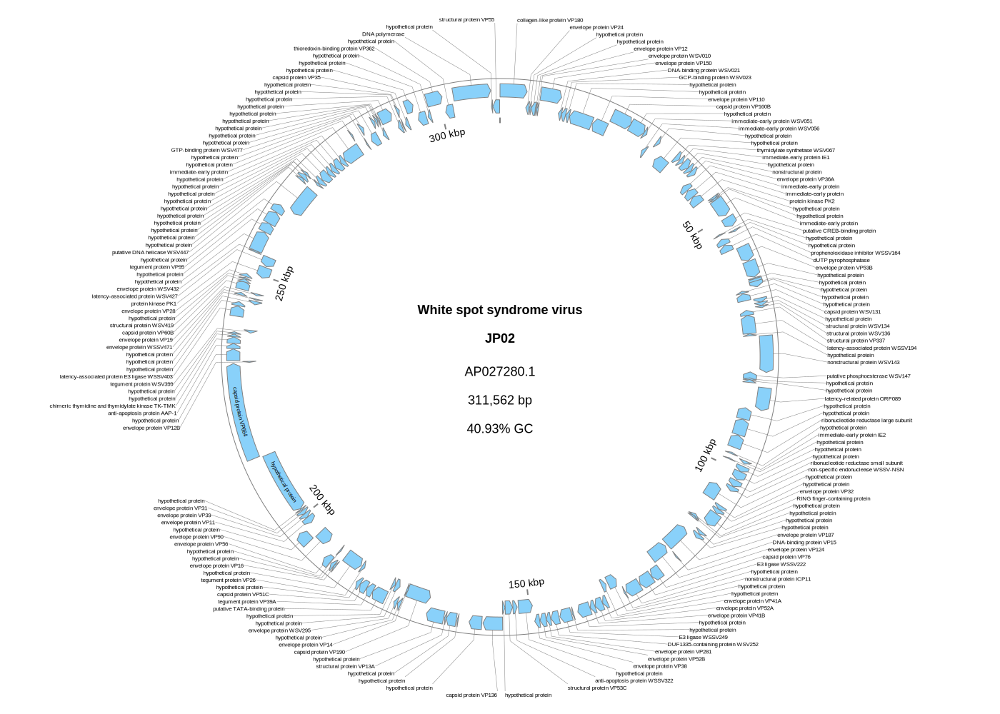

[Home](../README.md) | [Installation](../INSTALL.md) | [Quickstart](../QUICKSTART.md) | [**Tutorials**](../TUTORIALS/TUTORIALS.md) | [Gallery](../GALLERY.md) | [FAQ](../FAQ.md) | [ABOUT](../ABOUT.md)

[< Back to Quickstart](../QUICKSTART.md)

　　　　　　[Go to Tutorial 2: Comparative Genomics with BLAST >](./2_Comparative_Genomics.md) 

[< Back to the Index of Tutorials](./TUTORIALS.md)

# Tutorial 1: Customizing Your Plot

**Goal**: Learn the basics of customizing plot appearance, including colors, titles, and labels, using the plot from the Quickstart.

---

### 1. Changing the Color Scheme

`gbdraw` comes with [55 built-in color palettes](../../examples/color_palette_examples.md). You can specify one using the `-p` or `--palette` option. Let's try the [`orchid`](../../examples/color_palette_examples.md#orchid) palette.

```bash
gbdraw circular \
  --gbk NC_000913.gbk \
  -o ecoli_orchid \
  -f svg \
  --separate_strands \
  -p orchid
```

The new file `ecoli_orchid.svg` will be generated with a different color scheme. 


You can see examples of all available palettes [here](../../examples/color_palette_examples.md).

### 2. Changing the track layout
You have precise control over how genomic features are arranged in the plot. The two main options for this are `--track_type` and `--separate_strands`.

#### Track layout style (`--track_type`)
You can choose how features are displayed in the circular track. `tuckin` is the default and most compact, `middle` places features along the middle of the circle, and `spreadout` spreads them around the circle.
#### Strand separation (`--separate_strands`)
By default, features from both the forward (+) and reverse (-) strands are drawn on a single, combined track. For genomes with many genes, this can look crowded. Using the `--separate_strands` flag tells gbdraw to place features on two distinct tracks: an outer track for the forward strand and an inner track for the reverse strand. This separation is recommended for relatively large genomes (e.g. bacteria) as it makes it easier to distinguish features.


### 3. Adding a Title
Use the `--species` and `--strain` options to add a title to the center of your plot. You can use HTML `<i>` tags for *italics*.
> [!CAUTION]
> Mixed-format text (e.g., combining italic and block elements like <i>Ca.</i> Tyloplasma litorale) cannot be reliably converted from SVG to PDF/PNG/EPS/PS.

```bash
gbdraw circular \
  --gbk NC_000913.gbk \
  -o ecoli_with_title \
  -f svg \
  --separate_strands \
  -p orchid \
  --species "<i>Escherichia coli</i>" \
  --strain "K-12"
```
The plot will now have a formatted title in the center.


### 4. Showing Feature Labels
By default, gene labels are hidden. Use the `--show_labels` option to display them.
As the *E.coli* genome is a little bit too large for this purpose, we will use the genome of white spot syndrome virus, a large DNA virus infecting crustaceans.
> [!WARNING]
> Do not use `--show_labels` for genomes with more than a few hundred genes unless you downsample labels with `--lablel_blacklist` or `--label_whitelist`.

```bash
wget "https://eutils.ncbi.nlm.nih.gov/entrez/eutils/efetch.fcgi?db=nuccore&id=AP027280.1&rettype=gbwithparts&retmode=text" -O AP027280.gb
```
Alternatively, download the genbank file from [the NCBI website](https://www.ncbi.nlm.nih.gov/nuccore/AP027280) manually and rename it from something like `sequence.gb` to `AP027280.gb`.
> [!TIP]
> To prevent clutters, you can adjust label text size with `--label_font_size` or use advanced filtering techniques covered in [a later tutorial](./3_Advanced_Customization.md).
```bash
gbdraw circular \
 --gbk AP027280.gb \
 -o WSSV_with_labels \
 -f svg \
 --block_stroke_width 1 \
 --track_type middle \
 --show_labels
```


### 5. Filtering Plot Elements
You can simplify the plot by showing only the elements you are interested in.

Select Feature Types: Use the `--features` (or `-k`) option to specify a comma-separated list of features to draw.

**Hide Tracks & Legend**: You can hide the GC content track with `--suppress_gc`,`--suppress_skew` and the legend with `--legend none`.

Let's re-draw the WSSV genome, but this time hiding the GC tracks and the legend.

```bash
gbdraw circular \
 --gbk AP027280.gb \
 -o WSSV_filtered \
 -f svg \
 --block_stroke_width 1 \
 --suppress_gc \
 --suppress_skew \
 --separate_strands \
 --show_labels \
 --legend none
```



[< Back to Quickstart](../QUICKSTART.md)

　　　　　　[Go to Tutorial 2: Comparative Genomics with BLAST >](./2_Comparative_Genomics.md) 

[< Back to the Index of Tutorials](./TUTORIALS.md)


[Home](../README.md) | [Installation](../INSTALL.md) | [Quickstart](../QUICKSTART.md) | [**Tutorials**](../TUTORIALS/TUTORIALS.md) | [Gallery](../GALLERY.md) | [FAQ](../FAQ.md) | [ABOUT](../ABOUT.md)