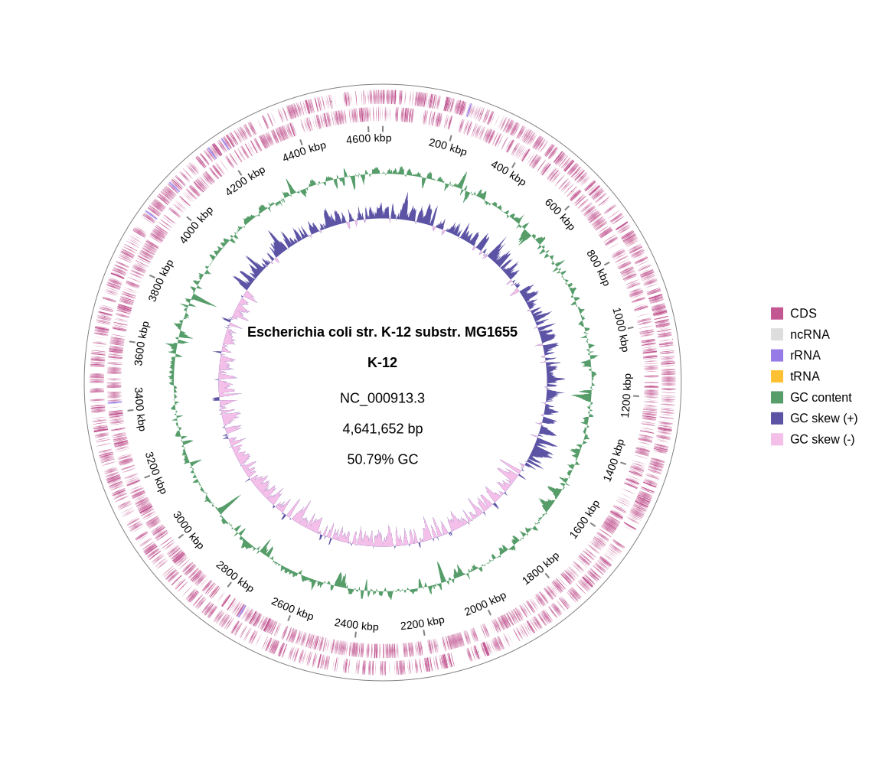
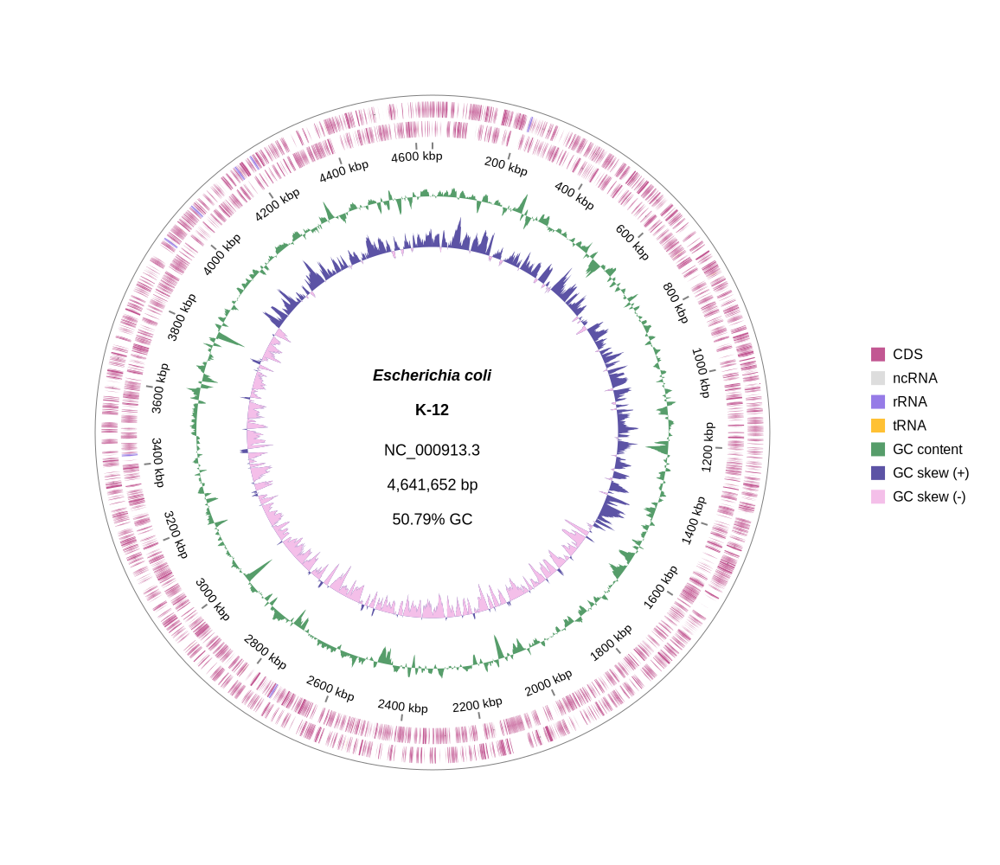
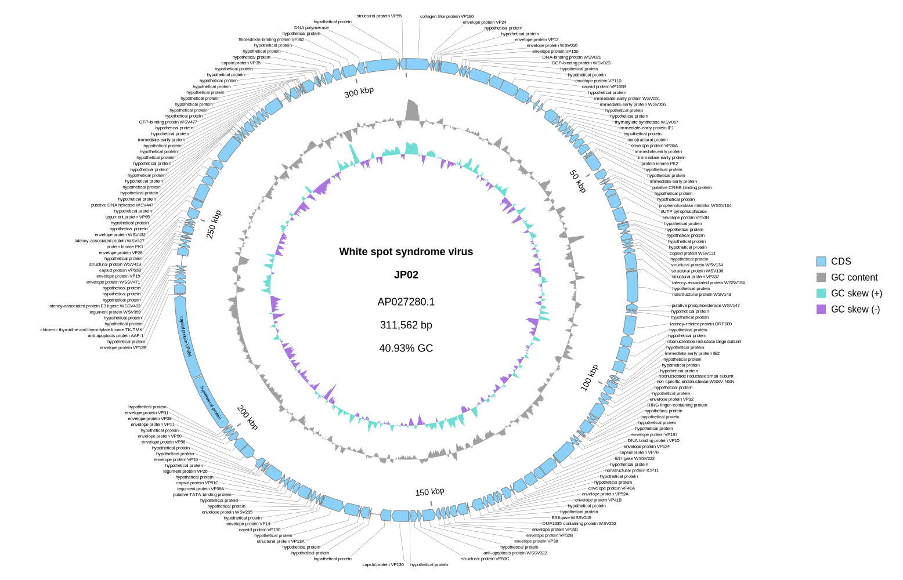

[Home](../README.md) | [Installation](../INSTALL.md) | [Quickstart](../QUICKSTART.md) | [**Tutorials**](../TUTORIALS/TUTORIALS.md) | [Gallery](../GALLERY.md) | [FAQ](../FAQ.md) | [ABOUT](../ABOUT.md)

[< Back to Quickstart](../QUICKSTART.md)

[< Back to the Index of Tutorials](./TUTORIALS.md)　　　　　　[Go to Tutorial 2: Comparative Genomics with BLAST >](./2_Comparative_Genomics.md) 

# Tutorial 1: Customizing Your Plot

**Goal**: Learn the basics of customizing plot appearance, including colors, titles, and labels, using the plot from the Quickstart.

---

### 1. Changing the Color Scheme

`gbdraw` comes with [55 built-in color palettes](../../examples/color_palette_examples.md). You can specify one using the `-p` or `--palette` option. Let's try the [`orchid`](../../examples/color_palette_examples.md#orchid) palette.

```bash
gbdraw circular \
  --gbk NC_000913.gbk \
  -o ecoli_ajisai \
  -f svg \
  --separate_strands \
  -p orchid
```

The new file `ecoli_orchid.svg` will be generated with a different color scheme. 



You can see examples of all available palettes [here](../examples/color_palette_examples.md).


### 2. Adding a Title
Use the `--species` and `--strain` options to add a title to the center of your plot. You can use HTML `<i>` tags for *italics*.
> [!CAUTION]
> Mixed-format text (e.g., combining italic and block elements like <i>Ca.</i> Tyloplasma litorale) cannot be reliably converted from SVG to PDF/PNG/EPS/PS.

```bash
gbdraw circular \
  --gbk NC_000913.gbk \
  -o ecoli_with_title \
  -f svg \
  --separate_strands \
  -p orchid \
  --species "<i>Escherichia coli</i>" \
  --strain "K-12"
```
The plot will now have a formatted title in the center.


### 3. Showing Feature Labels
By default, gene labels are hidden. Use the `--show_labels` option to display them.
As the *E.coli* genome is a little bit too large for this purpose, we will use the genome of white spot syndrome virus, a large DNA virus infecting crustaceans.
> [!WARNING]
> Do not use `--show_labels` for genomes with more than a few hundred genes unless you downsample labels with `--lablel_blacklist` or `--label_whitelist`.

```bash
wget "https://eutils.ncbi.nlm.nih.gov/entrez/eutils/efetch.fcgi?db=nuccore&id=AP027280.1&rettype=gbwithparts&retmode=text" -O AP027280.gb
```
Alternatively, download the genbank file from [the NCBI website](https://www.ncbi.nlm.nih.gov/nuccore/AP027280) manually and rename it from something like `sequence.gb` to `AP027280.gb`.
```bash
gbdraw circular \
 --gbk AP027280.gb \
 -o WSSV_with_labels \
 -f svg \
 --block_stroke_width 1 \
 --track_type middle \
 --show_labels
```


> [!TIP]
> To prevent clutters, you can adjust label text size with `--label_font_size` or use advanced filtering techniques covered in [a later tutorial](./3_Advanced_Customization.md).


[< Back to Quickstart](../QUICKSTART.md)

[< Back to the Index of Tutorials](./TUTORIALS.md)　　　　　　[Go to Tutorial 2: Comparative Genomics with BLAST >](./2_Comparative_Genomics.md) 


[Home](../README.md) | [Installation](../INSTALL.md) | [Quickstart](../QUICKSTART.md) | [**Tutorials**](../TUTORIALS/TUTORIALS.md) | [Gallery](../GALLERY.md) | [FAQ](../FAQ.md) | [ABOUT](../ABOUT.md)