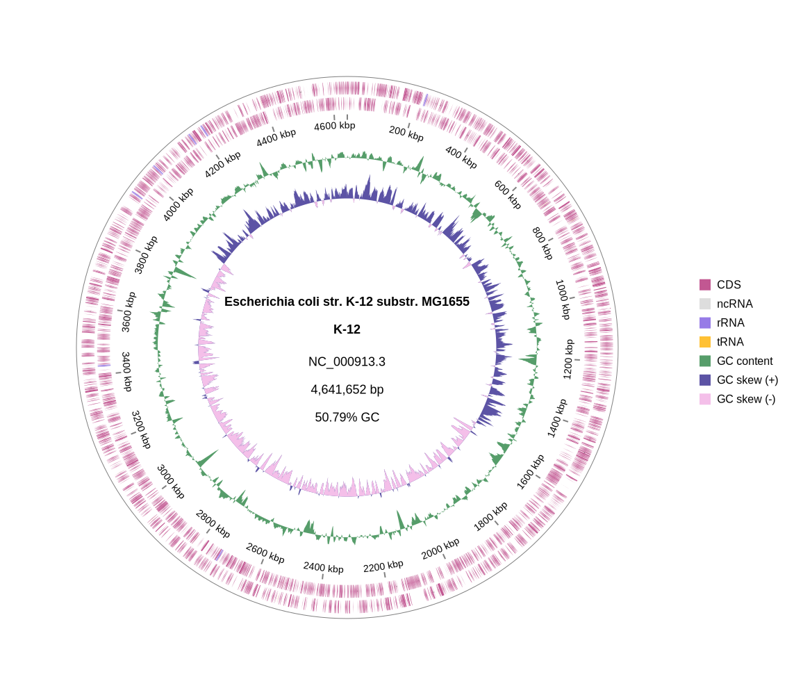
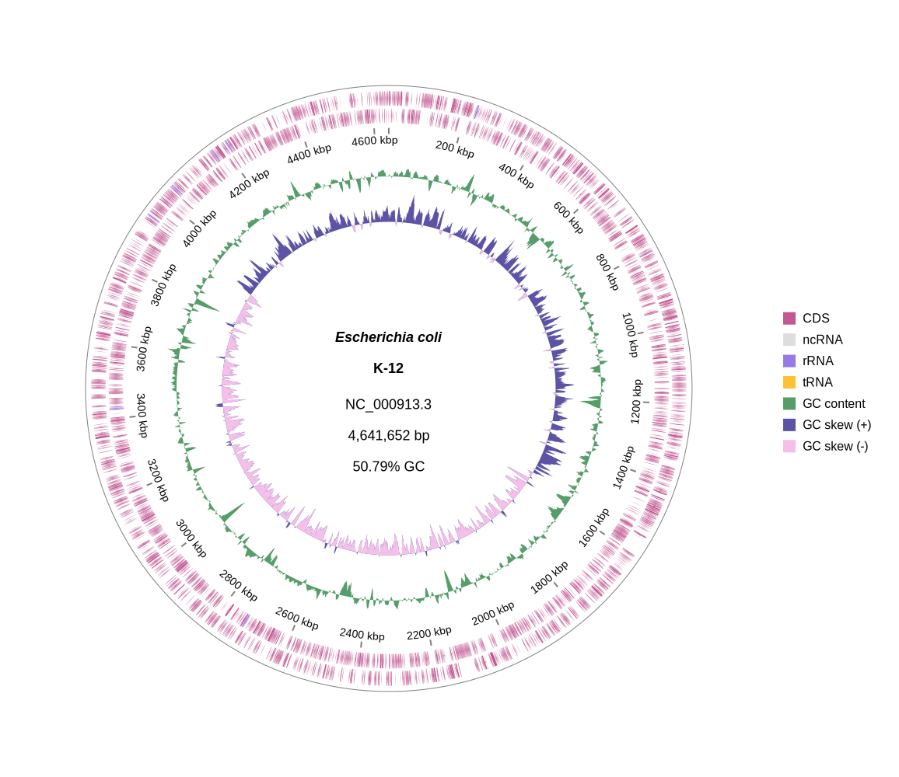
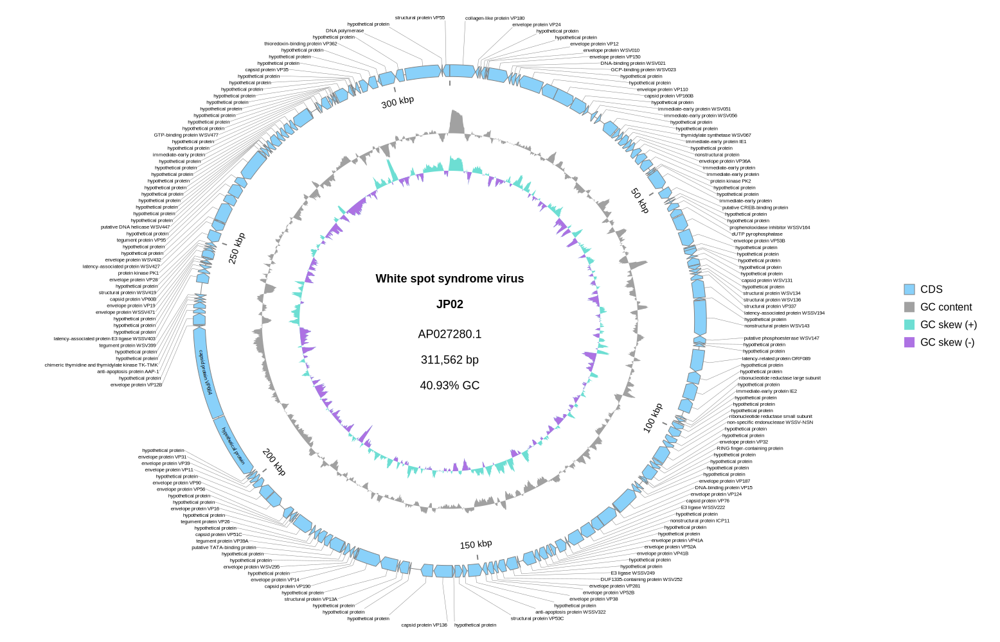
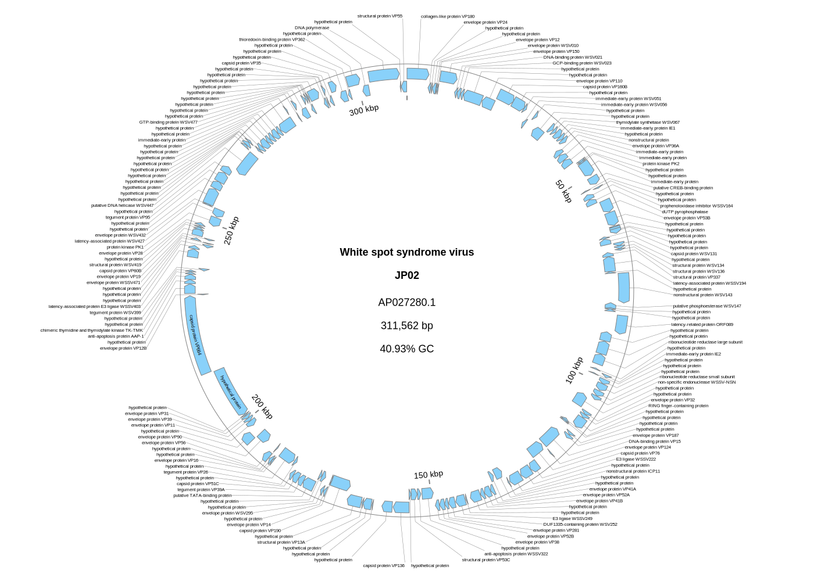

[Home](../DOCS.md) | [Installation](../INSTALL.md) | [Quickstart](../QUICKSTART.md) | [Tutorials](./TUTORIALS.md) | [Recipes](../RECIPES.md) | [CLI Reference](../CLI_Reference.md) | [Gallery](../GALLERY.md) | [FAQ](../FAQ.md) | [About](../ABOUT.md)

[< Back to Quickstart](../QUICKSTART.md) | [Go to Tutorial 2 >](./2_Comparative_Genomics.md)

[< Back to the Tutorials Index](./TUTORIALS.md)

# Tutorial 1: Customizing Your Plot

**Goal:** learn the basic styling controls for circular plots: palettes, track layout, centered definition text, titles, and labels.

## 1. Change the Color Scheme

`gbdraw` ships with many built-in palettes. Use `-p` or `--palette` to select one.

```bash
gbdraw circular \
  --gbk NC_000913.gbk \
  -o ecoli_orchid \
  -f svg \
  --separate_strands \
  -p orchid
```



See [color_palette_examples.md](../../examples/color_palette_examples.md) for the full palette list.

## 2. Choose a Circular Layout

Two options control the overall look of a circular plot:

- `--track_type`: `tuckin`, `middle`, or `spreadout`
- `--separate_strands`: split forward and reverse features into different tracks

`tuckin` is the default and most compact. `middle` is often easier to label. `spreadout` gives the most visual separation.


## 3. Add Centered Organism Text or a Plot Title

Use `--species` and `--strain` to control the centered definition text:

```bash
gbdraw circular \
  --gbk NC_000913.gbk \
  -o ecoli_with_title \
  -f svg \
  --separate_strands \
  --species "<i>Escherichia coli</i>" \
  --strain "K-12"
```



If you want a title above or below the plot, use `--plot_title` together with `--plot_title_position top` or `bottom`.

> [!CAUTION]
> Mixed-format text such as `<i>Ca.</i> Tyloplasma litorale` does not reliably survive SVG-to-PNG/PDF/EPS/PS conversion. Use SVG when exact formatting matters.

## 4. Show Feature Labels

Circular labels are hidden by default. Use `--labels` to show outer labels, or `--labels both` to show outer and inner labels.

For a label-focused example, use the white spot syndrome virus genome rather than a crowded bacterial chromosome:

```bash
wget "https://eutils.ncbi.nlm.nih.gov/entrez/eutils/efetch.fcgi?db=nuccore&id=AP027280.1&rettype=gbwithparts&retmode=text" -O AP027280.gb
```

```bash
gbdraw circular \
  --gbk AP027280.gb \
  -o WSSV_with_labels \
  -f svg \
  --block_stroke_width 1 \
  --track_type middle \
  --labels
```



> [!WARNING]
> Avoid `--labels` or `--labels both` on feature-dense genomes unless you also filter labels with `--label_blacklist` or `--label_whitelist`.

## 5. Simplify the Plot

You can reduce clutter by hiding tracks or legends, or by drawing only selected feature types.

```bash
gbdraw circular \
  --gbk AP027280.gb \
  -o WSSV_filtered \
  -f svg \
  --block_stroke_width 1 \
  --suppress_gc \
  --suppress_skew \
  --separate_strands \
  --labels \
  --legend none
```



## 6. When You Move to Linear Mode

Linear mode has its own input selectors:

- `--record_id`
- `--reverse_complement`
- `--region`

See [Tutorial 2](./2_Comparative_Genomics.md) and the [CLI Reference](../CLI_Reference.md) for details.

[< Back to Quickstart](../QUICKSTART.md) | [Go to Tutorial 2 >](./2_Comparative_Genomics.md)

[< Back to the Tutorials Index](./TUTORIALS.md)

[Home](../DOCS.md) | [Installation](../INSTALL.md) | [Quickstart](../QUICKSTART.md) | [Tutorials](./TUTORIALS.md) | [Recipes](../RECIPES.md) | [CLI Reference](../CLI_Reference.md) | [Gallery](../GALLERY.md) | [FAQ](../FAQ.md) | [About](../ABOUT.md)
