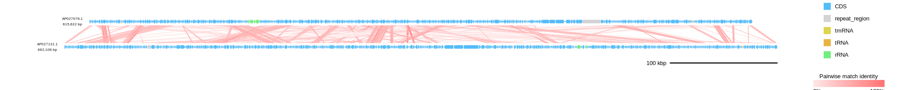
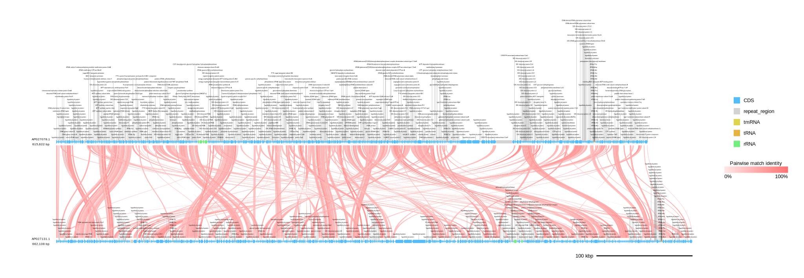
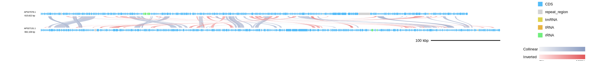
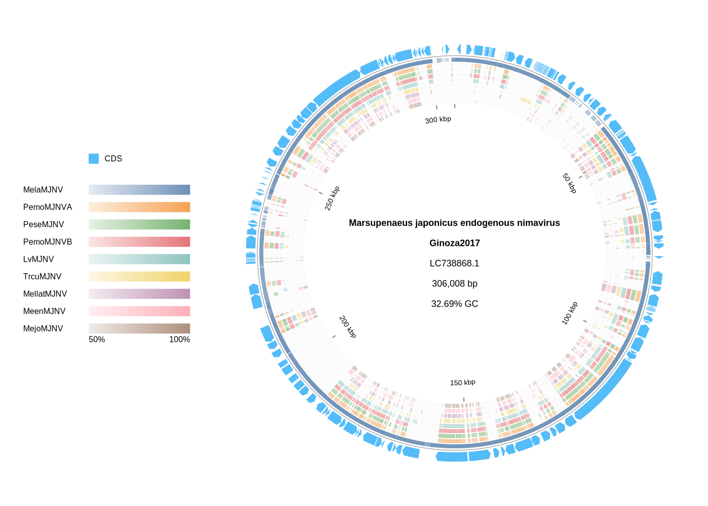

[Home](../DOCS.md) | [Installation](../INSTALL.md) | [Quickstart](../QUICKSTART.md) | [Tutorials](./TUTORIALS.md) | [Recipes](../RECIPES.md) | [CLI Reference](../CLI_Reference.md) | [Gallery](../GALLERY.md) | [FAQ](../FAQ.md) | [About](../ABOUT.md)

[< Back to the Tutorials Index](./TUTORIALS.md)
[< Back to Tutorial 1](./1_Customizing_Plots.md) | [Go to Tutorial 3 >](./3_Advanced_Customization.md)

# Tutorial 2: Comparative Genomics with BLAST

**Goal:** visualize sequence similarity with linear BLAST comparisons, generated protein comparisons, and circular LOSATN/TLOSATX homology rings.

## 1. Required Inputs

Comparative plots need two or more annotated genomes in GenBank or GFF3 + FASTA format.

For precomputed comparisons, supply one nucleotide or protein BLAST result file for each adjacent comparison with `-b/--blast`. Accepted BLAST table formats are outfmt 6 and outfmt 7.

For generated protein comparisons, do not supply BLAST tables. Use `--protein_blastp_mode pairwise`, `orthogroup`, or `collinear`; gbdraw extracts proteins from CDS features and runs the selected blastp workflow.

> [!IMPORTANT]
> `-b/--blast` and `--protein_blastp_mode` are mutually exclusive. Choose one comparison source per run: either precomputed BLAST tables or generated protein blastp comparisons.

## 2. Prepare a Pairwise Example

This example uses the first two sequences from the [Hepatoplasmataceae five-genome comparison](../GALLERY.md#hepatoplasmataceae-five-genome-comparison): *Candidatus Tyloplasma litorale* (AP027078.1) and *Candidatus Hepatoplasma vulgare* (AP027131.1).

```bash
wget "https://eutils.ncbi.nlm.nih.gov/entrez/eutils/efetch.fcgi?db=nuccore&id=AP027078.1&rettype=gbwithparts&retmode=text" -O AP027078.gb
wget "https://eutils.ncbi.nlm.nih.gov/entrez/eutils/efetch.fcgi?db=nuccore&id=AP027078.1&rettype=fasta&retmode=text" -O AP027078.fasta

wget "https://eutils.ncbi.nlm.nih.gov/entrez/eutils/efetch.fcgi?db=nuccore&id=AP027131.1&rettype=gbwithparts&retmode=text" -O AP027131.gb
wget "https://eutils.ncbi.nlm.nih.gov/entrez/eutils/efetch.fcgi?db=nuccore&id=AP027131.1&rettype=fasta&retmode=text" -O AP027131.fasta
```

Install NCBI BLAST+ so that `tblastx` is available on `PATH`, then create an outfmt 7 comparison table:

```bash
tblastx \
  -query AP027078.fasta \
  -subject AP027131.fasta \
  -outfmt 7 \
  -out AP027078_AP027131.tblastx.out
```

## 3. Generate the Pairwise Plot

```bash
gbdraw linear \
  --gbk AP027078.gb AP027131.gb \
  -b AP027078_AP027131.tblastx.out \
  --align_center \
  --separate_strands \
  -o hepatoplasmataceae_pair \
  -f svg
```


The default pairwise link style is `ribbon`, which draws straight filled ribbons and is best when the exact BLAST alignment span is the main signal. Use `--pairwise_match_style curve` for curved filled ribbons in dense synteny-style views; the curve style still preserves each match span from `qstart/qend` and `sstart/send`.

For generated collinear protein comparisons, `--collinear_color_mode orientation_identity` uses separate forward and inverted identity gradients. Collinear blocks use RBH anchors. In the web app, `Evidence scope` controls which record pairs provide collinearity evidence. `Adjacent pairs` uses only neighboring records; `All records` uses every record pair for grouping and block support. Both settings draw ribbons only for adjacent display pairs.

## 4. Generate Protein Comparisons Without BLAST Tables

The same two GenBank files can be compared by generated protein blastp workflows. These commands intentionally omit `-b/--blast`.

Pairwise protein ribbons:

```bash
gbdraw linear \
  --gbk AP027078.gb AP027131.gb \
  --protein_blastp_mode pairwise \
  --align_center \
  -o hepatoplasmataceae_protein_pairwise \
  -f svg
```



Orthogroup-supported ribbons:

```bash
gbdraw linear \
  --gbk AP027078.gb AP027131.gb \
  --protein_blastp_mode orthogroup \
  --show_labels orthogroup_top \
  --pairwise_match_style curve \
  -o hepatoplasmataceae_orthogroup \
  -f svg
```



Collinear blocks:

```bash
gbdraw linear \
  --gbk AP027078.gb AP027131.gb \
  --protein_blastp_mode collinear \
  --collinear_min_anchors 2 \
  --collinear_color_mode orientation_identity \
  --pairwise_match_style curve \
  -o hepatoplasmataceae_collinear \
  -f svg
```



See [Tutorial 4](./4_Protein_Comparisons.md) for runtime selection, labels, and collinear tuning.

## 5. Interpreting Orthogroups and Collinear Blocks

`orthogroup` groups related CDS-derived proteins across the input records, while `collinear` groups those protein-supported matches when their genes occur in a compatible order.

Both modes run protein `blastp` searches on proteins obtained from CDS features. gbdraw uses bundled native LOSAT when available, then a `losat` executable on `PATH`, then NCBI BLAST+ `blastp` on `PATH`. Linux x86_64 can use the bundled LOSAT binary. macOS and Windows do not currently ship bundled LOSAT binaries, so install NCBI BLAST+ and make `blastp` available on `PATH`, or pass it explicitly with `--ncbi_blastp_bin /path/to/blastp`. You can still force a native LOSAT executable on any platform with `--losatp_bin /path/to/losat`. NCBI BLAST+ fallback provides compatible outfmt 6 protein comparisons, but it is not guaranteed to produce exactly the same hit set as LOSAT.

Choose one comparison source per run. Precomputed `-b/--blast` tables are used directly as pairwise comparison input; generated `--protein_blastp_mode` runs infer pairwise protein matches, orthogroups, or collinear blocks from CDS proteins.

### Orthogroups

In evolutionary genomics, an orthogroup is a set of genes descended from a single gene in the last common ancestor of the taxa being compared. Different genomes may contribute one gene, multiple genes, or no detectable member. An orthogroup is therefore not necessarily a set of one-to-one orthologs.

> [!NOTE]
> gbdraw infers similarity-based groups for visualization. Reciprocal and near-reciprocal protein matches define the group cores, and additional proteins are assigned when the evidence supports membership in the same family. Because gbdraw does not infer gene or species trees, these groups may not necessarily reflect true phylogenetic orthology. Use a dedicated orthology workflow such as OrthoFinder when orthology inference itself is the analysis goal.

### Collinear Blocks

An anchor is a protein-supported gene pair associated with the same gbdraw orthogroup. A collinear block is a run of anchors with compatible order in two records. For multi-anchor blocks, `plus` means that the anchors occur in the same order in both records; `minus` means that their order is reversed, which suggests an inversion.

Multi-anchor blocks combine protein similarity with conserved local gene order. They can highlight conserved gene neighborhoods, including candidate operons or gene clusters, but they do not by themselves establish shared function or cotranscription. Genes lying between anchors are not automatically homologous or members of the same orthogroup.

The default `--collinear_min_anchors 1` retains singleton links. Set it to `2` to require at least two anchors per rendered block; higher values require more anchors.

## 6. Select Records or Regions

Linear mode supports three selectors:

- `--record_id`: choose one record by ID or `#index`; repeat the option for multiple input files
- `--reverse_complement`: set one Boolean orientation value per occurrence; repeat the option in input-file order
- `--region`: crop a region with `record_id:start-end[:rc]`; repeat the option for multiple regions

Example: select one record and crop a region.

```bash
gbdraw linear \
  --gbk AP027078.gb \
  --record_id AP027078.1 \
  --region AP027078.1:100000-250000 \
  -o AP027078_region \
  -f svg
```

Example: reverse-complement the second input.

```bash
gbdraw linear \
  --gbk AP027078.gb AP027131.gb \
  --reverse_complement false \
  --reverse_complement true \
  -o hepatoplasmataceae_second_rc \
  -f svg
```

Each occurrence of `--record_id` and `--reverse_complement` accepts one value. Repeat the option rather than placing several values after a single occurrence.

If you use `--region` or `--reverse_complement` together with BLAST, make sure the BLAST coordinates still match the selected inputs.

For larger comparisons, put row-specific selectors and crops in a records table instead of repeating several order-sensitive CLI options. Create `records.tsv`:

```tsv
gbk	record_label	record_id	region	reverse_complement	order
AP027078.gb	T. litorale	AP027078.1	100000-250000	0	1
AP027131.gb	H. vulgare	AP027131.1	50000-180000	1	2
```

```bash
gbdraw linear \
  --records_table records.tsv \
  -o hepatoplasmataceae_regions \
  -f svg
```


This selector-only example intentionally omits `-b/--blast`; a full-record BLAST table does not automatically acquire coordinates for cropped or reverse-complemented records.

`--records_table` is an alternative input source, so do not combine it with `--gbk`, `--gff`, or `--fasta`.

## 7. Compare More Than Two Genomes

The Gallery comparison extends the pair above to five genomes. Download the remaining three GenBank and FASTA records:

```bash
wget "https://eutils.ncbi.nlm.nih.gov/entrez/eutils/efetch.fcgi?db=nuccore&id=AP027133.1&rettype=gbwithparts&retmode=text" -O AP027133.gb
wget "https://eutils.ncbi.nlm.nih.gov/entrez/eutils/efetch.fcgi?db=nuccore&id=AP027133.1&rettype=fasta&retmode=text" -O AP027133.fasta

wget "https://eutils.ncbi.nlm.nih.gov/entrez/eutils/efetch.fcgi?db=nuccore&id=AP027132.1&rettype=gbwithparts&retmode=text" -O AP027132.gb
wget "https://eutils.ncbi.nlm.nih.gov/entrez/eutils/efetch.fcgi?db=nuccore&id=AP027132.1&rettype=fasta&retmode=text" -O AP027132.fasta

wget "https://eutils.ncbi.nlm.nih.gov/entrez/eutils/efetch.fcgi?db=nuccore&id=NZ_CP006932.1&rettype=gbwithparts&retmode=text" -O NZ_CP006932.gb
wget "https://eutils.ncbi.nlm.nih.gov/entrez/eutils/efetch.fcgi?db=nuccore&id=NZ_CP006932.1&rettype=fasta&retmode=text" -O NZ_CP006932.fasta
```

The first adjacent comparison table was created in Section 2. Generate the remaining three in the same order as the genome list:

```bash
tblastx -query AP027131.fasta -subject AP027133.fasta -outfmt 7 -out AP027131_AP027133.tblastx.out
tblastx -query AP027133.fasta -subject AP027132.fasta -outfmt 7 -out AP027133_AP027132.tblastx.out
tblastx -query AP027132.fasta -subject NZ_CP006932.fasta -outfmt 7 -out AP027132_NZ_CP006932.tblastx.out
```

```bash
gbdraw linear \
  --gbk AP027078.gb AP027131.gb AP027133.gb AP027132.gb NZ_CP006932.gb \
  -b AP027078_AP027131.tblastx.out AP027131_AP027133.tblastx.out AP027133_AP027132.tblastx.out AP027132_NZ_CP006932.tblastx.out \
  --align_center \
  --separate_strands \
  --show_gc \
  --show_skew \
  --palette default \
  -o hepatoplasmataceae_default \
  -f svg
```

Add `--evalue`, `--bitscore`, or `--alignment_length` when you want to filter the comparison tables before drawing the ribbons.

Inspect the result for four ribbon bands, each connecting one adjacent pair in the five-genome input order.


> [!IMPORTANT]
> BLAST files must follow the same order as the genome list.

## 8. Circular Homology Rings: LOSATN vs TLOSATX

Circular mode can place one pairwise comparison ring per query sequence around an annotated reference. This example uses MjeNMV as the reference and the other nine majaniviruses as queries for both LOSATN and TLOSATX. Comparing the two diagrams reveals homology that is weak at the nucleotide level but retained at the translated protein level.

### 8.1 Download the reference and queries

Download MjeNMV as the annotated GenBank reference:

```bash
wget "https://eutils.ncbi.nlm.nih.gov/entrez/eutils/efetch.fcgi?db=nuccore&id=LC738868.1&rettype=gbwithparts&retmode=text" -O MjeNMV.gb
```

Download the nine comparison genomes as FASTA queries:

```bash
while read -r name accession; do
  wget "https://eutils.ncbi.nlm.nih.gov/entrez/eutils/efetch.fcgi?db=nuccore&id=${accession}&rettype=fasta&retmode=text" -O "${name}.fasta"
done <<'EOF'
MelaMJNV LC738874.1
PemoMJNVA LC738870.1
PeseMJNV LC738873.1
PemoMJNVB LC738871.1
LvMJNV LC738872.1
TrcuMJNV LC738879.1
MellatMJNV AP027153.1
MeenMJNV LC738876.1
MejoMJNV LC738878.1
EOF
```

The same GenBank and FASTA files are available under `examples/` in a source checkout.

### 8.2 Configure the shared circular plot

Open the [gbdraw web app](https://gbdraw.app/), select `Circular`, and upload `MjeNMV.gb` as the input genome. Use these settings for both comparisons:

| Setting | Value |
|---|---|
| Track Preset | Spreadout |
| Hide GC Content | Selected |
| Hide GC Skew | Selected |
| Legend Position | Left |
| Pairwise Comparisons | Run LOSAT |
| Ring Width | 8 |
| Ring Gap | 2 |
| Bitscore | 50 |
| E-value | `1e-5` |

In `Pairwise Comparisons`, click `Add Seq` and add the nine FASTA files in the order shown in the download block. Each FASTA is a query; the displayed MjeNMV genome is the subject and the coordinate reference for every ring.

### 8.3 Generate the nucleotide-level LOSATN rings

Select `LOSATN`, set `Task` to `blastn`, `Minimum Identity` to `75`, and `Minimum Length` to `100`. Click `Generate Diagram`.



Most rings contain only isolated nucleotide matches. MelaMJNV is the clear exception: its outer ring remains dense because it is much more similar to MjeNMV at the nucleotide level than the other queries.

### 8.4 Generate the translated TLOSATX rings

Keep the same reference, query order, colors, and layout. Change `LOSAT Mode` to `TLOSATX`, then set `Minimum Identity` to `30` and `Minimum Length` to `30`. Keep `Reference gencode` and each query `Subject gencode` at `1`, then click `Generate Diagram` again.


The eight nucleotide-divergent queries cover substantially more of MjeNMV in the TLOSATX plot, while MelaMJNV remains dense in both plots. The contrast indicates that much of the shared protein-coding content remains detectable after translation even where synonymous substitutions and other nucleotide changes make direct DNA matches sparse.

After merging overlapping HSP spans on the MjeNMV reference, the eight divergent queries individually cover only about 0.6–9.1% in the LOSATN result but about 28.5–44.0% in the TLOSATX result. MelaMJNV covers about 94% with LOSATN and 91% with TLOSATX, which explains its dense ring in both diagrams.

> [!NOTE]
> MjeNMV is annotated as linear, so gbdraw reports a topology warning. This tutorial intentionally uses a circular view to compare homology rings; use linear mode when the displayed topology must match the record annotation.

The web app can save the raw LOSAT tables with `Save Raw LOSAT TSV`. To draw the same rings from the CLI, pass one saved outfmt 6/7 file per ring with `--conservation_blast` and select `--conservation_reference subject`. BLAST rows with `start > end` on the selected reference side are drawn as reverse-orientation hits, not as circular wraparound hits.

[< Back to the Tutorials Index](./TUTORIALS.md)
[< Back to Tutorial 1](./1_Customizing_Plots.md) | [Go to Tutorial 3 >](./3_Advanced_Customization.md)

[Home](../DOCS.md) | [Installation](../INSTALL.md) | [Quickstart](../QUICKSTART.md) | [Tutorials](./TUTORIALS.md) | [Recipes](../RECIPES.md) | [CLI Reference](../CLI_Reference.md) | [Gallery](../GALLERY.md) | [FAQ](../FAQ.md) | [About](../ABOUT.md)
