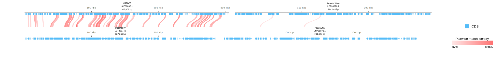

[Home](../DOCS.md) | [Quickstart](../QUICKSTART.md) | [Tutorials](./TUTORIALS.md) | [Recipes](../RECIPES.md) | [CLI Reference](../CLI_Reference.md) | [Gallery](../GALLERY.md)

[< Back to the guide index](./TUTORIALS.md) | [Protein comparisons >](./4_Protein_Comparisons.md)

# Draw genome comparison links from precomputed BLAST results

Connect precomputed BLAST high-scoring segment pairs (HSPs) to the correct records, then extend the comparison to more records. Each ribbon represents a retained HSP, not an orthology or conservation call.

For searches over annotated CDS translations, use [Compare annotated CDS proteins](./4_Protein_Comparisons.md). That guide is the single place that explains the `pairwise`, `orthogroup`, and `collinear` protein-search modes.

## 1. Required inputs

A linear comparison needs:

- two or more GenBank records, or matched GFF3 + FASTA pairs;
- one BLAST outfmt 6 or 7 table for each adjacent displayed record pair;
- query/subject coordinates that correspond to those records in the same order.

This example uses files under [`tests/test_inputs`](../../tests/test_inputs/):

- `AP027078.gb`
- `AP027131.gb`
- `AP027078_AP027131.tblastx.out`

## 2. Draw a two-record comparison

```bash
gbdraw linear \
  --gbk tests/test_inputs/AP027078.gb tests/test_inputs/AP027131.gb \
  --blast tests/test_inputs/AP027078_AP027131.tblastx.out \
  --separate_strands \
  --align_center \
  -o tutorial-2-pairwise-blast \
  -f svg
```


Each ribbon is one retained high-scoring segment pair (HSP). Its endpoints are the query and subject coordinate spans reported by BLAST. The default `ribbon` style draws straight filled spans; `--pairwise_match_style curve` bends those same spans without merging or resizing them.

The order matters:

1. the first GenBank record corresponds to the query coordinates;
2. the second corresponds to the subject coordinates;
3. the first BLAST file connects records 1 and 2.

Reversing an input or cropping a region does not remap a full-record BLAST table. Regenerate the search for the displayed sequences when the coordinate systems change.

## 3. Extend to more records

For five displayed records, pass four BLAST files in adjacent-pair order:

```bash
gbdraw linear \
  --gbk \
    tests/test_inputs/AP027078.gb \
    tests/test_inputs/AP027131.gb \
    tests/test_inputs/AP027133.gb \
    tests/test_inputs/AP027132.gb \
    tests/test_inputs/NZ_CP006932.gb \
  --blast \
    tests/test_inputs/AP027078_AP027131.tblastx.out \
    tests/test_inputs/AP027131_AP027133.tblastx.out \
    tests/test_inputs/AP027133_AP027132.tblastx.out \
    tests/test_inputs/AP027132_NZ_CP006932.tblastx.out \
  --align_center \
  --separate_strands \
  --show_gc \
  --show_skew \
  -o hepatoplasmataceae_default \
  -f svg
```


The table at position *n* connects displayed records *n* and *n + 1*. The raw HSP spans show retained local similarity under the search and filtering settings; they do not by themselves establish evolutionary conservation, shared function, or orthology.

## 4. Choose thresholds deliberately

Use `--bitscore`, `--evalue`, `--identity`, and `--alignment_length` to filter rows before drawing. Record the search program, database/query order, BLAST version, and thresholds with the figure. A visually sparse track can reflect strict filters rather than biological absence.

## 5. Select records, regions, or orientation

Record selection and layout are independent from the meaning of BLAST HSPs. See [Arrange linear tracks, record labels, and rulers](./7_Linear_Layout.md#7-select-records-regions-and-orientation) for `--record_id`, `--region`, and `--reverse_complement`. For more than a few records, store those values in [`--records_table`](./5_Table_Driven_Inputs.md#2-linear---records_table-for-genbank-rows).

## 6. Compare selected pairs across multi-record rows

When a row contains several records, adjacency no longer identifies the intended endpoints. Put the layout in a records table and the edges in a comparison table:

```tsv
# linear_multi_records.tsv
gbk	record_label	record_id	order	row	column
MjeNMV.gb	MjeNMV	LC738868.1	1	1	1
PemoMJNVA.gb	PemoMJNVA	LC738870.1	2	1	2
MelaMJNV.gb	MelaMJNV	LC738874.1	3	2	1
PeseMJNV.gb	PeseMJNV	LC738873.1	4	2	2
```

```tsv
# linear_multi_comparisons.tsv
blast	query	subject
MjeNMV.MelaMJNV.tblastx.out	#1	#3
PemoMJNVA.PeseMJNV.tblastx.out	#2	#4
```

```bash
gbdraw linear \
  --records_table linear_multi_records.tsv \
  --comparisons_table linear_multi_comparisons.tsv \
  --linear_record_gap 28 \
  --identity 97 \
  --alignment_length 500 \
  --pairwise_match_style curve \
  -o linear_multi_record \
  -f svg
```



The four records use one shared bp/px scale. Each comparison retains its declared query and subject even if the endpoints are listed in the opposite vertical order. Endpoints must lie in adjacent rows; same-row and row-skipping edges are errors.

## 7. Circular BLAST/LOSAT comparison rings

Circular mode can place one outfmt 6/7 result per query around an annotated reference. Use `--conservation_blast` for existing tables or `--conservation_table` for a reproducible manifest. Despite the compatibility option name, describe these as BLAST/LOSAT comparison rings unless a separate analysis supports a conservation claim.

In the web app, click an HSP arc to inspect both BLAST coordinate pairs and export matched nucleotide spans. Run LOSAT already supplies both sequences. For uploaded BLAST, choose an optional **Comparison FASTA** on the corresponding ring row; otherwise only the displayed reference span is available. These are coordinate spans, not gapped alignments.

- [Table-driven circular comparison rings](./5_Table_Driven_Inputs.md#5-circular-blast-similarity-rings-with---conservation_table)
- [WSSV advanced session-based case study](https://gbdraw.app/gallery/#WSSV_genome_comparison)

## Continue with protein or session workflows

- Compare protein-search modes in [Compare annotated CDS proteins](./4_Protein_Comparisons.md).
- Put per-record metadata and comparison inputs in [TSV manifests](./5_Table_Driven_Inputs.md).
- Save the final command or [interactive session](./8_Interactive_SVG_Sessions.md) with the figure.

[< Back to the guide index](./TUTORIALS.md) | [Protein comparisons >](./4_Protein_Comparisons.md)
