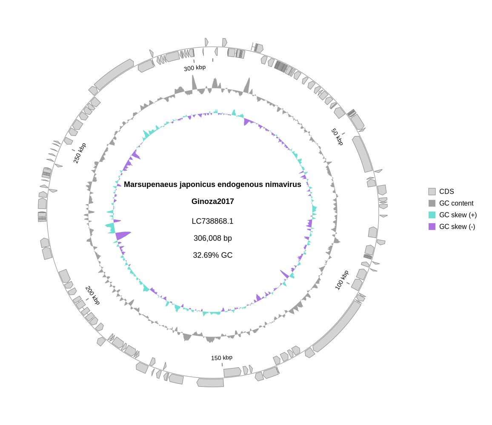
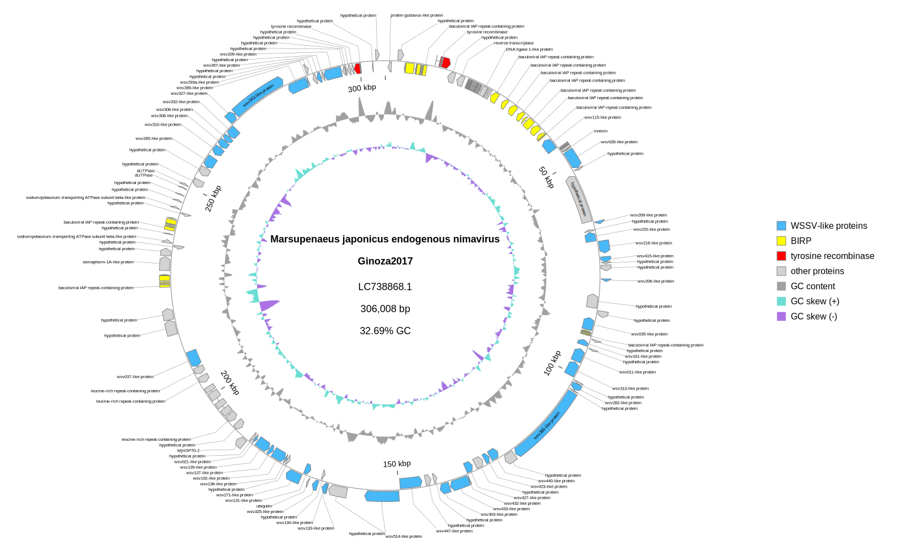
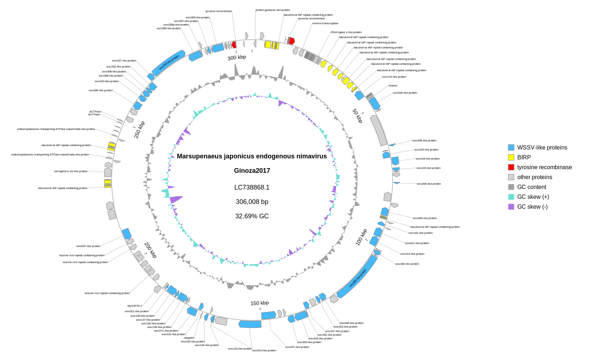
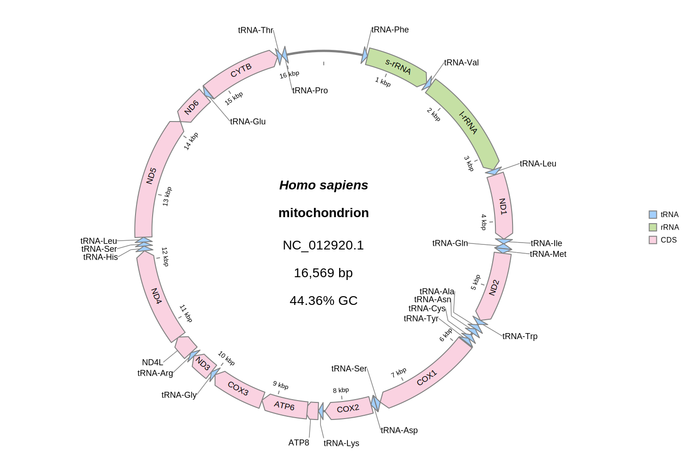
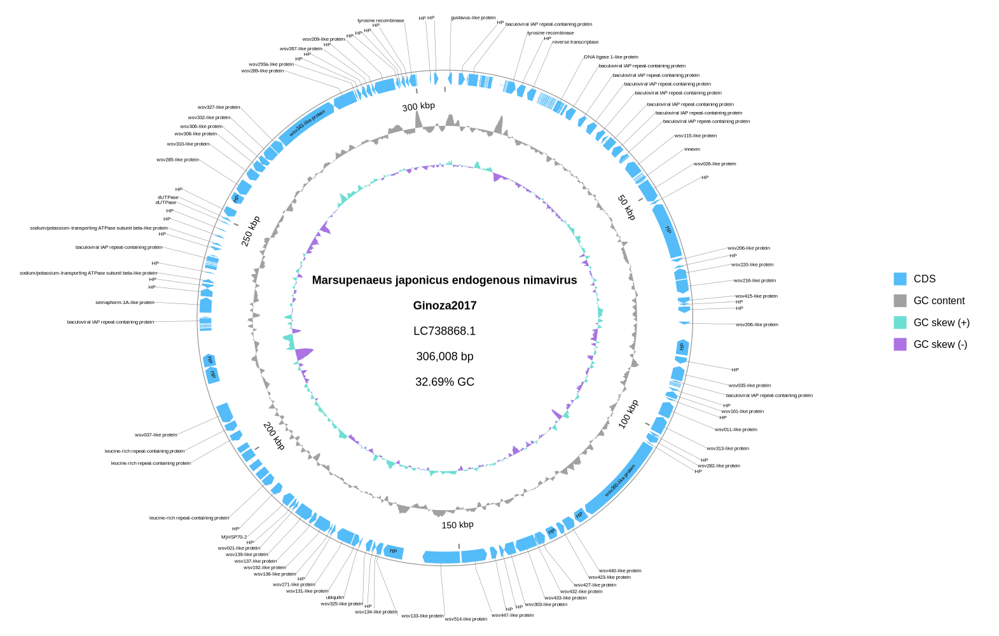
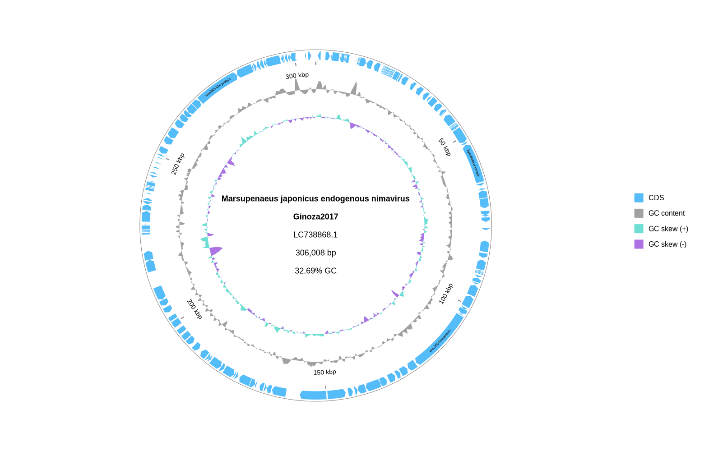
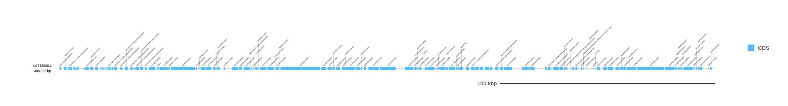

[Home](../DOCS.md) | [Installation](../INSTALL.md) | [Quickstart](../QUICKSTART.md) | [Tutorials](./TUTORIALS.md) | [Recipes](../RECIPES.md) | [CLI Reference](../CLI_Reference.md) | [Gallery](../GALLERY.md) | [FAQ](../FAQ.md) | [About](../ABOUT.md)

[< Back to the Tutorials Index](./TUTORIALS.md)
[< Back to Tutorial 2](./2_Comparative_Genomics.md) | [Go to Tutorial 4 >](./4_Protein_Comparisons.md)

# Tutorial 3: Control colors, labels, and appearance

Use tables and styling options to control feature colors, labels, and plot appearance.

`--track_type` selects the base circular preset (`tuckin`, `middle`, or `spreadout`). Custom track slots add an ordered slot list on top of that preset. A built-in slot inherits any omitted radius, width, physical gaps, placement, and standard renderer parameters from the preset for each record. Explicit `r`, `w`, `inner_gap_px`, `outer_gap_px`, `side`, `z`, and renderer parameters override the inherited values. The legacy `spacing` field remains a compatibility alias for both circular gaps.

Numeric and depth slots placed inside the axis auto-compress when `r` and `w` are omitted; gbdraw never moves them outside automatically. The circular axis stays fixed and cannot be moved or hidden with a circular track slot.

## Color tables

`gbdraw` supports two complementary table formats:

| Method | Option | Use case |
| --- | --- | --- |
| Default override table | `-d` | Replace the default color for an entire feature type |
| Feature-specific table | `-t` | Highlight selected features based on qualifier matches |

### 1. Override default colors

Create `modified_default_colors.tsv`:

```tsv
CDS	#d3d3d3
```

```bash
wget "https://eutils.ncbi.nlm.nih.gov/entrez/eutils/efetch.fcgi?db=nuccore&id=LC738868.1&rettype=gbwithparts&retmode=text" -O MjeNMV.gbk
```

```bash
gbdraw circular \
  --gbk MjeNMV.gbk \
  --separate_strands \
  --track_type middle \
  -f svg \
  --block_stroke_width 1 \
  -d modified_default_colors.tsv \
  -o MjeNMV_modified_default_colors
```

The output now uses the light-gray override for CDS features instead of the built-in CDS color.



### 2. Highlight specific features

Create `feature_specific_colors.tsv`:

```tsv
CDS	product	wsv.*-like protein	#47b8f8	WSSV-like proteins
CDS	product	baculoviral IAP repeat-containing protein	yellow	BIRP
CDS	product	tyrosine recombinase	red	tyrosine recombinase
```

Then combine `-d` and `-t`:

```bash
gbdraw circular \
  --gbk MjeNMV.gbk \
  --separate_strands \
  --track_type middle \
  -f svg \
  --block_stroke_width 1 \
  -d modified_default_colors.tsv \
  -t feature_specific_colors.tsv \
  --labels \
  -o MjeNMV_feature_specific_colors_with_labels
```

The output has blue WSSV-like proteins, yellow BIRP features, and a red tyrosine recombinase against the light-gray CDS background.



## Label filters and overrides

### 1. Blacklist uninformative labels

```bash
gbdraw circular \
  --gbk MjeNMV.gbk \
  --separate_strands \
  --track_type middle \
  -f svg \
  --block_stroke_width 1 \
  -d modified_default_colors.tsv \
  -t feature_specific_colors.tsv \
  --labels \
  --label_blacklist "hypothetical" \
  -o MjeNMV_feature_specific_colors_with_labels_blacklist
```

The highlighted features remain, but labels containing `hypothetical` are removed.



To remove several label terms, pass one comma-separated value, for example `--label_blacklist "hypothetical,putative"`. The blacklist uses case-insensitive substring matching.

### 2. Whitelist only the labels you need

Create `stx_whitelist.tsv`:

```tsv
CDS	gene	^stx1A$
CDS	gene	^stx1B$
CDS	gene	^stx2A$
CDS	gene	^stx2B$
```

`--label_whitelist` uses the same case-insensitive Python `re.search(...)` semantics as `-t`.
Use `^...$` for exact matches, or broader patterns such as `wsv.*-like protein` when you want to keep a label family.

Download the O157:H7 Sakai GenBank file used by this example:

```bash
wget "https://eutils.ncbi.nlm.nih.gov/entrez/eutils/efetch.fcgi?db=nuccore&id=NC_002695.2&rettype=gbwithparts&retmode=text" -O O157_H7.gbk
```

```bash
gbdraw circular \
  --gbk O157_H7.gbk \
  -o O157_H7_stx_whitelist \
  --labels \
  --separate_strands \
  --species "<i>Escherichia coli</i> O157:H7" \
  --strain "Sakai" \
  --label_whitelist stx_whitelist.tsv \
  --label_font_size 16 \
  -f svg
```

Only CDS features whose `gene` qualifier matches one of the four whitelist patterns receive labels.


### 3. Change which qualifier supplies the label

Create `qualifier_priority.tsv`:

```tsv
CDS	gene
```

Download the human mitochondrial GenBank file used by this example:

```bash
wget "https://eutils.ncbi.nlm.nih.gov/entrez/eutils/efetch.fcgi?db=nuccore&id=NC_012920.1&rettype=gbwithparts&retmode=text" -O HmmtDNA.gbk
```

```bash
gbdraw circular \
  --gbk HmmtDNA.gbk \
  -f svg \
  --track_type middle \
  --species "<i>Homo sapiens</i>" \
  --block_stroke_width 2 \
  --axis_stroke_width 5 \
  --labels both \
  --palette soft_pastels \
  --definition_font_size 28 \
  --label_font_size 18 \
  --qualifier_priority qualifier_priority.tsv \
  -o HmmtDNA_qualifier_priority_soft_pastels
```

The mitochondrial CDS labels now come from the `gene` qualifier and use the soft-pastels palette.



### 4. Override label text after filtering

Ordinary `--label_table` rules run after whitelist, blacklist, and qualifier-priority processing. A rule whose qualifier is `hash` targets one exact feature at the highest priority and can bypass whitelist or blacklist filtering.

Create `label_override.tsv`:

```tsv
LC738868.1	CDS	label	^protein gustavus-like protein$	gustavus-like protein
*	*	label	^hypothetical protein$	HP
```

Circular mode:

```bash
gbdraw circular \
  --gbk MjeNMV.gbk \
  --labels \
  --label_table label_override.tsv \
  -o MjeNMV_label_override
```

The circular result shortens the exact gustavus-like label and renders matching hypothetical-protein labels as `HP`:



Linear mode:

```bash
gbdraw linear \
  --gbk MjeNMV.gbk \
  --show_labels all \
  --label_table label_override.tsv \
  -o MjeNMV_linear_label_override
```

### 5. Control embedded vs external labels

The default `--label_rendering auto` mode embeds labels that fit inside feature bodies and routes the remaining labels outside. Use `embedded_only` to discard labels that require external placement, or `external_only` to place every label outside feature bodies.

```bash
gbdraw circular \
  --gbk MjeNMV.gbk \
  --labels \
  --label_rendering embedded_only \
  -o MjeNMV_embedded_labels

gbdraw linear \
  --gbk MjeNMV.gbk \
  --show_labels all \
  --label_rendering external_only \
  -o MjeNMV_external_labels
```

The circular `embedded_only` result keeps only labels that fit inside their feature bodies:



For slanted labels above linear features, use `--label_placement above_feature` with the default `--label_rendering auto`. Do not combine this placement mode with `--label_rendering embedded_only` or `--label_rendering external_only`.

```bash
gbdraw linear \
  --gbk MjeNMV.gbk \
  --show_labels all \
  --label_placement above_feature \
  --label_rotation 45 \
  -o MjeNMV_above_feature_labels
```

The linear result places the 45-degree labels above their features:



## Fine-tune plot appearance

These options control stroke colors and widths, font sizes, and circular label offsets:

- `--block_stroke_color` and `--block_stroke_width`
- `--axis_stroke_color` and `--axis_stroke_width`
- `--line_stroke_color` and `--line_stroke_width`
- `--definition_font_size` and `--label_font_size`
- `--outer_label_x_radius_offset`, `--outer_label_y_radius_offset`
- `--inner_label_x_radius_offset`, `--inner_label_y_radius_offset`

Example:

```bash
gbdraw circular \
  --gbk MjeNMV.gbk \
  --separate_strands \
  --track_type middle \
  --labels both \
  --block_stroke_color black \
  --block_stroke_width 1 \
  --axis_stroke_width 5 \
  --line_stroke_color gray \
  --line_stroke_width 1 \
  --definition_font_size 24 \
  --label_font_size 12 \
  --outer_label_x_radius_offset 1.05 \
  --outer_label_y_radius_offset 1.05 \
  -o MjeNMV_tuned \
  -f svg
```

The first montage compares centered definition text at 20, 28, and 36 pt from left to right.


The second montage compares circular feature labels at 8, 12, and 16 pt from left to right.


The final montage compares paired x/y outer-label offsets of 0.95, 1.00, 1.05, and 1.10 from top left to bottom right.


## Linear mode input selectors

For linear plots, the main selectors are:

- `--record_id`
- `--reverse_complement`
- `--region`

When each input needs its own selector, crop, label, or orientation, use a
`--records_table` TSV manifest instead of parallel option lists. See
[Tutorial 2](./2_Comparative_Genomics.md) and the
[CLI Reference](../CLI_Reference.md) for the full syntax.

[< Back to the Tutorials Index](./TUTORIALS.md)
[< Back to Tutorial 2](./2_Comparative_Genomics.md) | [Go to Tutorial 4 >](./4_Protein_Comparisons.md)

[Home](../DOCS.md) | [Installation](../INSTALL.md) | [Quickstart](../QUICKSTART.md) | [Tutorials](./TUTORIALS.md) | [Recipes](../RECIPES.md) | [CLI Reference](../CLI_Reference.md) | [Gallery](../GALLERY.md) | [FAQ](../FAQ.md) | [About](../ABOUT.md)
