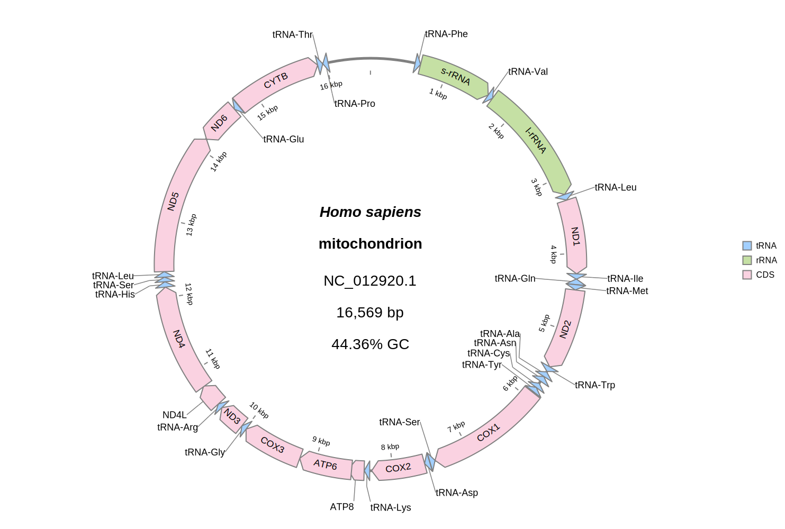

[Home](../README.md) | [Installation](../INSTALL.md) | [Quickstart](../QUICKSTART.md) | [**Tutorials**](../TUTORIALS/TUTORIALS.md) | [Gallery](../GALLERY.md) | [FAQ](../FAQ.md) | [ABOUT](../ABOUT.md)

[< Back to the Index of Tutorials](./TUTORIALS.md)
[< Back to Tutorial 2: Comparative Genomics with BLAST](./2_Comparative_Genomics.md)

# Tutorial 3: Advanced Customization


**Goal**: Go beyond the basics to gain fine-grained control over plot aesthetics using configuration files for colors and labels.

---

## Part 1: Advanced Color Control

While `--palette` is great for general styling, you often need to highlight specific features. `gbdraw` offers two ways to do this with simple tab-separated value (TSV) files.

### Method 1: Override Default Colors (`-d`)

This method replaces the default color for an entire feature type (e.g., make all `CDS` features gray).

1.  **Create a default-override TSV file.** Let's call it `modified_default_colors.tsv`. This file has two columns: `feature type` and `color`.

    ```tsv
    CDS	#d3d3d3
    ```

2.  **Use it in your command.**

    ```bash
    # MAG: Marsupenaeus japonicus endogenous nimavirus Ginoza2017 (LC738868.1)
    wget "https://eutils.ncbi.nlm.nih.gov/entrez/eutils/efetch.fcgi?db=nuccore&id=LC738868.1&rettype=gbwithparts&retmode=text" -O MjeNMV.gbk
    ```
    ```bash
    gbdraw circular \
      --gbk MjeNMV.gbk \
      --separate_strands \
      --track middle \
      -f svg \
      --block_stroke_width 1 \
      -d modified_default_colors.tsv \
      -o MjeNMV_modified_default_colors
    ```
    In the output, all CDS features will be gray.
    
    

### Method 2: Feature-Specific Colors (`-t`)

This method is more powerful. It colors individual features that match a specific rule, such as a gene's product name. This is perfect for highlighting genes of interest.

1.  **Create a feature-specific color TSV file.** Let's call it `feature_specifc_colors.tsv`. The file has 5 columns: `FeatureType`, `Qualifier`, `RegexPattern`, `Color`, and `LegendLabel`.

    ```tsv
    CDS	product	wsv.*-like protein	#47b8f8	WSSV-like proteins
    CDS	product	baculoviral IAP repeat-containing protein	yellow	BIRP
    CDS	product	tyrosine recombinase	red	tyrosine recombinase
    ```
2.  **Combine both methods for maximum control.** Let's make all CDS features gray *except* for the specific ones we want to highlight.

    ```bash
    gbdraw circular \
      --gbk MjeNMV.gbk \
      --separate_strands \
      --track middle \
      -f svg \
      --block_stroke_width 1 \
      -d modified_default_colors.tsv \
      -t feature_specifc_colors.tsv \
      --show_labels \
      -o MjeNMV_feature_specifc_colors_with_labels
    ```
The result is a plot where most genes are gray, but specific genes of interest are colored and labeled in the legend.


---

## Part 2: Advanced Label Control

When using `--show_labels`, you can prevent visual clutter using whitelists and blacklists.

### Blacklisting Labels (`--label_blacklist`)

This is the most common use case: hiding uninformative labels like "hypothetical protein".

* **As a command-line argument:**
    ```bash
    gbdraw circular \
      --gbk MjeNMV.gbk \
      --separate_strands \
      --track middle \
      -f svg \
      --block_stroke_width 1 \
      -d modified_default_colors.tsv \
      -t feature_specifc_colors.tsv \
      --show_labels \
      --label_blacklist "hypothetical" \
      -o MjeNMV_feature_specifc_colors_with_labels_blacklist
    ```


* **As a file:** Create a file `blacklist.txt` with one term per line, then use `--label_blacklist blacklist.txt`.

### Whitelisting Labels (`--label_whitelist`)

This is the opposite: you specify exactly which genes should be labeled, and all others will be hidden. This is useful for showing only a few key genes in a large genome.

1.  **Create a whitelist TSV file.** The format is `FeatureType`, `Qualifier`, `RegexPattern`.
    ```tsv
    CDS	gene	stx1A
    CDS	gene	stx1B
    CDS	gene	stx2A
    CDS	gene	stx2B
    ```
2.  **Use it in your command.**
    ```bash
    gbdraw circular \
      --gbk O157_H7.gbk \
      -o O157_H7_stx_whitelist \
      --show_labels \
      --separate_strands \
      --species "<i>Escherichia coli</i> O157_H7" \
      --strain "Sakai" \
      --label_whitelist stx_whitelist.tsv \
      --label_font_size 16 \
      -f svg
    ```


### Changing Label Content (`--qualifier_priority`)

By default, `gbdraw` uses the `product` qualifier for labels. If you prefer to use the `gene` name or `locus_tag`, you can specify a new priority.


1.  **Create a priority file.**
    `qualifier_priority.tsv` specifies the 'gene' qualifier first for CDS features.
    ```tsv
    CDS	gene
    ```
2.  **Use it in your command.**
    ```bash
    gbdraw circular \
    --gbk HmmtDNA.gbk \
    -f svg --track_type middle \
    --species "<i>Homo sapiens</i>" \
    --block_stroke_width 2 \
    --axis_stroke_width 5 \
    --allow_inner_labels \
    --show_labels \
    --palette soft_pastels \
    --definition_font_size 28 \
    --label_font_size 18 \
    --qualifier_priority qualifier_priority.tsv \
    -o HmmtDNA_qualifier_priority_soft_pastels
    ```



[< Back to the Index of Tutorials](./TUTORIALS.md)
[< Back to Tutorial 2: Comparative Genomics with BLAST](./2_Comparative_Genomics.md)


[Home](../README.md) | [Installation](../INSTALL.md) | [Quickstart](../QUICKSTART.md) | [**Tutorials**](../TUTORIALS/TUTORIALS.md) | [Gallery](../GALLERY.md) | [FAQ](../FAQ.md) | [ABOUT](../ABOUT.md)