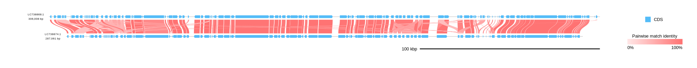
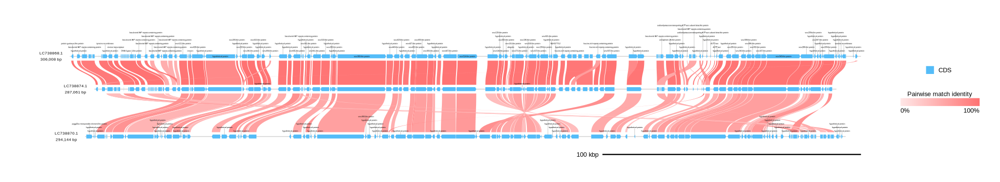
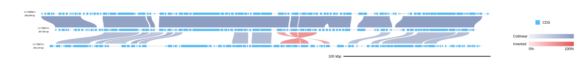

[Home](../DOCS.md) | [Installation](../INSTALL.md) | [Quickstart](../QUICKSTART.md) | [Tutorials](./TUTORIALS.md) | [Recipes](../RECIPES.md) | [CLI Reference](../CLI_Reference.md) | [Gallery](../GALLERY.md) | [FAQ](../FAQ.md) | [About](../ABOUT.md)

[< Back to the guide index](./TUTORIALS.md)
[< Previous: Set feature colors and labels](./3_Advanced_Customization.md) | [Next: Use TSV manifests >](./5_Table_Driven_Inputs.md)

# Draw protein matches from annotated CDS features

Compare annotated CDS translations as individual pairwise hits, gbdraw similarity groups across records, or locally ordered collinear blocks. Each example builds a linear diagram by translating annotated CDS features before running the protein search. The runtime is configurable, and the similarity groups are search-derived visualization groups rather than phylogeny-based orthogroups.

## 1. Prepare annotated GenBank inputs

The protein-search modes need two or more annotated GenBank or GFF3 + FASTA records with CDS translations, or CDS features that can be translated.

This tutorial uses three majanivirus GenBank records:

```bash
wget "https://eutils.ncbi.nlm.nih.gov/entrez/eutils/efetch.fcgi?db=nuccore&id=LC738868.1&rettype=gbwithparts&retmode=text" -O MjeNMV.gb
wget "https://eutils.ncbi.nlm.nih.gov/entrez/eutils/efetch.fcgi?db=nuccore&id=LC738874.1&rettype=gbwithparts&retmode=text" -O MelaMJNV.gb
wget "https://eutils.ncbi.nlm.nih.gov/entrez/eutils/efetch.fcgi?db=nuccore&id=LC738870.1&rettype=gbwithparts&retmode=text" -O PemoMJNVA.gb
```

If you are working from a source checkout, the same files are also available under `examples/`.

## 2. Runtime selection

Unless you pass an explicit executable path, `--protein_blastp_mode pairwise`, `orthogroup`, and `collinear` choose the protein search program in this order:

1. bundled native LOSAT on Linux x86_64 when available
2. `losat` on `PATH`
3. NCBI BLAST+ `blastp` on `PATH`

Use an explicit path when you need to control the runtime:

```bash
gbdraw linear \
  --gbk MjeNMV.gb MelaMJNV.gb \
  --protein_blastp_mode pairwise \
  --losatp_bin /path/to/losat \
  --losatp_threads 4 \
  -o majani_pairwise_losat \
  -f svg
```

Or force NCBI BLAST+:

```bash
gbdraw linear \
  --gbk MjeNMV.gb MelaMJNV.gb \
  --protein_blastp_mode pairwise \
  --ncbi_blastp_bin /path/to/blastp \
  -o majani_pairwise_blastp \
  -f svg
```

NCBI BLAST+ output is compatible with the workflow, but it may not produce exactly the same hit set as LOSAT.

Pass only one of `--losatp_bin` and `--ncbi_blastp_bin` in a command.

## 3. Pairwise protein matches

`pairwise` searches each adjacent record pair and draws a ribbon for every retained protein match.

```bash
gbdraw linear \
  --gbk MjeNMV.gb MelaMJNV.gb \
  --protein_blastp_mode pairwise \
  --align_center \
  --pairwise_match_style curve \
  -o tutorial-protein-pairwise \
  -f svg
```

This writes `tutorial-protein-pairwise.svg`. The curved ribbons connect CDS-derived protein hits between the two adjacent records.



## 4. gbdraw similarity-group ribbons (`orthogroup` mode)

`orthogroup` assigns CDS-derived proteins to gbdraw similarity groups across all input records before drawing ribbons between adjacent records. The mode does not perform phylogeny-based orthology inference.

```bash
gbdraw linear \
  --gbk MjeNMV.gb MelaMJNV.gb PemoMJNVA.gb \
  --protein_blastp_mode orthogroup \
  --show_labels orthogroup_top \
  --pairwise_match_style curve \
  --align_center \
  -o majani_orthogroup \
  -f svg
```

This writes `majani_orthogroup.svg`.

`--show_labels orthogroup_top` labels the topmost displayed member of each gbdraw similarity group, which is useful when the same group appears in multiple records.



## 5. Collinear blocks

`collinear` combines protein-match anchors that occur in compatible local order.

```bash
gbdraw linear \
  --gbk MjeNMV.gb MelaMJNV.gb PemoMJNVA.gb \
  --protein_blastp_mode collinear \
  --collinear_min_anchors 2 \
  --collinear_color_mode orientation_identity \
  --pairwise_match_style curve \
  --align_center \
  -o majani_collinear \
  -f svg
```

This writes `majani_collinear.svg`.

`--collinear_min_anchors 2` removes singleton blocks. `--collinear_color_mode orientation_identity` separates forward and inverted blocks while still encoding identity.



## 6. When to prefer precomputed `-b/--blast`

Use precomputed BLAST tables when you need to preserve an existing result, use custom database settings, compare nucleotide or translated nucleotide sequences, or draw hits that were filtered by an upstream workflow.

Do not combine `-b/--blast` with `--protein_blastp_mode`. The CLI rejects that combination because the two options define different comparison sources.

[< Back to the guide index](./TUTORIALS.md)
[< Previous: Set feature colors and labels](./3_Advanced_Customization.md) | [Next: Use TSV manifests >](./5_Table_Driven_Inputs.md)

[Home](../DOCS.md) | [Installation](../INSTALL.md) | [Quickstart](../QUICKSTART.md) | [Tutorials](./TUTORIALS.md) | [Recipes](../RECIPES.md) | [CLI Reference](../CLI_Reference.md) | [Gallery](../GALLERY.md) | [FAQ](../FAQ.md) | [About](../ABOUT.md)
