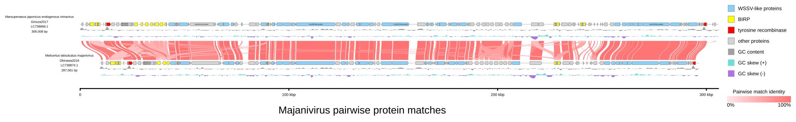
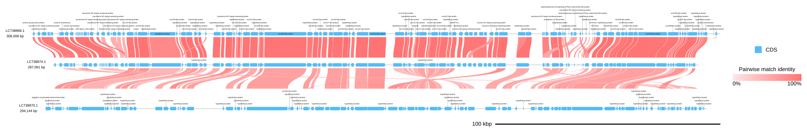
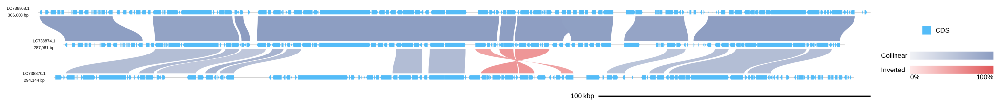

[Home](../DOCS.md) | [Installation](../INSTALL.md) | [Quickstart](../QUICKSTART.md) | [Tutorials](./README.md) | [Recipes](../RECIPES.md) | [CLI Reference](../CLI_Reference.md) | [Gallery](../GALLERY.md) | [FAQ](../FAQ.md) | [About](../ABOUT.md)

[< Back to the guide index](./README.md)
[< Previous: Set feature colors and labels](./3_Advanced_Customization.md) | [Next: Use TSV manifests >](./5_Table_Driven_Inputs.md)

# Draw protein matches from annotated CDS features

Compare annotated CDS translations as individual pairwise hits, gbdraw similarity groups across records, or locally ordered collinear blocks. Each example builds a linear diagram by translating annotated CDS features before running the protein search. The runtime is configurable, and the similarity groups are search-derived visualization groups rather than phylogeny-based orthogroups.

## 1. Prepare annotated GenBank inputs

The protein-search modes need two or more annotated GenBank or GFF3 + FASTA records with CDS translations, or CDS features that can be translated.

This tutorial uses three majanivirus GenBank records:

```bash
wget "https://eutils.ncbi.nlm.nih.gov/entrez/eutils/efetch.fcgi?db=nuccore&id=LC738868.1&rettype=gbwithparts&retmode=text" -O MjeNMV.gb
wget "https://eutils.ncbi.nlm.nih.gov/entrez/eutils/efetch.fcgi?db=nuccore&id=LC738874.1&rettype=gbwithparts&retmode=text" -O MelaMJNV.gb
wget "https://eutils.ncbi.nlm.nih.gov/entrez/eutils/efetch.fcgi?db=nuccore&id=LC738870.1&rettype=gbwithparts&retmode=text" -O PemoMJNVA.gb
```

If you are working from a source checkout, the same files are also available under `examples/`.

## 2. Runtime selection

Unless you pass an explicit executable path, `--protein_blastp_mode pairwise`, `orthogroup`, and `collinear` choose the protein search program in this order:

1. bundled native LOSAT on Linux x86_64 when available
2. `losat` on `PATH`
3. NCBI BLAST+ `blastp` on `PATH`

Use an explicit path when you need to control the runtime:

```bash
gbdraw linear \
  --gbk MjeNMV.gb MelaMJNV.gb \
  --protein_blastp_mode pairwise \
  --losatp_bin /path/to/losat \
  --losatp_threads 4 \
  -o majani_pairwise_losat \
  -f svg
```

Or force NCBI BLAST+:

```bash
gbdraw linear \
  --gbk MjeNMV.gb MelaMJNV.gb \
  --protein_blastp_mode pairwise \
  --ncbi_blastp_bin /path/to/blastp \
  -o majani_pairwise_blastp \
  -f svg
```

NCBI BLAST+ output is compatible with the workflow, but it may not produce exactly the same hit set as LOSAT.

Pass only one of `--losatp_bin` and `--ncbi_blastp_bin` in a command.

## 3. Pairwise protein matches

`pairwise` searches each adjacent record pair and draws a ribbon for every retained protein match.

```bash
gbdraw linear \
  --gbk MjeNMV.gb MelaMJNV.gb \
  -t tests/test_inputs/majani_custom_color_table.tsv \
  -d examples/modified_default_colors.tsv \
  --block_stroke_color gray \
  --block_stroke_width 1 \
  --line_stroke_color lightgray \
  --line_stroke_width 2 \
  --protein_blastp_mode pairwise \
  --align_center \
  --pairwise_match_style curve \
  --gc \
  --skew \
  --show_labels first \
  --label_rendering embedded_only \
  --record_label "Marsupenaeus japonicus endogenous nimavirus" \
  --record_label "Melicertus latisulcatus majanivirus" \
  --record_subtitle Ginoza2017 \
  --record_subtitle Okinawa2016 \
  --scale_style ruler \
  --plot_title "Majanivirus pairwise protein matches" \
  -o tutorial-protein-pairwise \
  -f svg
```

This writes `tutorial-protein-pairwise.svg`. The curved ribbons connect CDS-derived protein hits between the two adjacent records. The checked-in color tables distinguish WSSV-like proteins, BIRP features, tyrosine recombinase, and other proteins, while the block and line widths keep both filled features and feature lines legible. Features use the default on-axis placement. Omit `-t` and `-d` when running outside a source checkout.



### Web app selected LOSAT pairs

For a sparse browser workflow, edit one entry under **Adjacent gaps**, or click
**Add** under **Selected pairs and retained drafts** for custom endpoints.
Either action creates a **Selected pairs** plan. Set each included edge to **Run
LOSAT**. Selected edges support LOSATN, TLOSATX, and LOSATP when the LOSATP mode
is **Pairwise**. One plan can also mix those LOSAT edges with uploaded BLAST TSV
edges and omitted pairs.

**Similarity groups** and **Collinear blocks** still collect evidence across
all records and are available with the global adjacent LOSAT plan. The web app
rejects an active selected LOSAT edge in either of those modes instead of
silently expanding it. A selected plan containing only uploaded edges remains
valid because it does not request LOSAT evidence expansion.

## 4. gbdraw similarity-group ribbons (`orthogroup` mode)

`orthogroup` assigns CDS-derived proteins to gbdraw similarity groups across all input records before drawing ribbons between adjacent records. The mode does not perform phylogeny-based orthology inference.

```bash
gbdraw linear \
  --gbk MjeNMV.gb MelaMJNV.gb PemoMJNVA.gb \
  --protein_blastp_mode orthogroup \
  --show_labels orthogroup_top \
  --pairwise_match_style curve \
  --align_center \
  -o majani_orthogroup \
  -f svg
```

This writes `majani_orthogroup.svg`.

`--show_labels orthogroup_top` labels the topmost displayed member of each gbdraw similarity group, which is useful when the same group appears in multiple records.



## 5. Collinear blocks

`collinear` combines protein-match anchors that occur in compatible local order.

```bash
gbdraw linear \
  --gbk MjeNMV.gb MelaMJNV.gb PemoMJNVA.gb \
  --protein_blastp_mode collinear \
  --collinear_min_anchors 2 \
  --collinear_color_mode orientation_identity \
  --pairwise_match_style curve \
  --align_center \
  -o majani_collinear \
  -f svg
```

This writes `majani_collinear.svg`.

`--collinear_min_anchors 2` removes singleton blocks. `--collinear_color_mode orientation_identity` separates forward and inverted blocks while still encoding identity.

In the web preview or standalone interactive SVG, click a collinear block to export its complete query and subject block envelopes as nucleotide FASTA. The envelopes may include intergenic sequence and genes that are not anchors. This remains distinct from the orthogroup-member nucleotide and amino-acid actions in the same popup.

For a multi-record layout, add `--collinear_search_scope all` to search every record pair. gbdraw renders the accepted blocks only between adjacent layout rows and omits same-row ribbons. This supports all-vs-all comparisons between two groups of replicons, including chromosome-to-noncorresponding-chromosome blocks. See the [two-strain *Vibrio* example](./7_Linear_Layout.md#two-strains-with-multiple-replicons).



## 6. When to prefer precomputed `-b/--blast`

Use precomputed BLAST tables when you need to preserve an existing result, use custom database settings, compare nucleotide or translated nucleotide sequences, or draw hits that were filtered by an upstream workflow.

Do not combine `-b/--blast` with `--protein_blastp_mode`. The CLI rejects that combination because the two options define different comparison sources.

The selected mixed-source plan described above is a web app feature. It does
not change the CLI restriction or the Python `pairs` contract.

For Python workflows with multi-record rows, use `LinearComparisonOptions(protein_mode="pairwise", pairs=((0, 2), (1, 3)))` to run only the declared record pairs. Pair indices are zero-based and must connect adjacent layout rows. Omitting `pairs` preserves adjacent-record behavior. See the [Python API linear example](../PYTHON_API.md#linear-diagrams-and-comparisons).

## 7. When a saved protein search is reused

A saved protein search is reused when the amino-acid sequences, selected
proteins, record and feature bindings, query/subject direction, program, and
meaningful search arguments still match. Renaming an upload or resource,
changing a display-only label, or saving and loading the same biological inputs
does not invalidate the raw result. Display metadata may still be rebuilt.

Changing a sequence, protein set, binding, feature location or strand, or search
setting invalidates the affected record pair. gbdraw reruns only that pair.

**Save Raw LOSAT TSV** writes readable protein or feature aliases rather than
session-internal identifiers. It fails instead of producing a partially resolved
download. User-uploaded comparison TSV is left unchanged.

For exact version, cache-schema, identity, and migration rules, see
[Session and request compatibility](../SESSION_COMPATIBILITY.md#saved-protein-comparison-results).

[< Back to the guide index](./README.md)
[< Previous: Set feature colors and labels](./3_Advanced_Customization.md) | [Next: Use TSV manifests >](./5_Table_Driven_Inputs.md)

[Home](../DOCS.md) | [Installation](../INSTALL.md) | [Quickstart](../QUICKSTART.md) | [Tutorials](./README.md) | [Recipes](../RECIPES.md) | [CLI Reference](../CLI_Reference.md) | [Gallery](../GALLERY.md) | [FAQ](../FAQ.md) | [About](../ABOUT.md)
